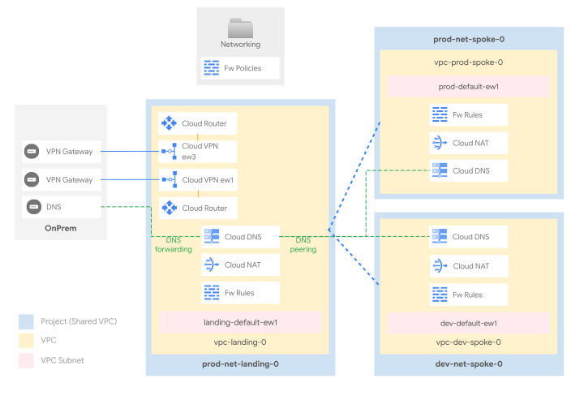

# Hub and spoke with VPC Peerings

This stage sets up the shared network infrastructure environment, and leverages [VPC Network Peering](https://cloud.google.com/vpc/docs/vpc-peering) to implement a Hub and Spoke topology with a hub and two spokes.

Leveraging the lack of transitivity when using VPC peerings, the spoke VPCs have no routing line-of-sight with each other, which is ideal when implementing isolated environment. However anything that transit through the hub will be able to reach destinations in both spokes.

Transitivity between spokes could be achieved by adding a (potentially one-legged) network virtual appliance acting as a router.

The following diagram illustrates the high-level design, and should be used as a reference for the following sections.

<p align="center">
  
  </br>Peering diagram
</p>

### VPC design

The hub VPC hosts external connectivity (by default VPN tunnels), and centralises the DNS configuration.

The default dataset ships two different VPCs, mapping to hypotetical environments (dev and prod). Each VPC is created into its own project, and each project is configured as a Shared VPC host, so that network-related resources and access configurations via IAM are kept separate for each VPC.

The design easily lends itself to implementing additional environments, or adopting a different logical mapping for spokes (e.g. one spoke for each company entity, etc.).

### IP ranges, subnetting, routing

Minimizing the number of routes (and subnets) in use on the cloud environment is an important consideration, as it simplifies management and avoids hitting [Cloud Router](https://cloud.google.com/network-connectivity/docs/router/quotas) and [VPC](https://cloud.google.com/vpc/docs/quota) quotas and limits. For this reason, we recommend careful planning of the IP space used in your cloud environment, to be able to use large IP CIDR blocks in routes whenever possible.

This stage uses a dedicated /16 block (which should of course be sized to your needs) for each region in each VPC, and subnets created in each VPC should derive their ranges from the relevant block.

The Prod Spoke VPC also define and reserve - as an example - two "special" CIDR ranges dedicated to [PSA (Private Service Access)](https://cloud.google.com/vpc/docs/private-services-access) and [Internal Application Load Balancers (L7 LBs)](https://cloud.google.com/load-balancing/docs/l7-internal).

Routes in GCP are either automatically created for VPC subnets, manually created via static routes, programmed by the NCC hub or dynamically programmed by [Cloud Routers](https://cloud.google.com/network-connectivity/docs/router#docs) via BGP sessions, which can be configured to advertise VPC ranges, and/or custom ranges via custom advertisements.

Furthermore:

- routes between multiple subnets within the same VPC are automatically programmed by GCP
- each spoke exchanges routes with the HUB
- on-premises is connected to the hub VPC and dynamically exchanges BGP routes with GCP using HA VPN. The HA VPN tunnels program routes in the hub VPC which then exports them to the spoke VPCs.

### Peering Configuration

VPC peering is controlled by each VPC `.config` file, as per the example below.

[vpcs/hub/.config.yaml](./vpcs/hub/.config.yaml)

```yaml
# [...]
peering_config:
  to-prod:
    peer_network: $networks:prod
  to-dev:
    peer_network: $networks:dev
# [...]
```

[vpcs/prod/.config.yaml](./vpcs/prod/.config.yaml)

```yaml
# [...]
peering_config:
  to-hub:
    peer_network: $networks:hub
# [...]
```

For more informations about cross referencing resources, please check the [main README.md file](../../README.md)

### Internet egress

Cloud NAT provides the simplest path for internet egress. This setup uses Cloud NAT, which is enabled by default on the primary region on every VPC.

e.g. in [vpcs/prod/.config.yaml](./vpcs/prod/.config.yaml)

```yaml
# [...]
nat_config:
  nat-primary:
    region: $locations:primary
# [...]
```

Several other scenarios are possible through ad-hoc implementations, with varying degrees of complexity:

- a forward proxy (including [SWP](https://cloud.google.com/secure-web-proxy/docs/overview)), with optional URL filters
- a default route to on-prem to leverage existing egress infrastructure
- a full-fledged perimeter firewall to control egress and implement additional security features like IPS

### VPC and Hierarchical Firewall

The GCP Firewall is a stateful, distributed feature that allows the creation of L4 policies, either via VPC-level rules or more recently via hierarchical policies applied on the resource hierarchy (organization, folders).

The current setup adopts both firewall types, and uses [hierarchical rules on the Networking folder](./firewall-policies/networking-policy.yaml) for common ingress rules, e.g. from health check or IAP forwarders ranges, and [VPC rules](./vpcs/prod/firewall-rules) for the environment or workload-level ingress.

### DNS

This dataset implements both DNS flows:

- on-prem to cloud via private zones for cloud-managed domains, and an [inbound policy](https://cloud.google.com/dns/docs/server-policies-overview#dns-server-policy-in) used as forwarding target or via delegation (requires some extra configuration) from on-prem DNS resolvers

- cloud to on-prem via forwarding zones for the on-prem managed domains

DNS configuration is further centralized by leveraging peering zones, so that

- the hub Cloud DNS hosts configurations for on-prem forwarding, Google API domains, and the top-level private zone/s (e.g. test.)
- the spokes Cloud DNS host configurations for the environment-specific domains (e.g. prod.test.), which are bound to the hub leveraging [cross-project binding](https://cloud.google.com/dns/docs/zones/zones-overview#cross-project_binding); a peering zone for the `.` (root) zone is then created on each spoke, delegating all DNS resolution to hub/landing.
- Private Google Access is enabled via [DNS Response Policies](https://cloud.google.com/dns/docs/zones/manage-response-policies#create-response-policy-rule) for most of the [supported domains](https://cloud.google.com/vpc/docs/configure-private-google-access#domain-options)

To complete the configuration, the 35.199.192.0/19 range should be routed on the VPN tunnels from on-prem, and the following names configured for DNS forwarding to cloud:

- `private.googleapis.com`
- `restricted.googleapis.com`
- `gcp.example.com` (used as a placeholder)

From cloud, the `onprem.` domain (used as a placeholder) is forwarded to on-prem.

### VPNs

Connectivity to on-prem is implemented with HA VPN ([`net-vpn`](../../../../../modules/net-vpn-ha/)) and defined in [`onprem.yaml`](./vpcs/hub/vpns/onprem.yaml). The file provisionally implements a single logical connection between onprem and the hub on the primary region through 2 IPSec tunnels.
