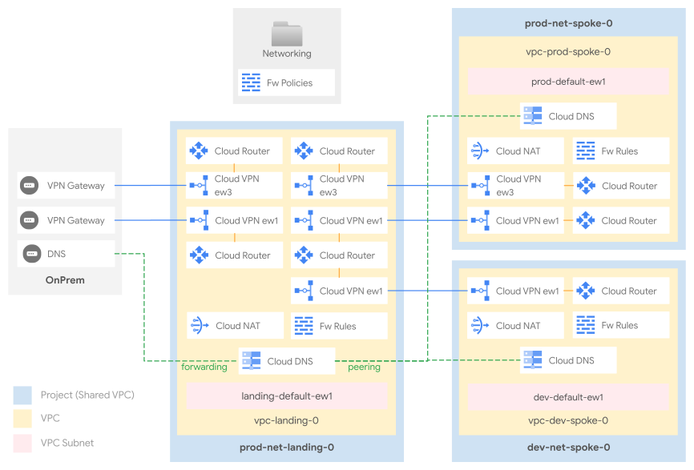

# Hub and spoke with VPNs

This stage sets up the shared network infrastructure environment, and leverages [HA VPN](https://cloud.google.com/network-connectivity/docs/vpn/concepts/topologies) to implement a Hub and Spoke topology with a hub and two spokes.

This model provides a clear separation between environments while centralizing shared services and connectivity in a hub network. Each spoke is connected to the hub via a dedicated HA VPN connection, ensuring traffic between spokes is routed through the hub.

The following diagram illustrates the high-level design, and should be used as a reference for the following sections.

<p align="center">
  
  </br>VPN diagram
</p>

## VPC design

The hub VPC hosts external connectivity to on-premises networks and centralizes DNS configuration.

The default dataset ships two different VPCs, mapping to hypothetical environments (dev and prod). Each VPC is created into its own project, and each project is configured as a Shared VPC host, so that network-related resources and access configurations via IAM are kept separate for each VPC.

The design easily lends itself to implementing additional environments, or adopting a different logical mapping for spokes (e.g., one spoke for each company entity, etc.).

## IP ranges, subnetting, routing

Minimizing the number of routes (and subnets) in use on the cloud environment is an important consideration, as it simplifies management and avoids hitting [Cloud Router](https://cloud.google.com/network-connectivity/docs/router/quotas) and [VPC](https://cloud.google.com/vpc/docs/quota) quotas and limits. For this reason, we recommend careful planning of the IP space used in your cloud environment, to be able to use large IP CIDR blocks in routes whenever possible.

This stage uses a dedicated /16 block (which should of course be sized to your needs) for each region in each VPC, and subnets created in each VPC should derive their ranges from the relevant block.

The Prod Spoke VPC also defines and reserves - as an example - two "special" CIDR ranges dedicated to [PSA (Private Service Access)](https://cloud.google.com/vpc/docs/private-services-access) and [Internal Application Load Balancers (L7 LBs)](https://cloud.google.com/load-balancing/docs/l7-internal).

Routes in GCP are either automatically created for VPC subnets, manually created via static routes, or dynamically programmed by [Cloud Routers](https://cloud.google.com/network-connectivity/docs/router#docs) via BGP sessions.

In this dataset:

- routes between multiple subnets within the same VPC are automatically programmed by GCP
- each spoke exchanges routes with the hub via BGP over the HA VPN tunnels.
- on-premises is connected to the hub VPC and dynamically exchanges BGP routes with GCP using HA VPN. The hub's Cloud Router then advertises these routes (all of RFC1918) to the spoke VPCs.

### VPN Configuration

HA VPN connections are defined in the `vpcs/[vpc-name]/vpns` directory. The hub VPC has VPNs connecting to each spoke, and the spokes have corresponding VPNs connecting back to the hub.

For example, the connection from the hub to the `prod` spoke is defined in `vpcs/hub/vpns/to-prod.yaml`:

```yaml
name: to-prod
region: europe-west8
peer_gateways:
  default:
    gcp: $vpn_gateways:prod/to-hub
router_config:
  create: false
  name: $routers:hub/vpn-router
# ...
```

And the corresponding connection from the `prod` spoke to the hub is in `vpcs/prod/vpns/to-hub.yaml`:

```yaml
name: to-hub
region: europe-west8
peer_gateways:
  default:
    gcp: $vpn_gateways:hub/to-prod
router_config:
  create: false
  name: $routers:prod/vpn-router
# ...
```

For more information about cross-referencing resources, please check the [main README.md file](../../README.md).

### Internet egress

Cloud NAT provides the simplest path for internet egress. This setup uses Cloud NAT, which is enabled by default on the primary region in the hub VPC. All spokes route internet-bound traffic through the hub.

e.g. in `vpcs/hub/.config.yaml`:

```yaml
# [...]
nat_config:
  nat-ew8:
    region: europe-west8
# [...]
```

Several other scenarios are possible through ad-hoc implementations, with varying degrees of complexity:

- A forward proxy (including [SWP](https://cloud.google.com/secure-web-proxy/docs/overview)), with optional URL filters.
- A default route to on-prem to leverage existing egress infrastructure.
- A full-fledged perimeter firewall to control egress and implement additional security features like IPS.

### VPC and Hierarchical Firewall

The GCP Firewall is a stateful, distributed feature that allows the creation of L4 policies, either via VPC-level rules or more recently via hierarchical policies applied on the resource hierarchy (organization, folders).

The current setup adopts both firewall types, and uses [hierarchical rules on the Networking folder](./firewall-policies/networking-policy.yaml) for common ingress rules, e.g., from health check or IAP forwarders ranges, and [VPC rules](./vpcs/prod/firewall-rules) for the environment or workload-level ingress.

### DNS

This dataset implements a centralized DNS architecture that handles resolution between GCP and on-premises environments.

- **Cloud to on-prem:** A [forwarding zone](./dns/zones/net-core-0/fwd-root.yaml) for the `onprem.` domain is configured in the hub VPC. It forwards DNS queries for on-premises resources to the on-premises DNS resolvers.
- **On-prem to cloud:** An [inbound DNS policy](https://cloud.google.com/dns/docs/server-policies-overview#dns-server-policy-in) allows on-premises systems to resolve resources in GCP.

DNS configuration is centralized in the hub project (`net-core-0`) and shared with the spokes using DNS peering:

- The **hub** hosts:
  - A top-level private zone for the cloud environment (e.g., `test.`).
  - The forwarding zone to on-premises.
- The **spokes** (`net-dev-0`, `net-prod-0`) host private zones for their specific subdomains (e.g., `dev.test.`, `prod.test.`). These zones are visible to the hub.
- A **peering zone** for the `.` (root) domain is configured in the spokes, pointing to the hub. This delegates all DNS resolution from the spokes to the hub, creating a centralized model.
- **Private Google Access** is enabled via [DNS Response Policies](https://cloud.google.com/dns/docs/zones/manage-response-policies#create-response-policy-rule) for most of the [supported domains](https://cloud.google.com/vpc/docs/configure-private-google-access#domain-options).

To complete the configuration, on-premises DNS servers should be configured to forward queries for your cloud domain (e.g., `test.`) to the GCP inbound policy's IP addresses. Additionally, the `35.199.192.0/19` range (used by the inbound forwarder) should be routed over the VPN tunnels from on-premises.
