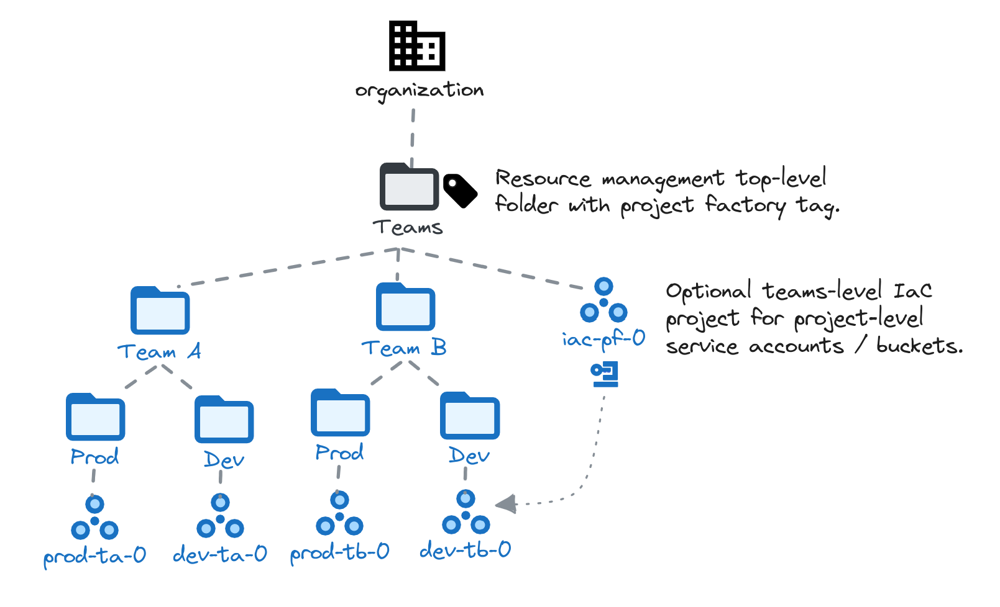
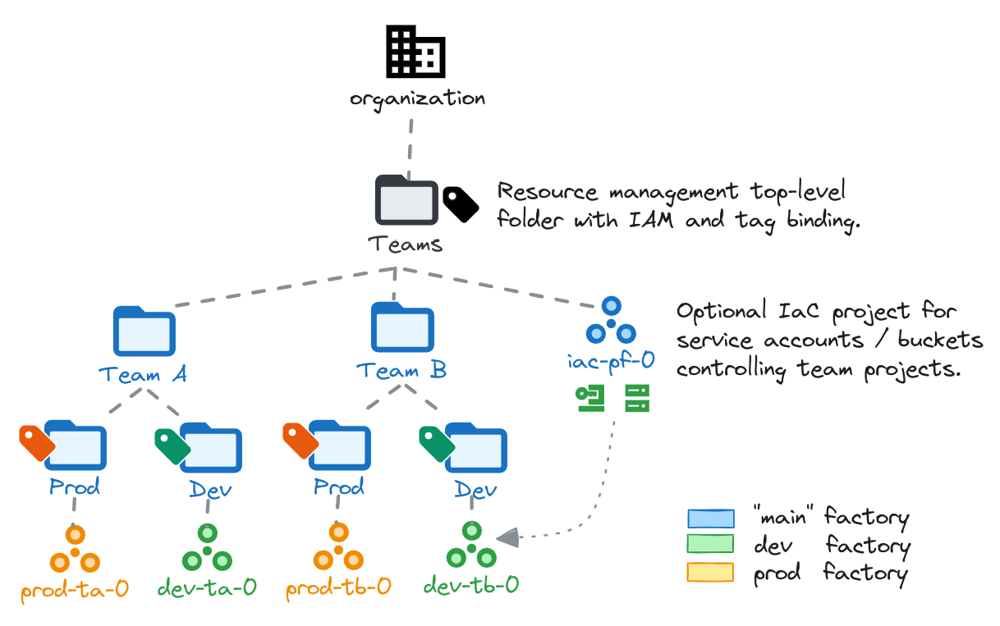

# Project factory

<!-- BEGIN TOC -->
- [Design overview and choices](#design-overview-and-choices)
- [How to run this stage](#how-to-run-this-stage)
  - [Resource Management stage configuration](#resource-management-stage-configuration)
  - [Factory configuration](#factory-configuration)
  - [Stage provider and Terraform variables](#stage-provider-and-terraform-variables)
- [Managing folders and projects](#managing-folders-and-projects)
  - [Folder and hierarchy management](#folder-and-hierarchy-management)
  - [Folder parent-child relationship and variable substitutions](#folder-parent-child-relationship-and-variable-substitutions)
  - [Project Creation](#project-creation)
  - [Automation Resources for Projects](#automation-resources-for-projects)
- [Alternative patterns](#alternative-patterns)
  - [Per-environment Factories](#per-environment-factories)
- [Files](#files)
- [Variables](#variables)
- [Outputs](#outputs)
<!-- END TOC -->

The Project Factory stage allows simplified management of folder hierarchies and projects via YAML-based configuration files. Multiple project factories can coexist in the same landing zone, and different patterns can be implemented by pointing them at different configuration files.

The pattern implemented here by default allows management of a teams (or business units, applications, etc.) hierarchy. Different patterns are possible, and this document also tries to provide some guidance on how to implement them.

<p align="center">
  
</p>

## Design overview and choices

The project factory is "primed" by the resource management stage via

- a set of service accounts with different scopes
- one or more user-defined top-level folders where those service accounts operate

This stage does not directly depend on other stage 2 like networking and security, but it can optionally leverage resources created there like Shared VPC host projects, which are used to define service projects.

The project factory stage is a thin wrapper of the underlying [project-factory module](../../../modules/project-factory/), which in turn exposes the full interface of the [project](../../../modules/project/) and [folder](../../../modules/folder/) modules.

## How to run this stage

This stage is meant to be executed after the [bootstrap](../0-bootstrap/) and [resource management](../1-resman/) "foundational stages". As mentioned above it runs in parallel with other stage 2 and can leverage resources they create but does not depend on them.

### Resource Management stage configuration

The resource management stage already contains a sample "Teams" folder defined via YAML, which can be used as-is or modified to provide a top-level folder for the project factory. More folders can of course be added, and Terraform variables used instead of or in addition to YAML files in the resource management stage.

This is the teams YAML in resource management, leveraging attribute substitutions from provided context for the project factory service account and tag value.

```yaml
name: Teams
automation:
  enable: false
iam:
  "roles/owner":
    - project-factory
  "roles/resourcemanager.folderAdmin":
    - project-factory
  "roles/resourcemanager.projectCreator":
    - project-factory
  "roles/resourcemanager.tagUser":
    - project-factory
  "service_project_network_admin":
    - project-factory
tag_bindings:
  context: context/project-factory
```

This is the alternative version that can be used instead of the YAML file above.

```tfvars
top_level_folders = {
  # more top-level folders might be present here
  teams = {
    name = "Teams"
    iam = {
      "roles/owner"                          = ["project-factory"]
      "roles/resourcemanager.folderAdmin"    = ["project-factory"]
      "roles/resourcemanager.projectCreator" = ["project-factory"]
      "roles/resourcemanager.tagUser"        = ["project-factory"]
      "service_project_network_admin"        = ["project-factory"]
    }
    tag_bindings = {
      context = "context/project-factory"
    }
  }
}
# tftest skip
```

You can of course extend these snippets to grant additional roles to groups or other service accounts via the `iam`, `iam_by_principals`, and `iam_bindings` folder-level variables.

The project factory tag binding on the folder allows management of organization policies in the Teams hierarchy. If this functionality is not needed, the tag binding can be safely omitted.

### Factory configuration

The `data` folder in this stage contains factory files that can be used as examples to implement the team-based design shown above. Before running `terraform apply` check the YAML files, as project names and other attributes will need basic editing to match your desired setup.

### Stage provider and Terraform variables

As all other FAST stages, the [mechanism](../0-bootstrap/README.md#output-files-and-cross-stage-variables) used to pass variable values and pre-built provider files from one stage to the next is also leveraged here.

The commands to link or copy the provider and terraform variable files can be easily derived from the `stage-links.sh` script in the FAST root folder, passing it a single argument with the local output files folder (if configured) or the GCS output bucket in the automation project (derived from stage 0 outputs). The following examples demonstrate both cases, and the resulting commands that then need to be copy/pasted and run.

```bash
../../../stage-links.sh ~/fast-config

# copy and paste the following commands for '2-project-factory'

ln -s ~/fast-config/providers/2-project-factory-providers.tf ./
ln -s ~/fast-config/tfvars/0-globals.auto.tfvars.json ./
ln -s ~/fast-config/tfvars/0-bootstrap.auto.tfvars.json ./
ln -s ~/fast-config/tfvars/1-resman.auto.tfvars.json ./
# optional but recommended
ln -s ~/fast-config/tfvars/2-networking.auto.tfvars.json ./
ln -s ~/fast-config/tfvars/2-security.auto.tfvars.json ./
```

```bash
../../../stage-links.sh gs://xxx-prod-iac-core-outputs-0

# copy and paste the following commands for '2-project-factory'

gcloud storage cp gs://xxx-prod-iac-core-outputs-0/providers/2-project-factory-providers.tf ./
gcloud storage cp gs://xxx-prod-iac-core-outputs-0/tfvars/0-globals.auto.tfvars.json ./
gcloud storage cp gs://xxx-prod-iac-core-outputs-0/tfvars/0-bootstrap.auto.tfvars.json ./
gcloud storage cp gs://xxx-prod-iac-core-outputs-0/tfvars/1-resman.auto.tfvars.json ./
# optional but recommended
gcloud storage cp gs://xxx-prod-iac-core-outputs-0/tfvars/2-networking.auto.tfvars.json ./
gcloud storage cp gs://xxx-prod-iac-core-outputs-0/tfvars/2-security.auto.tfvars.json ./
```

If you're not using FAST, refer to the [Variables](#variables) table at the bottom of this document for a full list of variables, their origin (e.g., a stage or specific to this one), and descriptions explaining their meaning.

Besides the values above, the project factory is driven by YAML data files, with one file per project. Please refer to the underlying [project factory module](../../../modules/project-factory/) documentation for details on the format.

Once the configuration is complete, run the project factory with:

```bash
terraform init
terraform apply
```

## Managing folders and projects

The YAML data files are self-explanatory and the included [schema files](./schemas/) provide a reliable framework to allow editing the sample data, or starting from scratch to implement a different pattern. This section lists some general considerations on how folder and project files work to help getting up to speed with operations.

### Folder and hierarchy management

The project factory manages its folder hierarchy via a filesystem tree, rooted in the path defined via the `factories_config.hierarchy_data` variable.

Filesystem folders which contain a `_config.yaml` file are mapped to folders in the resource management hierarchy. Their YAML configuration files allow definining folder attributes like descriptive name, IAM bindings, organization policies, tag bindings.

This is the simple filesystem hierarchy provided here as an example.

```bash
hierarchy
├── team-a
│   ├── _config.yaml
│   ├── dev
│   │   └── _config.yaml
│   └── prod
│       └── _config.yaml
└── team-b
    ├── _config.yaml
    ├── dev
    │   └── _config.yaml
    └── prod
        └── _config.yaml
```

The approach is intentionally explicit and repetitive in order to simplify operations: copy/pasting an existing set of folders (or an ad hoc template) and changing a few YAML variables allows to quickly define new sub-hierarchy branches. Mass editing via search and replace functionality allows sweeping changes across the whole hierarchy.

Where inheritance is leveraged in the overall design config files can be deceptively simple: the following is the config file for the dev Team A folder in the provided example.

```yaml
name: Development
tag_bindings:
  environment: environment/development
iam_by_principals:
  "group:team-a-admins@example.com":
    - roles/editor
```

All of the [folder module](../../../modules/folder/) attributes can of course be leveraged in the configuration files. Refer to the [folder schema](./schemas/folder.schema.json) for the complete set of available attributes.

### Folder parent-child relationship and variable substitutions

In the example YAML configuration above there's no explicitly specified folder parent: it is derived from the filesystem hierarchy, and set to the "Team A" folder.

But what about the "Team A" folder itself? From the point of view of the project factory it's a top-level folder attached to the root of its hierarchy (the "Teams" folder), so how does it know where to create it in the GCP hierarchy?

There are three different ways to pass this information to the project factory:

- in the YAML file itself, by explicitly setting the folder's `parent` attribute to the explicit numeric id of the "Teams" folder
- in the YAML file itself, by explicitly setting the folder's `parent` attribute to the short name of the "Teams" folder in the resource management stage's outputs
- in the stage Terraform variables, by setting the `default` folder for the project factory to the numeric id of the "Teams" folder

This flexibility is what allows the project factory to manage folders under multiple roots, and to also be used for folders created outside of FAST. Imagine a scenario where there's no single "Teams" folder, but multiple ones for different subsidiaries, or for internal and external teams, etc.

The snippets below show how to set the `parent` attribute explicitly or via substitution in the YAML file.

```yaml
name: Team A
# use the explicit id of the Teams folder
parent: folders/1234567890
```

```yaml
name: Team A
# use variable substitution from stage 1 tfvars (preferred approach)
parent: teams
```

The third way explained above does not explicitly define a root folder in the YAML files, but sets a default folder in the Terraform variables for the stage via the `factories_config.substitutions.folder_ids`, by adding a `default` key pointing to the folder id of the root ("Teams") folder.

```tfvars
factories_config = {
  substitutions = {
    folder_ids = {
      # id of the top-level Teams folder
      # derived from the 1-resman.auto.tfvars.json file
      default = "folders/12345678"
    }
  }
}
# tftest skip
```

### Project Creation

Project YAML files can be created in two different filesystem paths:

- in the filesystem folder defined via the `factories_config.project_data` variable, and then explicitly setting their `parent` attribute in YAML files, or
- in the filesystem hierarchy discussed above, so that their `parent` attribute is automatically derived from the containing folder

The two approaches can be mixed and matched, but the first approach is safer as is avoids potentially dangerous situations when folders are deleted with project configuration files still inside.

When specifying projects outside of the folder hierarchy, setting the parent folder works in pretty much the same way as discussed above, with substitutions available for any folder defined in the filesystem hierarchy. This allows writing portable files, by referring to short names instead of resource ids.

```yaml
# use the explicit id of the parent folder
parent: folders/1234509876
```

```yaml
# use variable substitution from managed folders (preferred approach)
parent: team-a/dev
```

All of the [project module](../../../modules/project/) attributes (and some service account attributes) can of course be leveraged in the configuration files. Refer to the [project schema](./schemas/folder.schema.json) for the complete set of available attributes.

### Automation Resources for Projects

When created projects are meant to be managed via IaC downstream, an initial set of automation resources can be created in a "controlling project". The preferred pattern is to first create one or more controlling projects for the project factory, and then leverage them for service account and GCS bucket creation.

```yaml
# controlling project shown in the diagram above
parent: teams
name: xxx-prod-iac-teams-0
services:
  - compute.googleapis.com
  - storage.googleapis.com
  # ...
  # enable all services used by service accounts in this project
```

Once a controlling project is in place, it can be used in any other project declaration to host service accounts and buckets for automation. The service accounts can be used in IAM bindings in the same file by referring to their name via substitutions, as shown here.

```yaml
# team or application-level project with automation resources
parent: team-a/dev
# project prefix is forced via override in `main.tf`
name: dev-ta-app-0
iam:
  roles/owner:
    # refer to the rw service account defined below
    - rw
  roles/viewer:
    # refer to the ro service account defined below
    - ro
automation:
  # no context is possible here
  # use the complete project id
  project: xxx-prod-iac-teams-0
  service_accounts:
    # resulting sa name: xxx-dev-ta-app-0-rw
    rw:
      description: Read/write automation sa for team a app 0.
    # resulting sa name: xxx-dev-ta-app-0-ro
    ro:
      description: Read-only automation sa for team a app 0.
  buckets:
    # resulting bucket name: xxx-dev-ta-app-0-state
    state:
      description: Terraform state bucket for team a app 0.
      iam:
        # service accounts can use short name substitutions from context
        roles/storage.objectCreator:
          - rw
        roles/storage.objectViewer:
          - rw
          - ro
          - group:devops@example.org
```

## Alternative patterns

Some alternative patterns are captured here, the list will grow as we generalize approaches seen in the field.

### Per-environment Factories

A variation of this pattern uses separate project factories for each environment, as in the following diagram.

<p align="center">
  
</p>

This approach leverages the per-environment project factory service accounts and tags created by the resource management stage, so that

- the Teams folder hierarchy and IaC project are managed by a cross-environment factory using the "main" project factory service account
- IAM permissions are set on the environment folders to grant control to the prod and dev project factory service accounts
- one additional factory per environment manages project creation leveraging the folders created above

The approach is not shown here but reasonably easy to implement. The main project factory output file can also be used to set up folder id susbtitution in the per-environment factories.

<!-- TFDOC OPTS files:1 show_extra:1 -->
<!-- BEGIN TFDOC -->
## Files

| name | description | modules |
|---|---|---|
| [main.tf](./main.tf) | Project factory. | <code>project-factory</code> |
| [outputs.tf](./outputs.tf) | Module outputs. |  |
| [variables-fast.tf](./variables-fast.tf) | None |  |
| [variables.tf](./variables.tf) | Module variables. |  |

## Variables

| name | description | type | required | default | producer |
|---|---|:---:|:---:|:---:|:---:|
| [billing_account](variables-fast.tf#L17) | Billing account id. If billing account is not part of the same org set `is_org_level` to false. | <code title="object&#40;&#123;&#10;  id           &#61; string&#10;  is_org_level &#61; optional&#40;bool, true&#41;&#10;&#125;&#41;">object&#40;&#123;&#8230;&#125;&#41;</code> | ✓ |  | <code>0-bootstrap</code> |
| [prefix](variables-fast.tf#L55) | Prefix used for resources that need unique names. Use a maximum of 9 chars for organizations, and 11 chars for tenants. | <code>string</code> | ✓ |  | <code>0-bootstrap</code> |
| [factories_config](variables.tf#L17) | Configuration for YAML-based factories. | <code title="object&#40;&#123;&#10;  folders_data_path  &#61; optional&#40;string, &#34;data&#47;hierarchy&#34;&#41;&#10;  projects_data_path &#61; optional&#40;string, &#34;data&#47;projects&#34;&#41;&#10;  budgets &#61; optional&#40;object&#40;&#123;&#10;    billing_account       &#61; string&#10;    budgets_data_path     &#61; optional&#40;string, &#34;data&#47;budgets&#34;&#41;&#10;    notification_channels &#61; optional&#40;map&#40;any&#41;, &#123;&#125;&#41;&#10;  &#125;&#41;&#41;&#10;  context &#61; optional&#40;object&#40;&#123;&#10;    folder_ids        &#61; optional&#40;map&#40;string&#41;, &#123;&#125;&#41;&#10;    iam_principals    &#61; optional&#40;map&#40;string&#41;, &#123;&#125;&#41;&#10;    tag_values        &#61; optional&#40;map&#40;string&#41;, &#123;&#125;&#41;&#10;    vpc_host_projects &#61; optional&#40;map&#40;string&#41;, &#123;&#125;&#41;&#10;  &#125;&#41;, &#123;&#125;&#41;&#10;&#125;&#41;">object&#40;&#123;&#8230;&#125;&#41;</code> |  | <code>&#123;&#125;</code> |  |
| [folder_ids](variables-fast.tf#L30) | Folders created in the resource management stage. | <code>map&#40;string&#41;</code> |  | <code>&#123;&#125;</code> | <code>1-resman</code> |
| [groups](variables-fast.tf#L38) | Group names or IAM-format principals to grant organization-level permissions. If just the name is provided, the 'group:' principal and organization domain are interpolated. | <code>map&#40;string&#41;</code> |  | <code>&#123;&#125;</code> | <code>0-bootstrap</code> |
| [host_project_ids](variables-fast.tf#L47) | Host project for the shared VPC. | <code>map&#40;string&#41;</code> |  | <code>&#123;&#125;</code> | <code>2-networking</code> |
| [service_accounts](variables-fast.tf#L65) | Automation service accounts in name => email format. | <code>map&#40;string&#41;</code> |  | <code>&#123;&#125;</code> | <code>1-resman</code> |
| [tag_values](variables-fast.tf#L73) | FAST-managed resource manager tag values. | <code>map&#40;string&#41;</code> |  | <code>&#123;&#125;</code> | <code>1-resman</code> |

## Outputs

| name | description | sensitive | consumers |
|---|---|:---:|---|
| [projects](outputs.tf#L17) | Created projects. |  |  |
| [service_accounts](outputs.tf#L27) | Created service accounts. |  |  |
<!-- END TFDOC -->
