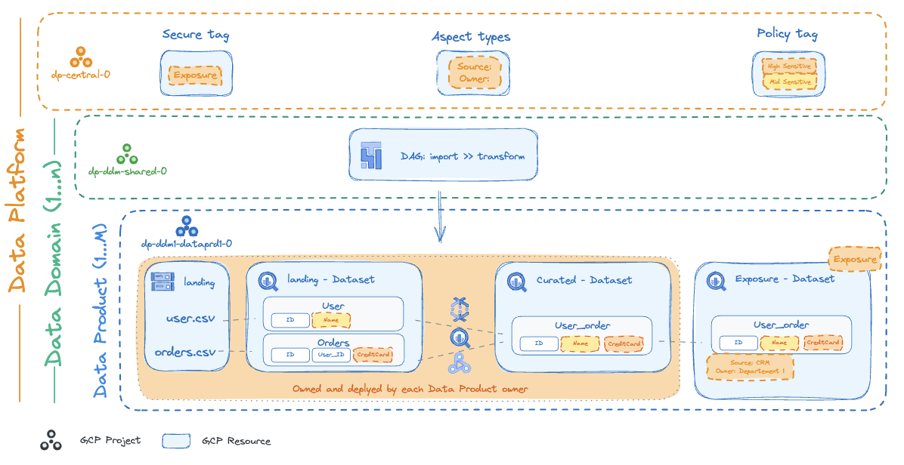
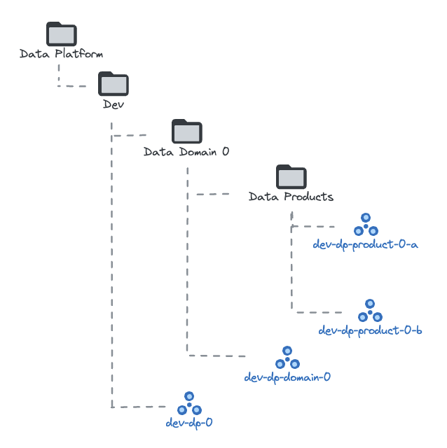

# Data Platform Dataset

This dataset configures an opinionated Data Platform architecture based on Google Cloud best practices, managed via the Project Factory.

Its architecture is designed to be reliable, robust, and scalable, facilitating the continuous onboarding of new Data Products (or data workloads).

<!-- BEGIN TOC -->
- [Design Overview and Choices](#design-overview-and-choices)
  - [Data Platform Architecture](#data-platform-architecture)
  - [Folder and Project Structure](#folder-and-project-structure)
    - [Central Shared Services (Federated Governance)](#central-shared-services-federated-governance)
    - [Data Domains (Domain-Driven Ownership)](#data-domains-domain-driven-ownership)
    - [Data Products (DaaP)](#data-products-daap)
  - [Delegated Automation Model](#delegated-automation-model)
  - [Teams and Personas](#teams-and-personas)
    - [Central Data Platform Team](#central-data-platform-team)
    - [Data Domain Team](#data-domain-team)
    - [Data Product Team](#data-product-team)
- [Stage Prerequisites](#stage-prerequisites)
  - [Service Accounts](#service-accounts)
  - [Storage](#storage)
  - [IAM Bindings](#iam-bindings)
    - [Data Platform Folder](#data-platform-folder)
    - [Networking](#networking)
    - [Security](#security)
    - [Organization Level (VPC-SC)](#organization-level-vpc-sc)
  - [Output Files and Provider Generation](#output-files-and-provider-generation)
  - [Environment File and Linking](#environment-file-and-linking)
- [Customization Guide](#customization-guide)
    - [1. IAM Principals and Context](#1-iam-principals-and-context)
    - [2. Data Governance Assets](#2-data-governance-assets)
    - [3. Adding Domains and Products](#3-adding-domains-and-products)
    - [4. VPC-SC Perimeter](#4-vpc-sc-perimeter)
- [Deployment Choices](#deployment-choices)
  - [Networking Models](#networking-models)
  - [Project-Local VPCs](#project-local-vpcs)
- [Usage](#usage)
<!-- END TOC -->

## Design Overview and Choices

### Data Platform Architecture

The following diagram represents the high-level architecture of the Data Platform related projects and their associated resources managed by this dataset:

<p align="center">
  
</p>

### Folder and Project Structure

The dataset manages the following three high-level logical components implemented via GCP folders and projects:

- "Central Shared Services", a single central project, in which Dataplex Catalog Aspect Types, Policy Tags, and Resource Manager tags a.k.a. "Secure Tags" are defined
- one or more "Data Domains", each composed of a folder with a top-level shared project hosting shared resources such as Composer at the domain level, and an additional sub-folder for hosting data products e.g. "Data Products"
- one or more "Data Products" per domain, each composed of a project, and related resources that are optional

<p align="center">

</p>

#### Central Shared Services (Federated Governance)

Central Shared Services Project provides the standardized central capabilities to foster federated governance processes. These are implemented via established foundations that enable cross-domain data discovery, data sharing, self-service functionalities, and consistent governance.

Core, platform-wide capabilities are delivered as shared services managed within a dedicated "Central Shared Services" project. These capabilities include:

- [Dataplex Catalog Aspect Types](https://cloud.google.com/dataplex/docs/enrich-entries-metadata): Defined in `aspect-types/`.
- [Policy Tags](https://cloud.google.com/bigquery/docs/best-practices-policy-tags): Configured via the `central_project_config.policy_tags` variable (if applicable) or YAML.

#### Data Domains (Domain-Driven Ownership)

A Data Domain typically aligns with a business unit (BU) or a distinct function within an enterprise. To support this ownership model, each logical Data Domain is provisioned with its own isolated GCP folder.

Within each Data Domain, a corresponding Google Cloud "Data Domain" project serves as the primary container for all its specific services and resources. A dedicated Cloud Composer environment is provisioned within this project for orchestrating the domain's data workflows.

#### Data Products (DaaP)

Each Data Product within a Data Domain is encapsulated in its own dedicated Google Cloud Project. This separation is key to achieving modularity, scalability, flexibility, and distinct ownership for each product.

### Delegated Automation Model

To enable domain-driven ownership and self-service, the dataset implements a multi-tiered automation model using the Project Factory's `automation` feature:

1.  **Central Platform**: Managed by the main Stage 0 service accounts (or the principal running the stage).
2.  **Data Domains**: The Domain project (`projects/domain-0/shared-0.yaml`) creates its own automation service accounts (read-only and read-write) in the Central project (`prod-dp-core-0`).
3.  **Data Products**: The Product project (`projects/domain-0/product-0.yaml`) uses the Domain's read-write service account for its automation, and stores its state in a bucket within the Domain project.

This structure allows central teams to bootstrap domains, and then delegate the management of products within a domain to the respective domain team, using their specific service accounts.

### Teams and Personas

Effective data mesh operation relies on well-defined roles and responsibilities.

| Group | Central Shared Services Project | Data Domain Folder | Data Product Project |
| - | :-: | :-: | :-: |
| Central Data Platform Team | `ADMIN` | `Log and Metrics Viewer` | `Log and Metrics Viewer` |
| Data Domain Team | `READ/USAGE` | `ADMIN` | `Log and Metrics Viewer` |
| Data Product Team | `READ/USAGE` | `READ/USAGE` | `ADMIN` |

#### Central Data Platform Team

This team defines the overall data platform architecture, establishes shared infrastructure, and enforces central data governance policies and standards across the data mesh.

#### Data Domain Team

Aligned with specific business areas (e.g., customer, finance, distribution), this team holds clearly defined ownership of data within that domain. They are responsible for the domain-wide data product roadmap and security.

#### Data Product Team

This team is responsible for the end-to-end lifecycle of a specific Data Product. They develop, operate, and maintain their assigned Data Product, including ingestion, transformation, and exposure.

## Stage Prerequisites

When using this dataset as an additional project factory (separate from the main `2-project-factory` stage), you need to configure Stage 0 to provision the necessary automation resources and IAM permissions.

This typically involves adding a new set of service accounts and a dedicated state bucket folder for the data platform automation.

### Service Accounts

Add the following service accounts to your Stage 0 configuration (e.g., in `projects/core/iac-0.yaml`):

```yaml
service_accounts:
  iac-dp-ro:
    display_name: IaC service account for data platform (read-only).
  iac-dp-rw:
    display_name: IaC service account for data platform (read-write).
```

### Storage

Configure a dedicated managed folder for the data platform state in the Stage 0 state bucket, and grant access to the service accounts:

```yaml
buckets:
  iac-stage-state:
    managed_folders:
      2-data-platform:
        iam:
          roles/storage.admin:
            - $iam_principals:service_accounts/iac-0/iac-dp-rw
          $custom_roles:storage_viewer:
            - $iam_principals:service_accounts/iac-0/iac-dp-ro
```

Also, ensure the data platform service accounts have access to the `iac-outputs` bucket:

```yaml
  iac-outputs:
    iam:
      roles/storage.admin:
        - $iam_principals:service_accounts/iac-0/iac-dp-rw
      $custom_roles:storage_viewer:
        - $iam_principals:service_accounts/iac-0/iac-dp-ro
```

### IAM Bindings

Grant the necessary permissions to the data platform service accounts on the folders they will manage.

#### Data Platform Folder

Since the Data Platform folder is not part of the default dataset, you need to create a new folder configuration file.

Create a file named `.config.yaml` for the folder. You can place it:
- Directly under the organization by creating `folders/data-platform/.config.yaml` in your Stage 0 dataset directory.
- Within an existing folder, for example under `teams`, by creating `folders/teams/data-platform/.config.yaml`.

Here is the complete `.config.yaml` content:

```yaml
name: Data Platform
iam_by_principals:
  $iam_principals:service_accounts/iac-0/iac-dp-rw:
    - roles/logging.admin
    - roles/owner
    - roles/resourcemanager.folderAdmin
    - roles/resourcemanager.projectCreator
    - roles/compute.xpnAdmin
  $iam_principals:service_accounts/iac-0/iac-dp-ro:
    - roles/viewer
    - roles/resourcemanager.folderViewer
```

#### Networking

This configuration is used if you rely on the centralized network stage, and access to share networking resources is required from the data platform. Grant the following roles on the `networking` folder.

> [!NOTE]
> These prerequisites are only required if you are using the default Shared VPCs model described in the [Deployment Choices](#deployment-choices) section.

```yaml
iam_bindings:
  dp_rw:
    members:
      - $iam_principals:service_accounts/iac-0/iac-dp-rw
    role: $custom_roles:service_project_network_admin
  dp_ro:
    role: roles/compute.networkViewer
    members:
      - $iam_principals:service_accounts/iac-0/iac-dp-ro
```

And to delegate IAM project administration for networking resources:

```yaml
iam_bindings:
  dp_delegated_iam:
    role: roles/resourcemanager.projectIamAdmin
    members:
      - $iam_principals:service_accounts/iac-0/iac-dp-rw
    condition:
      title: Data platform delegated IAM grant.
      expression: |
        api.getAttribute('iam.googleapis.com/modifiedGrantsByRole', []).hasOnly([
          'roles/compute.networkUser', 'roles/composer.sharedVpcAgent',
          'roles/container.hostServiceAgentUser', 'roles/vpcaccess.user',
          '${custom_roles["dns_zone_binder"]}'
        ])
```

> [!TIP]
> If your Stage 0 configuration already includes a `project_factory` delegated IAM grant with these roles (e.g., for the main Project Factory stage), you can simply add the data platform service account (`iac-dp-rw`) to the members list of that existing binding instead of creating a new `dp_delegated_iam` binding. This applies to both networking and security configurations if similar delegations are needed.

#### Security

This configuration is used if you rely on the centralized security stage, and access to manage security resources (like KMS keys) is required from the data platform. Grant the following roles on the `security` folder (or the specific project hosting the keys):

```yaml
iam_bindings:
  dp_rw_viewer:
    role: roles/cloudkms.viewer
    members:
      - $iam_principals:service_accounts/iac-0/iac-dp-rw
  dp_ro_viewer:
    role: roles/cloudkms.viewer
    members:
      - $iam_principals:service_accounts/iac-0/iac-dp-ro
```

And to delegate IAM project administration for KMS resources (allow granting encrypt/decrypt roles on keys):

```yaml
iam_bindings:
  dp_delegated_kms:
    role: roles/cloudkms.admin
    members:
      - $iam_principals:service_accounts/iac-0/iac-dp-rw
    condition:
      title: Data platform delegated KMS grant.
      expression: |
        api.getAttribute('iam.googleapis.com/modifiedGrantsByRole', []).hasOnly(
[
          'roles/cloudkms.cryptoKeyEncrypterDecrypter',
          'roles/cloudkms.cryptoKeyEncrypterDecrypterViaDelegation'
        ]) && resource.type == 'cloudkms.googleapis.com/CryptoKey'
```

#### Organization Level (VPC-SC)

If you are using VPC-SC and need this stage to manage perimeters or add projects to them, you must grant the following roles at the organization level to the data platform service accounts:

```yaml
iam_by_principals:
  $iam_principals:service_accounts/iac-0/iac-dp-rw:
    - roles/accesscontextmanager.policyEditor
  $iam_principals:service_accounts/iac-0/iac-dp-ro:
    - roles/accesscontextmanager.policyReader
```

### Output Files and Provider Generation

To automatically generate the provider files for this stage, you need to configure the `output_files` section in your Stage 0 `defaults.yaml` file (e.g., `fast/stages/0-org-setup/datasets/classic/defaults.yaml`).

Add the following entries under `output_files.providers`:

```yaml
    2-data-platform:
      bucket: $storage_buckets:iac-0/iac-stage-state
      prefix: 2-data-platform
      service_account: $iam_principals:service_accounts/iac-0/iac-dp-rw
    2-data-platform-ro:
      bucket: $storage_buckets:iac-0/iac-stage-state
      prefix: 2-data-platform
      service_account: $iam_principals:service_accounts/iac-0/iac-dp-ro
```

This configuration instructs Stage 0 to generate `2-data-platform-providers.tf` and `2-data-platform-ro-providers.tf` files in the outputs folder and/or bucket.

### Environment File and Linking

To use these generated files in your custom stage directory (e.g., `custom-stages/2-project-factory-dp`), you need to configure the `.fast-stage.env` file in that directory.

Set `FAST_STAGE_NAME` to `data-platform`:

```text
FAST_STAGE_DESCRIPTION="data platform"
FAST_STAGE_LEVEL=2
FAST_STAGE_NAME=data-platform
FAST_STAGE_DEPS="0-globals 0-org-setup"
FAST_STAGE_OPTIONAL="1-vpcsc 2-networking 2-security"
```

This allows the `fast-links.sh` script to correctly identify and link the data platform specific provider and tfvars files.

To create the links, run the script from inside your stage folder:

```bash
../../fast/stages/fast-links.sh path/to/your/fast-config or gs://automation_bucket_name
```

## Customization Guide

You can customize the deployment by modifying the YAML files in this directory:

#### 1. IAM Principals and Context
In `defaults.yaml`, update the `context.iam_principals` map with the actual groups or users for your organization:
- `dp-platform`: Central data platform team.
- `dp-domain-a`: Data domain team members.
- `dp-product-a-0`: Data product team members.
- `data-consumer-bi`: Consumers of public data.

#### 2. Data Governance Assets
The Central project (`projects/core-0.yaml`) is configured to load data governance assets from the following directories:
- `aspect-types/`: Define Dataplex Catalog Aspect Types.
- `tags/`: Define Resource Manager tags.
- `taxonomies/`: Define Data Catalog taxonomies and policy tags (e.g., `taxonomies/tags.yaml`).

#### 3. Adding Domains and Products
The provided `domain-0` directory is a template. To add new domains or products:
1.  Replicate or modify the folder structure under `projects/`.
2.  Update the `parent` and `name` attributes in the new YAML files.
3.  Ensure the `automation` block references the correct parent project and service accounts.

> [!TIP]
> **Project Templates**: For data products that follow a similar configuration, you can use the project templates feature by placing template files in the `project-templates/` directory. This dataset provides a simple example in `project-templates/data-product.yaml`.
>
> Note that the project template feature implements a **shallow merge**, meaning that top-level keys defined in your specific project YAML file will completely overwrite the corresponding top-level keys from the template.

#### 4. VPC-SC Perimeter
If you are using VPC-SC, you can add projects to a perimeter by specifying it in `defaults.yaml` under `projects.defaults`:

```yaml
projects:
  defaults:
    vpc_sc:
      perimeter_name: $vpc_sc_perimeters:default
      is_dry_run: false
```

## Deployment Choices

The Data Platform dataset allows for flexibility in networking models, supporting both Shared VPCs (standard enterprise pattern) and Project-Local VPCs (isolated workloads).

### Networking Models

The Data Platform dataset supports two networking models, which can also be used together:

1.  **Project-Local VPCs (Default)**: By default, this dataset creates project-local VPCs using the VPC factory (reading from the `vpcs` directory).
2.  **Shared VPCs**: To attach projects to a Shared VPC managed in the `2-networking` stage, you must:
    *   Delete the files in the `vpcs` directory (or set `factories_config.paths.vpcs` to a non-existent path).
    *   Uncomment the `shared_vpc_service_config` block in the project YAML files (e.g., `projects/domain-0/shared-0.yaml`).

### Project-Local VPCs

This folder can contain YAML files defining VPCs that are local to specific projects.
The structure should follow the `net-vpc-factory` pattern:

1.  Create a folder for the VPC (e.g., `my-vpc-0`).
2.  Inside that folder, create a `.config.yaml` file.
3.  Define the VPC configuration in `.config.yaml` (see `net-vpc-factory` module documentation for schema details).

Example `.config.yaml` (e.g. `domain-0/.config.yaml`):

```yaml
name: domain-0
project_id: $project_ids:shared-0 # Use context interpolation for project IDs
subnets:
  - name: default
    ip_cidr_range: 10.0.0.0/24
    region: $locations:primary
```

Note: You must also enable the `vpcs` factory path in your `terraform.tfvars` or `*.auto.tfvars` file if it's not enabled by default:

```hcl
factories_config = {
  paths = {
    vpcs = "vpcs"
  }
}
```

## Usage

To deploy this dataset, configure your `2-project-factory` stage to use this directory by setting the `dataset` attribute in `factories_config`:

```hcl
factories_config = {
  dataset = "datasets/data-platform"
}
```
