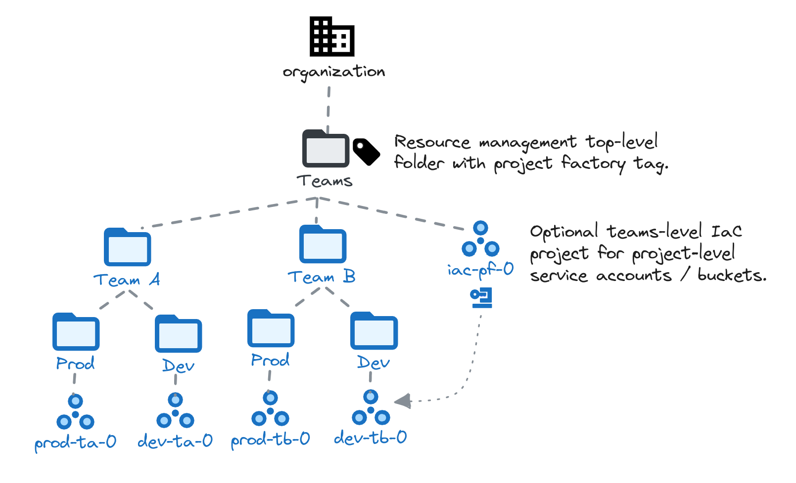

# Project Factory Teams Pattern

This sample pattern shows how to leverage the project factory to manage a team or application-level hirerarchy under a common root. The following diagram illustrates the high level design.

<p align="center">
  
</p>

The project factory controls one or more top-level folders created in the resource management stage, and where its service account has high level permissions via IAM and tag bindings.

<!-- BEGIN TOC -->
- [Resource Management Stage Configuration](#resource-management-stage-configuration)
- [Project Factory Hierarchy Management](#project-factory-hierarchy-management)
  - [Folder Parent-Child Relationships and Variable Substitutions](#folder-parent-child-relationships-and-variable-substitutions)
- [Project Creation](#project-creation)
  - [Automation Resources for Projects](#automation-resources-for-projects)
<!-- END TOC -->

## Resource Management Stage Configuration

This is an example configuration for the resource management `top_folders` variable, using implicit substitutions to refer to the project factory service account, tag, and the custom role that allows the project factory to manage Shared VPC service projects.

```tfvars
top_level_folders = {
  # more top-level folders might be present here
  teams = {
    name = "Teams"
    iam = {
      "roles/owner"                          = ["project-factory"]
      "roles/resourcemanager.folderAdmin"    = ["project-factory"]
      "roles/resourcemanager.projectCreator" = ["project-factory"]
      "service_project_network_admin"        = ["project-factory"]
    }
    tag_bindings = {
      context = "context/project-factory"
    }
  }
}
# tftest skip
```

You can of course extend the above snippet to grant additional roles to groups or different service accounts via the `iam`, `iam_by_principals`, and `iam_bindings` folder-level variables.

The project factory tag binding on the folder allows management of organization policies in the Teams hierarchy. If this functionality is not needed, the tag binding can be safely omitted.

## Factory Configuration

The `data` folder in this pattern contains factory files that can be used as exaples to implement the design shown above. To use them, configure the project factory `factories_config` variable so paths for the hierarchy and project data point to this folder.

Before running `terraform apply` check the YAML files, as project names and other attributes are dependent on your global variables, and need basic editing to match your organization.

### Project Factory Hierarchy Management

The project factory manages the folder hierarchy below the top-level Teams folder, via a filesystem hierarchy rooted in the path defined via the `factories_config.hierarchy_data` variable.

Filesystem folders which contain a `_config.yaml` file are mapped to folders in the resource management hierarchy. The YAML configuration file allows definining folder attributes like descriptive name, IAM bindings, organization policies, tag bindings.

The data files provided with this pattern implement the design in the diagram above, and have the following layout in the filesystem.

```bash
hierarchy
├── team-a
│   ├── _config.yaml
│   ├── dev
│   │   └── _config.yaml
│   └── prod
│       └── _config.yaml
└── team-b
    ├── _config.yaml
    ├── dev
    │   └── _config.yaml
    └── prod
        └── _config.yaml
```

The approach is intentionally explicit and repetitive in order to simplify operations: when a new team branch is needed, copy/paste one of the existing teams (or an ad hoc template that servers as a basis for new teams), and change the few relevant variables in the YAML config files.

This is the config file for the dev Team A folder. The IAM binding is just an example: all the features of the [folder module](../../../../modules/folder/) can be used to fine-tune the configuration.

```yaml
name: Development
tag_bindings:
  environment: environment/development
iam_by_principals:
  "group:team-a-admins@example.com":
    - roles/editor
```

#### Folder Parent-Child Relationships and Variable Substitutions

You might have noted that there's no parent specified for the folder in the example above: the parent is derived from the filesystem hierarchy, and in this case it's set to the "Team A" folder.

But what about the "Team A" folder itself? From the point of view of the project factory it's a top-level folder, so how can you instruct it to create it below "Teams"?

There are three different ways this can be done:

- setting the folder's `parent` attribute to the explicit numeric id of the "Teams" folder
- setting the folder's `parent` attribute to the short name of the "Teams" folder in the resource management stage's outputs
- setting the `default` folder for the project factory to the numeric id of the "Teams" folder

This flexibility might seem confusing, but it's a feature which allows the project factory to manage folders under multiple roots. Imagine a scenario where you don't have a single "Teams" folder, but multiple ones for different subsidiaries, or for internal and external teams, etc.

This is an example that shows how to set the `parent` attributes, either explicitly or via substitution.

```yaml
name: Team A
# this sets the explicit id of the Teams folder
# parent: folders/1234567890
# this is preferred and uses variable substitutions
parent: teams
```

Setting a default folder allows you to skip defining a parent in YAML files, but is slightly more complex. In the stage terraform variables, populate the `factories_config.substitutions.folder_ids` so that the `default` key points to the folder id of the root.

```tfvars
factories_config = {
  substitutions = {
    folder_ids = {
      # id of the top-level Teams folder
      default = "folders/12345678"
    }
  }
}
# tftest skip
```

### Project Creation

Project YAML files can be created in two paths:

- in the folder defined in the `factories_config.project_data` variable
- in the folder hierarchy discussed above

The two approaches can be mixed and matched, but the first approach is safer as is avoids situations which are complex to troubleshoot and fix, where a folder is deleted with projects still contained in it and the delete operation gets stuck.

When specifying projects outside of the folder hierarchy, the parent folder needs to be manually specified in the YAML files. Substitutions can of course be used to avoid manually specifying the folder id.

```yaml
parent: team-a/dev
```

YAML files support the full interface of the [project module](../../../../modules/project/).

#### Automation Resources for Projects

If created projects are meant to be managed via IaC, an initial set of automation resources can be created in a "controlling project". The preferred pattern is to first create the controlling project for the (Teams) hierarchy, and then leverage it for service account and GCS bucket creation.

```yaml
parent: teams
name: xxx-prod-iac-teams-0
services:
  - compute.googleapis.com
  - storage.googleapis.com
  # ...
  # enable all services used by service accounts in this project
```

Once the automation project is in place, it can be used in any other project declaration to create controlling service accounts and buckets for IaC. Service accounts can then be used in IAM bindings in the same file by referring to their name, as shown here.

```yaml
parent: team-a/dev
name: xxx-dev-ta-app-0
iam:
  roles/owner:
    - rw
  roles/viewer:
    - ro
automation:
  project: xxx-prod-iac-teams-0
  service_accounts:
    # sa name: foo-prod-app-example-0-rw
    rw:
      description: Read/write automation sa for team a app 0.
    # sa name: foo-prod-app-example-0-ro
    ro:
      description: Read-only automation sa for team a app 0.
  buckets:
    # bucket name: foo-prod-app-example-0-state
    state:
      description: Terraform state bucket for team a app 0.
      iam:
        roles/storage.objectCreator:
          - rw
        roles/storage.objectViewer:
          - rw
          - ro
          - group:devops@example.org
```
