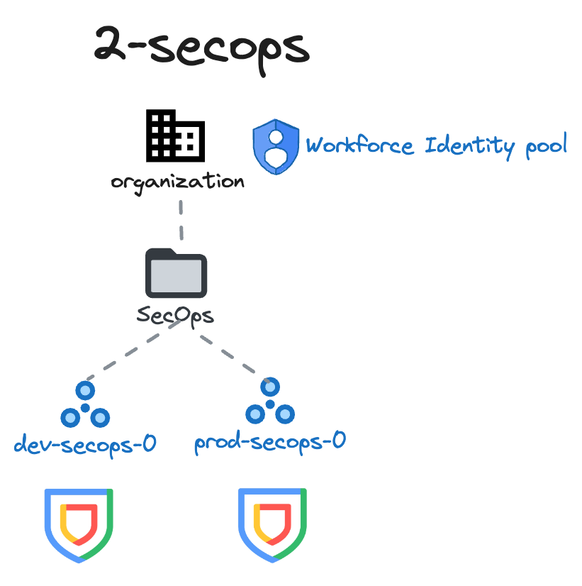

# SecOps Stage

This stage sets up an area dedicated to hosting SecOps projects in the Google Cloud organization.

The design of this stage is fairly simple, as it is only responsible for creating GCP projects that will be linked to SecOps instances as per the [following documentation](https://cloud.google.com/chronicle/docs/onboard/configure-cloud-project).

After creating the projects please refer to your Google Cloud Security representative for instructions on how to bind your Google SecOps instance to the Google Cloud project/s created in this stage.

The following diagram illustrates the high-level design of resources managed here:

<p align="center">
  
</p>

<!-- BEGIN TOC -->
- [Design overview and choices](#design-overview-and-choices)
  - [Workforce Identity Federation](#workforce-identity-federation)
- [How to run this stage](#how-to-run-this-stage)
  - [Provider and Terraform variables](#provider-and-terraform-variables)
  - [Impersonating the automation service account](#impersonating-the-automation-service-account)
  - [Variable configuration](#variable-configuration)
  - [Using delayed billing association for projects](#using-delayed-billing-association-for-projects)
  - [Running the stage](#running-the-stage)
- [Customizations](#customizations)
  - [Workforce Identity Federation](#workforce-identity-federation)
- [Files](#files)
- [Variables](#variables)
- [Outputs](#outputs)
<!-- END TOC -->

## Design overview and choices

This stage will deploy 1 SecOps project for each environment available from the 0-globals input variables, of course such a behaviour might be updated to either deploy a single production instance or different number of environments with respect to the foundations ones.

IAM for day to day operations is already assigned at the folder level to the secops team by the previous stage, but more granularity can be added here at the project level, to grant control of separate services across environments to different actors as well as in the later 3-secops-dev/prod stages.

### Workforce Identity Federation

This stage supports configuration of [Workforce Identity Federation](https://cloud.google.com/iam/docs/workforce-identity-federation) which lets an external identity provider (IdP) to authenticate and authorize a group of users (usually employees) using IAM, so that the users can access Google Cloud services.

The following example shows an example on how to define a Workforce Identity pool for the organization.

```hcl
# stage 2 secops wif tfvars
workforce_identity_providers = {
  test = {
    issuer       = "azuread"
    display_name = "wif-provider"
    description  = "Workforce Identity pool"
    saml         = {
      idp_metadata_xml = "<?xml version=\"1.0\" encoding=\"utf-8\"?>..."
    }
  }
}
# tftest skip
```

## How to run this stage

This stage is meant to be executed after the [resource management](../1-resman) stage has run, as it leverages the automation service account and bucket created there, and additional resources configured in the [bootstrap](../0-bootstrap) stage.

It's of course possible to run this stage in isolation, but that's outside the scope of this document, and you would need to refer to the code for the previous stages for the environmental requirements.

Before running this stage, you need to make sure you have the correct credentials and permissions, and localize variables by assigning values that match your configuration.

### Provider and Terraform variables

As all other FAST stages, the [mechanism used to pass variable values and pre-built provider files from one stage to the next](../0-bootstrap/README.md#output-files-and-cross-stage-variables) is also leveraged here.

The commands to link or copy the provider and terraform variable files can be easily derived from the `fast-links.sh` script in the FAST stages folder, passing it a single argument with the local output files folder (if configured) or the GCS output bucket in the automation project (derived from stage 0 outputs). The following examples demonstrate both cases, and the resulting commands that then need to be copy/pasted and run.

```bash
../fast-links.sh ~/fast-config

# File linking commands for security stage

# provider file
ln -s ~/fast-config/fast-test-00/providers/2-secops-providers.tf ./

# input files from other stages
ln -s ~/fast-config/fast-test-00/tfvars/0-globals.auto.tfvars.json ./
ln -s ~/fast-config/fast-test-00/tfvars/0-bootstrap.auto.tfvars.json ./
ln -s ~/fast-config/fast-test-00/tfvars/1-resman.auto.tfvars.json ./

# conventional place for stage tfvars (manually created)
ln -s ~/fast-config/fast-test-00/2-secops.auto.tfvars ./
```

```bash
../fast-links.sh gs://xxx-prod-iac-core-outputs-0

# File linking commands for security stage

# provider file
gcloud storage cp gs://xxx-prod-iac-core-outputs-0/providers/2-secops-providers.tf ./

# input files from other stages
gcloud storage cp gs://xxx-prod-iac-core-outputs-0/tfvars/0-globals.auto.tfvars.json ./
gcloud storage cp gs://xxx-prod-iac-core-outputs-0/tfvars/0-bootstrap.auto.tfvars.json ./
gcloud storage cp gs://xxx-prod-iac-core-outputs-0/tfvars/1-resman.auto.tfvars.json ./

# conventional place for stage tfvars (manually created)
gcloud storage cp gs://xxx-prod-iac-core-outputs-0/2-secops.auto.tfvars ./
```

### Impersonating the automation service account

The preconfigured provider file uses impersonation to run with this stage's automation service account's credentials. The `gcp-devops` and `organization-admins` groups have the necessary IAM bindings in place to do that, so make sure the current user is a member of one of those groups.

### Variable configuration

Variables in this stage -- like most other FAST stages -- are broadly divided into three separate sets:

- variables which refer to global values for the whole organization (org id, billing account id, prefix, etc.), which are pre-populated via the `0-globals.auto.tfvars.json` file linked or copied above
- variables which refer to resources managed by previous stages, which are prepopulated here via the `0-bootstrap.auto.tfvars.json` and `1-resman.auto.tfvars.json` files linked or copied above
- and finally variables that optionally control this stage's behaviour and customizations, and can to be set in a custom `terraform.tfvars` file

The latter set is explained in the [Customization](#customizations) sections below, and the full list can be found in the [Variables](#variables) table at the bottom of this document.

Note that the `outputs_location` variable is disabled by default, you need to explicitly set it in your `terraform.tfvars` file if you want output files to be generated by this stage. This is a sample `terraform.tfvars` that configures it, refer to the [bootstrap stage documentation](../0-bootstrap/README.md#output-files-and-cross-stage-variables) for more details:

```tfvars
outputs_location = "~/fast-config"
```

### Using delayed billing association for projects

This configuration is possible but unsupported and only exists for development purposes, use at your own risk:

- temporarily switch `billing_account.id` to `null` in `0-globals.auto.tfvars.json`
- for each project resources in the project modules used in this stage (`dev`, `prod`)
  - apply using `-target`, for example
    `terraform apply -target 'module.project["dev"].google_project.project[0]'`
  - untaint the project resource after applying, for example
    `terraform untaint 'module.project["dev"].google_project.project[0]'`
- go through the process to associate the billing account with the two projects
- switch `billing_account.id` back to the real billing account id
- resume applying normally

### Running the stage

Once provider and variable values are in place and the correct user is configured, the stage can be run:

```bash
terraform init
terraform apply
```

## Customizations

### Workforce Identity Federation

This is a minimal configuration that creates a Workforce Identity pool at organization level.

```tfvars
workforce_identity_providers = {
  test = {
    issuer       = "azuread"
    display_name = "wif-provider"
    description  = "Workforce Identity pool"
    saml         = {
      idp_metadata_xml = "<?xml version=\"1.0\" encoding=\"utf-8\"?>..."
    }
  }
}
```

<!-- TFDOC OPTS files:1 show_extra:1 exclude:2-secops-providers.tf -->
<!-- BEGIN TFDOC -->
## Files

| name | description | modules | resources |
|---|---|---|---|
| [identity-providers-defs.tf](./identity-providers-defs.tf) | Workforce Identity provider definitions. |  |  |
| [identity-providers.tf](./identity-providers.tf) | Workforce Identity Federation provider definitions. |  | <code>google_iam_workforce_pool</code> · <code>google_iam_workforce_pool_provider</code> |
| [main.tf](./main.tf) | Module-level locals and resources. | <code>folder</code> · <code>project</code> |  |
| [outputs.tf](./outputs.tf) | Module outputs. |  | <code>google_storage_bucket_object</code> · <code>local_file</code> |
| [variables-fast.tf](./variables-fast.tf) | None |  |  |
| [variables.tf](./variables.tf) | Module variables. |  |  |

## Variables

| name | description | type | required | default | producer |
|---|---|:---:|:---:|:---:|:---:|
| [automation](variables-fast.tf#L17) | Automation resources created by the bootstrap stage. | <code title="object&#40;&#123;&#10;  outputs_bucket &#61; string&#10;&#125;&#41;">object&#40;&#123;&#8230;&#125;&#41;</code> | ✓ |  | <code>0-bootstrap</code> |
| [billing_account](variables-fast.tf#L25) | Billing account id. If billing account is not part of the same org set `is_org_level` to false. | <code title="object&#40;&#123;&#10;  id           &#61; string&#10;  is_org_level &#61; optional&#40;bool, true&#41;&#10;&#125;&#41;">object&#40;&#123;&#8230;&#125;&#41;</code> | ✓ |  | <code>0-bootstrap</code> |
| [environments](variables-fast.tf#L47) | Environment names. | <code title="map&#40;object&#40;&#123;&#10;  name       &#61; string&#10;  short_name &#61; string&#10;  tag_name   &#61; string&#10;  is_default &#61; optional&#40;bool, false&#41;&#10;&#125;&#41;&#41;">map&#40;object&#40;&#123;&#8230;&#125;&#41;&#41;</code> | ✓ |  | <code>0-globals</code> |
| [folder_ids](variables-fast.tf#L65) | Folder name => id mappings, the 'security' folder name must exist. | <code title="object&#40;&#123;&#10;  secops      &#61; string&#10;  secops-dev  &#61; optional&#40;string&#41;&#10;  secops-prod &#61; optional&#40;string&#41;&#10;&#125;&#41;">object&#40;&#123;&#8230;&#125;&#41;</code> | ✓ |  | <code>1-resman</code> |
| [organization](variables-fast.tf#L75) | Organization details. | <code title="object&#40;&#123;&#10;  domain      &#61; string&#10;  id          &#61; number&#10;  customer_id &#61; string&#10;&#125;&#41;">object&#40;&#123;&#8230;&#125;&#41;</code> | ✓ |  | <code>0-bootstrap</code> |
| [prefix](variables-fast.tf#L86) | Prefix used for resources that need unique names. Use a maximum of 9 chars for organizations, and 11 chars for tenants. | <code>string</code> | ✓ |  | <code>0-bootstrap</code> |
| [custom_roles](variables-fast.tf#L38) | Custom roles defined at the org level, in key => id format. | <code title="object&#40;&#123;&#10;  project_iam_viewer &#61; string&#10;&#125;&#41;">object&#40;&#123;&#8230;&#125;&#41;</code> |  | <code>null</code> | <code>0-bootstrap</code> |
| [essential_contacts](variables.tf#L17) | Email used for essential contacts, unset if null. | <code>string</code> |  | <code>null</code> |  |
| [outputs_location](variables.tf#L23) | Path where providers, tfvars files, and lists for the following stages are written. Leave empty to disable. | <code>string</code> |  | <code>null</code> |  |
| [stage_config](variables-fast.tf#L96) | FAST stage configuration. | <code title="object&#40;&#123;&#10;  security &#61; optional&#40;object&#40;&#123;&#10;    short_name          &#61; optional&#40;string&#41;&#10;    iam_admin_delegated &#61; optional&#40;map&#40;list&#40;string&#41;&#41;, &#123;&#125;&#41;&#10;    iam_viewer          &#61; optional&#40;map&#40;list&#40;string&#41;&#41;, &#123;&#125;&#41;&#10;  &#125;&#41;, &#123;&#125;&#41;&#10;&#125;&#41;">object&#40;&#123;&#8230;&#125;&#41;</code> |  | <code>&#123;&#125;</code> | <code>1-resman</code> |
| [tag_values](variables-fast.tf#L110) | Root-level tag values. | <code>map&#40;string&#41;</code> |  | <code>&#123;&#125;</code> | <code>1-resman</code> |
| [workforce_identity_providers](variables.tf#L29) | Workforce Identity Federation pools. | <code title="map&#40;object&#40;&#123;&#10;  attribute_condition &#61; optional&#40;string&#41;&#10;  issuer              &#61; string&#10;  display_name        &#61; string&#10;  description         &#61; string&#10;  disabled            &#61; optional&#40;bool, false&#41;&#10;  saml &#61; optional&#40;object&#40;&#123;&#10;    idp_metadata_xml &#61; string&#10;  &#125;&#41;, null&#41;&#10;&#125;&#41;&#41;">map&#40;object&#40;&#123;&#8230;&#125;&#41;&#41;</code> |  | <code>&#123;&#125;</code> |  |

## Outputs

| name | description | sensitive | consumers |
|---|---|:---:|---|
| [federated_identity_pool](outputs.tf#L41) | Workforce Identity Federation pool. |  |  |
| [secops_project_ids](outputs.tf#L46) | SecOps project IDs. |  |  |
| [tfvars](outputs.tf#L51) | Terraform variable files for the following stages. | ✓ |  |
<!-- END TFDOC -->
