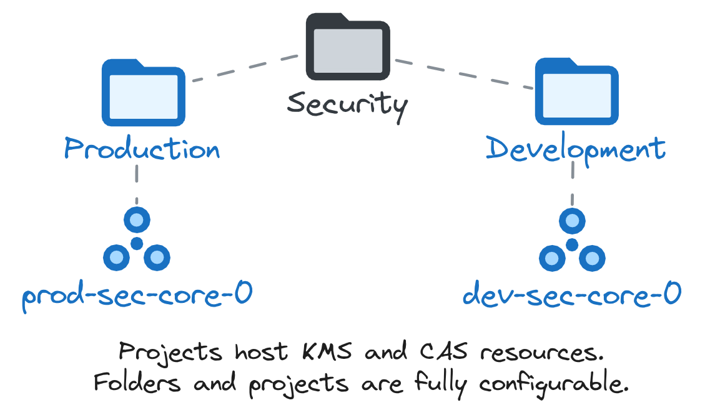

# Shared security resources and VPC Service Controls

This stage sets up an area dedicated to hosting security resources and configurations which impact the whole organization, or are shared across the hierarchy to other projects and teams.

The design of this stage is fairly general, and out of the box it only provides a reference example for [Cloud KMS](https://cloud.google.com/security-key-management).

Expanding it to include other security-related services like Secret Manager is fairly simple by adapting the provided implementation for Cloud KMS, and leveraging the broad permissions granted on the top-level Security folder to the automation service account used here.

The following diagram illustrates the high-level design of resources managed here:

<p align="center">
  
</p>

<!-- BEGIN TOC -->
- [Design overview and choices](#design-overview-and-choices)
  - [Cloud KMS](#cloud-kms)
  - [Certificate Authority Service (CAS)](#certificate-authority-service-cas)
- [How to run this stage](#how-to-run-this-stage)
  - [Provider and Terraform variables](#provider-and-terraform-variables)
  - [Impersonating the automation service account](#impersonating-the-automation-service-account)
  - [Variable configuration](#variable-configuration)
  - [Using delayed billing association for projects](#using-delayed-billing-association-for-projects)
  - [Running the stage](#running-the-stage)
- [Customizations](#customizations)
  - [KMS keys](#kms-keys)
  - [NGFW Enterprise - sample TLS configurations](#ngfw-enterprise-sample-tls-configurations)
- [Files](#files)
- [Variables](#variables)
- [Outputs](#outputs)
<!-- END TOC -->

## Design overview and choices

Project-level security resources are grouped into two separate projects, one per environment. This setup matches requirements we frequently observe in real life and provides enough separation without needlessly complicating operations.

Cloud KMS is configured and designed mainly to encrypt GCP resources with a [Customer-managed encryption key](https://cloud.google.com/kms/docs/cmek) but it may be used to create cryptokeys used to [encrypt application data](https://cloud.google.com/kms/docs/encrypting-application-data) too.

IAM for day to day operations is already assigned at the folder level to the security team by the previous stage, but more granularity can be added here at the project level, to grant control of separate services across environments to different actors.

### Cloud KMS

A reference Cloud KMS implementation is part of this stage, to provide a simple way of managing centralized keys, that are then shared and consumed widely across the organization to enable customer-managed encryption. The implementation is also easy to clone and modify to support other services like Secret Manager.

The Cloud KMS configuration allows defining keys by name (typically matching the downstream service that uses them) in different locations. It then takes care internally of provisioning the relevant keyrings and creating keys in the appropriate location.

IAM roles on keys can be configured at the logical level for all locations where a logical key is created. Their management can also be delegated via [delegated role grants](https://cloud.google.com/iam/docs/setting-limits-on-granting-roles) exposed through a simple variable, to allow other identities to set IAM policies on keys. This is particularly useful in setups like project factories, making it possible to configure IAM bindings during project creation for team groups or service agent accounts (compute, storage, etc.).

### Certificate Authority Service (CAS)

With this stage you can leverage Certificate Authority Services (CAS) and create as many CAs you need for each environments. To create custom CAS, you can use the `certificate_authorities` variable.

## How to run this stage

This stage is meant to be executed after the [resource management](../1-resman) stage has run, as it leverages the automation service account and bucket created there, and additional resources configured in the [bootstrap](../0-bootstrap) stage.

It's of course possible to run this stage in isolation, but that's outside the scope of this document, and you would need to refer to the code for the previous stages for the environmental requirements.

Before running this stage, you need to make sure you have the correct credentials and permissions, and localize variables by assigning values that match your configuration.

### Provider and Terraform variables

As all other FAST stages, the [mechanism used to pass variable values and pre-built provider files from one stage to the next](../0-bootstrap/README.md#output-files-and-cross-stage-variables) is also leveraged here.

The commands to link or copy the provider and terraform variable files can be easily derived from the `fast-links.sh` script in the FAST stages folder, passing it a single argument with the local output files folder (if configured) or the GCS output bucket in the automation project (derived from stage 0 outputs). The following examples demonstrate both cases, and the resulting commands that then need to be copy/pasted and run.

```bash
../fast-links.sh ~/fast-config

# File linking commands for security stage

# provider file
ln -s ~/fast-config/fast-test-00/providers/2-security-providers.tf ./

# input files from other stages
ln -s ~/fast-config/fast-test-00/tfvars/0-globals.auto.tfvars.json ./
ln -s ~/fast-config/fast-test-00/tfvars/0-bootstrap.auto.tfvars.json ./
ln -s ~/fast-config/fast-test-00/tfvars/1-resman.auto.tfvars.json ./

# conventional place for stage tfvars (manually created)
ln -s ~/fast-config/fast-test-00/2-security.auto.tfvars ./

# optional files
ln -s ~/fast-config/fast-test-00/2-nsec.auto.tfvars.json ./
```

```bash
../fast-links.sh gs://xxx-prod-iac-core-outputs-0

# File linking commands for security stage

# provider file
gcloud storage cp gs://xxx-prod-iac-core-outputs-0/providers/2-security-providers.tf ./

# input files from other stages
gcloud storage cp gs://xxx-prod-iac-core-outputs-0/tfvars/0-globals.auto.tfvars.json ./
gcloud storage cp gs://xxx-prod-iac-core-outputs-0/tfvars/0-bootstrap.auto.tfvars.json ./
gcloud storage cp gs://xxx-prod-iac-core-outputs-0/tfvars/1-resman.auto.tfvars.json ./

# conventional place for stage tfvars (manually created)
gcloud storage cp gs://xxx-prod-iac-core-outputs-0/2-security.auto.tfvars ./

# optional files
gcloud storage cp gs://xxx-prod-iac-core-outputs-0/2-nsec.auto.tfvars.json ./
```

### Impersonating the automation service account

The preconfigured provider file uses impersonation to run with this stage's automation service account's credentials. The `gcp-devops` and `organization-admins` groups have the necessary IAM bindings in place to do that, so make sure the current user is a member of one of those groups.

### Variable configuration

Variables in this stage -- like most other FAST stages -- are broadly divided into three separate sets:

- variables which refer to global values for the whole organization (org id, billing account id, prefix, etc.), which are pre-populated via the `0-globals.auto.tfvars.json` file linked or copied above
- variables which refer to resources managed by previous stages, which are prepopulated here via the `0-bootstrap.auto.tfvars.json` and `1-resman.auto.tfvars.json` files linked or copied above
- and finally variables that optionally control this stage's behaviour and customizations, and can to be set in a custom `terraform.tfvars` file

The latter set is explained in the [Customization](#customizations) sections below, and the full list can be found in the [Variables](#variables) table at the bottom of this document.

Note that the `outputs_location` variable is disabled by default, you need to explicitly set it in your `terraform.tfvars` file if you want output files to be generated by this stage. This is a sample `terraform.tfvars` that configures it, refer to the [bootstrap stage documentation](../0-bootstrap/README.md#output-files-and-cross-stage-variables) for more details:

```tfvars
outputs_location = "~/fast-config"
```

### Using delayed billing association for projects

This configuration is possible but unsupported and only exists for development purposes, use at your own risk:

- temporarily switch `billing_account.id` to `null` in `0-globals.auto.tfvars.json`
- for each project resources in the project modules used in this stage (`dev-sec-project`, `prod-sec-project`)
  - apply using `-target`, for example
    `terraform apply -target 'module.prod-sec-project.google_project.project[0]'`
  - untaint the project resource after applying, for example
    `terraform untaint 'module.prod-sec-project.google_project.project[0]'`
- go through the process to associate the billing account with the two projects
- switch `billing_account.id` back to the real billing account id
- resume applying normally

### Running the stage

Once provider and variable values are in place and the correct user is configured, the stage can be run:

```bash
terraform init
terraform apply
```

## Customizations

### KMS keys

Cloud KMS configuration is controlled by `kms_keys`, which configures the actual keys to create, and also allows configuring their IAM bindings, labels, locations and rotation period. When configuring locations for a key, please consider the limitations each cloud product may have.

The additional `kms_restricted_admins` variable allows granting `roles/cloudkms.admin` to specified principals, restricted via [delegated role grants](https://cloud.google.com/iam/docs/setting-limits-on-granting-roles) so that it only allows granting the roles needed for encryption/decryption on keys. This allows safe delegation of key management to subsequent Terraform stages like the Project Factory, for example to grant usage access on relevant keys to the service agent accounts for compute, storage, etc.

To support these scenarios, key IAM bindings are configured by default to be additive, to enable other stages or Terraform configuration to safely co-manage bindings on the same keys. If this is not desired, follow the comments in the `core-dev.tf` and `core-prod.tf` files to switch to authoritative bindings on keys.

An example of how to configure keys:

```tfvars
# terraform.tfvars

kms_keys = {
  compute = {
    iam = {
      "roles/cloudkms.cryptoKeyEncrypterDecrypter" = [
        "user:user1@example.com"
      ]
    }
    labels          = { service = "compute" }
    locations       = ["europe-west1", "europe-west3", "global"]
    rotation_period = "7776000s"
  }
  storage = {
    iam             = null
    labels          = { service = "storage" }
    locations       = ["europe"]
    rotation_period = null
  }
}
```

The script will create one keyring for each specified location and keys on each keyring.

### NGFW Enterprise - sample TLS configurations

This is a minimal configuration that creates a CAs for each environment and enables TLS inspection policies for NGFW Enterprise.

```tfvars
cas_configs = {
  dev = {
    ngfw-dev-cas-0 = {
      location = "europe-west1"
    }
  }
  prod = {
    ngfw-prod-cas-0 = {
      location = "europe-west1"
    }
  }
}
tls_inspection = {
  enabled = true
}
```

You can optionally create also trust-configs for NGFW Enterprise.

```tfvars
cas_configs = {
  dev = {
    ngfw-dev-cas-0 = {
      location = "europe-west1"
    }
  }
  prod = {
    ngfw-prod-cas-0 = {
      location = "europe-west1"
    }
  }
}
trust_configs = {
  dev = {
    ngfw-dev-tc-0 = {
      allowlisted_certificates = {
        my_ca = "~/my_keys/srv-dev.crt"
      }
      location = "europe-west1"
    }
  }
  prod = {
    ngfw-prod-tc-0 = {
      allowlisted_certificates = {
        my_ca = "~/my_keys/srv-prod.crt"
      }
      location = "europe-west1"
    }
  }
}
tls_inspection = {
  enabled = true
}
```

You can customize the keys of your configurations, as long as they match the ones you specify in the `ngfw_tls_configs.keys` variable.

```tfvars
cas_configs = {
  dev = {
    my-ca-0 = {
      location = "europe-west1"
    }
  }
}
ngfw_tls_configs = {
  keys = {
    dev = {
      cas = "my-ca-0"
    }
  }
}
tls_inspection = {
  enabled = true
}
```

<!-- TFDOC OPTS files:1 show_extra:1 exclude:2-security-providers.tf -->
<!-- BEGIN TFDOC -->
## Files

| name | description | modules | resources |
|---|---|---|---|
| [cas.tf](./cas.tf) | Per-environment certificate resources. | <code>certificate-authority-service</code> |  |
| [kms.tf](./kms.tf) | Per-environment KMS. |  |  |
| [main.tf](./main.tf) | Module-level locals and resources. | <code>folder</code> · <code>project</code> |  |
| [outputs.tf](./outputs.tf) | Module outputs. |  | <code>google_storage_bucket_object</code> · <code>local_file</code> |
| [variables-fast.tf](./variables-fast.tf) | None |  |  |
| [variables.tf](./variables.tf) | Module variables. |  |  |

## Variables

| name | description | type | required | default | producer |
|---|---|:---:|:---:|:---:|:---:|
| [automation](variables-fast.tf#L17) | Automation resources created by the bootstrap stage. | <code title="object&#40;&#123;&#10;  outputs_bucket &#61; string&#10;&#125;&#41;">object&#40;&#123;&#8230;&#125;&#41;</code> | ✓ |  | <code>0-bootstrap</code> |
| [billing_account](variables-fast.tf#L25) | Billing account id. If billing account is not part of the same org set `is_org_level` to false. | <code title="object&#40;&#123;&#10;  id           &#61; string&#10;  is_org_level &#61; optional&#40;bool, true&#41;&#10;&#125;&#41;">object&#40;&#123;&#8230;&#125;&#41;</code> | ✓ |  | <code>0-bootstrap</code> |
| [environments](variables-fast.tf#L47) | Environment names. | <code title="map&#40;object&#40;&#123;&#10;  name       &#61; string&#10;  short_name &#61; string&#10;  tag_name   &#61; string&#10;  is_default &#61; optional&#40;bool, false&#41;&#10;&#125;&#41;&#41;">map&#40;object&#40;&#123;&#8230;&#125;&#41;&#41;</code> | ✓ |  | <code>0-globals</code> |
| [folder_ids](variables-fast.tf#L65) | Folder name => id mappings, the 'security' folder name must exist. | <code title="object&#40;&#123;&#10;  security      &#61; string&#10;  security-dev  &#61; optional&#40;string&#41;&#10;  security-prod &#61; optional&#40;string&#41;&#10;&#125;&#41;">object&#40;&#123;&#8230;&#125;&#41;</code> | ✓ |  | <code>1-resman</code> |
| [prefix](variables-fast.tf#L75) | Prefix used for resources that need unique names. Use a maximum of 9 chars for organizations, and 11 chars for tenants. | <code>string</code> | ✓ |  | <code>0-bootstrap</code> |
| [certificate_authorities](variables.tf#L17) | Certificate Authority Service pool and CAs. If environments is null identical pools and CAs are created in all environments. | <code title="map&#40;object&#40;&#123;&#10;  location              &#61; string&#10;  environments          &#61; optional&#40;list&#40;string&#41;&#41;&#10;  iam                   &#61; optional&#40;map&#40;list&#40;string&#41;&#41;, &#123;&#125;&#41;&#10;  iam_bindings          &#61; optional&#40;map&#40;any&#41;, &#123;&#125;&#41;&#10;  iam_bindings_additive &#61; optional&#40;map&#40;any&#41;, &#123;&#125;&#41;&#10;  iam_by_principals     &#61; optional&#40;map&#40;list&#40;string&#41;&#41;, &#123;&#125;&#41;&#10;  ca_configs &#61; map&#40;object&#40;&#123;&#10;    deletion_protection                    &#61; optional&#40;string, true&#41;&#10;    type                                   &#61; optional&#40;string, &#34;SELF_SIGNED&#34;&#41;&#10;    is_ca                                  &#61; optional&#40;bool, true&#41;&#10;    lifetime                               &#61; optional&#40;string, null&#41;&#10;    pem_ca_certificate                     &#61; optional&#40;string, null&#41;&#10;    ignore_active_certificates_on_deletion &#61; optional&#40;bool, false&#41;&#10;    skip_grace_period                      &#61; optional&#40;bool, true&#41;&#10;    labels                                 &#61; optional&#40;map&#40;string&#41;, null&#41;&#10;    gcs_bucket                             &#61; optional&#40;string, null&#41;&#10;    key_spec &#61; optional&#40;object&#40;&#123;&#10;      algorithm  &#61; optional&#40;string, &#34;RSA_PKCS1_2048_SHA256&#34;&#41;&#10;      kms_key_id &#61; optional&#40;string, null&#41;&#10;    &#125;&#41;, &#123;&#125;&#41;&#10;    key_usage &#61; optional&#40;object&#40;&#123;&#10;      cert_sign          &#61; optional&#40;bool, true&#41;&#10;      client_auth        &#61; optional&#40;bool, false&#41;&#10;      code_signing       &#61; optional&#40;bool, false&#41;&#10;      content_commitment &#61; optional&#40;bool, false&#41;&#10;      crl_sign           &#61; optional&#40;bool, true&#41;&#10;      data_encipherment  &#61; optional&#40;bool, false&#41;&#10;      decipher_only      &#61; optional&#40;bool, false&#41;&#10;      digital_signature  &#61; optional&#40;bool, false&#41;&#10;      email_protection   &#61; optional&#40;bool, false&#41;&#10;      encipher_only      &#61; optional&#40;bool, false&#41;&#10;      key_agreement      &#61; optional&#40;bool, false&#41;&#10;      key_encipherment   &#61; optional&#40;bool, true&#41;&#10;      ocsp_signing       &#61; optional&#40;bool, false&#41;&#10;      server_auth        &#61; optional&#40;bool, true&#41;&#10;      time_stamping      &#61; optional&#40;bool, false&#41;&#10;    &#125;&#41;, &#123;&#125;&#41;&#10;    subject &#61; optional&#40;&#10;      object&#40;&#123;&#10;        common_name         &#61; string&#10;        organization        &#61; string&#10;        country_code        &#61; optional&#40;string&#41;&#10;        locality            &#61; optional&#40;string&#41;&#10;        organizational_unit &#61; optional&#40;string&#41;&#10;        postal_code         &#61; optional&#40;string&#41;&#10;        province            &#61; optional&#40;string&#41;&#10;        street_address      &#61; optional&#40;string&#41;&#10;      &#125;&#41;,&#10;      &#123;&#10;        common_name  &#61; &#34;test.example.com&#34;&#10;        organization &#61; &#34;Test Example&#34;&#10;      &#125;&#10;    &#41;&#10;    subject_alt_name &#61; optional&#40;object&#40;&#123;&#10;      dns_names       &#61; optional&#40;list&#40;string&#41;, null&#41;&#10;      email_addresses &#61; optional&#40;list&#40;string&#41;, null&#41;&#10;      ip_addresses    &#61; optional&#40;list&#40;string&#41;, null&#41;&#10;      uris            &#61; optional&#40;list&#40;string&#41;, null&#41;&#10;    &#125;&#41;, null&#41;&#10;    subordinate_config &#61; optional&#40;object&#40;&#123;&#10;      root_ca_id              &#61; optional&#40;string&#41;&#10;      pem_issuer_certificates &#61; optional&#40;list&#40;string&#41;&#41;&#10;    &#125;&#41;, null&#41;&#10;  &#125;&#41;&#41;&#10;  ca_pool_config &#61; object&#40;&#123;&#10;    create_pool &#61; optional&#40;object&#40;&#123;&#10;      name &#61; string&#10;      tier &#61; optional&#40;string, &#34;DEVOPS&#34;&#41;&#10;    &#125;&#41;&#41;&#10;    use_pool &#61; optional&#40;object&#40;&#123;&#10;      id &#61; string&#10;    &#125;&#41;&#41;&#10;  &#125;&#41;&#10;&#125;&#41;&#41;">map&#40;object&#40;&#123;&#8230;&#125;&#41;&#41;</code> |  | <code>&#123;&#125;</code> |  |
| [custom_roles](variables-fast.tf#L38) | Custom roles defined at the org level, in key => id format. | <code title="object&#40;&#123;&#10;  project_iam_viewer &#61; string&#10;&#125;&#41;">object&#40;&#123;&#8230;&#125;&#41;</code> |  | <code>null</code> | <code>0-bootstrap</code> |
| [essential_contacts](variables.tf#L98) | Email used for essential contacts, unset if null. | <code>string</code> |  | <code>null</code> |  |
| [kms_keys](variables.tf#L104) | KMS keys to create, keyed by name. | <code title="map&#40;object&#40;&#123;&#10;  iam &#61; optional&#40;map&#40;list&#40;string&#41;&#41;, &#123;&#125;&#41;&#10;  iam_bindings &#61; optional&#40;map&#40;object&#40;&#123;&#10;    members &#61; list&#40;string&#41;&#10;    role    &#61; string&#10;    condition &#61; optional&#40;object&#40;&#123;&#10;      expression  &#61; string&#10;      title       &#61; string&#10;      description &#61; optional&#40;string&#41;&#10;    &#125;&#41;&#41;&#10;  &#125;&#41;&#41;, &#123;&#125;&#41;&#10;  iam_bindings_additive &#61; optional&#40;map&#40;object&#40;&#123;&#10;    member &#61; string&#10;    role   &#61; string&#10;    condition &#61; optional&#40;object&#40;&#123;&#10;      expression  &#61; string&#10;      title       &#61; string&#10;      description &#61; optional&#40;string&#41;&#10;    &#125;&#41;&#41;&#10;  &#125;&#41;&#41;, &#123;&#125;&#41;&#10;  labels &#61; optional&#40;map&#40;string&#41;&#41;&#10;  locations &#61; optional&#40;list&#40;string&#41;, &#91;&#10;    &#34;europe&#34;, &#34;europe-west1&#34;, &#34;europe-west3&#34;, &#34;global&#34;&#10;  &#93;&#41;&#10;  purpose                       &#61; optional&#40;string, &#34;ENCRYPT_DECRYPT&#34;&#41;&#10;  rotation_period               &#61; optional&#40;string, &#34;7776000s&#34;&#41;&#10;  skip_initial_version_creation &#61; optional&#40;bool, false&#41;&#10;  version_template &#61; optional&#40;object&#40;&#123;&#10;    algorithm        &#61; string&#10;    protection_level &#61; optional&#40;string, &#34;SOFTWARE&#34;&#41;&#10;  &#125;&#41;&#41;&#10;&#125;&#41;&#41;">map&#40;object&#40;&#123;&#8230;&#125;&#41;&#41;</code> |  | <code>&#123;&#125;</code> |  |
| [outputs_location](variables.tf#L142) | Path where providers, tfvars files, and lists for the following stages are written. Leave empty to disable. | <code>string</code> |  | <code>null</code> |  |
| [stage_configs](variables-fast.tf#L85) | FAST stage configuration. | <code title="object&#40;&#123;&#10;  security &#61; optional&#40;object&#40;&#123;&#10;    short_name          &#61; optional&#40;string&#41;&#10;    iam_admin_delegated &#61; optional&#40;map&#40;list&#40;string&#41;&#41;, &#123;&#125;&#41;&#10;    iam_viewer          &#61; optional&#40;map&#40;list&#40;string&#41;&#41;, &#123;&#125;&#41;&#10;  &#125;&#41;, &#123;&#125;&#41;&#10;&#125;&#41;">object&#40;&#123;&#8230;&#125;&#41;</code> |  | <code>&#123;&#125;</code> | <code>1-resman</code> |
| [tag_values](variables-fast.tf#L99) | Root-level tag values. | <code>map&#40;string&#41;</code> |  | <code>&#123;&#125;</code> | <code>1-resman</code> |

## Outputs

| name | description | sensitive | consumers |
|---|---|:---:|---|
| [certificate_authority_pools](outputs.tf#L53) | Certificate Authority Service pools and CAs. |  |  |
| [kms_keys](outputs.tf#L58) | KMS key ids. |  |  |
| [tfvars](outputs.tf#L63) | Terraform variable files for the following stages. | ✓ |  |
<!-- END TFDOC -->
