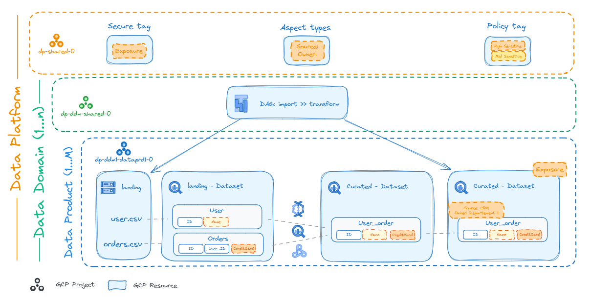

# Data Platform

This stage allows creation and management of a Data Platform, which enables the implementation of a reliable, robust, and scalable environment to support the onboarding of new data products (or data workloads) over time.

The code provided here sets up the foundational design and centralizes sharing patterns for data, leaving the specifics of data handling, computation, and processing to the individual data products.

This solution implements the [Data Mesh principles on Google Cloud Platform](https://cloud.google.com/architecture/data-mesh) and relies on the higher level FAST stages for the resource hierarchy, networking, and security. It's also possible to run this stage in isolation by providing it the required prerequisites.

<!-- BEGIN TOC -->
- [Project Structure](#project-structure)
  - [Central Shared Services](#central-shared-services)
  - [Data Domains](#data-domains)
  - [Data Products](#data-products)
- [Teams and personas](#teams-and-personas)
- [Configuration](#configuration)
  - [Data Domain Syntax](#data-domain-syntax)
  - [Data Product Syntax](#data-product-syntax)
  - [Context replacements](#context-replacements)
- [Files](#files)
- [Variables](#variables)
- [Outputs](#outputs)
<!-- END TOC -->

## Project Structure

The stage manages three separate high level components:

- a central project, where aspect types, policy tags, and resource manager tags are defined
- one or more data domains, each composed of a folder, a project hosting resources shared at the product level (Composer), and a folder hosting data products
- one or more data products per domain, each composed of a project, and optional exposed resources

The platform high level approach is represented in the following diagram:

<p align="center">
  
</p>

### Central Shared Services

Central teams manage the data mesh by providing cross-domain oversight, services, and governance. They reduce the operational burden for data domains in producing and consuming data products, and facilitate the cross-domain relationships that are required for the data mesh to operate.

A central project is created to host resources managed by the central team, which provide core and platform-wide capabilities such as Secure Tags, [Dataplex Catalog aspects)[https://cloud.google.com/dataplex/docs/enrich-entries-metadata], and [Policy tags](https://cloud.google.com/bigquery/docs/best-practices-policy-tags).

### Data Domains

Data Domains are usually aligned with business or functional units within an enterprise. Common examples of business domains might be the mortgage department in a bank, or the customer, distribution, finance, or HR departments of an enterprise.

Data Domain creation is centrally managed by this stage, with a dedicated folder sub-hierarchy and project for each logical domain. This provides a clear organizational boundary and allows for IAM and resource separation, which usually maps to an actual line of business.

A dedicated Data Domain project is created as the primary container for all services and resources specific to each domain. A shared  Cloud Composer environment is also created to orchestrate domain-specific workflows, and provided by default with access to the domain's Data Products via impersonation.

### Data Products

One or more Data Products can be mapped to each Data Domain. A dedicated project is created for each product in its domain's hierarchy, enforcing modularity, scalability, flexibility and clear ownership boundaries.

The per-product BigQuery and Cloud Storage exposure layers can then be deployed in each project, by binding the centrally managed secure tags connected to platform-level IAM bindings.

## Teams and personas

Clear operational role profiles must be defined for a data mesh to operate well, with each profile mapping to a team archetype or function. These profiles implement the core user journeys for each data mesh actor. This stage comes with three predefined profiles, which are meant as a starting example open to customizations.

> TODO: add folder/project roles

The three main functions identified here are:

- **Central data team**
  Defines and enforces the data platform structure and data governance policies among data producers, ensuring high data quality and data trustworthiness for consumers. This team is often referred to as the Data Governance team.
- **Data domain teams**
  Aligned with specific business domains, these teams are responsible for creating and maintaining data products over their lifecycle. This includes defining the data product's purpose, scope, and boundaries, developing and maintaining a product roadmap, implementing data security measures, ensuring compliance, and monitoring usage and performance.
- **Data Product teams**
  Aligned with a specific data products, these teams are responsible for developing, operating and maintaing the data product.

## Configuration

### FAST prerequisites

This stage needs specific permission granted to its automation service accounts, that enable them to connect service projects to Shared VPC networks. This needs to be configured in the resource management stage's network configuration via two separate blocks.

The first block grants the relevant roles on the Networking folder to the Data Platform service accounts, with a condition on the environment tag.

```yaml
# make sure this block exists in the data/stage-2/networking.yaml file
  iam_bindings_additive:
    # Data Platform (dev)
    dp_dev_net_admin:
      role: service_project_network_admin
      member: data-platform-dev-rw
      condition:
        title: Data platform dev service project admin.
        expression: |
          resource.matchTag('${organization.id}/${tag_names.environment}', 'development')
    dp_dev_net_viewer:
      role: roles/compute.networkViewer
      member: data-platform-dev-ro
      condition:
        title: Data platform dev network viewer.
        expression: |
          resource.matchTag('${organization.id}/${tag_names.environment}', 'development')
```

The second block signals the networking stage that the Data Platform service accounts need delegated IAM grants on the dev network project, in order to be able to assign specific roles on it.

```yaml
# make sure this block exists in the data/stage-2/networking.yaml file
stage3_config:
  iam_admin_delegated:
    - environment: dev
      principal: data-platform-dev-rw
  iam_viewer:
    - environment: dev
      principal: data-platform-dev-ro
```

Once the two above configurations are in place, apply the resource management and network stages in succession. Be sure to refresh the tfvars files in the network stage if needed (e.g. by re-running `fast-links.sh`).

### Stage Variables

The default data files provided as an example makes a few assumptions that needs to be matched by corresponding variables configured for the stage:

- the `location` variable needs to be explicitly configured, as it's used as a default location for buckets, datasets, and Composer; locations can be individually overridden but a default needs to be in place
- the domain `deploy_config.composer.node_config.subnetwork` attribute neeeds to match the location defined above; Composer network and subnetwork use interpolation from FAST networking outputs, explicit IDs can be used instead if needed
- IAM roles for the domain and product refer to generic `dp-product-a-0` and `data-consumer-bi` groups, these need to be defined via the `factories_config.context.iam_principals` variable, or changed to explicit IAM principals (e.g. `group:foo@example.com`)

### Data Domain and Product Data Files

The formats for both types of data files are controlled via [schemas](./schemas/), which can generally be used directly in development environments to provide error checking and autocompletion. A set of HTML files with each schema representation is available [in the same folder](./schemas/) and can be used as a quick human-readable reference.

### Context replacements

This stage is designed so that factory files are as much as possible organization and resource agnostic, so that they can be portable across installations (e.g. for different environments, or partner/customer organizations).

This is mostly achieved via context replacements in factory files, where IAM principals and a few other attributes can use short names from the `factories_config.context` variable or from internally managed resources, which are then expanded to full principals at runtime.

For example, configuring the `factories_config.context` variable:

```hcl
factories_config = {
  context = {
    iam_principals = {
      data-consumer-bi = "group:data-consumer-bi@example.com"
    }
  }
}
```

Allows using the group short name in templates:

```yaml
folder_config:
  iam_by_principals:
    data-consumer-bi:
      - roles/datacatalog.viewer
      - roles/dataplex.catalogViewer
      - roles/datalineage.viewer
```

Or within a data domain definition, service accounts can be referenced in project-level IAM via their short name:

```yaml
service_accounts:
  rw:
    description: Automation (rw).
project_config:
  iam:
    roles/owner:
      - rw
```

The following table lists the available substitutions.

| resource        | attributes         | context expansions                                                                 |
| --------------- | ------------------ | ---------------------------------------------------------------------------------- |
| central project | IAM principals     | `var.factories_config.context.iam_principals`                                      |
| central project | tag IAM principals | `var.factories_config.context.iam_principals`                                      |
| domain folder   | IAM principals     | `var.factories_config.context.iam_principals`                                      |
| domain project  | IAM principals     | `var.factories_config.context.iam_principals`                                      |
| domain sa       | IAM principals     | `var.factories_config.context.iam_principals`<br>domain service accounts                                      |
| product project | IAM principals     | `var.factories_config.context.iam_principals`<br>product service accounts                                      |
| product project | IAM conditions     | `var.factories_config.context.iam_tag_values`<br>FAST tag values<br>exposure tag value |
| product sa      | IAM principals     | `var.factories_config.context.iam_principals`                                      |

<!-- TFDOC OPTS files:1 show_extra:1 exclude:3-gcve-dev-providers.tf -->
<!-- BEGIN TFDOC -->
## Files

| name | description | modules | resources |
|---|---|---|---|
| [data-domains-automation.tf](./data-domains-automation.tf) | Data product automation resources. | <code>gcs</code> · <code>iam-service-account</code> |  |
| [data-domains-composer.tf](./data-domains-composer.tf) | None | <code>iam-service-account</code> | <code>google_composer_environment</code> |
| [data-domains.tf](./data-domains.tf) | None | <code>folder</code> · <code>iam-service-account</code> · <code>project</code> |  |
| [data-products-automation.tf](./data-products-automation.tf) | Data product automation resources. | <code>gcs</code> · <code>iam-service-account</code> |  |
| [data-products-exposure.tf](./data-products-exposure.tf) | Data product exposure layer resources. | <code>bigquery-dataset</code> · <code>gcs</code> |  |
| [data-products.tf](./data-products.tf) | Data product project, service account and exposed resources. | <code>iam-service-account</code> · <code>project</code> |  |
| [factory.tf](./factory.tf) | None |  |  |
| [main.tf](./main.tf) | Locals and project-level resources. | <code>data-catalog-policy-tag</code> · <code>dataplex-aspect-types</code> · <code>project</code> |  |
| [outputs.tf](./outputs.tf) | Stage outputs. |  | <code>google_storage_bucket_object</code> · <code>local_file</code> |
| [variables-fast.tf](./variables-fast.tf) | None |  |  |
| [variables.tf](./variables.tf) | Module variables. |  |  |

## Variables

| name | description | type | required | default | producer |
|---|---|:---:|:---:|:---:|:---:|
| [automation](variables-fast.tf#L17) | Automation resources created by the bootstrap stage. | <code title="object&#40;&#123;&#10;  outputs_bucket &#61; string&#10;&#125;&#41;">object&#40;&#123;&#8230;&#125;&#41;</code> | ✓ |  | <code>0-bootstrap</code> |
| [billing_account](variables-fast.tf#L25) | Billing account id. If billing account is not part of the same org set `is_org_level` to false. | <code title="object&#40;&#123;&#10;  id &#61; string&#10;&#125;&#41;">object&#40;&#123;&#8230;&#125;&#41;</code> | ✓ |  | <code>0-bootstrap</code> |
| [environments](variables-fast.tf#L33) | Environment names. | <code title="object&#40;&#123;&#10;  dev &#61; object&#40;&#123;&#10;    name       &#61; string&#10;    short_name &#61; string&#10;  &#125;&#41;&#10;&#125;&#41;">object&#40;&#123;&#8230;&#125;&#41;</code> | ✓ |  | <code>1-resman</code> |
| [prefix](variables-fast.tf#L60) | Prefix used for resources that need unique names. Use a maximum of 9 chars for organizations, and 11 chars for tenants. | <code>string</code> | ✓ |  | <code>0-bootstrap</code> |
| [aspect_types](variables.tf#L17) | Aspect templates. Merged with those defined via the factory. | <code title="map&#40;object&#40;&#123;&#10;  description       &#61; optional&#40;string&#41;&#10;  display_name      &#61; optional&#40;string&#41;&#10;  labels            &#61; optional&#40;map&#40;string&#41;, &#123;&#125;&#41;&#10;  metadata_template &#61; optional&#40;string&#41;&#10;  iam               &#61; optional&#40;map&#40;list&#40;string&#41;&#41;, &#123;&#125;&#41;&#10;  iam_bindings &#61; optional&#40;map&#40;object&#40;&#123;&#10;    members &#61; list&#40;string&#41;&#10;    role    &#61; string&#10;    condition &#61; optional&#40;object&#40;&#123;&#10;      expression  &#61; string&#10;      title       &#61; string&#10;      description &#61; optional&#40;string&#41;&#10;    &#125;&#41;&#41;&#10;  &#125;&#41;&#41;, &#123;&#125;&#41;&#10;  iam_bindings_additive &#61; optional&#40;map&#40;object&#40;&#123;&#10;    member &#61; string&#10;    role   &#61; string&#10;    condition &#61; optional&#40;object&#40;&#123;&#10;      expression  &#61; string&#10;      title       &#61; string&#10;      description &#61; optional&#40;string&#41;&#10;    &#125;&#41;&#41;&#10;  &#125;&#41;&#41;, &#123;&#125;&#41;&#10;&#125;&#41;&#41;">map&#40;object&#40;&#123;&#8230;&#125;&#41;&#41;</code> |  | <code>&#123;&#125;</code> |  |
| [central_project_config](variables.tf#L48) | Configuration for the top-level central project. | <code title="object&#40;&#123;&#10;  iam &#61; optional&#40;map&#40;list&#40;string&#41;&#41;, &#123;&#125;&#41;&#10;  iam_bindings &#61; optional&#40;map&#40;object&#40;&#123;&#10;    members &#61; list&#40;string&#41;&#10;    role    &#61; string&#10;    condition &#61; optional&#40;object&#40;&#123;&#10;      expression  &#61; string&#10;      title       &#61; string&#10;      description &#61; optional&#40;string&#41;&#10;    &#125;&#41;&#41;&#10;  &#125;&#41;&#41;, &#123;&#125;&#41;&#10;  iam_bindings_additive &#61; optional&#40;map&#40;object&#40;&#123;&#10;    member &#61; string&#10;    role   &#61; string&#10;    condition &#61; optional&#40;object&#40;&#123;&#10;      expression  &#61; string&#10;      title       &#61; string&#10;      description &#61; optional&#40;string&#41;&#10;    &#125;&#41;&#41;&#10;  &#125;&#41;&#41;, &#123;&#125;&#41;&#10;  iam_by_principals &#61; optional&#40;map&#40;list&#40;string&#41;&#41;, &#123;&#125;&#41;&#10;  services &#61; optional&#40;list&#40;string&#41;, &#91;&#10;    &#34;bigquery.googleapis.com&#34;,&#10;    &#34;datacatalog.googleapis.com&#34;,&#10;    &#34;logging.googleapis.com&#34;,&#10;    &#34;monitoring.googleapis.com&#34;&#10;  &#93;&#41;&#10;  short_name &#61; optional&#40;string, &#34;central-0&#34;&#41;&#10;&#125;&#41;">object&#40;&#123;&#8230;&#125;&#41;</code> |  | <code>&#123;&#125;</code> |  |
| [exposure_config](variables.tf#L84) | Data exposure configuration. | <code title="object&#40;&#123;&#10;  tag_name &#61; optional&#40;string, &#34;exposure&#47;allow&#34;&#41;&#10;&#125;&#41;">object&#40;&#123;&#8230;&#125;&#41;</code> |  | <code>&#123;&#125;</code> |  |
| [factories_config](variables.tf#L102) | Configuration for the resource factories. | <code title="object&#40;&#123;&#10;  aspect_types &#61; optional&#40;string, &#34;data&#47;aspect-types&#34;&#41;&#10;  data_domains &#61; optional&#40;string, &#34;data&#47;data-domains&#34;&#41;&#10;  context &#61; optional&#40;object&#40;&#123;&#10;    iam_principals &#61; optional&#40;map&#40;string&#41;, &#123;&#125;&#41;&#10;    tag_values     &#61; optional&#40;map&#40;string&#41;, &#123;&#125;&#41;&#10;  &#125;&#41;, &#123;&#125;&#41;&#10;&#125;&#41;">object&#40;&#123;&#8230;&#125;&#41;</code> |  | <code>&#123;&#125;</code> |  |
| [folder_ids](variables-fast.tf#L44) | Folder name => id mappings. | <code>map&#40;string&#41;</code> |  | <code>&#123;&#125;</code> | <code>1-resman</code> |
| [host_project_ids](variables-fast.tf#L52) | Shared VPC host project name => id mappings. | <code>map&#40;string&#41;</code> |  | <code>&#123;&#125;</code> | <code>2-networking</code> |
| [location](variables.tf#L116) | Default location used when no location is specified. | <code>string</code> |  | <code>&#34;europe-west1&#34;</code> |  |
| [outputs_location](variables.tf#L123) | Enable writing provider, tfvars and CI/CD workflow files to local filesystem. Leave null to disable. | <code>string</code> |  | <code>null</code> |  |
| [regions](variables-fast.tf#L70) | Region mappings. | <code>map&#40;string&#41;</code> |  | <code>&#123;&#125;</code> | <code>2-networking</code> |
| [secure_tags](variables.tf#L129) | Resource manager tags created in the central project. | <code title="map&#40;object&#40;&#123;&#10;  description &#61; optional&#40;string, &#34;Managed by the Terraform project module.&#34;&#41;&#10;  iam         &#61; optional&#40;map&#40;list&#40;string&#41;&#41;, &#123;&#125;&#41;&#10;  values &#61; optional&#40;map&#40;object&#40;&#123;&#10;    description &#61; optional&#40;string, &#34;Managed by the Terraform project module.&#34;&#41;&#10;    iam         &#61; optional&#40;map&#40;list&#40;string&#41;&#41;, &#123;&#125;&#41;&#10;    id          &#61; optional&#40;string&#41;&#10;  &#125;&#41;&#41;, &#123;&#125;&#41;&#10;&#125;&#41;&#41;">map&#40;object&#40;&#123;&#8230;&#125;&#41;&#41;</code> |  | <code>&#123;&#125;</code> |  |
| [stage_config](variables.tf#L150) | Stage configuration used to find environment and resource ids, and to generate names. | <code title="object&#40;&#123;&#10;  environment &#61; string&#10;  name        &#61; string&#10;  short_name  &#61; optional&#40;string, &#34;dp&#34;&#41;&#10;&#125;&#41;">object&#40;&#123;&#8230;&#125;&#41;</code> |  | <code title="&#123;&#10;  environment &#61; &#34;dev&#34;&#10;  name        &#61; &#34;data-platform-dev&#34;&#10;&#125;">&#123;&#8230;&#125;</code> |  |
| [subnet_self_links](variables-fast.tf#L78) | Subnet VPC name => { name => self link } mappings. | <code>map&#40;map&#40;string&#41;&#41;</code> |  | <code>&#123;&#125;</code> | <code>2-networking</code> |
| [tag_values](variables-fast.tf#L86) | FAST-managed resource manager tag values. | <code>map&#40;string&#41;</code> |  | <code>&#123;&#125;</code> | <code>1-resman</code> |
| [vpc_self_links](variables-fast.tf#L94) | Shared VPC name => self link mappings. | <code>map&#40;string&#41;</code> |  | <code>&#123;&#125;</code> | <code>2-networking</code> |

## Outputs

| name | description | sensitive | consumers |
|---|---|:---:|---|
| [aspect_types](outputs.tf#L173) | Aspect types defined in central project. |  |  |
| [central_project](outputs.tf#L178) | Central project attributes. |  |  |
| [data_domains](outputs.tf#L183) | Data domain attributes. |  |  |
| [policy_tags](outputs.tf#L188) | Policy tags defined in central project. |  |  |
| [secure_tags](outputs.tf#L193) | Secure tags defined in central project. |  |  |
<!-- END TFDOC -->
