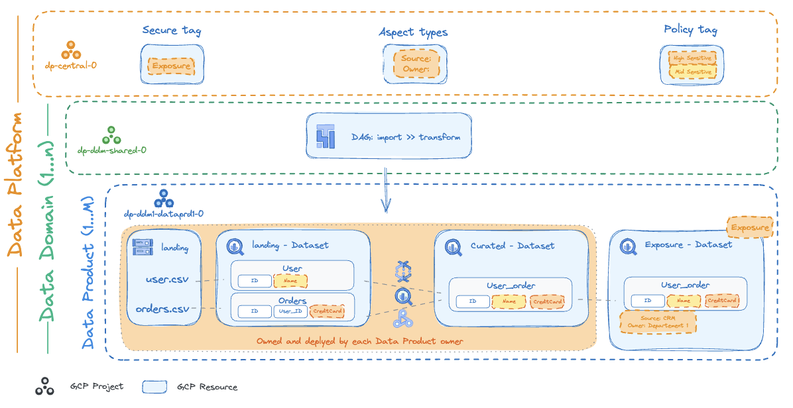
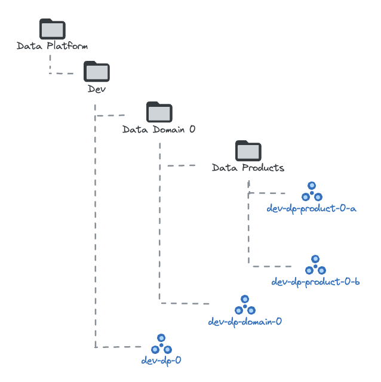

# Data Platform

This stage focuses on the creation and management of an opinionated Data Platform architecture based on Google Cloud best practices. Its architecture is designed to be reliable, robust, and scalable, facilitating the continuous onboarding of new Data Products (or data workloads).

The Data Platform's foundation, established in this stage, provides core capabilities without prescribing specific data handling, computation, or processing for individual workloads or Data Products. This allows flexibility in the technology choices for individual data domains, product and teams. The platform's approach is to encourage shared patterns, aiming to optimize, standardize, accelerate adoption, and ultimately reduce implementation costs and management overhead across Data Products.

While our implementation draws inspiration from [Data Mesh principles on Google Cloud Platform](https://cloud.google.com/architecture/data-mesh) for illustrative purposes, its core design primarily emphasizes the "Data as a Product" concept, treating data as a first-class citizen. This stage can be integrated with established [FAST stages](../README.md) for foundational aspects like resource hierarchy, networking, and security. However, FAST is not a strict prerequisite; this solution can also be deployed independently, provided the necessary dependencies are met.

<!-- BEGIN TOC -->
- [Design Overview and Choices](#design-overview-and-choices)
  - [Data Platform Architecture](#data-platform-architecture)
  - [Folder & Project Structure](#folder-project-structure)
    - [Shared Services (Federated Governance)](#shared-services-federated-governance)
    - [Data Domains (Domain-Driven Ownership)](#data-domains-domain-driven-ownership)
    - [Data Products (DaaP)](#data-products-daap)
  - [Teams and Personas](#teams-and-personas)
    - [Central Data Platform Team](#central-data-platform-team)
    - [Data Domain Teams](#data-domain-teams)
    - [Data Product Teams](#data-product-teams)
- [TODO](#todo)
- [Configuration](#configuration)
  - [FAST prerequisites](#fast-prerequisites)
  - [Stage Variables](#stage-variables)
  - [Data Domain and Product Data Files](#data-domain-and-product-data-files)
  - [Context replacements](#context-replacements)
- [Files](#files)
- [Variables](#variables)
- [Outputs](#outputs)
<!-- END TOC -->

## Design Overview and Choices

### Data Platform Architecture

The following diagram represent the high-level architecture of the Data Platform related projects and their associated resources managed by this stage:

<p align="center">
  
</p>



### Folder & Project Structure

The stage manages the following three high-level logical components implemented via GCP folders and projects:

- "central shared services", a single central project, in which Dataplex Catalog Aspect Types, Policy Tags, and Resource Manager tags a.k.a. "Secure Tags" are defined
- one or more "data domains", each composed of a folder containing a project hosting shared resources at the domain level e.g. Composer, and a folder for hosting data products
- one or more "data products" per domain, each composed of a project, and related resources that are optional*


#### Shared Services (Federated Governance)

Central Shared Services Project provides the standardized central capabilities to foster federated governance processes. These are implemented via established foundations that enable cross-domain data discovery, data sharing, self-service functionalities, and consistent governance. A key objective of these centrally managed services is to reduce the operational burden for data domains in producing and consuming data products, while also fostering the cross-domain collaboration necessary for the data mesh to operate efficiently.

Managed within a dedicated "Central Services" project, these shared services deliver core, platform-wide capabilities. This includes:

- [Dataplex Catalog Aspect Types](https://cloud.google.com/dataplex/docs/enrich-entries-metadata) configuration: create a YAML file definition for each Aspect Type in the `data/aspect-types` folder.
- [Policy Tags](https://cloud.google.com/bigquery/docs/best-practices-policy-tags) definition: configure them in the `central_project_config.policy_tags` variable.

Configure accordingly to your needs the `central_project_config` terraform variable. Use the [terraform.tfvars.sample](./terraform.tfvars.sample) as reference.

#### Data Domains (Domain-Driven Ownership)

Another foundational principle of a data mesh architecture is domain-driven ownership. A Data Domain, in this context, typically aligns with a business unit (BU) or a distinct function within an enterprise. For instance, Data Domains could represent a bank's mortgage department, or an enterprise's customer, distribution, finance, or HR departments.

To support this ownership model and ensure clear separation, each logical Data Domain is provisioned with its own isolated GCP folder under the Data Platform parent with its collection of dedicated Google Cloud project(s). This structure establishes a distinct organizational boundary and resource separation, directly mapping to specific lines of business.

Within each Data Domain, a corresponding Google Cloud "Data Domain" project serves as the primary container for all its specific services and resources. A dedicated Cloud Composer environment is provisioned within this project for orchestrating the domain's data workflows. To adhere to the principle of least privilege, this Composer environment operates with a dedicated IAM Service Account capable of impersonating the necessary Data Product-specific service accounts within that domain.

A data domain will be created for each folder within the `data/data-domains` folder. The configuration should be provided in a `_config.yaml` file within each folder. Within the `_config.yaml` you can configure IAM, services to enable in the shared folder and the Cloud composer configuration.

It is suggested to grant access to consumers on exposed data metadata relying IAM secure tag created in the central project.

```yaml
folder_config:
  iam_bindings:
    bigquery_metadata_viewer:
      members:
        - data-consumer-bi
      role: roles/bigquery.metadataViewer
      condition:
        title: exposure
        description: Expose via secure tag.
        expression: resource.matchTag('exposure', 'allow')
    dataplex_catalog_viewer:
      members:
        - data-consumer-bi
      role: roles/dataplex.catalogViewer
      condition:
        title: exposure
        description: Expose via secure tag.
        expression: resource.matchTag('exposure', 'allow')
```

Use the [.data/data-domains/domain-0/](domain-0) folder as reference to customize.

#### Data Products (DaaP)

Each Data Product within a Data Domain (which is organized under a GCP Folder) encapsulated in its own dedicated Google Cloud Project. This separation is key to achieving modularity, scalability, flexibility, and distinct ownership for each product.

For every Data Product project created, its exposure layer (e.g. specific BigQuery datasets or Cloud Storage buckets) is carefully configured and deployed. This involves assigning the relevant "Secure Tags" that were established in the central Shared Services project. Applying these tags is crucial as it allows for the implementation of precise IAM bindings based on IAM conditions, thereby ensuring fine-grained and secure data access in line with least privilege principles.

Resources needed to import and curate data (e.g. intermediate dataset, dataproc instances, ...) are not deployed by the central Data Platform team. Each data Product owner is responsible for the definition of resources needed. The deployment of those resources will belong to a different Teraform state.

Within each domain, you can instantiate a data product creating a `data-product-X.yaml` file in the data domain's folder. In the YAML file you can configure IAM, services, products to configure in the exposure layer.

It is suggested to grant access to consumer on exposed data configuring IAM binging in the `exposure_layer` variable.

```yaml
exposure_layer:
  bigquery:
    datasets:
      exposure: {}
    iam:
      "roles/bigquery.dataViewer":
        - data-consumer-bi
```

Use the [./data/data-domains/domain-0/product-0.yaml](product-0.yaml) file as reference to customize.

### Teams and Personas

Effective data mesh operation relies on well-defined roles and responsibilities. Ownership is typically assigned to team archetypes, also referred to as functions. These functions represent the core user journeys of individual roles interacting with the data mesh. To clearly describe these journeys, specific user roles are defined within these functions. These user roles can be split or combined bases on specific needs and the scale of each enterprise.

This stage comes with four predefined role profiles, which are meant as a starting example open to customizations. It is suggested to rely on [context replacements](Context Replacements) logic where you can configure the mapping between short names and group values in the `factories_config.context.iam_principals` variable. The mapping will let you refer in YAML file to the group using the short name.

Use IAM configured in the [./terraform.tfvars.sample](terraform.tfvars.sample), [./data/domain-0/_config.yaml](Data Domain YAML) and [./data/domain-0/product-0.yaml](Data Product YAML) as reference to customize.

#### Central Data Platform Team

This function defines the overall data platform architecture, establishes shared infrastructure, and enforces central data governance policies and standards across the data mesh. It enables data producers with tools, paved path solutions and best practices, ensuring high data quality, security, and trustworthiness for consumers. Its focus is on providing the foundations of a self-serve data platform as well as universal governance standards for all users. The Central Data Platform team often works in collaboration with the Data Governance functions within enterprises.

The group tipically has `ADMIN` access on resources in the central project. The team tipically do not have access to the underling data stored on each data domain and product but has access to log and metrics information to monitor the data platform health.

|Group|Central Project|Data Domain|Data Product|
|-|:-:|:-:|:-:|
|Central Data Platform team|`ADMIN`|`Log and Metrics Viewer`|`Log and Metrics Viewer`|

The team is usually responsible to configure IAM bindings on data domains and products.

#### Data Domain Teams

Aligned with specific business areas (e.g., customer, finance, distribution), this function holds clearly defined ownership of data within that domain. Key responsibilities include establishing and upholding a data product's purpose, scope, and boundaries. This is achieved through ongoing activities such as:

- Creating and maintaining its domain-wide data product roadmap.
- Implementing robust data security measures.
- Ensuring adherence to all relevant compliance obligations.
- Continuously monitoring usage and performance.

The group tipically has `ADMIN` access on resources in the shared data domain project, read and usage access to resources created in the central project (e.g. aspects type). The team tipically do not have access to the underling data stored on each data product but has access to log and metrics information to monitor the data platform health. The team is not tipically owner for IAM bindings.

|Group|Central Project|Data Domain|Data Product|
|-|:-:|:-:|:-:|
|Data Domain team|`READ/USAGE`|`ADMIN`|`Log and Metrics Viewer`|

#### Data Product Teams

This function is responsible for the end-to-end lifecycle of a specific data product. Data Product Teams (which may be part of or work closely with a Data Domain Team) develop, operate, and maintain their assigned data product. Their tasks include defining the data product's schema and interfaces, implementing data ingestion and transformation pipelines, ensuring data quality and security for their product, managing its roadmap, and supporting its data consumers.

The group tipically has `ADMIN` access on resources in the data product project, read and usage access to resources created in the central project (e.g. aspects type) and data domain shared project (e.g. Cloud Composer). The team is not tipically owner for IAM bindings.

|Group|Central Project|Data Domain|Data Product|
|-|:-:|:-:|:-:|
|Data Domain team|`READ/USAGE`|`READ/USAGE`|`ADMIN`|

The team is responsible of:

- identify and configure resources needed in the data product to Extract, Load and Transform data to expose in the exposure layer. Those resources should be deployed in a different Terraform state using the automation service account created for each data product.
- configure Policy Tags to protect PII data.
- configure metadata on Aspects related to tables and resources configured in the exposure layer.

When using BigQuery in the exposure layer, it is suggested to rely on Authorized view configuring the exposure dataset as an authorized dataset of the underling dataset hosting curated data.

## TODO

- How to run the stage (similar to all other FAST starges copy&paste)

## Configuration

### FAST prerequisites

This stage needs specific permissions granted to its automation service accounts on networking and security resources.

Network permissions are needed to associate data domain or product projects to Shared VPC hosts and grant network permissions to data platform managed service accounts. They are mandatory when deploying Composer.

Security permissions are only needed when using CMEK encryption, to grant the relevant IAM roles to data platform service agents on the encryption keys used.

The networking and security configuration need to be defined in the resource management stage via specific YAML code blocks: two are needed for networking, and one for security.

The first networking code block grants the relevant roles on the Networking folder to the Data Platform service accounts, with a condition on the environment tag.

```yaml
# make sure this block exists in the data/stage-2/networking.yaml file
  iam_bindings_additive:
    # Data Platform (dev)
    dp_dev_net_admin:
      role: service_project_network_admin
      member: data-platform-dev-rw
      condition:
        title: Data platform dev service project admin.
        expression: |
          resource.matchTag('${organization.id}/${tag_names.environment}', 'development')
    dp_dev_net_viewer:
      role: roles/compute.networkViewer
      member: data-platform-dev-ro
      condition:
        title: Data platform dev network viewer.
        expression: |
          resource.matchTag('${organization.id}/${tag_names.environment}', 'development')
```

The second networking code block signals the networking stage that the Data Platform service accounts need delegated IAM grants on the dev network project, in order to be able to assign specific roles on it.

```yaml
# make sure this block exists in the data/stage-2/networking.yaml file
stage3_config:
  iam_admin_delegated:
    - environment: dev
      principal: data-platform-dev-rw
  iam_viewer:
    - environment: dev
      principal: data-platform-dev-ro
```

For security, a block similar to the one above is needed.

```yaml
# make sure this block exists in the data/stage-2/security.yaml file
stage3_config:
  iam_admin_delegated:
    - environment: dev
      principal: data-platform-dev-rw
  iam_viewer:
    - environment: dev
      principal: data-platform-dev-ro
```

Once the two above configurations are in place, apply the resource management,  networking and security stages in succession. Be sure to refresh the tfvars files in the network and security stages if needed (e.g. by re-running `fast-links.sh`).

### Stage Variables

The default data files provided as an example makes a few assumptions that needs to be matched by corresponding variables configured for the stage:

- the `location` variable needs to be explicitly configured, as it's used as a default location for buckets, datasets, and Composer; locations can be individually overridden but a default needs to be in place
- the domain `deploy_config.composer.node_config.subnetwork` attribute needs to match the location defined above; Composer network and subnetwork use interpolation from FAST networking outputs, explicit IDs can be used instead if needed
- IAM roles for the domain and product refer to generic `dp-product-a-0` and `data-consumer-bi` groups, these need to be defined via the `factories_config.context.iam_principals` variable, or changed to explicit IAM principals (e.g. `group:foo@example.com`)

### Data Domain and Product Data Files

The formats for both types of data files are controlled via [schemas](./schemas/), which can generally be used directly in development environments to provide error checking and autocompletion.

### Context replacements

This stage is designed so that factory files are as much as possible organization and resource agnostic, so that they can be portable across installations (e.g. for different environments, or partner/customer organizations).

This is mostly achieved via context replacements in factory files, where IAM principals and a few other attributes can use short names from the `factories_config.context` variable or from internally managed resources, which are then expanded to full principals at runtime.

For example, configuring the `factories_config.context` variable:

```hcl
factories_config = {
  context = {
    iam_principals = {
      data-consumer-bi = "group:data-consumer-bi@example.com"
    }
  }
}
```

Allows using the group short name in templates:

```yaml
folder_config:
  iam_by_principals:
    data-consumer-bi:
      - roles/datacatalog.viewer
      - roles/dataplex.catalogViewer
      - roles/datalineage.viewer
```

Or within a data domain definition, service accounts can be referenced in project-level IAM via their short name:

```yaml
service_accounts:
  rw:
    description: Automation (rw).
project_config:
  iam:
    roles/owner:
      - rw
```

The following table lists the available substitutions.

| resource        | attributes              | context expansions                                                                     |
| --------------- | ----------------------- | -------------------------------------------------------------------------------------- |
| central project | IAM principals          | `var.factories_config.context.iam_principals`                                          |
| central project | tag IAM principals      | `var.factories_config.context.iam_principals`                                          |
| domain folder   | IAM principals          | `var.factories_config.context.iam_principals`                                          |
| domain project  | shared VPC host project | FAST VPC hosts                                                                         |
| domain project  | IAM principals          | `var.factories_config.context.iam_principals`                                          |
| domain sa       | IAM principals          | `var.factories_config.context.iam_principals`<br>domain service accounts               |
| product project | shared VPC host project | FAST VPC hosts                                                                         |
| product project | IAM principals          | `var.factories_config.context.iam_principals`<br>product service accounts              |
| product project | IAM conditions          | `var.factories_config.context.iam_tag_values`<br>FAST tag values<br>exposure tag value |
| product sa      | IAM principals          | `var.factories_config.context.iam_principals`                                          |
| composer        | shared VPC network      | FAST VPCs                                                                              |
| composer        | shared VPC subnetwork   | FAST subnets                                                                           |
| composer        | encryption key          | `var.factories_config.context.encryption_keys`<br>FAST KMS keys |
| exposed bucket        | encryption key          | `var.factories_config.context.encryption_keys`<br>FAST KMS keys |
| exposed dataset        | encryption key          | `var.factories_config.context.encryption_keys`<br>FAST KMS keys |

<!-- TFDOC OPTS files:1 show_extra:1 exclude:3-gcve-dev-providers.tf -->
<!-- BEGIN TFDOC -->
## Files

| name | description | modules | resources |
|---|---|---|---|
| [data-domains-automation.tf](./data-domains-automation.tf) | Data product automation resources. | <code>gcs</code> · <code>iam-service-account</code> |  |
| [data-domains-composer.tf](./data-domains-composer.tf) | None | <code>iam-service-account</code> | <code>google_composer_environment</code> |
| [data-domains.tf](./data-domains.tf) | None | <code>folder</code> · <code>iam-service-account</code> · <code>project</code> |  |
| [data-products-automation.tf](./data-products-automation.tf) | Data product automation resources. | <code>gcs</code> · <code>iam-service-account</code> |  |
| [data-products-exposure.tf](./data-products-exposure.tf) | Data product exposure layer resources. | <code>bigquery-dataset</code> · <code>gcs</code> |  |
| [data-products.tf](./data-products.tf) | Data product project, service account and exposed resources. | <code>iam-service-account</code> · <code>project</code> |  |
| [factory.tf](./factory.tf) | None |  |  |
| [main.tf](./main.tf) | Locals and project-level resources. | <code>data-catalog-policy-tag</code> · <code>dataplex-aspect-types</code> · <code>project</code> |  |
| [outputs.tf](./outputs.tf) | Stage outputs. |  | <code>google_storage_bucket_object</code> · <code>local_file</code> |
| [variables-fast.tf](./variables-fast.tf) | None |  |  |
| [variables.tf](./variables.tf) | Module variables. |  |  |

## Variables

| name | description | type | required | default | producer |
|---|---|:---:|:---:|:---:|:---:|
| [automation](variables-fast.tf#L17) | Automation resources created by the bootstrap stage. | <code title="object&#40;&#123;&#10;  outputs_bucket &#61; string&#10;&#125;&#41;">object&#40;&#123;&#8230;&#125;&#41;</code> | ✓ |  | <code>0-bootstrap</code> |
| [billing_account](variables-fast.tf#L26) | Billing account id. If billing account is not part of the same org set `is_org_level` to false. | <code title="object&#40;&#123;&#10;  id &#61; string&#10;&#125;&#41;">object&#40;&#123;&#8230;&#125;&#41;</code> | ✓ |  | <code>0-bootstrap</code> |
| [environments](variables-fast.tf#L34) | Environment names. | <code title="object&#40;&#123;&#10;  dev &#61; object&#40;&#123;&#10;    name       &#61; string&#10;    short_name &#61; string&#10;  &#125;&#41;&#10;&#125;&#41;">object&#40;&#123;&#8230;&#125;&#41;</code> | ✓ |  | <code>1-resman</code> |
| [prefix](variables-fast.tf#L69) | Prefix used for resources that need unique names. Use a maximum of 9 chars for organizations, and 11 chars for tenants. | <code>string</code> | ✓ |  | <code>0-bootstrap</code> |
| [aspect_types](variables.tf#L17) | Aspect templates. Merged with those defined via the factory. | <code title="map&#40;object&#40;&#123;&#10;  description       &#61; optional&#40;string&#41;&#10;  display_name      &#61; optional&#40;string&#41;&#10;  labels            &#61; optional&#40;map&#40;string&#41;, &#123;&#125;&#41;&#10;  metadata_template &#61; optional&#40;string&#41;&#10;  iam               &#61; optional&#40;map&#40;list&#40;string&#41;&#41;, &#123;&#125;&#41;&#10;  iam_bindings &#61; optional&#40;map&#40;object&#40;&#123;&#10;    members &#61; list&#40;string&#41;&#10;    role    &#61; string&#10;    condition &#61; optional&#40;object&#40;&#123;&#10;      expression  &#61; string&#10;      title       &#61; string&#10;      description &#61; optional&#40;string&#41;&#10;    &#125;&#41;&#41;&#10;  &#125;&#41;&#41;, &#123;&#125;&#41;&#10;  iam_bindings_additive &#61; optional&#40;map&#40;object&#40;&#123;&#10;    member &#61; string&#10;    role   &#61; string&#10;    condition &#61; optional&#40;object&#40;&#123;&#10;      expression  &#61; string&#10;      title       &#61; string&#10;      description &#61; optional&#40;string&#41;&#10;    &#125;&#41;&#41;&#10;  &#125;&#41;&#41;, &#123;&#125;&#41;&#10;&#125;&#41;&#41;">map&#40;object&#40;&#123;&#8230;&#125;&#41;&#41;</code> |  | <code>&#123;&#125;</code> |  |
| [central_project_config](variables.tf#L48) | Configuration for the top-level central project. | <code title="object&#40;&#123;&#10;  iam &#61; optional&#40;map&#40;list&#40;string&#41;&#41;, &#123;&#125;&#41;&#10;  iam_bindings &#61; optional&#40;map&#40;object&#40;&#123;&#10;    members &#61; list&#40;string&#41;&#10;    role    &#61; string&#10;    condition &#61; optional&#40;object&#40;&#123;&#10;      expression  &#61; string&#10;      title       &#61; string&#10;      description &#61; optional&#40;string&#41;&#10;    &#125;&#41;&#41;&#10;  &#125;&#41;&#41;, &#123;&#125;&#41;&#10;  iam_bindings_additive &#61; optional&#40;map&#40;object&#40;&#123;&#10;    member &#61; string&#10;    role   &#61; string&#10;    condition &#61; optional&#40;object&#40;&#123;&#10;      expression  &#61; string&#10;      title       &#61; string&#10;      description &#61; optional&#40;string&#41;&#10;    &#125;&#41;&#41;&#10;  &#125;&#41;&#41;, &#123;&#125;&#41;&#10;  iam_by_principals &#61; optional&#40;map&#40;list&#40;string&#41;&#41;, &#123;&#125;&#41;&#10;  services &#61; optional&#40;list&#40;string&#41;, &#91;&#10;    &#34;bigquery.googleapis.com&#34;,&#10;    &#34;datacatalog.googleapis.com&#34;,&#10;    &#34;logging.googleapis.com&#34;,&#10;    &#34;monitoring.googleapis.com&#34;,&#10;    &#34;storage.googleapis.com&#34;,&#10;  &#93;&#41;&#10;  short_name &#61; optional&#40;string, &#34;central-0&#34;&#41;&#10;  policy_tags &#61; optional&#40;map&#40;any&#41;, &#123;&#10;    low    &#61; &#123;&#125;&#10;    medium &#61; &#123;&#125;&#10;    high   &#61; &#123;&#125;&#10;  &#125;&#41;&#10;&#125;&#41;">object&#40;&#123;&#8230;&#125;&#41;</code> |  | <code>&#123;&#125;</code> |  |
| [encryption_keys](variables.tf#L90) | Default encryption keys for services, in service => { region => key id } format. Overridable on a per-object basis. | <code title="object&#40;&#123;&#10;  bigquery &#61; optional&#40;map&#40;string&#41;, &#123;&#125;&#41;&#10;  composer &#61; optional&#40;map&#40;string&#41;, &#123;&#125;&#41;&#10;  storage  &#61; optional&#40;map&#40;string&#41;, &#123;&#125;&#41;&#10;&#125;&#41;">object&#40;&#123;&#8230;&#125;&#41;</code> |  | <code>&#123;&#125;</code> |  |
| [exposure_config](variables.tf#L101) | Data exposure configuration. | <code title="object&#40;&#123;&#10;  tag_name &#61; optional&#40;string, &#34;exposure&#47;allow&#34;&#41;&#10;&#125;&#41;">object&#40;&#123;&#8230;&#125;&#41;</code> |  | <code>&#123;&#125;</code> |  |
| [factories_config](variables.tf#L119) | Configuration for the resource factories. | <code title="object&#40;&#123;&#10;  aspect_types &#61; optional&#40;string, &#34;data&#47;aspect-types&#34;&#41;&#10;  data_domains &#61; optional&#40;string, &#34;data&#47;data-domains&#34;&#41;&#10;  context &#61; optional&#40;object&#40;&#123;&#10;    iam_principals &#61; optional&#40;map&#40;string&#41;, &#123;&#125;&#41;&#10;    kms_keys       &#61; optional&#40;map&#40;string&#41;, &#123;&#125;&#41;&#10;    tag_values     &#61; optional&#40;map&#40;string&#41;, &#123;&#125;&#41;&#10;  &#125;&#41;, &#123;&#125;&#41;&#10;&#125;&#41;">object&#40;&#123;&#8230;&#125;&#41;</code> |  | <code>&#123;&#125;</code> |  |
| [folder_ids](variables-fast.tf#L45) | Folder name => id mappings. | <code>map&#40;string&#41;</code> |  | <code>&#123;&#125;</code> | <code>1-resman</code> |
| [host_project_ids](variables-fast.tf#L53) | Shared VPC host project name => id mappings. | <code>map&#40;string&#41;</code> |  | <code>&#123;&#125;</code> | <code>2-networking</code> |
| [kms_keys](variables-fast.tf#L61) | KMS key ids. | <code>map&#40;string&#41;</code> |  | <code>&#123;&#125;</code> | <code>2-security</code> |
| [location](variables.tf#L134) | Default location used when no location is specified. | <code>string</code> |  | <code>&#34;europe-west1&#34;</code> |  |
| [outputs_location](variables.tf#L141) | Enable writing provider, tfvars and CI/CD workflow files to local filesystem. Leave null to disable. | <code>string</code> |  | <code>null</code> |  |
| [regions](variables-fast.tf#L79) | Region mappings. | <code>map&#40;string&#41;</code> |  | <code>&#123;&#125;</code> | <code>2-networking</code> |
| [secure_tags](variables.tf#L147) | Resource manager tags created in the central project. | <code title="map&#40;object&#40;&#123;&#10;  description &#61; optional&#40;string, &#34;Managed by the Terraform project module.&#34;&#41;&#10;  iam         &#61; optional&#40;map&#40;list&#40;string&#41;&#41;, &#123;&#125;&#41;&#10;  values &#61; optional&#40;map&#40;object&#40;&#123;&#10;    description &#61; optional&#40;string, &#34;Managed by the Terraform project module.&#34;&#41;&#10;    iam         &#61; optional&#40;map&#40;list&#40;string&#41;&#41;, &#123;&#125;&#41;&#10;    id          &#61; optional&#40;string&#41;&#10;  &#125;&#41;&#41;, &#123;&#125;&#41;&#10;&#125;&#41;&#41;">map&#40;object&#40;&#123;&#8230;&#125;&#41;&#41;</code> |  | <code>&#123;&#125;</code> |  |
| [stage_config](variables.tf#L168) | Stage configuration used to find environment and resource ids, and to generate names. | <code title="object&#40;&#123;&#10;  environment &#61; string&#10;  name        &#61; string&#10;  short_name  &#61; optional&#40;string, &#34;dp&#34;&#41;&#10;&#125;&#41;">object&#40;&#123;&#8230;&#125;&#41;</code> |  | <code title="&#123;&#10;  environment &#61; &#34;dev&#34;&#10;  name        &#61; &#34;data-platform-dev&#34;&#10;&#125;">&#123;&#8230;&#125;</code> |  |
| [subnet_self_links](variables-fast.tf#L87) | Subnet VPC name => { name => self link } mappings. | <code>map&#40;map&#40;string&#41;&#41;</code> |  | <code>&#123;&#125;</code> | <code>2-networking</code> |
| [tag_values](variables-fast.tf#L95) | FAST-managed resource manager tag values. | <code>map&#40;string&#41;</code> |  | <code>&#123;&#125;</code> | <code>1-resman</code> |
| [vpc_self_links](variables-fast.tf#L103) | Shared VPC name => self link mappings. | <code>map&#40;string&#41;</code> |  | <code>&#123;&#125;</code> | <code>2-networking</code> |

## Outputs

| name | description | sensitive | consumers |
|---|---|:---:|---|
| [aspect_types](outputs.tf#L191) | Aspect types defined in central project. |  |  |
| [central_project](outputs.tf#L196) | Central project attributes. |  |  |
| [data_domains](outputs.tf#L201) | Data domain attributes. |  |  |
| [policy_tags](outputs.tf#L206) | Policy tags defined in central project. |  |  |
| [secure_tags](outputs.tf#L211) | Secure tags defined in central project. |  |  |
<!-- END TFDOC -->
