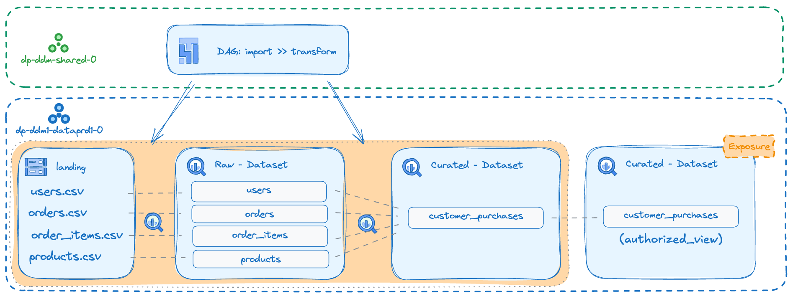

# Data Product Reference Example

This folder contains a reference implementation of a Data Product showcasing the complete lifecycle from raw data ingestion to curated analytics-ready datasets. The example demonstrates how to create Data Products within the [Data Platform stage](../README.md) of Fabric FAST. It utilizes the automation service account and shared services created by the Data Platform stage.

Our example consists of a batch ELT pipeline that processes and joins individual CSV data files from Cloud Storage to BigQuery using the publicly available theLook eCommerce dataset:

## Components

This reference implementation includes:

- **Infrastructure as Code**: Terraform modules for deploying GCP resources
- **Data Schemas**: BigQuery table schemas in JSON format for structured data validation
- **Orchestration**: Cloud Composer (Apache Airflow) DAGs for automated pipeline execution
- **Sample Data**: Utility script to download theLook eCommerce reference tables

## Getting Started

### Prerequisites

- Google Cloud SDK installed and configured
- Terraform >= 1.9.0
- `jq` command-line JSON processor
- Access to the automation service account from the previous stage

Ensure that you are authenticated with the `gcloud` CLI using the user that has the relevant access to
both the Domain Shared Resources as well as the Data Product GCP projects:

```bash
gcloud auth login
gcloud auth application-default login
```

### 1. Infrastructure Setup

**1. Configure Terraform Variables**

   ```bash
   cp terraform.tfvars.sample terraform.tfvars
   # Edit terraform.tfvars with your specific values
   ```

**2. Deploy Infrastructure**

   ```bash
   terraform init
   terraform apply
   ```

### 2. Data Pipeline Setup

**1. Set Environment Variables**

   ```bash
   export LANDING_BUCKET=$(terraform output -raw landing_gcs_bucket)
   export COMPOSER_PROJECT_ID=$(terraform output -raw composer_project_id)
   export COMPOSER_ENV_NAME=$(terraform output -raw composer_environment_name)
   export LOCATION=$(terraform output -raw location)
   ```

**2. Deploy Data Schemas**

   ```bash
   gcloud storage cp -r data/schemas/* gs://$LANDING_BUCKET/schemas
   ```

**3. Source Sample Data**

   ```bash
   ./data/get_thelook_data.sh gs://$LANDING_BUCKET
   ```

**4. Configure Composer Environment**

   Update Composer environment variables from `composer/variables.json`:

   > **Note**: This step may take several minutes to complete.

   ```bash
   # Copy Airflow JSON variable file into Composer data folder
   gcloud composer environments storage data import \
       --project $COMPOSER_PROJECT_ID \
       --environment=$COMPOSER_ENV_NAME \
       --location $LOCATION \
       --source="composer/variables.json"

   # Import Airflow variables
   gcloud composer environments run $COMPOSER_ENV_NAME \
       --project $COMPOSER_PROJECT_ID \
       --location $LOCATION \
       variables \
       -- import /home/airflow/gcs/data/variables.json
   ```

**5. Deploy Airflow DAGs**

   ```bash
   gcloud composer environments storage dags import \
       --project=$COMPOSER_PROJECT_ID \
       --environment=$COMPOSER_ENV_NAME \
       --location=$LOCATION \
       --source="composer/DAG-dp0"
   ```

   > **Note**: It may take several minutes for the DAGs to be parsed and become available in Composer.

### 3. Pipeline Execution

**1. Verify DAG Import**

   Navigate to the Composer UI in the Domain Shared Resources project and confirm that the DAGs have been successfully imported.

**2. Execute Pipeline**

   Trigger the DAGs in the following sequence (wait for each to complete):

   1. **`gcs2bq_table_create`** - Creates BigQuery tables with proper schemas
   2. **`gcs2bq_table_elt`** - Executes the ELT pipeline to process data

## Architecture Overview

The data product implements a three-tier architecture:

<p align="center">
  
</p>

Curated data will be made accessible through authorized views within the `exposure` dataset.

### Data Storage Layers

- **Landing Zone** (`{prefix}-land-cs-0`): Raw CSV files stored in Cloud Storage
- **Raw Layer** (`{prefix}_lnd_bq_0`): Raw data loaded into BigQuery for processing
- **Curated Layer** (`{prefix}_cur_bq_0`): Processed, analytics-ready datasets

## Troubleshooting

### Common Issues

- **DAG Import Failures**: Ensure the Composer environment is fully initialized before importing DAGs
- **Permission Errors**: Verify that the user that you authenticated with via the `gcloud` CLI has the relevant permissions
- **Variable Configuration**: Double-check that `terraform.tfvars` is properly configured

### Useful Commands

```bash
# Check Terraform outputs
terraform output

# Verify bucket contents
gcloud storage ls gs://$LANDING_BUCKET --recursive

# Check Composer environment status
gcloud composer environments describe $COMPOSER_ENV_NAME \
    --project $COMPOSER_PROJECT_ID \
    --location $LOCATION
```

<!-- TFDOC OPTS files:1 show_extra:1 exclude:providers.tf -->
<!-- BEGIN TFDOC -->
## Files

| name | description | modules | resources |
|---|---|---|---|
| [main.tf](./main.tf) | Module-level locals and resources. | <code>bigquery-dataset</code> · <code>gcs</code> |  |
| [outputs.tf](./outputs.tf) | Module outputs. |  | <code>local_file</code> |
| [variables.tf](./variables.tf) | Module variables. |  |  |

## Variables

| name | description | type | required | default | producer |
|---|---|:---:|:---:|:---:|:---:|
| [authorized_dataset_on_curated](variables.tf#L16) | Authorized Dataset. | <code>string</code> | ✓ |  |  |
| [composer_config](variables.tf#L21) | Composer environment configuration. | <code title="object&#40;&#123;&#10;  environment_name &#61; string&#10;  project_id       &#61; string&#10;&#125;&#41;">object&#40;&#123;&#8230;&#125;&#41;</code> | ✓ |  |  |
| [dp_processing_service_account](variables.tf#L30) | Service account for data processing via Composer impersonation. | <code>string</code> | ✓ |  |  |
| [impersonate_service_account](variables.tf#L47) | Service account to impersonate for Google Cloud providers. | <code>string</code> | ✓ |  |  |
| [prefix](variables.tf#L60) | Prefix used for resources that need unique names. Use a maximum of 9 chars for organizations, and 11 chars for tenants. | <code>string</code> | ✓ |  |  |
| [project_id](variables.tf#L69) | Project ID to deploy resources. | <code>string</code> | ✓ |  |  |
| [encryption_keys](variables.tf#L36) | Default encryption keys for services, in service => { region => key id } format. Overridable on a per-object basis. | <code title="object&#40;&#123;&#10;  bigquery &#61; optional&#40;map&#40;string&#41;, &#123;&#125;&#41;&#10;  composer &#61; optional&#40;map&#40;string&#41;, &#123;&#125;&#41;&#10;  storage  &#61; optional&#40;map&#40;string&#41;, &#123;&#125;&#41;&#10;&#125;&#41;">object&#40;&#123;&#8230;&#125;&#41;</code> |  | <code>&#123;&#125;</code> |  |
| [location](variables.tf#L53) | Default location used when no location is specified. | <code>string</code> |  | <code>&#34;europe-west8&#34;</code> |  |

## Outputs

| name | description | sensitive | consumers |
|---|---|:---:|---|
| [composer_environment_name](outputs.tf#L17) | The name of the Composer environment. |  |  |
| [composer_project_id](outputs.tf#L22) | The project ID where the Composer environment is located. |  |  |
| [dp_processing_service_account](outputs.tf#L27) | Service account for data processing. |  |  |
| [landing_gcs_bucket](outputs.tf#L32) | The name of the landing GCS bucket. |  |  |
| [location](outputs.tf#L37) | The location/region used for resources. |  |  |
<!-- END TFDOC -->
