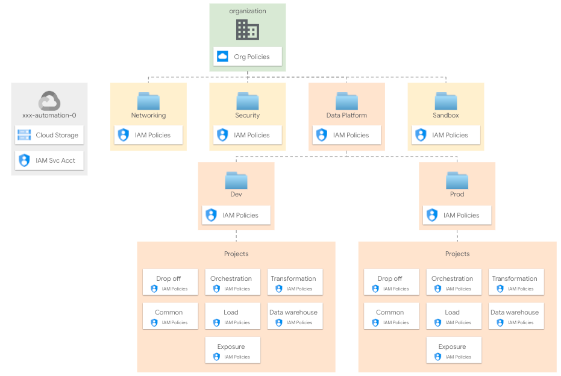
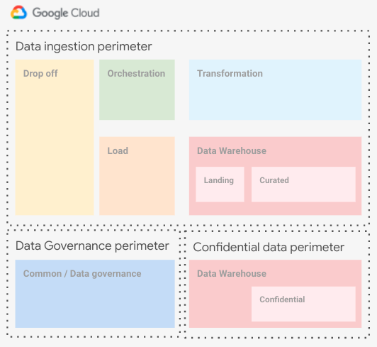

# Data Platform

The Data Platform builds on top of your foundations to create and set up projects (and related resources) to be used for your data platform.

<p align="center">
  
</p>

## Design overview and choices

> A more comprehensive description of the Data Platform architecture and approach can be found in the [Data Platform module README](../../../../blueprints/data-solutions/data-platform-foundations/). The module is wrapped and configured here to leverage the FAST flow.

The Data Platform creates projects in a well-defined context, usually an ad-hoc folder  managed by the resource management setup. Resources are organized by environment within this folder.

Across different data layers environment-specific projects are created to separate resources and IAM roles.

The Data Platform manages:

- project creation
- API/Services enablement
- service accounts creation
- IAM role assignment for groups and service accounts
- KMS keys roles assignment
- Shared VPC attachment and subnet IAM binding
- project-level organization policy definitions
- billing setup (billing account attachment and budget configuration)
- data-related resources in the managed projects

### User groups

As per our GCP best practices the Data Platform relies on user groups to assign roles to human identities. These are the specific groups used by the Data Platform and their access patterns, from the [module documentation](../../../../blueprints/data-solutions/data-platform-foundations/#groups):

- *Data Engineers* They handle and run the Data Hub, with read access to all resources in order to troubleshoot possible issues with pipelines. This team can also impersonate any service account.
- *Data Analysts*. They perform analysis on datasets, with read access to the data warehouse Curated or Confidential projects depending on their privileges.
- *Data Security*:. They handle security configurations related to the Data Hub. This team has admin access to the common project to configure Cloud DLP templates or Data Catalog policy tags.

|Group|Landing|Load|Transformation|Data Warehouse Landing|Data Warehouse Curated|Data Warehouse Confidential|Orchestration|Common|
|-|:-:|:-:|:-:|:-:|:-:|:-:|:-:|:-:|
|Data Engineers|`ADMIN`|`ADMIN`|`ADMIN`|`ADMIN`|`ADMIN`|`ADMIN`|`ADMIN`|`ADMIN`|
|Data Analysts|-|-|-|-|-|`READ`|-|-|
|Data Security|-|-|-|-|-|-|-|-|`ADMIN`|

### Network

A Shared VPC is used here, either from one of the FAST networking stages (e.g. [hub and spoke via VPN](../../2-networking-b-vpn)) or from an external source.

### Encryption

Cloud KMS crypto keys can be configured wither from the [FAST security stage](../../2-security) or from an external source. This step is optional and depends on customer policies and security best practices.

To configure the use of Cloud KMS on resources, you have to specify the key id on the `service_encryption_keys` variable. Key locations should match resource locations.

## Data Catalog

[Data Catalog](https://cloud.google.com/data-catalog) helps you to document your data entry at scale. Data Catalog relies on [tags](https://cloud.google.com/data-catalog/docs/tags-and-tag-templates#tags) and [tag template](https://cloud.google.com/data-catalog/docs/tags-and-tag-templates#tag-templates) to manage metadata for all data entries in a unified and centralized service. To implement [column-level security](https://cloud.google.com/bigquery/docs/column-level-security-intro) on BigQuery, we suggest to use `Tags` and `Tag templates`.

The default configuration will implement 3 tags:

- `3_Confidential`: policy tag for columns that include very sensitive information, such as credit card numbers.
- `2_Private`: policy tag for columns that include sensitive personal identifiable information (PII) information, such as a person's first name.
- `1_Sensitive`: policy tag for columns that include data that cannot be made public, such as the credit limit.

Anything that is not tagged is available to all users who have access to the data warehouse.

You can configure your tags and roles associated by configuring the `data_catalog_tags` variable. We suggest using the "[Best practices for using policy tags in BigQuery](https://cloud.google.com/bigquery/docs/best-practices-policy-tags)" article as a guide to designing your tags structure and access pattern. By default, no groups has access to tagged data.

### VPC-SC

As is often the case in real-world configurations, [VPC-SC](https://cloud.google.com/vpc-service-controls) is needed to mitigate data exfiltration. VPC-SC can be configured from the [FAST security stage](../../2-security). This step is optional, but highly recommended, and depends on customer policies and security best practices.

To configure the use of VPC-SC on the data platform, you have to specify the data platform project numbers on the `vpc_sc_perimeter_projects.dev` variable on [FAST security stage](../../2-security#perimeter-resources).

In the case your Data Warehouse need to handle confidential data and you have the requirement to separate them deeply from other data and IAM is not enough, the suggested configuration is to keep the confidential project in a separate VPC-SC perimeter with the adequate ingress/egress rules needed for the load and transformation service account. Below you can find an high level diagram describing the configuration.

<p align="center">
  
</p>

## How to run this stage

This stage is meant to be executed after the FAST "foundational" stages: bootstrap, resource management, security and networking stages.

It's of course possible to run this stage in isolation, refer to the *[Running in isolation](#running-in-isolation)* section below for details.

Before running this stage, you need to make sure you have the correct credentials and permissions, and localize variables by assigning values that match your configuration.

### Provider and Terraform variables

As all other FAST stages, the [mechanism used to pass variable values and pre-built provider files from one stage to the next](../../0-bootstrap/README.md#output-files-and-cross-stage-variables) is also leveraged here.

The commands to link or copy the provider and terraform variable files can be easily derived from the `stage-links.sh` script in the FAST root folder, passing it a single argument with the local output files folder (if configured) or the GCS output bucket in the automation project (derived from stage 0 outputs). The following examples demonstrate both cases, and the resulting commands that then need to be copy/pasted and run.

```bash
../../../stage-links.sh ~/fast-config

# copy and paste the following commands for '3-data-platform'

ln -s ~/fast-config/providers/3-data-platform-providers.tf ./
ln -s ~/fast-config/tfvars/0-globals.auto.tfvars.json ./
ln -s ~/fast-config/tfvars/0-bootstrap.auto.tfvars.json ./
ln -s ~/fast-config/tfvars/1-resman.auto.tfvars.json ./
ln -s ~/fast-config/tfvars/2-networking.auto.tfvars.json ./
ln -s ~/fast-config/tfvars/2-security.auto.tfvars.json ./
```

```bash
../../../stage-links.sh gs://xxx-prod-iac-core-outputs-0

# copy and paste the following commands for '3-data-platform'

gcloud alpha storage cp gs://xxx-prod-iac-core-outputs-0/providers/3-data-platform-providers.tf ./
gcloud alpha storage cp gs://xxx-prod-iac-core-outputs-0/tfvars/0-globals.auto.tfvars.json ./
gcloud alpha storage cp gs://xxx-prod-iac-core-outputs-0/tfvars/0-bootstrap.auto.tfvars.json ./
gcloud alpha storage cp gs://xxx-prod-iac-core-outputs-0/tfvars/1-resman.auto.tfvars.json ./
gcloud alpha storage cp gs://xxx-prod-iac-core-outputs-0/tfvars/2-networking.auto.tfvars.json ./
gcloud alpha storage cp gs://xxx-prod-iac-core-outputs-0/tfvars/2-security.auto.tfvars.json ./
```

### Impersonating the automation service account

The preconfigured provider file uses impersonation to run with this stage's automation service account's credentials. The `gcp-devops` and `organization-admins` groups have the necessary IAM bindings in place to do that, so make sure the current user is a member of one of those groups.

### Variable configuration

Variables in this stage -- like most other FAST stages -- are broadly divided into three separate sets:

- variables which refer to global values for the whole organization (org id, billing account id, prefix, etc.), which are pre-populated via the `0-globals.auto.tfvars.json` file linked or copied above
- variables which refer to resources managed by previous stage, which are prepopulated here via the `*.auto.tfvars.json` files linked or copied above
- and finally variables that optionally control this stage's behaviour and customizations, and can to be set in a custom `terraform.tfvars` file

The full list can be found in the [Variables](#variables) table at the bottom of this document.

### Running the stage

Once provider and variable values are in place and the correct user is configured, the stage can be run:

```bash
terraform init
terraform apply
```

### Running in isolation

This stage can be run in isolation by providing the necessary variables, but it's really meant to be used as part of the FAST flow after the "foundational stages" ([`0-bootstrap`](../../0-bootstrap), [`1-resman`](../../1-resman), [`2-networking`](../../2-networking-b-vpn) and [`2-security`](../../2-security)).

When running in isolation, the following roles are needed on the principal used to apply Terraform:

- on the organization or network folder level
  - `roles/xpnAdmin` or a custom role which includes the following permissions
    - `"compute.organizations.enableXpnResource"`,
    - `"compute.organizations.disableXpnResource"`,
    - `"compute.subnetworks.setIamPolicy"`,
- on each folder where projects are created
  - `"roles/logging.admin"`
  - `"roles/owner"`
  - `"roles/resourcemanager.folderAdmin"`
  - `"roles/resourcemanager.projectCreator"`
- on the host project for the Shared VPC
  - `"roles/browser"`
  - `"roles/compute.viewer"`
- on the organization or billing account
  - `roles/billing.admin`

The VPC host project, VPC and subnets should already exist.

## Demo pipeline

The application layer is out of scope of this script. As a demo purpuse only, several Cloud Composer DAGs are provided. Demos will import data from the `landing` area to the `DataWarehouse Confidential` dataset suing different features.

You can find examples in the `[demo](../../../../blueprints/data-solutions/data-platform-foundations/demo)` folder.

<!-- TFDOC OPTS files:1 show_extra:1 -->
<!-- BEGIN TFDOC -->
## Files

| name | description | modules | resources |
|---|---|---|---|
| [main.tf](./main.tf) | Data Platform. | <code>data-platform-foundations</code> |  |
| [outputs.tf](./outputs.tf) | Output variables. |  | <code>google_storage_bucket_object</code> · <code>local_file</code> |
| [variables.tf](./variables.tf) | Terraform Variables. |  |  |

## Variables

| name | description | type | required | default | producer |
|---|---|:---:|:---:|:---:|:---:|
| [automation](variables.tf#L17) | Automation resources created by the bootstrap stage. | <code title="object&#40;&#123;&#10;  outputs_bucket &#61; string&#10;&#125;&#41;">object&#40;&#123;&#8230;&#125;&#41;</code> | ✓ |  | <code>0-bootstrap</code> |
| [billing_account](variables.tf#L25) | Billing account id. If billing account is not part of the same org set `is_org_level` to false. | <code title="object&#40;&#123;&#10;  id           &#61; string&#10;  is_org_level &#61; optional&#40;bool, true&#41;&#10;&#125;&#41;">object&#40;&#123;&#8230;&#125;&#41;</code> | ✓ |  | <code>0-bootstrap</code> |
| [folder_ids](variables.tf#L108) | Folder to be used for the networking resources in folders/nnnn format. | <code title="object&#40;&#123;&#10;  data-platform-dev &#61; string&#10;&#125;&#41;">object&#40;&#123;&#8230;&#125;&#41;</code> | ✓ |  | <code>1-resman</code> |
| [host_project_ids](variables.tf#L126) | Shared VPC project ids. | <code title="object&#40;&#123;&#10;  dev-spoke-0 &#61; string&#10;&#125;&#41;">object&#40;&#123;&#8230;&#125;&#41;</code> | ✓ |  | <code>2-networking</code> |
| [organization](variables.tf#L156) | Organization details. | <code title="object&#40;&#123;&#10;  domain      &#61; string&#10;  id          &#61; number&#10;  customer_id &#61; string&#10;&#125;&#41;">object&#40;&#123;&#8230;&#125;&#41;</code> | ✓ |  | <code>00-globals</code> |
| [prefix](variables.tf#L172) | Unique prefix used for resource names. Not used for projects if 'project_create' is null. | <code>string</code> | ✓ |  | <code>00-globals</code> |
| [composer_config](variables.tf#L38) | Cloud Composer configuration options. | <code title="object&#40;&#123;&#10;  disable_deployment &#61; optional&#40;bool&#41;&#10;  environment_size   &#61; string&#10;  software_config &#61; object&#40;&#123;&#10;    airflow_config_overrides       &#61; optional&#40;any&#41;&#10;    pypi_packages                  &#61; optional&#40;any&#41;&#10;    env_variables                  &#61; optional&#40;map&#40;string&#41;&#41;&#10;    image_version                  &#61; string&#10;    cloud_data_lineage_integration &#61; optional&#40;bool, true&#41;&#10;  &#125;&#41;&#10;  workloads_config &#61; object&#40;&#123;&#10;    scheduler &#61; object&#40;&#10;      &#123;&#10;        cpu        &#61; number&#10;        memory_gb  &#61; number&#10;        storage_gb &#61; number&#10;        count      &#61; number&#10;      &#125;&#10;    &#41;&#10;    web_server &#61; object&#40;&#10;      &#123;&#10;        cpu        &#61; number&#10;        memory_gb  &#61; number&#10;        storage_gb &#61; number&#10;      &#125;&#10;    &#41;&#10;    worker &#61; object&#40;&#10;      &#123;&#10;        cpu        &#61; number&#10;        memory_gb  &#61; number&#10;        storage_gb &#61; number&#10;        min_count  &#61; number&#10;        max_count  &#61; number&#10;      &#125;&#10;    &#41;&#10;  &#125;&#41;&#10;&#125;&#41;">object&#40;&#123;&#8230;&#125;&#41;</code> |  | <code title="&#123;&#10;  environment_size &#61; &#34;ENVIRONMENT_SIZE_SMALL&#34;&#10;  software_config &#61; &#123;&#10;    image_version                  &#61; &#34;composer-2-airflow-2&#34;&#10;    cloud_data_lineage_integration &#61; true&#10;  &#125;&#10;  workloads_config &#61; null&#10;&#125;">&#123;&#8230;&#125;</code> |  |
| [data_catalog_tags](variables.tf#L87) | List of Data Catalog Policy tags to be created with optional IAM binging configuration in {tag => {ROLE => [MEMBERS]}} format. | <code title="map&#40;object&#40;&#123;&#10;  description &#61; optional&#40;string&#41;&#10;  iam         &#61; optional&#40;map&#40;list&#40;string&#41;&#41;, &#123;&#125;&#41;&#10;&#125;&#41;&#41;">map&#40;object&#40;&#123;&#8230;&#125;&#41;&#41;</code> |  | <code title="&#123;&#10;  &#34;3_Confidential&#34; &#61; &#123;&#125;&#10;  &#34;2_Private&#34;      &#61; &#123;&#125;&#10;  &#34;1_Sensitive&#34;    &#61; &#123;&#125;&#10;&#125;">&#123;&#8230;&#125;</code> |  |
| [deletion_protection](variables.tf#L101) | Prevent Terraform from destroying data storage resources (storage buckets, GKE clusters, CloudSQL instances) in this blueprint. When this field is set in Terraform state, a terraform destroy or terraform apply that would delete data storage resources will fail. | <code>bool</code> |  | <code>true</code> |  |
| [groups-dp](variables.tf#L116) | Data Platform groups. | <code>map&#40;string&#41;</code> |  | <code title="&#123;&#10;  data-analysts  &#61; &#34;gcp-data-analysts&#34;&#10;  data-engineers &#61; &#34;gcp-data-engineers&#34;&#10;  data-security  &#61; &#34;gcp-data-security&#34;&#10;&#125;">&#123;&#8230;&#125;</code> |  |
| [location](variables.tf#L134) | Location used for multi-regional resources. | <code>string</code> |  | <code>&#34;eu&#34;</code> |  |
| [network_config_composer](variables.tf#L140) | Network configurations to use for Composer. | <code title="object&#40;&#123;&#10;  cloudsql_range    &#61; string&#10;  gke_master_range  &#61; string&#10;  gke_pods_name     &#61; string&#10;  gke_services_name &#61; string&#10;&#125;&#41;">object&#40;&#123;&#8230;&#125;&#41;</code> |  | <code title="&#123;&#10;  cloudsql_range    &#61; &#34;192.168.254.0&#47;24&#34;&#10;  gke_master_range  &#61; &#34;192.168.255.0&#47;28&#34;&#10;  gke_pods_name     &#61; &#34;pods&#34;&#10;  gke_services_name &#61; &#34;services&#34;&#10;&#125;">&#123;&#8230;&#125;</code> |  |
| [outputs_location](variables.tf#L166) | Path where providers, tfvars files, and lists for the following stages are written. Leave empty to disable. | <code>string</code> |  | <code>null</code> |  |
| [project_services](variables.tf#L182) | List of core services enabled on all projects. | <code>list&#40;string&#41;</code> |  | <code title="&#91;&#10;  &#34;cloudresourcemanager.googleapis.com&#34;,&#10;  &#34;iam.googleapis.com&#34;,&#10;  &#34;serviceusage.googleapis.com&#34;,&#10;  &#34;stackdriver.googleapis.com&#34;&#10;&#93;">&#91;&#8230;&#93;</code> |  |
| [project_suffix](variables.tf#L193) | Suffix used only for project ids. | <code>string</code> |  | <code>null</code> |  |
| [region](variables.tf#L199) | Region used for regional resources. | <code>string</code> |  | <code>&#34;europe-west1&#34;</code> |  |
| [service_encryption_keys](variables.tf#L205) | Cloud KMS to use to encrypt different services. Key location should match service region. | <code title="object&#40;&#123;&#10;  bq       &#61; string&#10;  composer &#61; string&#10;  dataflow &#61; string&#10;  storage  &#61; string&#10;  pubsub   &#61; string&#10;&#125;&#41;">object&#40;&#123;&#8230;&#125;&#41;</code> |  | <code>null</code> |  |
| [subnet_self_links](variables.tf#L217) | Shared VPC subnet self links. | <code title="object&#40;&#123;&#10;  dev-spoke-0 &#61; map&#40;string&#41;&#10;&#125;&#41;">object&#40;&#123;&#8230;&#125;&#41;</code> |  | <code>null</code> | <code>2-networking</code> |
| [vpc_self_links](variables.tf#L226) | Shared VPC self links. | <code title="object&#40;&#123;&#10;  dev-spoke-0 &#61; string&#10;&#125;&#41;">object&#40;&#123;&#8230;&#125;&#41;</code> |  | <code>null</code> | <code>2-networking</code> |

## Outputs

| name | description | sensitive | consumers |
|---|---|:---:|---|
| [bigquery_datasets](outputs.tf#L42) | BigQuery datasets. |  |  |
| [demo_commands](outputs.tf#L47) | Demo commands. |  |  |
| [gcs_buckets](outputs.tf#L52) | GCS buckets. |  |  |
| [kms_keys](outputs.tf#L57) | Cloud MKS keys. |  |  |
| [projects](outputs.tf#L62) | GCP Projects information. |  |  |
| [vpc_network](outputs.tf#L67) | VPC network. |  |  |
| [vpc_subnet](outputs.tf#L72) | VPC subnetworks. |  |  |
<!-- END TFDOC -->
