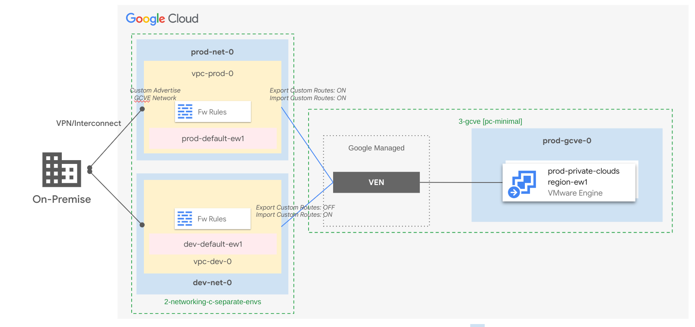

# GCVE Private Cloud Minimal

This stage implements a simple architecture that integrates Google VMware Engine in a FAST organization.

The setup configured here is for a single environment in a single region, and is provided as a starting point for the more complex patterns [described below in this document](#architectural-patterns) which can be easily implemented by extending this stage, and/or duplicating it across environments. Some configuration examples are provided in the [GCVE module](../../../modules/gcve-private-cloud/).

<!-- BEGIN TOC -->
- [Stage configuration](#stage-configuration)
  - [Project-level IAM](#project-level-iam)
  - [Networking](#networking)
- [Architectural patterns](#architectural-patterns)
  - [Single-region shared GCVE deployment](#single-region-shared-gcve-deployment)
  - [Single-region per-environment GCVE deployment](#single-region-per-environment-gcve-deployment)
  - [Multi-regional deployments](#multi-regional-deployments)
- [How to run this stage](#how-to-run-this-stage)
  - [Resource management configuration](#resource-management-configuration)
  - [Provider and Terraform variables](#provider-and-terraform-variables)
  - [Impersonating the automation service account](#impersonating-the-automation-service-account)
  - [Variable configuration](#variable-configuration)
  - [Running the stage](#running-the-stage)
- [Files](#files)
- [Variables](#variables)
- [Outputs](#outputs)
<!-- END TOC -->

## Stage configuration

### Project-level IAM

Project-level IAM is controlled via the `iam` and `iam_by_principals` variables, which allow controlling authoritative bindings on the project.

To manage GCVE assign the `roles/vmwareengine.vmwareengineAdmin` and `roles/vmwareengine.vmwareengineViewer` roles to suitable groups via either of the above variables.

### Networking

Any of the FAST networking stages can be used to provide prerequisites for this stage. The development spoke VPC is used by default to attach the GCVE Private Cloud. To adapt this stage to production (or to a custom VPC) simply change the configuration of the GCVE module in the `main.tf` file.

Peerings can be configured to additional VPCs via the `network_peerings` variable, provided the service account running this stage has suitable permissions on the VPCs. When running FAST, network projects matching this stage's environment already have the suitable IAM binding via the custom `gcveNetworkAdmin` role defined in the bootstrap stage. For custom setups outside of FAST, the [VMware Engine Admin role](https://cloud.google.com/iam/docs/understanding-roles#vmwareengine-roles) can be used.

## Architectural patterns

The patterns shown here can be achieved by combining this stage with the relevant networking stage, and configuring network peerings to achieve the desired connectivity layout. Different patterns can of course be implemented by modifying the default configuration.

### Single-region shared GCVE deployment

This approach creates one GCVE deployment in a single region connected to every environment. When using a networking stage with a dedicated landing VPC as in the first two diagrams, an additional peering is created there to allow connections to the Private Cloud from on premises.

<p align="center">
  
  <br>
  With hub and spoke networking stage.
</p>
<p>
  
  <br>
  With separate environments networking stage.
</p>

### Single-region per-environment GCVE deployment

This approach creates one GCVE deployment per environment in a single region. As in the approach above, when using a networking stage with a dedicated landing VPC as in the first two diagrams, additional peerings are created there to allow connections to the Private Cloud from on premises.

<p align="center">
  
  <br>
  With hub and spoke networking stage.
</p>
<p align="center">
  
  <br>
  With separate environments networking stage.
</p>

### Multi-regional deployments

A design for a multi-regional deployment with the NVA FAST networking stage is shown below.

<p align="center">
  
</p>

## How to run this stage

This stage is meant to be executed after the FAST "foundational" stages: bootstrap, resource management, security and networking stages.

It is also possible to run this stage in isolation. Refer to the *[Running in isolation](#running-in-isolation)* section below for details.

Before running this stage, you need to make sure you have the correct credentials and permissions, and localize variables by assigning values that match your configuration.

### Resource management configuration

Some configuration changes are needed in resource management before this stage can be run.

First, define a parent folder for each stage environment folder in the `data/top-level-folder` folder [in the resource management stage](../1-resman/data/top-level-folders/). As an example, this YAML definition creates a `GCVE` folder under the organization:

```yaml
# yaml-language-server: $schema=../../schemas/top-level-folder.schema.json

name: GCVE

# IAM bindings and organization policies can also be defined here
```

Then, make sure the stage 3 is enabled in the `data/stage-3` folder [in the resource management stage](../1-resman/data/stage-3/). As an example, this YAML definition saved as `gcve-dev.yaml` enables this stage 3 for the development environment:

```yaml
# yaml-language-server: $schema=../../schemas/fast-stage3.schema.json

short_name: gcve
environment: dev
folder_config:
  name: Development
  parent_id: gcve
```

Then edit the definition of the networking stage 2 in the `data/stage2` folder [in the resource management stage](../1-resman/data/stage-2/) to include the IAM configuration for GCVE. The following are example snippets for GCVE dev, make sure they match the `short_name` and `environment` configured above.

In `folder_config.iam_bindings_additive` add:

```yaml
# folder_config:
  # iam_bindings_additive:
    gcve_dev_net_admin:
      role: gcve_network_admin
      member: gcve-dev-rw
      condition:
        title: GCVE dev network admin.
        expression: |
          resource.matchTag('${organization.id}/${tag_names.environment}', 'development')
    gcve_dev_net_viewer:
      role: gcve_network_viewer
      member: gcve-dev-ro
      condition:
        title: GCVE dev network viewer.
        expression: |
          resource.matchTag('${organization.id}/${tag_names.environment}', 'development')
```

In `stage3_config` add the following so that the networking stage grants IAM delegated permissions to this stage's service accounts:

```yaml
# stage3_config:
  iam_admin_delegated:
    - environment: dev
      principal: gcve-dev-rw
  iam_viewer:
    - environment: dev
      principal: gcve-dev-ro
```

### Provider and Terraform variables

As all other FAST stages, the [mechanism used to pass variable values and pre-built provider files from one stage to the next](../0-bootstrap/README.md#output-files-and-cross-stage-variables) is also leveraged here.

The commands to link or copy the provider and terraform variable files can be easily derived from the `fast-links.sh` script in the FAST stages folder, passing it a single argument with the local output files folder (if configured) or the GCS output bucket in the automation project (derived from stage 0 outputs). The following examples demonstrate both cases, and the resulting commands that then need to be copy/pasted and run.

```bash
../fast-links.sh ~/fast-config

# File linking commands for GCVE (dev) stage

# provider file
ln -s ~/fast-config/fast-test-00/providers/3-gcve-dev-providers.tf ./

# input files from other stages
ln -s ~/fast-config/fast-test-00/tfvars/0-globals.auto.tfvars.json ./
ln -s ~/fast-config/fast-test-00/tfvars/0-bootstrap.auto.tfvars.json ./
ln -s ~/fast-config/fast-test-00/tfvars/1-resman.auto.tfvars.json ./
ln -s ~/fast-config/fast-test-00/tfvars/2-networking.auto.tfvars.json ./

# conventional place for stage tfvars (manually created)
ln -s ~/fast-config/fast-test-00/3-gcve-dev.auto.tfvars ./
```

```bash
../fast-links.sh gs://xxx-prod-iac-core-outputs-0

# File linking commands for GCVE (dev) stage

# provider file
gcloud storage cp gs://xxx-prod-iac-core-outputs-0/providers/3-gcve-dev-providers.tf ./

# input files from other stages
gcloud storage cp gs://xxx-prod-iac-core-outputs-0/tfvars/0-globals.auto.tfvars.json ./
gcloud storage cp gs://xxx-prod-iac-core-outputs-0/tfvars/0-bootstrap.auto.tfvars.json ./
gcloud storage cp gs://xxx-prod-iac-core-outputs-0/tfvars/1-resman.auto.tfvars.json ./
gcloud storage cp gs://xxx-prod-iac-core-outputs-0/tfvars/2-networking.auto.tfvars.json ./

# conventional place for stage tfvars (manually created)
gcloud storage cp gs://xxx-prod-iac-core-outputs-0/3-gcve-dev.auto.tfvars ./
```

### Impersonating the automation service account

The preconfigured provider file uses impersonation to run with this stage's automation service account's credentials. The `gcp-devops` and `organization-admins` groups have the necessary IAM bindings in place to do that, so make sure the current user is a member of one of those groups.

### Variable configuration

Variables in this stage -- like most other FAST stages -- are broadly divided into three separate sets:

- variables which refer to global values for the whole organization (org id, billing account id, prefix, etc.), which are pre-populated via the `0-globals.auto.tfvars.json` file linked or copied above
- variables which refer to resources managed by previous stage, which are prepopulated here via the `*.auto.tfvars.json` files linked or copied above
- and finally variables that optionally control this stage's behaviour and customizations, and can to be set in a custom `terraform.tfvars` file

The full list can be found in the [Variables](#variables) table at the bottom of this document.

### Running the stage

Once provider and variable values are in place and the correct user is configured, the stage can be run:

```bash
terraform init
terraform apply
```

<!-- TFDOC OPTS files:1 show_extra:1 exclude:3-gcve-dev-providers.tf -->
<!-- BEGIN TFDOC -->
## Files

| name | description | modules | resources |
|---|---|---|---|
| [gcve-pc.tf](./gcve-pc.tf) | GCVE private cloud resources. | <code>gcve-private-cloud</code> | <code>google_vmwareengine_network_peering</code> |
| [main.tf](./main.tf) | Locals and project-level resources. | <code>project</code> |  |
| [outputs.tf](./outputs.tf) | Output variables. |  |  |
| [variables-fast.tf](./variables-fast.tf) | FAST stage interface. |  |  |
| [variables.tf](./variables.tf) | Module variables. |  |  |

## Variables

| name | description | type | required | default | producer |
|---|---|:---:|:---:|:---:|:---:|
| [billing_account](variables-fast.tf#L19) | Billing account id. If billing account is not part of the same org set `is_org_level` to false. | <code title="object&#40;&#123;&#10;  id &#61; string&#10;&#125;&#41;">object&#40;&#123;&#8230;&#125;&#41;</code> | ✓ |  | <code>0-bootstrap</code> |
| [environments](variables-fast.tf#L27) | Long environment names. | <code title="object&#40;&#123;&#10;  dev &#61; object&#40;&#123;&#10;    name &#61; string&#10;  &#125;&#41;&#10;&#125;&#41;">object&#40;&#123;&#8230;&#125;&#41;</code> | ✓ |  | <code>1-resman</code> |
| [prefix](variables-fast.tf#L44) | Prefix used for resources that need unique names. Use a maximum of 9 chars for organizations, and 11 chars for tenants. | <code>string</code> | ✓ |  | <code>0-bootstrap</code> |
| [folder_ids](variables-fast.tf#L37) | Folders used by FAST stages in folders/nnnnnnnnnnn format. | <code>map&#40;string&#41;</code> |  | <code>&#123;&#125;</code> | <code>1-resman</code> |
| [iam](variables.tf#L17) | Project-level authoritative IAM bindings for users and service accounts in  {ROLE => [MEMBERS]} format. | <code>map&#40;list&#40;string&#41;&#41;</code> |  | <code>&#123;&#125;</code> |  |
| [iam_by_principals](variables.tf#L24) | Authoritative IAM binding in {PRINCIPAL => [ROLES]} format. Principals need to be statically defined to avoid cycle errors. Merged internally with the `iam` variable. | <code>map&#40;list&#40;string&#41;&#41;</code> |  | <code>&#123;&#125;</code> |  |
| [network_peerings](variables.tf#L31) | The network peerings between users' VPCs and the VMware Engine networks. Key is used for the peering name suffix. Network is expanded for FAST defined networks. | <code title="map&#40;object&#40;&#123;&#10;  peer_network                  &#61; string&#10;  configure_peer_network        &#61; optional&#40;bool, false&#41;&#10;  description                   &#61; optional&#40;string, &#34;Managed by Terraform.&#34;&#41;&#10;  peer_to_vmware_engine_network &#61; optional&#40;bool, false&#41;&#10;  routes_config &#61; optional&#40;object&#40;&#123;&#10;    export        &#61; optional&#40;bool, false&#41;&#10;    import        &#61; optional&#40;bool, false&#41;&#10;    public_export &#61; optional&#40;bool, false&#41;&#10;    public_import &#61; optional&#40;bool, false&#41;&#10;  &#125;&#41;, &#123;&#125;&#41;&#10;&#125;&#41;&#41;">map&#40;object&#40;&#123;&#8230;&#125;&#41;&#41;</code> |  | <code title="&#123;&#10;  dev-spoke-0 &#61; &#123;&#10;    peer_network           &#61; &#34;dev-spoke-0&#34;&#10;    configure_peer_network &#61; true&#10;  &#125;&#10;&#125;">&#123;&#8230;&#125;</code> |  |
| [private_cloud_configs](variables.tf#L54) | The VMware private cloud configurations. Key is used for the private cloud name suffix. | <code title="map&#40;object&#40;&#123;&#10;  cidr &#61; string&#10;  zone &#61; string&#10;  additional_cluster_configs &#61; optional&#40;map&#40;object&#40;&#123;&#10;    custom_core_count &#61; optional&#40;number&#41;&#10;    node_count        &#61; optional&#40;number, 3&#41;&#10;    node_type_id      &#61; optional&#40;string, &#34;standard-72&#34;&#41;&#10;  &#125;&#41;&#41;, &#123;&#125;&#41;&#10;  management_cluster_config &#61; optional&#40;object&#40;&#123;&#10;    custom_core_count &#61; optional&#40;number&#41;&#10;    name              &#61; optional&#40;string, &#34;mgmt-cluster&#34;&#41;&#10;    node_count        &#61; optional&#40;number, 3&#41;&#10;    node_type_id      &#61; optional&#40;string, &#34;standard-72&#34;&#41;&#10;  &#125;&#41;, &#123;&#125;&#41;&#10;  description &#61; optional&#40;string, &#34;Managed by Terraform.&#34;&#41;&#10;&#125;&#41;&#41;">map&#40;object&#40;&#123;&#8230;&#125;&#41;&#41;</code> |  | <code>&#123;&#125;</code> |  |
| [stage_config](variables.tf#L76) | FAST stage configuration used to find resource ids. Must match name defined for the stage in resource management. | <code title="object&#40;&#123;&#10;  environment &#61; string&#10;  name        &#61; string&#10;&#125;&#41;">object&#40;&#123;&#8230;&#125;&#41;</code> |  | <code title="&#123;&#10;  environment &#61; &#34;dev&#34;&#10;  name        &#61; &#34;gcve-dev&#34;&#10;&#125;">&#123;&#8230;&#125;</code> |  |
| [vpc_self_links](variables-fast.tf#L54) | FAST host VPC self links. | <code>map&#40;string&#41;</code> |  | <code>&#123;&#125;</code> | <code>2-networking</code> |

## Outputs

| name | description | sensitive | consumers |
|---|---|:---:|---|
| [network](outputs.tf#L17) | VMware engine network. |  |  |
| [network_peerings](outputs.tf#L21) | The peerings created towards the user VPC or other VMware engine networks. |  |  |
| [private_clouds](outputs.tf#L26) | VMware engine private cloud resources. |  |  |
| [project_id](outputs.tf#L31) | GCVE project id. |  |  |
<!-- END TFDOC -->
