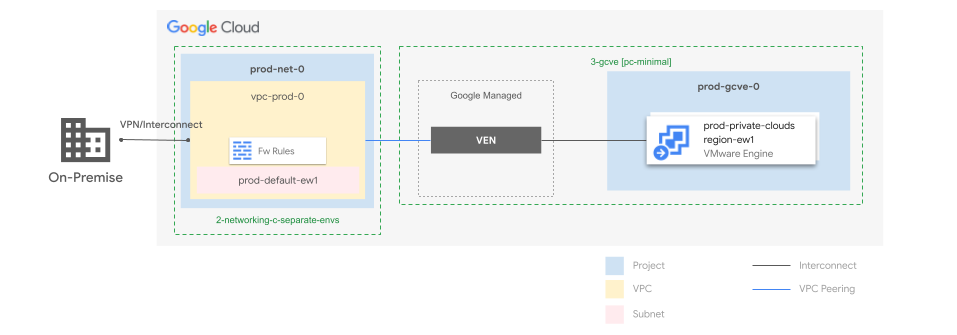
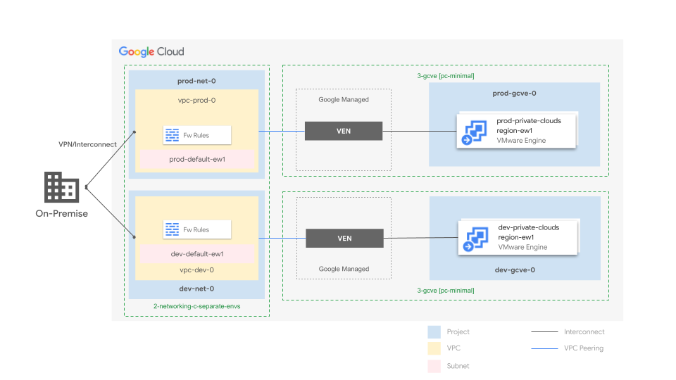
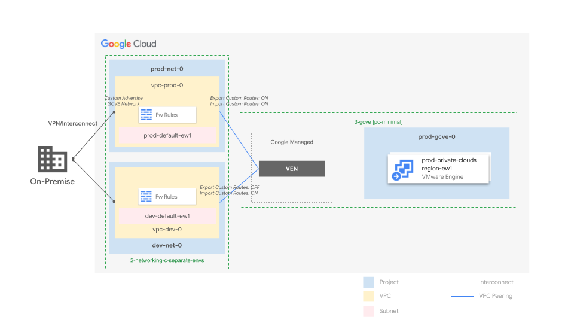
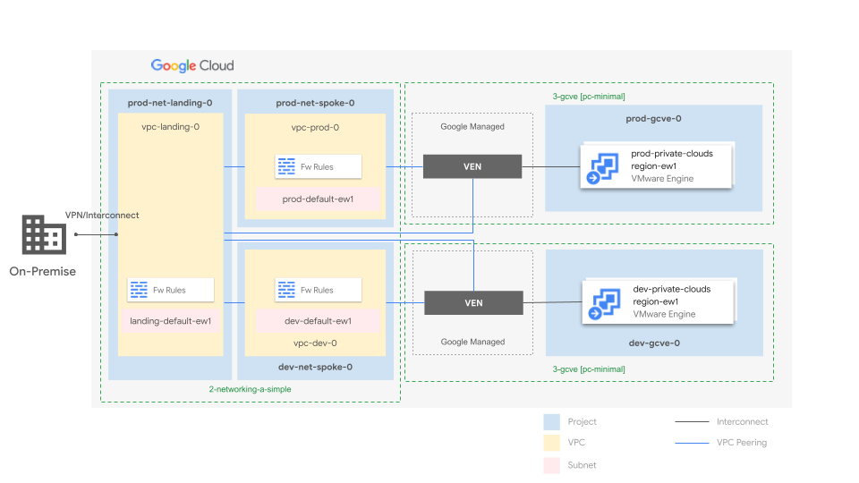
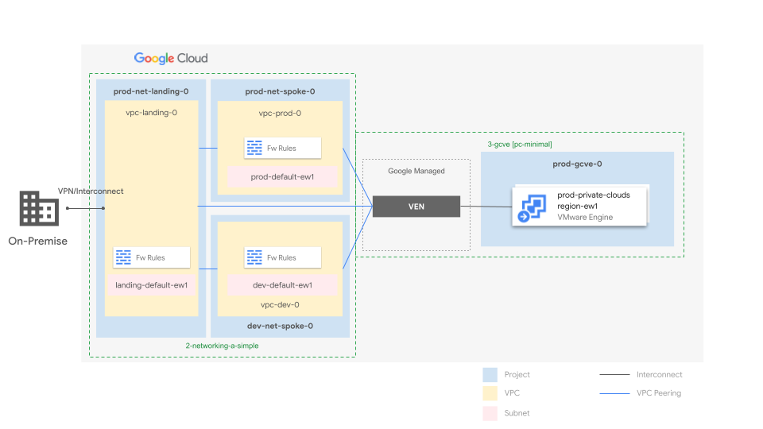
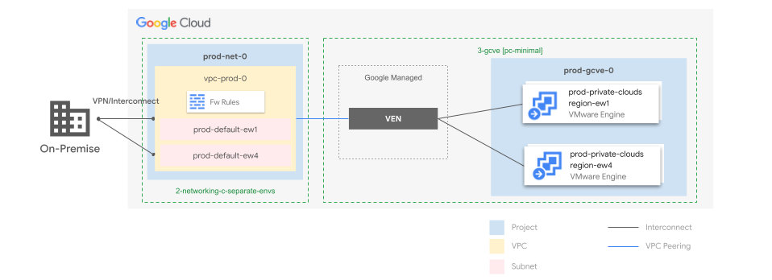
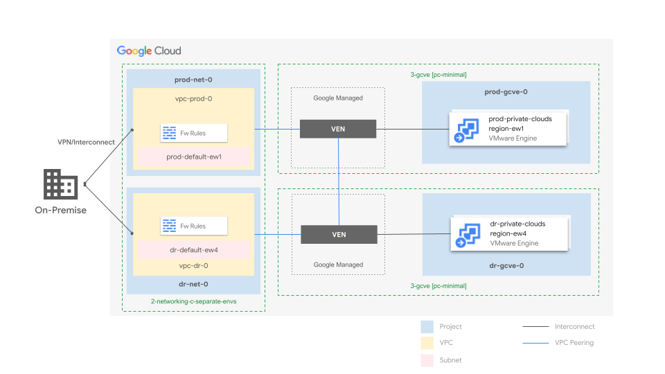

# Google Cloud VMware Engine Stage

The GCVE stage builds on top of your foundations to create and set up projects and related resources, used for your Google Cloud VMware Engine (GCVE) private cloud environments.
It is organized in folders representing environments (e.g. `dev`, `prod`), each implemented by a stand-alone Terraform setup.

This directory contains a [GCVE single region private cloud for the `prod` environment](./prod/) that can be used as-is or cloned with few changes to implement further environments. Refer to the example [`prod`/README.md](./prod/README.md) for configuration details.

With this stage and the [GCVE blueprints](./../../../blueprints/gcve/), you can rapidly deploy production-ready GCVE environments. These environments are fully optimized to integrate seamlessly with your Fabric FAST network topology. Explore the deployment patterns below to find the perfect fit for your use case."

## Single region deployments
### Standalone VPC for a single GCVE deployment

  

### Separate VPC Environments for individual dedicated GCVE deployments 

  

### Separate VPC Environments for shared GCVE deployment

  

### Hub and Spoke VPC Environments for individual dedicated GCVE deployments

  

### Hub and Spoke VPC Environments for shared GCVE deployment

  

## Multi region deployments

### Standalone VPC for a multi-region GCVE deployment

  

### Separate production and DR VPC environments for individual dedicated GCVE deployments

  

