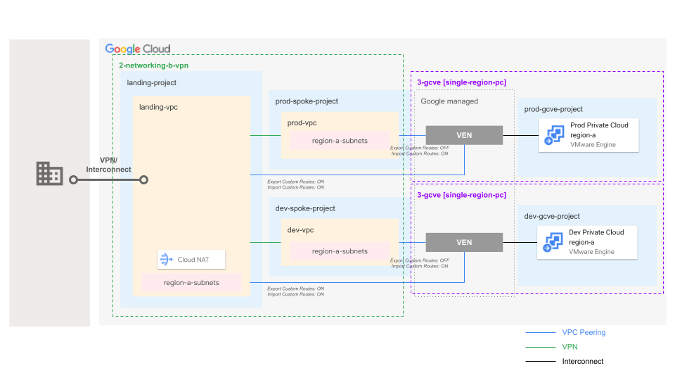
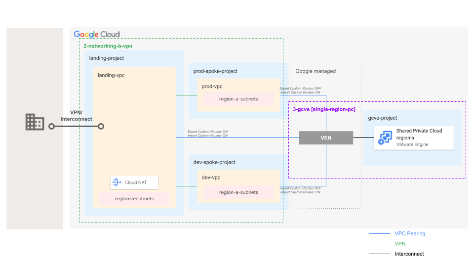

# GCVE

The GCVE stage builds on top of your foundations to create and set up projects and related resources, used for your GCVE private cloud environments.
It is organized in folders representing environments (e.g. `dev`, `prod`), each implemented by a stand-alone Terraform setup.

This directory contains a [GCVE single region private cloud for the `dev` environment](./dev/) that can be used as-is, and cloned with few changes to implement further environments. Refer to the example [`dev`/README.md](./dev/README.md) for configuration details.

With this stage and the [GCVE blueprints](./../../../blueprints/gcve/), you can rapidly deploy production-ready GCVE environments. These environments are fully optimized to integrate seamlessly with your Fabric FAST network topology. Explore the deployment patterns below to find the perfect fit for your use case."

## TOC

<!-- BEGIN TOC -->

<!-- END TOC -->

## Deployment Patterns
### Single Region
#### Hub and Spoke with VPC Peering and individual Private Clouds per environment

  

#### Hub and Spoke with VPC Peering and shared Private Cloud

  

### Hub and Spoke with VPN and individual Private Clouds per environment

  

### Hub and Spoke with VPN and shared Private Cloud

  

