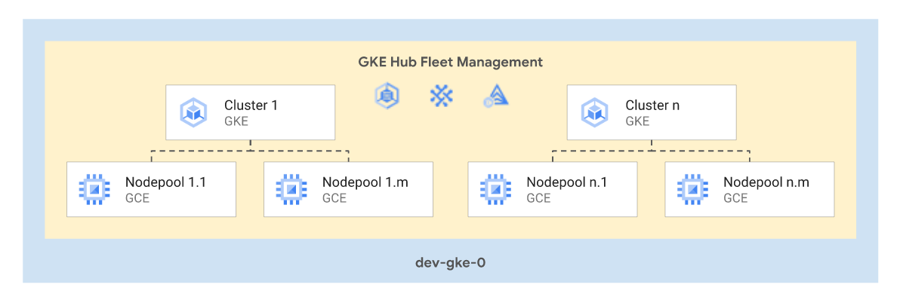

# GKE Multitenant

This stage allows creation and management of a fleet of GKE multitenant clusters for a single environment, optionally leveraging GKE Hub to configure additional features.

The following diagram illustrates the high-level design of created resources, which can be adapted to specific requirements via variables:

<p align="center">
  
</p>

<!-- BEGIN TOC -->
- [Design overview and choices](#design-overview-and-choices)
- [How to run this stage](#how-to-run-this-stage)
  - [FAST prerequisites](#fast-prerequisites)
- [Customizations](#customizations)
  - [Clusters and node pools](#clusters-and-node-pools)
  - [Fleet management](#fleet-management)
- [Files](#files)
- [Variables](#variables)
- [Outputs](#outputs)
<!-- END TOC -->

## Design overview and choices

The general idea behind this stage is to deploy a single project hosting multiple clusters leveraging several useful GKE features like Config Sync, which lend themselves well to a multitenant approach to GKE.

Some high level choices applied here:

- all clusters are created as [private clusters](https://cloud.google.com/kubernetes-engine/docs/how-to/private-clusters) which then need to be [VPC-native](https://cloud.google.com/kubernetes-engine/docs/concepts/alias-ips).
- Logging and monitoring uses Cloud Operations for system components and user workloads.
- [GKE metering](https://cloud.google.com/kubernetes-engine/docs/how-to/cluster-usage-metering) is enabled by default and stored in a BigQuery dataset created within the project.
- [GKE Fleet](https://cloud.google.com/kubernetes-engine/docs/fleets-overview) can be optionally with support for the following features:
  - [Fleet workload identity](https://docs.cloud.google.com/kubernetes-engine/fleet-management/docs/use-workload-identity)
  - [Config Management](https://cloud.google.com/anthos-config-management/docs/overview)
  - [Service Mesh](https://cloud.google.com/service-mesh/docs/overview)
  - [Identity Service](https://cloud.google.com/anthos/identity/setup/fleet)
  - [Multi-cluster services](https://cloud.google.com/kubernetes-engine/docs/concepts/multi-cluster-services)
  - [Multi-cluster ingress](https://cloud.google.com/kubernetes-engine/docs/concepts/multi-cluster-ingress).
- Support for [Config Sync](https://cloud.google.com/anthos-config-management/docs/config-sync-overview) and [Hierarchy Controller](https://cloud.google.com/anthos-config-management/docs/concepts/hierarchy-controller) when using Config Management.
- [Groups for GKE](https://cloud.google.com/kubernetes-engine/docs/how-to/google-groups-rbac) can be enabled to facilitate the creation of flexible RBAC policies referencing group principals.
- Support for [application layer secret encryption](https://cloud.google.com/kubernetes-engine/docs/how-to/encrypting-secrets).
- Some features are enabled by default in all clusters:
  - [Intranode visibility](https://cloud.google.com/kubernetes-engine/docs/how-to/intranode-visibility)
  - [Dataplane v2](https://cloud.google.com/kubernetes-engine/docs/concepts/dataplane-v2)
  - [Shielded GKE nodes](https://cloud.google.com/kubernetes-engine/docs/how-to/shielded-gke-nodes)
  - [Workload identity](https://cloud.google.com/kubernetes-engine/docs/how-to/workload-identity)
  - [Node local DNS cache](https://cloud.google.com/kubernetes-engine/docs/how-to/nodelocal-dns-cache)
  - [Use of the GCE persistent disk CSI driver](https://cloud.google.com/kubernetes-engine/docs/how-to/persistent-volumes/gce-pd-csi-driver)
  - Node [auto-upgrade](https://cloud.google.com/kubernetes-engine/docs/how-to/node-auto-upgrades) and [auto-repair](https://cloud.google.com/kubernetes-engine/docs/how-to/node-auto-repair) for all node pools

## How to run this stage

If this stage is deployed within a FAST-based GCP organization, we recommend executing it after foundational FAST `stage-2` components like `networking` and `security`. This is the recommended flow as specific data platform features in this stage might depend on configurations from these earlier stages. Although this stage can be run independently, instructions for such a standalone setup are beyond the scope of this document.

### FAST prerequisites

This stage needs specific automation resources, and permissions granted on those that allow control of selective IAM roles on specific networking and security resources.

Network permissions are needed to associate data domain or product projects to Shared VPC hosts and grant network permissions to data platform managed service accounts. They are mandatory when deploying Composer.

Security permissions are only needed when using CMEK encryption, to grant the relevant IAM roles to data platform service agents on the encryption keys used.

The ["Classic FAST" dataset](../0-org-setup/README.md#classic-fast-dataset) in the bootstrap stage contains the configuration for a development Data Platform that can be easily adapted to serve for this stage.

## Customizations

This stage is designed with multi-tenancy in mind, and the expectation is that  GKE clusters will mostly share a common set of defaults. Variables allow management of clusters, nodepools, and fleet registration and configurations.

### Clusters and node pools

This is an example of declaring a private cluster with one nodepool via `tfvars` file:

```hcl
clusters = {
  test-00 = {
    description = "Cluster test 0"
    location    = "europe-west8"
    private_cluster_config = {
      enable_private_endpoint = true
      master_global_access    = true
    }
    vpc_config = {
      subnetwork             = "projects/ldj-dev-net-spoke-0/regions/europe-west8/subnetworks/gke"
      master_ipv4_cidr_block = "172.16.20.0/28"
      master_authorized_ranges = {
        private = "10.0.0.0/8"
      }
    }
  }
}
nodepools = {
  test-00 = {
    00 = {
      node_count = { initial = 1 }
    }
  }
}
# tftest skip
```

And here another example of declaring a private cluster following hardening guidelines with one nodepool via `tfvars` file:
```hcl
clusters = {
  test-00 = {
    description = "Hardened Cluster test 0"
    location    = "europe-west1"
    private_cluster_config = {
      enable_private_endpoint = true
      master_global_access    = true
    }
    access_config = {
      dns_access = true
      ip_access = {
        disable_public_endpoint = true
      }
      private_nodes = true
    }
    enable_features = {
      binary_authorization = true
      groups_for_rbac      = "gke-security-groups@example.com"
      intranode_visibility = true
      rbac_binding_config = {
        enable_insecure_binding_system_unauthenticated : false
        enable_insecure_binding_system_authenticated : false
      }
      shielded_nodes = true
      upgrade_notifications = {
        event_types = ["SECURITY_BULLETIN_EVENT", "UPGRADE_AVAILABLE_EVENT", "UPGRADE_INFO_EVENT", "UPGRADE_EVENT"]
      }
      workload_identity = true
    }
    vpc_config = {
      subnetwork             = "projects/ldj-dev-net-spoke-0/regions/europe-west8/subnetworks/gke"
      master_ipv4_cidr_block = "172.16.20.0/28"
      master_authorized_ranges = {
        private = "10.0.0.0/8"
      }
    }
  }
}
nodepools = {
  test-00 = {
    00 = {
      node_count = { initial = 1 }
      node_config = {
        sandbox_config_gvisor = true
      }
    }
  }
}
# tftest skip
```


If clusters share similar configurations, those can be centralized via `locals` blocks in this stage's `main.tf` file, and merged in with clusters via a simple `for_each` loop.

### Fleet management

Fleet management is entirely optional, and uses two separate variables:

- `fleet_config`: specifies the [GKE fleet](https://docs.cloud.google.com/kubernetes-engine/fleet-management/docs/fleet-concepts#fleet-enabled-components) features to activate
- `fleet_configmanagement_templates`: defines configuration templates for specific sets of features ([Config Management](https://cloud.google.com/anthos-config-management/docs/how-to/install-anthos-config-management) currently)

Clusters can then be configured for fleet registration and one of the config management templates attached via the cluster-level `fleet_config` attribute.

<!-- TFDOC OPTS files:1 show_extra:1 exclude:3-gke-dev-providers.tf -->
<!-- BEGIN TFDOC -->
## Files

| name | description | modules | resources |
|---|---|---|---|
| [gke-clusters.tf](./gke-clusters.tf) | GKE clusters. | <code>gke-cluster-standard</code> · <code>gke-nodepool</code> |  |
| [gke-hub.tf](./gke-hub.tf) | GKE hub configuration. | <code>gke-hub</code> |  |
| [main.tf](./main.tf) | Project and usage dataset. | <code>bigquery-dataset</code> · <code>iam-service-account</code> · <code>project</code> |  |
| [outputs.tf](./outputs.tf) | Module outputs. |  | <code>google_storage_bucket_object</code> |
| [variables-fast.tf](./variables-fast.tf) | None |  |  |
| [variables-fleet.tf](./variables-fleet.tf) | GKE fleet configurations. |  |  |
| [variables.tf](./variables.tf) | Module variables. |  |  |

## Variables

| name | description | type | required | default | producer |
|---|---|:---:|:---:|:---:|:---:|
| [automation](variables-fast.tf#L17) | Automation resources created by the bootstrap stage. | <code>object&#40;&#123;&#8230;&#125;&#41;</code> | ✓ |  | <code>0-org-setup</code> |
| [billing_account](variables-fast.tf#L26) | Billing account id. If billing account is not part of the same org set `is_org_level` to false. | <code>object&#40;&#123;&#8230;&#125;&#41;</code> | ✓ |  | <code>0-org-setup</code> |
| [environments](variables-fast.tf#L34) | Long environment names. | <code>object&#40;&#123;&#8230;&#125;&#41;</code> | ✓ |  | <code>0-org-setup</code> |
| [prefix](variables-fast.tf#L60) | Prefix used for resources that need unique names. Use a maximum of 9 chars for organizations, and 11 chars for tenants. | <code>string</code> | ✓ |  | <code>0-org-setup</code> |
| [clusters](variables.tf#L17) | Clusters configuration. Refer to the gke-cluster module for type details. | <code>map&#40;object&#40;&#123;&#8230;&#125;&#41;&#41;</code> |  | <code>&#123;&#125;</code> |  |
| [deletion_protection](variables.tf#L106) | Prevent Terraform from destroying data resources. | <code>bool</code> |  | <code>false</code> |  |
| [fleet_config](variables-fleet.tf#L19) | Fleet configuration. | <code>object&#40;&#123;&#8230;&#125;&#41;</code> |  | <code>null</code> |  |
| [fleet_configmanagement_templates](variables-fleet.tf#L35) | Sets of fleet configurations that can be applied to member clusters, in config name => {options} format. | <code>map&#40;object&#40;&#123;&#8230;&#125;&#41;&#41;</code> |  | <code>&#123;&#125;</code> |  |
| [folder_ids](variables-fast.tf#L44) | Folder name => id mappings. | <code>map&#40;string&#41;</code> |  | <code>&#123;&#125;</code> | <code>0-org-setup</code> |
| [host_project_ids](variables-fast.tf#L52) | Shared VPC host project name => id mappings. | <code>map&#40;string&#41;</code> |  | <code>&#123;&#125;</code> | <code>2-networking</code> |
| [iam](variables.tf#L113) | Project-level authoritative IAM bindings for users and service accounts in  {ROLE => [MEMBERS]} format. | <code>map&#40;list&#40;string&#41;&#41;</code> |  | <code>&#123;&#125;</code> |  |
| [iam_by_principals](variables.tf#L120) | Authoritative IAM binding in {PRINCIPAL => [ROLES]} format. Principals need to be statically defined to avoid cycle errors. Merged internally with the `iam` variable. | <code>map&#40;list&#40;string&#41;&#41;</code> |  | <code>&#123;&#125;</code> |  |
| [nodepools](variables.tf#L127) | Nodepools configuration. Refer to the gke-nodepool module for type details. | <code>map&#40;map&#40;object&#40;&#123;&#8230;&#125;&#41;&#41;&#41;</code> |  | <code>&#123;&#125;</code> |  |
| [stage_config](variables.tf#L176) | FAST stage configuration used to find resource ids. Must match name defined for the stage in resource management. | <code>object&#40;&#123;&#8230;&#125;&#41;</code> |  | <code>&#123;&#8230;&#125;</code> |  |
| [subnet_self_links](variables-fast.tf#L70) | Subnet VPC name => { name => self link }  mappings. | <code>map&#40;map&#40;string&#41;&#41;</code> |  | <code>&#123;&#125;</code> | <code>2-networking</code> |
| [vpc_config](variables.tf#L188) | VPC-level configuration for project and clusters. | <code>object&#40;&#123;&#8230;&#125;&#41;</code> |  | <code>&#123;&#8230;&#125;</code> |  |
| [vpc_self_links](variables-fast.tf#L78) | Shared VPC name => self link mappings. | <code>map&#40;string&#41;</code> |  | <code>&#123;&#125;</code> | <code>2-networking</code> |

## Outputs

| name | description | sensitive | consumers |
|---|---|:---:|---|
| [cluster_ids](outputs.tf#L15) | Cluster ids. |  |  |
| [clusters](outputs.tf#L22) | Cluster resources. | ✓ |  |
| [project_id](outputs.tf#L28) | GKE project id. |  |  |
<!-- END TFDOC -->
