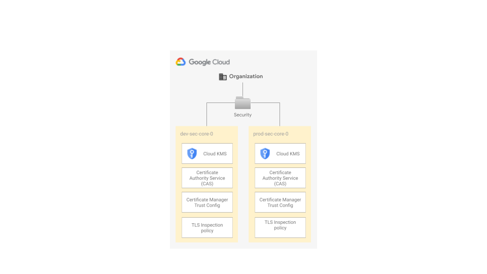

# Network Security

This stage enables NGFW Enterprise in the dev `dev` and `prod` VPCs. This includes:

- security profiles
- security profile groups
- NGFW endpoints
- NGFW endpoint associations
- global network firewall policies and some recommended firewall policy rules

The following diagram is a high level reference of the resources created and managed here (excludes projects and VPCs):

<p align="center">
  
</p>

<!-- BEGIN TOC -->
- [Design overview and choices](#design-overview-and-choices)
- [How to run this stage](#how-to-run-this-stage)
  - [Provider and Terraform variables](#provider-and-terraform-variables)
  - [Impersonating the automation service account](#impersonating-the-automation-service-account)
  - [Variable configuration](#variable-configuration)
  - [Running the stage](#running-the-stage)
- [Customizations](#customizations)
  - [Firewall policy rules factories](#firewall-policy-rules-factories)
  - [NGFW Enterprise configuration](#ngfw-enterprise-configuration)
- [Files](#files)
- [Variables](#variables)
- [Outputs](#outputs)
<!-- END TOC -->

## Design overview and choices

- We create one security profile (and security profile group) per environment in the spoke VPCs only. That's usually where inspection is needed, as it's where workloads run.
- By default, we create NGFW Enterprise endpoints in three zones in the default, primary region (europe-west1). You can adapt this, depending on where your workloads run, using the dedicated variable.
- We install default firewall policy rules in each spoke, so that we allow and inspect all traffic going to the Internet and we allow egress towards RFC-1918 addresses. In ingress, you'll need to add your own rules. We provided some examples that need to be adapted to your topology (number of regions, subnets).
- We use global network firewall policies, as legacy VPC firewall rules are not compatible with NGFW Enterprise. These policies coexist with the legacy VPC firewall rules that we create in the netwroking stage.
- For your convenience, firewall policy rules leverage factories, so that you can define firewall policy rules using yaml files. The path of these files is configurable. Look in the [Customization](#customizations) section for more details.
- NGFW Enterprise endpoints are org-level resources that need to reference a quota project for billing purposes. By default, we create a dedicated `xxx-net-ngfw-0` quota project. Anyway, you can choose to leverage an existing project. Look in the [Customization](#customizations) section for more details.
- Firewall endpoint associations in this stage can reference TLS inspection policies created in the [2-security stage](../2-security/README.md). More info in the customization section of this document.
- While TLS inspection policies are created in the [2-security stage](../2-security/README.md), FAST still allows the service accounts of this stage and the `gcp-network-admins` group to create and manage them anywhere in the organization.

## How to run this stage

This stage is meant to be executed after any [networking](../2-networking-a-simple) stage has run and it leverages dedicated automation service accounts and a bucket created in the [resman](../1-resman) stage.

It's to run this stage in isolation, but that's outside the scope of this document, and you would need to refer to the code for the bootstrap and resman stages for the roles needed.

Before running this stage, you need to make sure you have the correct credentials and permissions, and localize variables by assigning values that match your configuration.

### Provider and Terraform variables

As all other FAST stages, the [mechanism used to pass variable values and pre-built provider files from one stage to the next](../0-bootstrap/README.md#output-files-and-cross-stage-variables) is also leveraged here.

The commands to link or copy the provider and terraform variable files can be easily derived from the `stage-links.sh` script in the FAST root folder, passing it a single argument with the local output files folder (if configured) or the GCS output bucket in the automation project (derived from stage 0 outputs). The following examples demonstrate both cases, and the resulting commands that then need to be copy/pasted and run.

```bash
../../stage-links.sh ~/fast-config

# copy and paste the following commands for '3-network-security'

ln -s ~/fast-config/providers/3-network-security-providers.tf ./
ln -s ~/fast-config/tfvars/0-globals.auto.tfvars.json ./
ln -s ~/fast-config/tfvars/0-bootstrap.auto.tfvars.json ./
ln -s ~/fast-config/tfvars/1-resman.auto.tfvars.json ./
ln -s ~/fast-config/tfvars/2-networking.auto.tfvars.json ./
```

```bash
../../stage-links.sh gs://xxx-prod-iac-core-outputs-0

# copy and paste the following commands for '3-network-security'

gcloud storage cp gs://xxx-prod-iac-core-outputs-0/providers/3-network-security-providers.tf ./
gcloud storage cp gs://xxx-prod-iac-core-outputs-0/tfvars/0-globals.auto.tfvars.json ./
gcloud storage cp gs://xxx-prod-iac-core-outputs-0/tfvars/0-bootstrap.auto.tfvars.json ./
gcloud storage cp gs://xxx-prod-iac-core-outputs-0/tfvars/1-resman.auto.tfvars.json ./
gcloud storage cp gs://xxx-prod-iac-core-outputs-0/tfvars/2-networking.auto.tfvars.json ./
```

### Impersonating the automation service account

The preconfigured provider file uses impersonation to run with this stage's automation service account's credentials. The `gcp-devops` and `organization-admins` groups have the necessary IAM bindings in place to do that, so make sure the current user is a member of one of those groups.

### Variable configuration

Variables in this stage -- like most other FAST stages -- are broadly divided into three separate sets:

- variables which refer to global values for the whole organization (org id, billing account id, prefix, etc.), which are pre-populated via the `0-globals.auto.tfvars.json` file linked or copied above
- variables which refer to resources managed by previous stages, which are prepopulated here via the `0-bootstrap.auto.tfvars.json`, `1-resman.auto.tfvars.json` and `2-networking.auto.tfvars.json` files linked or copied above
- and finally variables that optionally control this stage's behaviour and customizations, and can to be set in a custom `terraform.tfvars` file

The latter set is explained in the [Customization](#customizations) sections below, and the full list can be found in the [Variables](#variables) table at the bottom of this document.

Note that the `outputs_location` variable is disabled by default, you need to explicitly set it in your `terraform.tfvars` file if you want output files to be generated by this stage. This is a sample `terraform.tfvars` that configures it, refer to the [bootstrap stage documentation](../0-bootstrap/README.md#output-files-and-cross-stage-variables) for more details:

```tfvars
outputs_location = "~/fast-config"
```

### Running the stage

Once provider and variable values are in place and the correct user is configured, the stage can be run:

```bash
terraform init
terraform apply
```

## Customizations

You can optionally customize a few options adding a `terraform.tfvars` file to this stage.

### Firewall policy rules factories

By default, firewall policy rules yaml files are contained in the `data` folder within this module. Anyway, you can customize this location.

### NGFW Enterprise configuration

You can decide the zones where to deploy the NGFW Enterprise endpoints. These are set by default to `europe-west1-b`, `europe-west1-c` and `europe-west1-d`.

```tfvars
ngfw_enterprise_config = {
  endpoint_zones = [
    "us-east4-a",
    "us-east4-b",
    "australia-southeast1-b",
    "australia-southeast1-c"
  ]
}
```

Instead of creating a dedicated NGFW Enterprise billing/quota project, you can choose to leverage an existing project. These can even be one of your existing networking projects.
You'll need to make sure your network security service account can activate the `networksecurity.googleapis.com` on that project (for example, assigning the `roles/serviceusage.serviceUsageAdmin` role).

```tfvars
ngfw_enterprise_config = {
  quota_project_id = "your-quota-project-id"
}
```

You can optionally enable TLS inspection in stage [2-security](../2-security/README.md).
Ingesting outputs from [stage 2-security](../2-security/README.md), this stage will configure TLS inspection in NGFW Enterprise and will reference the CAs and the trust-configs you created in [stage 2-security](../2-security/README.md).
Make sure the CAs and the trusted configs created for NGFW Enterprise in the [2-security stage](../2-security/README.md) match the region where you defined your zonal firewall endpoints.

<!-- TFDOC OPTS files:1 show_extra:1 -->
<!-- BEGIN TFDOC -->
## Files

| name | description | modules | resources |
|---|---|---|---|
| [main.tf](./main.tf) | Next-Generation Firewall Enterprise configuration. | <code>project</code> | <code>google_network_security_firewall_endpoint</code> |
| [net-dev.tf](./net-dev.tf) | Security components for dev spoke VPC. | <code>net-firewall-policy</code> | <code>google_network_security_firewall_endpoint_association</code> · <code>google_network_security_security_profile</code> · <code>google_network_security_security_profile_group</code> |
| [net-prod.tf](./net-prod.tf) | Security components for prod spoke VPC. | <code>net-firewall-policy</code> | <code>google_network_security_firewall_endpoint_association</code> · <code>google_network_security_security_profile</code> · <code>google_network_security_security_profile_group</code> |
| [outputs.tf](./outputs.tf) | Module outputs. |  |  |
| [variables-fast.tf](./variables-fast.tf) | None |  |  |
| [variables.tf](./variables.tf) | Module variables. |  |  |

## Variables

| name | description | type | required | default | producer |
|---|---|:---:|:---:|:---:|:---:|
| [billing_account](variables-fast.tf#L17) | Billing account id. If billing account is not part of the same org set `is_org_level` to false. | <code title="object&#40;&#123;&#10;  id           &#61; string&#10;  is_org_level &#61; optional&#40;bool, true&#41;&#10;&#125;&#41;">object&#40;&#123;&#8230;&#125;&#41;</code> | ✓ |  | <code>0-bootstrap</code> |
| [folder_ids](variables-fast.tf#L30) | Folders to be used for the networking resources in folders/nnnnnnnnnnn format. If null, folder will be created. | <code title="object&#40;&#123;&#10;  networking      &#61; string&#10;  networking-dev  &#61; string&#10;  networking-prod &#61; string&#10;&#125;&#41;">object&#40;&#123;&#8230;&#125;&#41;</code> | ✓ |  | <code>1-resman</code> |
| [organization](variables-fast.tf#L72) | Organization details. | <code title="object&#40;&#123;&#10;  domain      &#61; string&#10;  id          &#61; number&#10;  customer_id &#61; string&#10;&#125;&#41;">object&#40;&#123;&#8230;&#125;&#41;</code> | ✓ |  | <code>00-globals</code> |
| [prefix](variables-fast.tf#L82) | Prefix used for resources that need unique names. Use a maximum of 9 chars for organizations, and 11 chars for tenants. | <code>string</code> | ✓ |  | <code>0-bootstrap</code> |
| [vpc_self_links](variables-fast.tf#L92) | Self link for the shared VPC. | <code title="object&#40;&#123;&#10;  dev-spoke-0  &#61; string&#10;  prod-spoke-0 &#61; string&#10;&#125;&#41;">object&#40;&#123;&#8230;&#125;&#41;</code> | ✓ |  | <code>2-networking</code> |
| [factories_config](variables.tf#L17) | Configuration for network resource factories. | <code title="object&#40;&#123;&#10;  cidrs &#61; optional&#40;string, &#34;data&#47;cidrs.yaml&#34;&#41;&#10;  firewall_policy_rules &#61; optional&#40;object&#40;&#123;&#10;    dev  &#61; string&#10;    prod &#61; string&#10;  &#125;&#41;&#41;&#10;&#125;&#41;">object&#40;&#123;&#8230;&#125;&#41;</code> |  | <code title="&#123;&#10;  firewall_policy_rules &#61; &#123;&#10;    dev  &#61; &#34;data&#47;firewall-policy-rules&#47;dev&#34;&#10;    prod &#61; &#34;data&#47;firewall-policy-rules&#47;prod&#34;&#10;  &#125;&#10;&#125;">&#123;&#8230;&#125;</code> |  |
| [host_project_ids](variables-fast.tf#L41) | Host project for the shared VPC. | <code title="object&#40;&#123;&#10;  dev-spoke-0  &#61; optional&#40;string&#41;&#10;  prod-spoke-0 &#61; optional&#40;string&#41;&#10;&#125;&#41;">object&#40;&#123;&#8230;&#125;&#41;</code> |  | <code>&#123;&#125;</code> | <code>2-networking</code> |
| [ngfw_enterprise_config](variables.tf#L35) | NGFW Enterprise configuration. | <code title="object&#40;&#123;&#10;  endpoint_zones   &#61; list&#40;string&#41;&#10;  quota_project_id &#61; optional&#40;string, null&#41;&#10;&#125;&#41;">object&#40;&#123;&#8230;&#125;&#41;</code> |  | <code title="&#123;&#10;  endpoint_zones &#61; &#91;&#10;    &#34;europe-west1-b&#34;,&#10;    &#34;europe-west1-c&#34;,&#10;    &#34;europe-west1-d&#34;&#10;  &#93;&#10;&#125;">&#123;&#8230;&#125;</code> |  |
| [ngfw_tls_configs](variables-fast.tf#L52) | The NGFW Enterprise TLS configurations. | <code title="object&#40;&#123;&#10;  tls_enabled &#61; optional&#40;bool, false&#41;&#10;  tls_ip_ids_by_region &#61; optional&#40;object&#40;&#123;&#10;    dev  &#61; optional&#40;map&#40;string&#41;, &#123;&#125;&#41;&#10;    prod &#61; optional&#40;map&#40;string&#41;, &#123;&#125;&#41;&#10;  &#125;&#41;&#41;&#10;&#125;&#41;">object&#40;&#123;&#8230;&#125;&#41;</code> |  | <code title="&#123;&#10;  tls_enabled &#61; false&#10;  tls_ip_ids_by_region &#61; &#123;&#10;    dev  &#61; &#123;&#125;&#10;    prod &#61; &#123;&#125;&#10;  &#125;&#10;&#125;">&#123;&#8230;&#125;</code> | <code>2-security</code> |

## Outputs

| name | description | sensitive | consumers |
|---|---|:---:|---|
| [ngfw_enterprise_endpoint_ids](outputs.tf#L17) | The NGFW Enterprise endpoint ids. |  |  |
| [ngfw_enterprise_endpoints_quota_project](outputs.tf#L25) | The NGFW Enterprise endpoints quota project. |  |  |
<!-- END TFDOC -->
