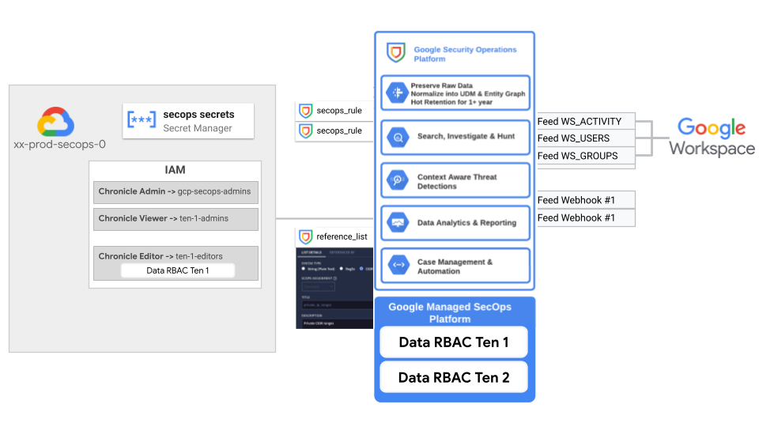

# SecOps Stage

This stage allows automated configuration of SecOps instance at both infrastructure and application level.

The following diagram illustrates the high-level design of SecOps instance configuration in both GCP and SecOps instance, which can be adapted to specific requirements via variables.

<p align="center">
  
</p>

<!-- BEGIN TOC -->
- [Design overview and choices](#design-overview-and-choices)
- [How to run this stage](#how-to-run-this-stage)
  - [FAST prerequisites](#fast-prerequisites)
- [Customizations](#customizations)
  - [Data RBAC](#data-rbac)
  - [SecOps rules and reference list management](#secops-rules-and-reference-list-management)
  - [Google Workspace integration](#google-workspace-integration)
- [Files](#files)
- [Variables](#variables)
- [Outputs](#outputs)
<!-- END TOC -->

## Design overview and choices

The general idea behind this stage is to configure a single SecOps instance for a specific environment with configurations both on SecOps leveraging terraform resources (where available) and `restful_resource` for interacting with the new [SecOps APIs](https://cloud.google.com/chronicle/docs/reference/rest).

Some high level features of the current version of the stage are:

- API/Services enablement
- Data RBAC configuration with labels and scopes
- IAM setup for the SecOps instance based on groups from Cloud Identity or WIF (with supports for Data RBAC)
- Detection Rules and reference lists management via terraform (leveraging [secops-rules](../../../modules/secops-rules) module)
- API Key setup for Webhook feeds
- Integration with Workspace for alerts and logs ingestion via SecOps Feeds

## How to run this stage

If this stage is deployed within a FAST-based GCP organization, we recommend executing it after foundational FAST `stage-2` components like `networking` and `security`. This is the recommended flow as specific data platform features in this stage might depend on configurations from these earlier stages. Although this stage can be run independently, instructions for such a standalone setup are beyond the scope of this document.

### FAST prerequisites

This stage needs specific automation resources, and permissions granted on those that allow control of selective IAM roles on specific networking and security resources.

Network permissions are needed to associate data domain or product projects to Shared VPC hosts and grant network permissions to data platform managed service accounts. They are mandatory when deploying Composer.

Security permissions are only needed when using CMEK encryption, to grant the relevant IAM roles to data platform service agents on the encryption keys used.

The ["Classic FAST" dataset](../0-org-setup/README.md#classic-fast-dataset) in the bootstrap stage contains the configuration for a development Data Platform that can be easily adapted to serve for this stage.

## Customizations

This stage is designed with few basic integrations provided out of the box which can be customized as per the following sections.

### Data RBAC

This stage supports configuration of [SecOps Data RBAC](https://cloud.google.com/chronicle/docs/administration/datarbac-overview) using two separate variables:

- `secops_data_rbac_config`: specifies Data RBAC [label and scopes](https://cloud.google.com/chronicle/docs/administration/configure-datarbac-users) in Google SecOps
- `secops_iam`: defines SecOps IAM configuration in {PRINCIPAL => {roles => [ROLES], scopes => [SCOPES]}} format referencing previously defined scopes. When scope is populated a [IAM condition](https://cloud.google.com/chronicle/docs/administration/configure-datarbac-users#assign-scope-to-users) restrict access to those scopes.

Example of a Data RBAC configuration is reported below.

```hcl
secops_data_rbac_config = {
  labels = {
    google = {
      description = "Google logs"
      label_id    = "google"
      udm_query   = "principal.hostname=\"google.com\""
    }
  }
  scopes = {
    google = {
      description = "Google logs"
      scope_id    = "gscope"
      allowed_data_access_labels = [{
        data_access_label = "google"
      }]
    }
  }
}
secops_iam = {
  "user:bruzzechesse@google.com" = {
    roles  = ["roles/chronicle.editor"]
    scopes = ["gscope"]
  }
}
# tftest skip
```

### SecOps rules and reference list management

This stage leverages the [secops-rules](../../../modules/secops-rules) for automated SecOps rules and reference list deployment via Terraform.

By default, the stage will try to deploy sample rule and reference list available in the [rules](./data/rules) and [reference_lists](./data/reference_lists) folders according to the configuration files `secops_rules.yaml` and `secops_reference_lists.yaml`.

The configuration can be updated via the `factory_config` variable as per the `secops-rules` module [README.md](../../../modules/secops-rules/README.md).

### Google Workspace integration

The stage supports automatic integration of Google Workspace as a SecOps source leveraging [SecOps Feeds](https://cloud.google.com/chronicle/docs/ingestion/default-parsers/collect-workspace-logs#configure_a_feed_in_to_ingest_logs) integration.

Integration is enabled via the `workspace_integration_config` variable as per the following sample:

```hcl
workspace_integration_config = {
  delegated_user        = "secops-feed@..."
  workspace_customer_id = "CXXXXXXX"
}
# tftest skip
```

Where `delegated_user` should be the email of the user created in Cloud Identity following the configuration instructions available [here](https://cloud.google.com/chronicle/docs/ingestion/default-parsers/collect-workspace-logs#configure_a_feed_in_to_ingest_logs).

Please be aware the Service Account Client ID needed during domain wide delegation setup is available in the key of the service account stored in Secret Manager.

<!-- TFDOC OPTS files:1 show_extra:1 exclude:3-secops-dev-providers.tf -->
<!-- BEGIN TFDOC -->
## Files

| name | description | modules | resources |
|---|---|---|---|
| [main.tf](./main.tf) | Module-level locals and resources. | <code>project</code> · <code>secops-rules</code> | <code>google_apikeys_key</code> |
| [outputs.tf](./outputs.tf) | Module outputs. |  | <code>google_storage_bucket_object</code> |
| [providers-override.tf](./providers-override.tf) | None |  |  |
| [secops-providers.tf](./secops-providers.tf) | None |  |  |
| [secops.tf](./secops.tf) | None |  | <code>google_chronicle_data_access_label</code> · <code>google_chronicle_data_access_scope</code> |
| [secrets.tf](./secrets.tf) | None | <code>secret-manager</code> |  |
| [variables-fast.tf](./variables-fast.tf) | None |  |  |
| [variables.tf](./variables.tf) | Module variables. |  |  |
| [workspace.tf](./workspace.tf) | None | <code>iam-service-account</code> | <code>google_service_account_key</code> · <code>restful_resource</code> |

## Variables

| name | description | type | required | default | producer |
|---|---|:---:|:---:|:---:|:---:|
| [automation](variables-fast.tf#L17) | Automation resources created by the bootstrap stage. | <code title="object&#40;&#123;&#10;  outputs_bucket &#61; string&#10;&#125;&#41;">object&#40;&#123;&#8230;&#125;&#41;</code> | ✓ |  | <code>0-org-setup</code> |
| [tenant_config](variables.tf#L118) | SecOps Tenant configuration. | <code title="object&#40;&#123;&#10;  customer_id &#61; string&#10;  region      &#61; string&#10;&#125;&#41;">object&#40;&#123;&#8230;&#125;&#41;</code> | ✓ |  |  |
| [billing_account](variables-fast.tf#L26) | Billing account id. If billing account is not part of the same org set `is_org_level` to false. | <code title="object&#40;&#123;&#10;  id &#61; optional&#40;string&#41;&#10;&#125;&#41;">object&#40;&#123;&#8230;&#125;&#41;</code> |  | <code>&#123;&#125;</code> | <code>0-org-setup</code> |
| [data_rbac_config](variables.tf#L17) | SecOps Data RBAC scope and labels config. | <code title="object&#40;&#123;&#10;  labels &#61; optional&#40;map&#40;object&#40;&#123;&#10;    description &#61; string&#10;    label_id    &#61; string&#10;    udm_query   &#61; string&#10;  &#125;&#41;&#41;&#41;&#10;  scopes &#61; optional&#40;map&#40;object&#40;&#123;&#10;    description &#61; string&#10;    scope_id    &#61; string&#10;    allowed_data_access_labels &#61; optional&#40;list&#40;object&#40;&#123;&#10;      data_access_label &#61; optional&#40;string&#41;&#10;      log_type          &#61; optional&#40;string&#41;&#10;      asset_namespace   &#61; optional&#40;string&#41;&#10;      ingestion_label &#61; optional&#40;object&#40;&#123;&#10;        ingestion_label_key   &#61; string&#10;        ingestion_label_value &#61; optional&#40;string&#41;&#10;      &#125;&#41;&#41;&#10;    &#125;&#41;&#41;, &#91;&#93;&#41;&#10;    denied_data_access_labels &#61; optional&#40;list&#40;object&#40;&#123;&#10;      data_access_label &#61; optional&#40;string&#41;&#10;      log_type          &#61; optional&#40;string&#41;&#10;      asset_namespace   &#61; optional&#40;string&#41;&#10;      ingestion_label &#61; optional&#40;object&#40;&#123;&#10;        ingestion_label_key   &#61; string&#10;        ingestion_label_value &#61; optional&#40;string&#41;&#10;      &#125;&#41;&#41;&#10;    &#125;&#41;&#41;, &#91;&#93;&#41;&#10;  &#125;&#41;&#41;&#41;&#10;&#125;&#41;">object&#40;&#123;&#8230;&#125;&#41;</code> |  | <code>&#123;&#125;</code> |  |
| [factories_config](variables.tf#L51) | Paths to  YAML config expected in 'rules' and 'reference_lists'. Path to folders containing rules definitions (yaral files) and reference lists content (txt files) for the corresponding _defs keys. | <code title="object&#40;&#123;&#10;  rules                &#61; optional&#40;string&#41;&#10;  rules_defs           &#61; optional&#40;string, &#34;data&#47;rules&#34;&#41;&#10;  reference_lists      &#61; optional&#40;string&#41;&#10;  reference_lists_defs &#61; optional&#40;string, &#34;data&#47;reference_lists&#34;&#41;&#10;&#125;&#41;">object&#40;&#123;&#8230;&#125;&#41;</code> |  | <code title="&#123;&#10;  rules                &#61; &#34;.&#47;data&#47;secops_rules.yaml&#34;&#10;  rules_defs           &#61; &#34;.&#47;data&#47;rules&#34;&#10;  reference_lists      &#61; &#34;.&#47;data&#47;secops_reference_lists.yaml&#34;&#10;  reference_lists_defs &#61; &#34;.&#47;data&#47;reference_lists&#34;&#10;&#125;">&#123;&#8230;&#125;</code> |  |
| [folder_ids](variables-fast.tf#L35) | Folder name => id mappings. | <code>map&#40;string&#41;</code> |  | <code>&#123;&#125;</code> | <code>1-resman</code> |
| [iam](variables.tf#L68) | SecOps IAM configuration in {PRINCIPAL => {roles => [ROLES], scopes => [SCOPES]}} format. | <code title="map&#40;object&#40;&#123;&#10;  roles  &#61; list&#40;string&#41;&#10;  scopes &#61; optional&#40;list&#40;string&#41;&#41;&#10;&#125;&#41;&#41;">map&#40;object&#40;&#123;&#8230;&#125;&#41;&#41;</code> |  | <code>&#123;&#125;</code> |  |
| [iam_default](variables.tf#L78) | Groups ID in IdP assigned to SecOps admins, editors, viewers roles. | <code title="object&#40;&#123;&#10;  admins  &#61; optional&#40;list&#40;string&#41;, &#91;&#93;&#41;&#10;  editors &#61; optional&#40;list&#40;string&#41;, &#91;&#93;&#41;&#10;  viewers &#61; optional&#40;list&#40;string&#41;, &#91;&#93;&#41;&#10;&#125;&#41;">object&#40;&#123;&#8230;&#125;&#41;</code> |  | <code>&#123;&#125;</code> |  |
| [project_id](variables.tf#L88) | Project id that references existing SecOps project. Use this variable when running this stage in isolation. | <code>string</code> |  | <code>null</code> |  |
| [project_reuse](variables.tf#L94) | Whether to use an existing project, leave default for FAST deployment. | <code>map&#40;string&#41;</code> |  | <code>&#123;&#125;</code> |  |
| [region](variables.tf#L100) | Google Cloud region definition for resources. | <code>string</code> |  | <code>&#34;europe-west8&#34;</code> |  |
| [secops_project_ids](variables-fast.tf#L43) | SecOps Project IDs for each environment. | <code>map&#40;string&#41;</code> |  | <code>null</code> | <code>2-secops</code> |
| [stage_config](variables.tf#L106) | FAST stage configuration used to find resource ids. Must match name defined for the stage in resource management. | <code title="object&#40;&#123;&#10;  environment &#61; string&#10;  name        &#61; string&#10;&#125;&#41;">object&#40;&#123;&#8230;&#125;&#41;</code> |  | <code title="&#123;&#10;  environment &#61; &#34;dev&#34;&#10;  name        &#61; &#34;secops-dev&#34;&#10;&#125;">&#123;&#8230;&#125;</code> |  |
| [workspace_integration_config](variables.tf#L126) | SecOps Feeds configuration for Workspace logs and entities ingestion. | <code title="object&#40;&#123;&#10;  workspace_customer_id &#61; string&#10;  delegated_user        &#61; string&#10;  applications &#61; optional&#40;list&#40;string&#41;, &#91;&#34;access_transparency&#34;, &#34;admin&#34;, &#34;calendar&#34;, &#34;chat&#34;, &#34;drive&#34;, &#34;gcp&#34;,&#10;    &#34;gplus&#34;, &#34;groups&#34;, &#34;groups_enterprise&#34;, &#34;jamboard&#34;, &#34;login&#34;, &#34;meet&#34;, &#34;mobile&#34;, &#34;rules&#34;, &#34;saml&#34;, &#34;token&#34;,&#10;    &#34;user_accounts&#34;, &#34;context_aware_access&#34;, &#34;chrome&#34;, &#34;data_studio&#34;, &#34;keep&#34;,&#10;  &#93;&#41;&#10;&#125;&#41;">object&#40;&#123;&#8230;&#125;&#41;</code> |  | <code>null</code> |  |

## Outputs

| name | description | sensitive | consumers |
|---|---|:---:|---|
| [project_id](outputs.tf#L15) | SecOps project id. |  |  |
<!-- END TFDOC -->
