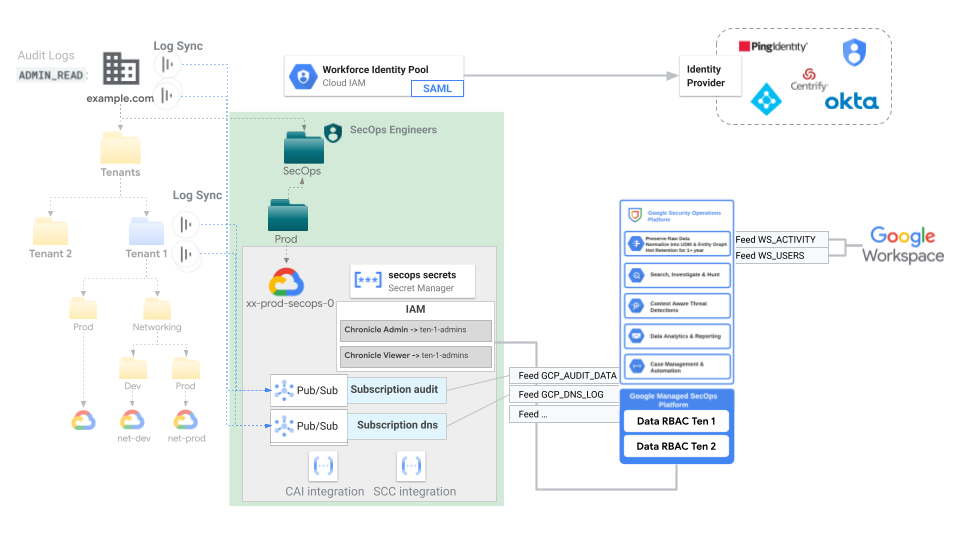

# SecOps Stage

This stage allows automated configuration of a SecOps instance at both infrastructure and application level. The following diagram illustrates the high-level design.

<p align="center">
  
</p>

<!-- BEGIN TOC -->
- [Design overview and choices](#design-overview-and-choices)
- [How to run this stage](#how-to-run-this-stage)
  - [FAST prerequisites](#fast-prerequisites)
- [Customizations](#customizations)
  - [Data RBAC](#data-rbac)
  - [SecOps rules and reference list management](#secops-rules-and-reference-list-management)
  - [Google Workspace integration](#google-workspace-integration)
- [Files](#files)
- [Variables](#variables)
- [Outputs](#outputs)
<!-- END TOC -->

## Design overview and choices

The general idea behind this stage is to configure a single SecOps instance for a specific environment with configurations for SecOps leveraging native Terraform resources (where available) and the `restful_resource` for interacting with the new [SecOps APIs](https://cloud.google.com/chronicle/docs/reference/rest).

Some high level features of this stage are:

- API/Services enablement
- Data RBAC configuration with labels and scopes
- IAM setup for the SecOps instance based on Cloud Identity groups or WIF (with support for Data RBAC)
- Detection Rules and reference lists management via Terraform (leveraging the [secops-rules](../../../modules/secops-rules) module)
- API Key setup for Webhook feeds
- Integration with Workspace for alert and log ingestion via SecOps Feeds

## How to run this stage

If this stage is deployed within a FAST-based GCP organization, we recommend executing it after foundational FAST `stage-2` components like `networking` and `security`. This is the recommended flow as specific features in this stage might depend on configurations from these earlier stages. Although this stage can be run independently, instructions for such a standalone setup are beyond the scope of this document.

### FAST prerequisites

This stage needs specific automation resources, and permissions granted on those that allow control of selective IAM roles on specific networking and security resources.

Network permissions are needed to associate data domain or product projects to Shared VPC hosts and grant network permissions to data platform managed service accounts. They are mandatory when deploying Composer.

Security permissions are only needed when using CMEK encryption, to grant the relevant IAM roles to data platform service agents on the encryption keys used.

## Customizations

This stage is designed with few basic integrations provided out of the box which can be customized as per the following sections.

### Data RBAC

This stage supports configuration of [SecOps Data RBAC](https://cloud.google.com/chronicle/docs/administration/datarbac-overview) using two separate variables:

- `secops_data_rbac_config`: specifies Data RBAC [label and scopes](https://cloud.google.com/chronicle/docs/administration/configure-datarbac-users) in Google SecOps
- `secops_iam`: defines SecOps IAM configuration in {PRINCIPAL => {roles => [ROLES], scopes => [SCOPES]}} format referencing previously defined scopes. When scope is populated a [IAM condition](https://cloud.google.com/chronicle/docs/administration/configure-datarbac-users#assign-scope-to-users) restrict access to those scopes.

Example of a Data RBAC configuration is reported below.

```hcl
secops_data_rbac_config = {
  labels = {
    google = {
      description = "Google logs"
      label_id    = "google"
      udm_query   = "principal.hostname=\"google.com\""
    }
  }
  scopes = {
    google = {
      description = "Google logs"
      scope_id    = "gscope"
      allowed_data_access_labels = [{
        data_access_label = "google"
      }]
    }
  }
}
secops_iam = {
  "user:bruzzechesse@google.com" = {
    roles  = ["roles/chronicle.editor"]
    scopes = ["gscope"]
  }
}
# tftest skip
```

### SecOps rules and reference list management

This stage leverages the [secops-rules](../../../modules/secops-rules) for automated SecOps rules and reference list deployment via Terraform.

By default, the stage will try to deploy sample rule and reference list available in the [rules](./data/rules) and [reference_lists](./data/reference_lists) folders according to the configuration files `secops_rules.yaml` and `secops_reference_lists.yaml`.

The configuration can be updated via the `factory_config` variable as per the `secops-rules` module [README.md](../../../modules/secops-rules/README.md).

### Google Workspace integration

The stage supports automatic integration of Google Workspace as a SecOps source leveraging [SecOps Feeds](https://cloud.google.com/chronicle/docs/ingestion/default-parsers/collect-workspace-logs#configure_a_feed_in_to_ingest_logs) integration.

Integration is enabled via the `workspace_integration_config` variable as per the following sample:

```hcl
workspace_integration_config = {
  delegated_user        = "secops-feed@..."
  workspace_customer_id = "CXXXXXXX"
}
# tftest skip
```

Where `delegated_user` should be the email of the user created in Cloud Identity following the configuration instructions available [here](https://cloud.google.com/chronicle/docs/ingestion/default-parsers/collect-workspace-logs#configure_a_feed_in_to_ingest_logs).

Please be aware the Service Account Client ID needed during domain wide delegation setup is available in the key of the service account stored in Secret Manager.

<!-- TFDOC OPTS files:1 show_extra:1 exclude:3-secops-dev-providers.tf -->
<!-- BEGIN TFDOC -->
## Files

| name | description | modules | resources |
|---|---|---|---|
| [main.tf](./main.tf) | Module-level locals and resources. | <code>project</code> · <code>secops-rules</code> | <code>google_apikeys_key</code> |
| [outputs.tf](./outputs.tf) | Module outputs. |  | <code>google_storage_bucket_object</code> |
| [providers-override.tf](./providers-override.tf) | None |  |  |
| [secops-providers.tf](./secops-providers.tf) | None |  |  |
| [secops.tf](./secops.tf) | None |  | <code>google_chronicle_data_access_label</code> · <code>google_chronicle_data_access_scope</code> |
| [secrets.tf](./secrets.tf) | None | <code>secret-manager</code> |  |
| [variables-fast.tf](./variables-fast.tf) | None |  |  |
| [variables.tf](./variables.tf) | Module variables. |  |  |
| [workspace.tf](./workspace.tf) | None | <code>iam-service-account</code> | <code>google_service_account_key</code> · <code>restful_resource</code> |

## Variables

| name | description | type | required | default | producer |
|---|---|:---:|:---:|:---:|:---:|
| [automation](variables-fast.tf#L17) | Automation resources created by the bootstrap stage. | <code>object&#40;&#123;&#8230;&#125;&#41;</code> | ✓ |  | <code>0-org-setup</code> |
| [prefix](variables-fast.tf#L67) | Prefix for organization projects. | <code>string</code> | ✓ |  | <code>0-org-setup</code> |
| [tenant_config](variables.tf#L139) | SecOps Tenant configuration. | <code>object&#40;&#123;&#8230;&#125;&#41;</code> | ✓ |  |  |
| [billing_account](variables-fast.tf#L26) | Billing account id. If billing account is not part of the same org set `is_org_level` to false. | <code>object&#40;&#123;&#8230;&#125;&#41;</code> |  | <code>&#123;&#125;</code> | <code>0-org-setup</code> |
| [context](variables.tf#L17) | Context-specific interpolations. | <code>object&#40;&#123;&#8230;&#125;&#41;</code> |  | <code>&#123;&#125;</code> |  |
| [custom_roles](variables-fast.tf#L35) | Custom roles defined at the org level, in key => id format. | <code>map&#40;string&#41;</code> |  | <code>&#123;&#125;</code> | <code>0-org-setup</code> |
| [data_rbac_config](variables.tf#L30) | SecOps Data RBAC scope and labels config. | <code>object&#40;&#123;&#8230;&#125;&#41;</code> |  | <code>&#123;&#125;</code> |  |
| [factories_config](variables.tf#L64) | Paths to  YAML config expected in 'rules' and 'reference_lists'. Path to folders containing rules definitions (yaral files) and reference lists content (txt files) for the corresponding _defs keys. | <code>object&#40;&#123;&#8230;&#125;&#41;</code> |  | <code>&#123;&#8230;&#125;</code> |  |
| [folder_ids](variables-fast.tf#L43) | Folders created in the bootstrap stage. | <code>map&#40;string&#41;</code> |  | <code>&#123;&#125;</code> | <code>0-org-setup</code> |
| [iam](variables.tf#L81) | SecOps IAM configuration in {PRINCIPAL => {roles => [ROLES], scopes => [SCOPES]}} format. | <code>map&#40;object&#40;&#123;&#8230;&#125;&#41;&#41;</code> |  | <code>&#123;&#125;</code> |  |
| [iam_default](variables.tf#L91) | Groups ID in IdP assigned to SecOps admins, editors, viewers roles. | <code>object&#40;&#123;&#8230;&#125;&#41;</code> |  | <code>&#123;&#125;</code> |  |
| [iam_principals](variables-fast.tf#L51) | IAM-format principals. | <code>map&#40;string&#41;</code> |  | <code>&#123;&#125;</code> | <code>0-org-setup</code> |
| [kms_keys](variables-fast.tf#L59) | KMS key ids. | <code>map&#40;string&#41;</code> |  | <code>&#123;&#125;</code> | <code>2-security</code> |
| [parent_folder](variables.tf#L101) | Folder to use for created project. | <code>string</code> |  | <code>&#34;&#36;folder_ids:secops&#47;dev&#34;</code> |  |
| [project_id](variables.tf#L108) | Project id for newly created project, or id of existing project if project_create is false. | <code>string</code> |  | <code>&#34;dev-secops-core-0&#34;</code> |  |
| [project_ids](variables-fast.tf#L74) | Projects created in the bootstrap stage. | <code>map&#40;string&#41;</code> |  | <code>&#123;&#125;</code> | <code>0-org-setup</code> |
| [project_reuse](variables.tf#L115) | Whether to use an existing project. | <code>map&#40;string&#41;</code> |  | <code>null</code> |  |
| [region](variables.tf#L121) | Google Cloud region definition for resources. | <code>string</code> |  | <code>&#34;europe-west8&#34;</code> |  |
| [stage_config](variables.tf#L127) | FAST stage configuration used to find resource ids. Must match name defined for the stage in resource management. | <code>object&#40;&#123;&#8230;&#125;&#41;</code> |  | <code>&#123;&#8230;&#125;</code> |  |
| [workspace_integration_config](variables.tf#L147) | SecOps Feeds configuration for Workspace logs and entities ingestion. | <code>object&#40;&#123;&#8230;&#125;&#41;</code> |  | <code>null</code> |  |

## Outputs

| name | description | sensitive | consumers |
|---|---|:---:|---|
| [project_id](outputs.tf#L15) | SecOps project id. |  |  |
<!-- END TFDOC -->
