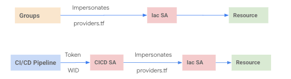

## 00-bootstrap
1. How to handle requests where automation, logging and/or billing export projects are not under organization but in different folders.
    - Run bootstrap stage and let automation, logging and/or billing projects be created under organization.
    - Run resource manager stage or any other custom stage which creates the folders where these projects will reside. 
    - Once folders are created add folder ids to varibale "project_parent_ids" in bootstrap stage and run bootstrap stage.
    - This step will move the projects from organization to the parent folders specificed.

## cicd
1. Why do we need two seperate ServiceAccounts when configuring cicd pipelines (cicd SA and IaC SA)
    - Having seperate service accounts helps shutdown the pipeline incase of any issues and still keep IaC SA and ability to run terraform plan/apply manually.
    - A pipeline can only generate a token that can get access to an SA. It cannot directly call a provider file to impersonate IaC SA.
    - Having providers file that allows impersonation to IaC SA allows flexibility to run terraform manually or from CICD Pipelines.
    

        
    

    

