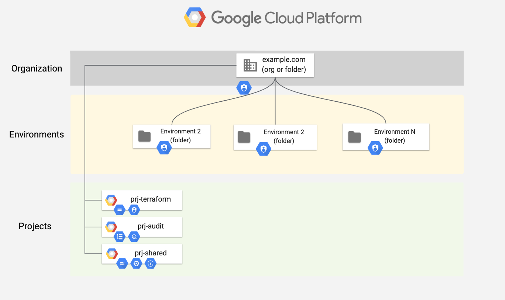

# Cloud foundation examples

The examples in this folder deal with cloud foundations: the set of resources used to **create the organizational hierarchy** (folders and specific IAM roles), **implement top-level initial best practices** (audit log exports, policies) and **bootstrap infrastructure automation** (GCS buckets, service accounts and IAM roles).

The examples are derived from actual production use cases, and are meant to be used as-is, or extended to create more complex hierarchies. The guiding principles they implement are:

- divide the hierarchy in separate partitions along environment/organization boundaries, to enforce separation of duties and decouple organization admin permissions from the day-to-day running of infrastructure
- keep top-level Terraform code minimal and encapsulate complexity in modules, to ensure readability and allow using code as high level documentation

## Examples

### Environment Hierarchy

<a href="./environments/" title="Environments example"></a> This [example](./environments/) implements a simple one-level oganizational layout, which is commonly used to bootstrap small infrastructures, or in situations where lower level folders are managed with separate, more granular Terraform setups.

One authoritative service account, one bucket and one folder are created for each environment, together with top-level shared resources. This example's simplicity makes it a good starting point to understand and prototype foundational design.

<br clear="left">

### Business Unit / Environment Hierarchy

<a href="./business-units/" title="Business Units example"></a> This [example](./business-units/) implements a two-level organizational layout, with a first level usually mapped to business units, and a second level implementing identical environments (prod, test, etc.) under each first-level folder.

This approach maps well to medium sized infrastructures, and can be used as a starting point for more complex scenarios. Separate Terraform stages are then usually implemented for each business unit, implementing fine-grained project and service account creation for individual application teams.
<br clear="left">

## Operational considerations

These examples are always used manually, as they require very high-level permissions and are updated infrequently.

The IAM roles needed are:

- Project Creator, Folder Administrator, Logging Administrator on the root node (org or folder)
- Billing Account Administrator on the billing account or org
- Organization Administrator if Shared VPC roles have to be granted to the automation service accounts created for each scope

State is local on the first run, then it should be moved to the GCS bucket created by the examples for this specific purpose:

```bash
# first apply
terraform apply
# create backend file
cp backend.tf.sample backend.tf
# edit backend.tf and use bootstrap_tf_gcs_bucket output for GCS bucket name
vi backend.tf
# once done, move local state to GCS bucket
terraform init
```
