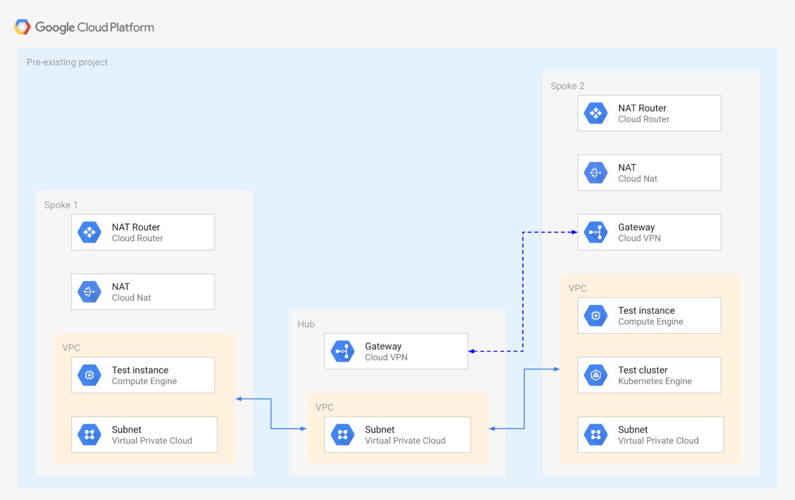

# Networking and infrastructure examples

The examples in this folder implement **typical network topologies** like hub and spoke, or **end-to-end scenarios** that allow testing specific features like on-premises DNS policies and Private Google Access.

They are meant to be used as minimal but complete strting points to create actual infrastructure, and as playgrounds to experiment with specific Google Cloud features.

## Examples

### Hub and Spoke via Peering

 This [example](./hub-and-spoke-peering/) implements a hub and spoke topology via VPC peering, a common design where a landing zone VPC (hub) is conncted to on-premises, and then peered with satellite VPCs (spokes) to further partition the infrastructure.

The sample highlights the lack of transitivity in peering: the absence of connectivity between spokes, and the need create workarounds for private service access to managed services. One such workarund is shown for private GKE, allowing access from hub and all spokes to GKE masters via a dedicated VPN.

 

### Hub and Spoke via Dynamic VPN

 This [example](./hub-and-spoke-vpn/) implements a hub and spoke topology via dynamic VPN tunnels, a common design where peering cannot be used due to limitations on the number of spokes or connectivity to managed services.

The example shows how to implement spoke transitivity via BGP advertisements, how to expose hub DNS zones to spokes via DNS peering, and allows easy testing of different VPN and BGP configurations.

 
