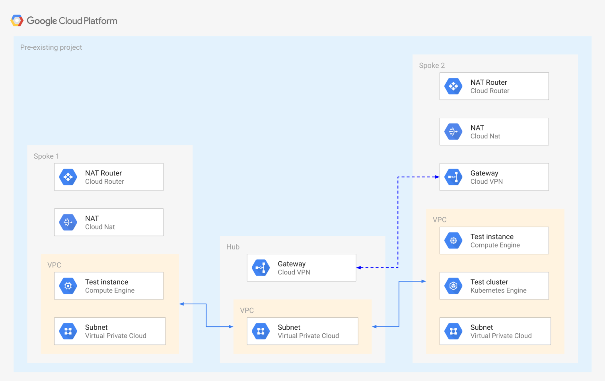

# Hub and Spoke via VPC Peering

This example creates a simple **Hub and Spoke** setup, where the VPC network connects satellite locations (spokes) through a single intermediary location (hub) via [VPC Peering](https://cloud.google.com/vpc/docs/vpc-peering).

The example shows some of the limitations that need to be taken into account when using VPC Peering, mostly due to the lack of transivity between peerings:

- no mesh networking between the spokes
- complex support for managed services hosted in tenant VPCs connected via peering (Cloud SQL, GKE, etc.)

One possible solution to the managed service limitation above is presented here, using a static VPN to establish connectivity to the GLE masters in the tenant project ([courtesy of @drebes](https://github.com/drebes/tf-samples/blob/master/gke-master-from-hub/main.tf#L10)). Other solutions typically involve the use of proxies, as [described in this GCP article](https://cloud.google.com/solutions/creating-kubernetes-engine-private-clusters-with-net-proxies).

One other topic that needs to be considered when using peering is the limit of 25 peerings in each peering group, which constrains the scalability of design like the one presented here.

The example has been purposefully kept simple to show how to use and wire the VPC modules together, and so that it can be used as a basis for more complex scenarios. This is the high level diagram:



## Managed resources and services

This sample creates several distinct groups of resources:

- one VPC each for hub and each spoke
- one set of firewall rules for each VPC
- one Cloud NAT configuration for each spoke
- one test instance for each spoke
- one GKE cluster with a single nodepool in spoke 2
- one static VPN gateway in hub and spoke 2 with a single tunnel each

## Testing GKE access from spoke 1

As mentioned above, a VPN tunnel is used as a workaround to avoid the peering transitivity issue that would prevent any VPC other than spoke 2 to connect to the GKE master.

To test cluster access, first log on to the spoke 2 instance and confirm cluster and IAM roles are set up correctly:

```bash
gcloud container clusters get-credentials cluster-1 --zone europe-west1-b
kubectl get all
```

Once the above works run the same commands on the spoke 1 instance, confirm they work, then bring down the VPN connection by deleting one of the tunnels, and issue them again. The cluster will become unreachable from the spoke 1 instance, but still be reachable from the spoke 2 instance.

## Operational considerations

A single pre-existing project is used in this example to keep variables and complexity to a minimum, in a real world scenarios each spoke would probably use a separate project.

The VPN used to connect the GKE masters VPC does not account for HA, upgrading to use HA VPN is reasonably simple by using the relevant [module](../../modules/net-vpn-ha).

<!-- BEGIN TFDOC -->
## Variables

| name | description | type | required | default |
|---|---|:---: |:---:|:---:|
| project_id | Project id for all resources. | <code title="">string</code> | ✓ |  |
| *ip_ranges* | IP CIDR ranges. | <code title="map&#40;string&#41;">map(string)</code> |  | <code title="&#123;&#10;hub     &#61; &#34;10.0.0.0&#47;24&#34;&#10;spoke-1 &#61; &#34;10.0.16.0&#47;24&#34;&#10;spoke-2 &#61; &#34;10.0.32.0&#47;24&#34;&#10;&#125;">...</code> |
| *ip_secondary_ranges* | Secondary IP CIDR ranges. | <code title="map&#40;string&#41;">map(string)</code> |  | <code title="&#123;&#10;spoke-2-pods     &#61; &#34;10.128.0.0&#47;18&#34;&#10;spoke-2-services &#61; &#34;172.16.0.0&#47;24&#34;&#10;&#125;">...</code> |
| *private_service_ranges* | Private service IP CIDR ranges. | <code title="map&#40;string&#41;">map(string)</code> |  | <code title="&#123;&#10;spoke-2-cluster-1 &#61; &#34;192.168.0.0&#47;28&#34;&#10;&#125;">...</code> |
| *region* | VPC regions. | <code title="">string</code> |  | <code title="">europe-west1</code> |

## Outputs

| name | description | sensitive |
|---|---|:---:|
| vms | GCE VMs. |  |
<!-- END TFDOC -->
