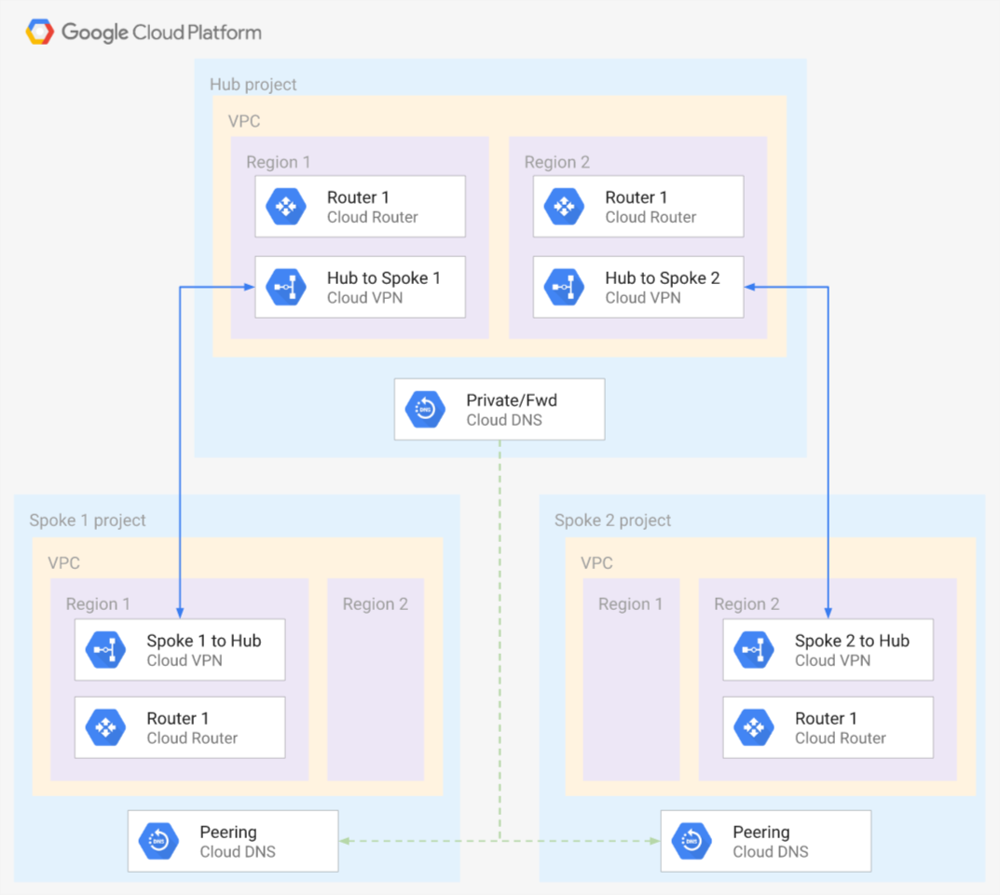

# Hub and Spoke VPNs

This sample creates a simple **Hub and Spoke VPN** architecture, where the VPC network connects satellite locations (spokes) through a single intermediary location (hub) via [IPsec VPN](https://cloud.google.com/vpn/docs/concepts/overview), optionally providing full-mesh networking via [custom route advertisements](https://cloud.google.com/router/docs/how-to/advertising-overview).

> **NOTE**: This example is not designed to provide HA, please refer to the [documentation](https://cloud.google.com/vpn/docs/concepts/advanced#ha-options) for information on Cloud VPNs and HA.

The benefits of this topology include:

- Network/Security Admin manages Central Services Project (Hub).
- Central services and tools deployed in Central Services Project (Hub) for use by all Service Projects (Spokes).
- Network/Security Admin hands over spoke Projects to respective team who then have full autonomy.
- Network/Security Admin monitors spoke projects for organization security posture compliance using tools like [Forseti](https://forsetisecurity.org/), [CSCC](https://cloud.google.com/security-command-center/) etc deployed in Central Services Project (Hub).
- Spokes communicate with on-prem via VPN to transit hub and then over Interconnect or VPN to on-premises (on-premises resources are not included in this sample for obvious reasons).
- (Optional) Spokes communicate in a full-mesh to each other via VPN transit routing in Central Services Project (Hub).
- This is a decentralized architecture where each spoke project has autonomy to manage all their GCP compute and network resources.

The purpose of this sample is showing how to wire different [Cloud Foundation Fabric](https://github.com/search?q=topic%3Acft-fabric+org%3Aterraform-google-modules&type=Repositories) modules to create **Hub and Spoke VPNs** network architectures, and as such it is meant to be used for prototyping, or to experiment with networking configurations. Additional best practices and security considerations need to be taken into account for real world usage (eg removal of default service accounts, disabling of external IPs, firewall design, etc).

## Managed resources and services

This sample creates several distinct groups of resources:

- three VPC Networks (hub network and two ppoke networks)
- VPC-level resources (VPC, subnets, firewall rules, etc.)
- one Cloud DNS Private zone in the hub project
- one Cloud DNS Forwarding zone in the hub project
- four Cloud DNS Peering zones (two per each spoke project)
- one Cloud DNS Policy for inbound forwarding
- four Cloud Routers (two in hub project and one per each spoke project)
- four Cloud VPNs (two in hub project and one per each spoke project)

## Test resources

A set of test resources are included for convenience, as they facilitate experimenting with different networking configurations (firewall rules, external connectivity via VPN, etc.). They are encapsulated in the `test-resources.tf` file, and can be safely removed as a single unit.

- two virtual machine instances in hub project (one per each region) 
- two virtual machine instances in spoke1 project (one per each region) 
- two virtual machine instances in spoke2 project (one per each region) 

SSH access to instances is configured via [OS Login](https://cloud.google.com/compute/docs/oslogin/). External access is allowed via the default SSH rule created by the firewall module, and corresponding `ssh` tags on the instances.

## Known issues
 - It is not possible to get inbound DNS forwarding IPs in the terraform output.
   -  Please refer to the [bug](https://github.com/terraform-providers/terraform-provider-google/issues/3753) for more details.
   -  Please refer to the [documentation](https://cloud.google.com/dns/zones/#creating_a_dns_policy_that_enables_inbound_dns_forwarding) on how to get the IPs with `gcloud`.

<!-- BEGIN TFDOC -->
## Variables

| name | description | type | required | default |
|---|---|:---: |:---:|:---:|
| project_id | Project id for all resources. | <code title="">string</code> | ✓ |  |
| *bgp_asn* | BGP ASNs. | <code title="map&#40;number&#41;">map(number)</code> |  | <code title="&#123;&#10;hub     &#61; 64513&#10;spoke-1 &#61; 64514&#10;spoke-2 &#61; 64515&#10;&#125;">...</code> |
| *bgp_custom_advertisements* | BGP custom advertisement IP CIDR ranges. | <code title="map&#40;string&#41;">map(string)</code> |  | <code title="&#123;&#10;hub-to-spoke-1 &#61; &#34;10.0.32.0&#47;20&#34;&#10;hub-to-spoke-2 &#61; &#34;10.0.16.0&#47;20&#34;&#10;&#125;">...</code> |
| *bgp_interface_ranges* | None | <code title=""></code> |  | <code title="&#123;&#10;spoke-1 &#61; &#34;169.254.1.0&#47;30&#34;&#10;spoke-2 &#61; &#34;169.254.1.4&#47;30&#34;&#10;&#125;">...</code> |
| *ip_ranges* | IP CIDR ranges. | <code title="map&#40;string&#41;">map(string)</code> |  | <code title="&#123;&#10;hub-a     &#61; &#34;10.0.0.0&#47;24&#34;&#10;hub-b     &#61; &#34;10.0.8.0&#47;24&#34;&#10;spoke-1-a &#61; &#34;10.0.16.0&#47;24&#34;&#10;spoke-1-b &#61; &#34;10.0.24.0&#47;24&#34;&#10;spoke-2-a &#61; &#34;10.0.32.0&#47;24&#34;&#10;spoke-2-b &#61; &#34;10.0.40.0&#47;24&#34;&#10;&#125;">...</code> |
| *regions* | VPC regions. | <code title="map&#40;string&#41;">map(string)</code> |  | <code title="&#123;&#10;a &#61; &#34;europe-west1&#34;&#10;b &#61; &#34;europe-west2&#34;&#10;&#125;">...</code> |

## Outputs

| name | description | sensitive |
|---|---|:---:|
| vms | GCE VMs. |  |
<!-- END TFDOC -->
