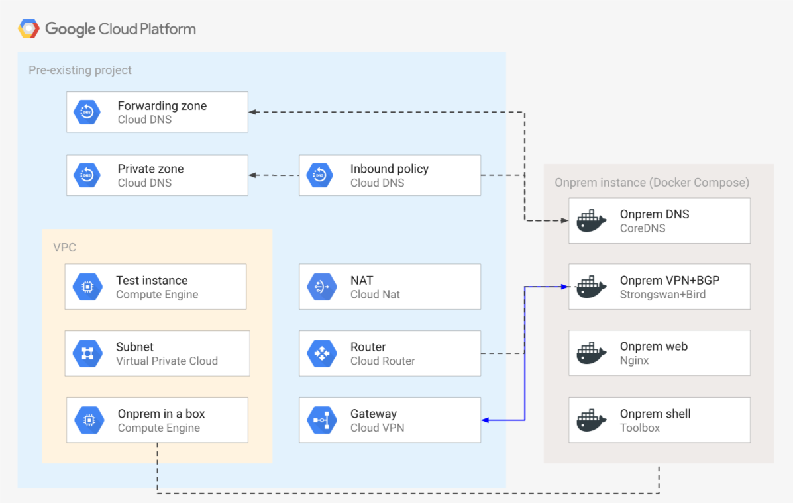

# On-prem DNS and Google Private Access

This example leverages the [on prem in a box](../../modules/on-prem-in-a-box) module to bootstrap an emulated on-premises environment on GCP, then connects it via VPN and sets up BGP and DNS so that several specific features can be tested:

- [Cloud DNS forwarding zone](https://cloud.google.com/dns/docs/overview#fz-targets) to on-prem
- DNS forwarding from on-prem via a [Cloud DNS inbound policy](https://cloud.google.com/dns/docs/policies#create-in)
- [Private Access for on-premises hosts](https://cloud.google.com/vpc/docs/configure-private-google-access-hybrid)

The example has been purposefully kept simple to show how to use and wire the on-prem module, but it lends itself well to experimenting and can be combined with the other [infrastructure examples](../) in this repository to test different GCP networking patterns in connection to on-prem. This is the high level diagram:



## Managed resources and services

This sample creates several distinct groups of resources:

- one VPC
- one set of firewall rules
- one Cloud NAT configuration
- one test instance
- one service account for the test instance
- one service account for the onprem instance
- one dynamic VPN gateway with a single tunnel
- two DNS zones (private and forwarding) and a DNS inbound policy
- one emulated on-premises environment in a single GCP instance

## Cloud DNS inbound forwarder entry point

The Cloud DNS inbound policy reserves an IP address in the VPC, which is used by the on-prem DNS server to forward queries to Cloud DNS. This address needs of course to be explicitly set in the on-prem DNS configuration (see below for details), but since there's currently no way for Terraform to find the exact address (cf [Google provider issue](https://github.com/terraform-providers/terraform-provider-google/issues/3753)), the following manual workaround needs to be applied.

### Find out the forwarder entry point address

Run this gcloud command to (find out the address assigned to the inbound forwarder)[https://cloud.google.com/dns/docs/policies#list-in-entrypoints]:

```bash
gcloud compute addresses list -project [your project id]
```

In the list of addresses, look for the address with purpose `DNS_RESOLVER` in the subnet `to-onprem-default`. If its IP address is `10.0.0.2` it matches the default value in the Terraform `forwarder_address` variable, which means you're all set. If it's different, proceed to the next step.

### Update the forwarder address variable and recreate on-prem

If the forwader address does not match the Terraform variable, add the correct value in your `terraform.tfvars` (or change the default value in `variables.tf`), then taint the onprem instance and apply to recreate it with the correct value in the DNS configuration:

```bash
tf apply
tf taint module.on-prem.google_compute_instance.on_prem_in_a_box
tf apply
```

## CoreDNS configuration for on-premises

The on-prem module uses a CoreDNS container to expose its DNS service, configured with foru distinct blocks:

- the onprem block serving static records for the `onprem.example.com` zone that map to each of the on-prem containers
- the forwarding block for the `gcp.example.com` zone and for Google Private Access, that map to the IP address of the Cloud DNS inbound policy
- the `google.internal` block that exposes to containers a name for the instance metadata address
- the default block that forwards to Google public DNS resolvers

This is the CoreDNS configuration:

```coredns
onprem.example.com {
  root /etc/coredns
  hosts onprem.hosts
  log
  errors
}
gcp.example.com googleapis.com {
  forward . ${resolver_address}
  log
  errors
}
google.internal {
  hosts {
    169.254.169.254 metadata.google.internal
  }
}
. {
  forward . 8.8.8.8
  log
  errors
}
```

## Testing

### Onprem to cloud

```bash
# connect to the onprem instance
gcloud compute ssh onprem

# check that the BGP session works and the advertised routes are set
sudo docker exec -it onprem_bird_1 ip route |grep bird
10.0.0.0/24 via 169.254.1.1 dev vti0  proto bird  src 10.0.16.2
35.199.192.0/19 via 169.254.1.1 dev vti0  proto bird  src 10.0.16.2
199.36.153.4/30 via 169.254.1.1 dev vti0  proto bird  src 10.0.16.2
199.36.153.8/30 via 169.254.1.1 dev vti0  proto bird  src 10.0.16.2

# get a shell on the toolbox container
sudo docker exec -it onprem_toolbox_1 sh

# test forwarding from CoreDNS via the Cloud DNS inbound policy
dig test-1.gcp.example.org +short
10.0.0.3

# test that Private Access is configured correctly
dig compute.googleapis.com +short
private.googleapis.com.
199.36.153.8
199.36.153.9
199.36.153.10
199.36.153.11

# issue an API call via Private Access
gcloud config set project [your project id]
gcloud compute instances list
```

### Cloud to onprem

```bash
# connect to the test instance
gcloud compute ssh test-1

# test forwarding from Cloud DNS to onprem CoreDNS (address may differ)
dig gw.onprem.example.org +short
10.0.16.1

# test a request to the onprem web server
curl www.onprem.example.com -s |grep h1
<h1>On Prem in a Box</h1>
```

## Operational considerations

A single pre-existing project is used in this example to keep variables and complexity to a minimum, in a real world scenarios each spoke would probably use a separate project.

The VPN used to connect to the on-premises environment does not account for HA, upgrading to use HA VPN is reasonably simple by using the relevant [module](../../modules/net-vpn-ha).

<!-- BEGIN TFDOC -->
## Variables

| name | description | type | required | default |
|---|---|:---: |:---:|:---:|
| project_id | Project id for all resources. | <code title="">string</code> | ✓ |  |
| *bgp_asn* | BGP ASNs. | <code title="map&#40;number&#41;">map(number)</code> |  | <code title="&#123;&#10;gcp    &#61; 64513&#10;onprem &#61; 64514&#10;&#125;">...</code> |
| *bgp_interface_ranges* | BGP interface IP CIDR ranges. | <code title="map&#40;string&#41;">map(string)</code> |  | <code title="&#123;&#10;gcp &#61; &#34;169.254.1.0&#47;30&#34;&#10;&#125;">...</code> |
| *ip_ranges* | IP CIDR ranges. | <code title="map&#40;string&#41;">map(string)</code> |  | <code title="&#123;&#10;gcp    &#61; &#34;10.0.0.0&#47;24&#34;&#10;onprem &#61; &#34;10.0.16.0&#47;24&#34;&#10;&#125;">...</code> |
| *region* | VPC region. | <code title="">string</code> |  | <code title="">europe-west1</code> |
| *resolver_address* | GCP DNS resolver address for the inbound policy. | <code title="">string</code> |  | <code title="">10.0.0.2</code> |
| *ssh_source_ranges* | IP CIDR ranges that will be allowed to connect via SSH to the onprem instance. | <code title="list&#40;string&#41;">list(string)</code> |  | <code title="">["0.0.0.0/0"]</code> |

## Outputs

| name | description | sensitive |
|---|---|:---:|
| foo | None |  |
| onprem-instance | Onprem instance details. |  |
| test-instance | Test instance details. |  |
<!-- END TFDOC -->
