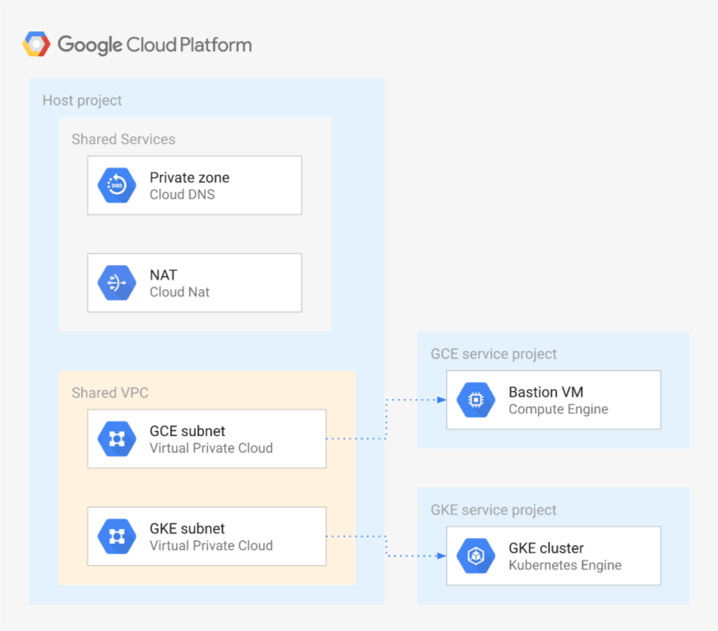

# Shared VPC sample

This sample creates a basic [Shared VPC](https://cloud.google.com/vpc/docs/shared-vpc) setup using one host project and two service projects, each with a specific subnet in the shared VPC. The setup also includes the specific IAM-level configurations needed for [GKE on Shared VPC](https://cloud.google.com/kubernetes-engine/docs/how-to/cluster-shared-vpc) to enable cluster creation in one of the two service projects.

The sample has been purposefully kept simple so that it can be used as a basis for different Shared VPC configurations. This is the high level diagram:

## Managed resources and services

This sample creates several distinct groups of resources:

- projects
  - host project
  - service project configured for GKE clusters
  - service project configured for GCE instances
- networking
  - the VPC network
  - one subnet with secondary ranges for GKE clusters
  - one subnet for GCE instances
  - firewall rules for SSH access via IAP and open communication within the VPC
  - Cloud NAT service
- IAM
  - one service account for the bastion CGE instance
  - one service account for the GKE nodes
  - optional owner role bindings on each project
  - optional [OS Login](https://cloud.google.com/compute/docs/oslogin/) role bindings on the GCE service project
  - role bindings to allow the GCE instance and GKE nodes logging and monitoring write access
  - role binding to allow the GCE instance cluster access
- DNS
  - one private zone
- GCE
  - one instance used to access the internal GKE cluster
- GKE
  - one private cluster with one nodepool

## Accessing the bastion instance and GKE cluster

The bastion VM has no public address so access is mediated via [IAP](https://cloud.google.com/iap/docs), which is supported transparently in the `gcloud compute ssh` command. Authentication is via OS Login set as a project default.

Cluster access from the bastion can leverage the instance service account's `container.developer` role: the only configuration needed is to fetch cluster credentials via `gcloud container clusters get-credentials` passing the correct cluster name, location and project via command options.

## Destroying

There's a minor glitch that can surface running `terraform destroy`, where the service project attachments to the Shared VPC will not get destroyed even with the relevant API call succeeding. We are investigating the issue, in the meantime just manually remove the attachment in the Cloud console or via the `gcloud` command when `terraform destroy` fails, and then relaunch the command.

<!-- BEGIN TFDOC -->
## Variables

| name | description | type | required | default |
|---|---|:---: |:---:|:---:|
| billing_account_id | Billing account id used as default for new projects. | <code title="">string</code> | ✓ |  |
| prefix | Prefix used for resources that need unique names. | <code title="">string</code> | ✓ |  |
| root_node | Hierarchy node where projects will be created, 'organizations/org_id' or 'folders/folder_id'. | <code title="">string</code> | ✓ |  |
| *ip_ranges* | Subnet IP CIDR ranges. | <code title="map&#40;string&#41;">map(string)</code> |  | <code title="&#123;&#10;gce &#61; &#34;10.0.16.0&#47;24&#34;&#10;gke &#61; &#34;10.0.32.0&#47;24&#34;&#10;&#125;">...</code> |
| *ip_secondary_ranges* | Secondary IP CIDR ranges. | <code title="map&#40;string&#41;">map(string)</code> |  | <code title="&#123;&#10;gke-pods     &#61; &#34;10.128.0.0&#47;18&#34;&#10;gke-services &#61; &#34;172.16.0.0&#47;24&#34;&#10;&#125;">...</code> |
| *owners_gce* | GCE project owners, in IAM format. | <code title="list&#40;string&#41;">list(string)</code> |  | <code title="">[]</code> |
| *owners_gke* | GKE project owners, in IAM format. | <code title="list&#40;string&#41;">list(string)</code> |  | <code title="">[]</code> |
| *owners_host* | Host project owners, in IAM format. | <code title="list&#40;string&#41;">list(string)</code> |  | <code title="">[]</code> |
| *private_service_ranges* | Private service IP CIDR ranges. | <code title="map&#40;string&#41;">map(string)</code> |  | <code title="&#123;&#10;cluster-1 &#61; &#34;192.168.0.0&#47;28&#34;&#10;&#125;">...</code> |
| *project_services* | Service APIs enabled by default in new projects. | <code title="list&#40;string&#41;">list(string)</code> |  | <code title="&#91;&#10;&#34;resourceviews.googleapis.com&#34;,&#10;&#34;stackdriver.googleapis.com&#34;,&#10;&#93;">...</code> |
| *region* | Region used. | <code title="">string</code> |  | <code title="">europe-west1</code> |

## Outputs

| name | description | sensitive |
|---|---|:---:|
| gke_clusters | GKE clusters information. |  |
| projects | Project ids. |  |
| service_accounts | GCE and GKE service accounts. |  |
| vms | GCE VMs. |  |
| vpc | Shared VPC. |  |
<!-- END TFDOC -->
