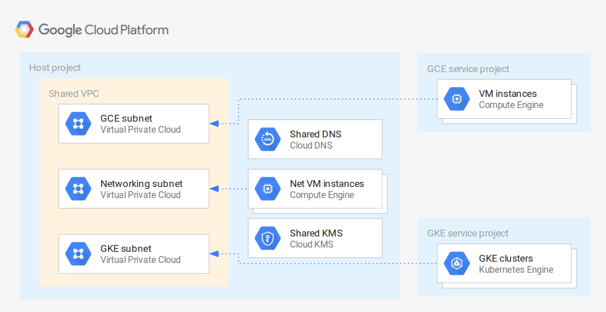

# Shared VPC sample

This sample creates a basic [Shared VPC](https://cloud.google.com/vpc/docs/shared-vpc) infrastructure, where two service projects are connected to separate subnets, and the host project exposes Cloud DNS and Cloud KMS as centralized services. The service projects are slightly different, as they are meant to illustrate the IAM-level differences that need to be taken into account when sharing subnets for GCE or GKE.

The purpose of this sample is showing how to wire different [Cloud Foundation Fabric](https://github.com/search?q=topic%3Acft-fabric+org%3Aterraform-google-modules&type=Repositories) modules to create Shared VPC infrastructures, and as such it is meant to be used for prototyping, or to experiment with networking configurations. Additional best practices and security considerations need to be taken into account for real world usage (eg removal of default service accounts, disabling of external IPs, firewall design, etc).

## Managed resources and services

This sample creates several distinct groups of resources:

- three projects (Shared VPC host and two service projects)
- VPC-level resources (VPC, subnets, firewall rules, etc.) in the host project
- one internal Cloud DNS zone in the host project
- one Cloud KMS keyring with one key in the host project
- IAM roles to wire all the above resource together
- one test instance in each project, with their associated DNS records

## Test resources

A set of test resources are included for convenience, as they facilitate experimenting with different networking configurations (firewall rules, external connectivity via VPN, etc.). They are encapsulated in the `test-resources.tf` file, and can be safely removed as a single unit.

SSH access to instances is configured via [OS Login](https://cloud.google.com/compute/docs/oslogin/), except for the GKE project instance since [GKE nodes do not support OS Login](https://cloud.google.com/compute/docs/instances/managing-instance-access#limitations). To access the GKe instance, use a SSH key set at the project or instance level. External access is allowed via the default SSH rule created by the firewall module, and corresponding `ssh` tags on the instances.

The GCE instance is somewhat special, as it's configured to run a containerized MySQL server using the [`cos-mysql` module](https://github.com/terraform-google-modules/terraform-google-container-vm/tree/master/modules/cos-mysql), to show a practical example of using this module with KMS encryption for its secret, and to demonstrate how to define a custom firewall rule in the firewall module.

The networking and GKE instances have `dig` and the `mysql` client installed via startup scripts, so that tests can be run as soon as they are created.

## Destroying

There's a minor glitch that can surface running `terraform destroy`, with a simple workaround. The glitch is due to a delay between the API reporting service project removal from the Shared VPC as successful (`google_compute_shared_vpc_service_project` resources destroyed), and the Shared VPC resource being aligned with that event. This results in an error that prevents disabling the Shared VPC feature: `Error disabling Shared VPC Host [...] Cannot disable project as a shared VPC host because it has active service projects.`. The workaround is to run `terraform destroy` again after a few seconds, giving the Shared VPC resource time to be in sync with service project removal.

<!-- BEGIN TFDOC -->
## Variables

| name | description | type | required | default |
|---|---|:---: |:---:|:---:|
| billing_account_id | Billing account id used as default for new projects. | <code title="">string</code> | ✓ |  |
| prefix | Prefix used for resources that need unique names. | <code title="">string</code> | ✓ |  |
| root_node | Hierarchy node where projects will be created, 'organizations/org_id' or 'folders/folder_id'. | <code title="">string</code> | ✓ |  |
| *kms_keyring_location* | Location used for the KMS keyring. | <code title=""></code> |  | <code title="">europe</code> |
| *kms_keyring_name* | Name used for the KMS keyring. | <code title=""></code> |  | <code title="">svpc-example</code> |
| *oslogin_admins_gce* | GCE project oslogin admin members, in IAM format. | <code title=""></code> |  | <code title="">[]</code> |
| *oslogin_users_gce* | GCE project oslogin user members, in IAM format. | <code title=""></code> |  | <code title="">[]</code> |
| *owners_gce* | GCE project owners, in IAM format. | <code title=""></code> |  | <code title="">[]</code> |
| *owners_gke* | GKE project owners, in IAM format. | <code title=""></code> |  | <code title="">[]</code> |
| *owners_host* | Host project owners, in IAM format. | <code title=""></code> |  | <code title="">[]</code> |
| *project_services* | Service APIs enabled by default in new projects. | <code title=""></code> |  | <code title="&#91;&#10;&#34;resourceviews.googleapis.com&#34;,&#10;&#34;stackdriver.googleapis.com&#34;,&#10;&#93;">...</code> |
| *subnet_secondary_ranges* | Shared VPC subnets secondary range definitions. | <code title=""></code> |  | <code title="&#123;&#10;networking &#61; &#91;&#93;,&#10;gce        &#61; &#91;&#93;,&#10;gke &#61; &#91;&#10;&#123;&#10;range_name    &#61; &#34;services&#34;&#10;ip_cidr_range &#61; &#34;172.16.0.0&#47;24&#34;&#10;&#125;,&#10;&#123;&#10;range_name    &#61; &#34;pods&#34;&#10;ip_cidr_range &#61; &#34;10.128.0.0&#47;18&#34;&#10;&#125;&#10;&#93;&#10;&#125;">...</code> |
| *subnets* | Shared VPC subnet definitions. | <code title=""></code> |  | <code title="&#91;&#10;&#123;&#10;subnet_name           &#61; &#34;networking&#34;&#10;subnet_ip             &#61; &#34;10.0.0.0&#47;24&#34;&#10;subnet_region         &#61; &#34;europe-west1&#34;&#10;subnet_private_access &#61; &#34;true&#34;&#10;&#125;,&#10;&#123;&#10;subnet_name           &#61; &#34;gce&#34;&#10;subnet_ip             &#61; &#34;10.0.16.0&#47;24&#34;&#10;subnet_region         &#61; &#34;europe-west1&#34;&#10;subnet_private_access &#61; &#34;true&#34;&#10;&#125;,&#10;&#123;&#10;subnet_name           &#61; &#34;gke&#34;&#10;subnet_ip             &#61; &#34;10.0.32.0&#47;24&#34;&#10;subnet_region         &#61; &#34;europe-west1&#34;&#10;subnet_private_access &#61; &#34;true&#34;&#10;&#125;,&#10;&#93;">...</code> |

## Outputs

| name | description | sensitive |
|---|---|:---:|
| host_project_id | VPC host project id. |  |
| service_project_ids | Service project ids. |  |
| vpc_name | Shared VPC name |  |
| vpc_subnets | Shared VPC subnets. |  |
<!-- END TFDOC -->
