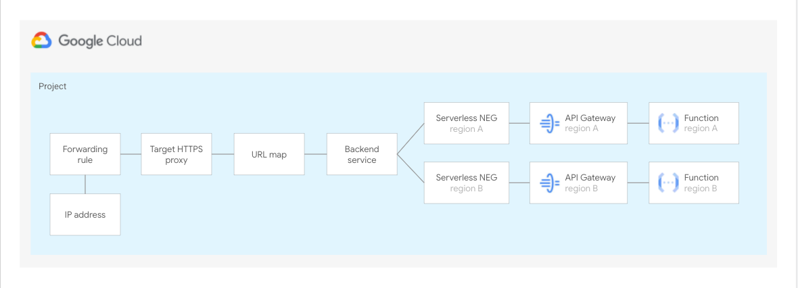

# Multi-region deployment for API Gateway

This recipe shows you how to configure an HTTP(S) load balancer to enable multi-region deployments for API Gateway. For more details on how this set up work have a look at the article [here](https://cloud.google.com/api-gateway/docs/multi-region-deployment).

The diagram below depicts the architecture that this blueprint sets up.



Once deployed do the following to see that it works:

1. Copy the IP address returned as output

2. Execute the following command:

    curl -k -v <https://example.com/hello> --resolve example.com:443:<IP_ADDRESS>
<!-- BEGIN TFDOC -->
## Variables

| name | description | type | required | default |
|---|---|:---:|:---:|:---:|
| [project_id](variables.tf#L27) | Identifier of the project. | <code>string</code> | ✓ |  |
| [regions](variables.tf#L32) | List of regions to deploy the proxy in. | <code>list&#40;string&#41;</code> | ✓ |  |
| [_testing](variables.tf#L17) | Populate this variable to avoid triggering the data source. | <code title="object&#40;&#123;&#10;  name             &#61; string&#10;  number           &#61; number&#10;  services_enabled &#61; optional&#40;list&#40;string&#41;, &#91;&#93;&#41;&#10;&#125;&#41;">object&#40;&#123;&#8230;&#125;&#41;</code> |  | <code>null</code> |

## Outputs

| name | description | sensitive |
|---|---|:---:|
| [address](outputs.tf#L17) | LB IP address. |  |
<!-- END TFDOC -->
## Test

```hcl
module "test" {
  source     = "./fabric/modules/api-gateway/recipe-multi-region"
  project_id = "project-1"
  regions = [
    "europe-west1",
    "us-central1"
  ]
  _testing = {
    name   = "project-1"
    number = 1234567890
  }
}
# tftest modules=8 resources=43
```
