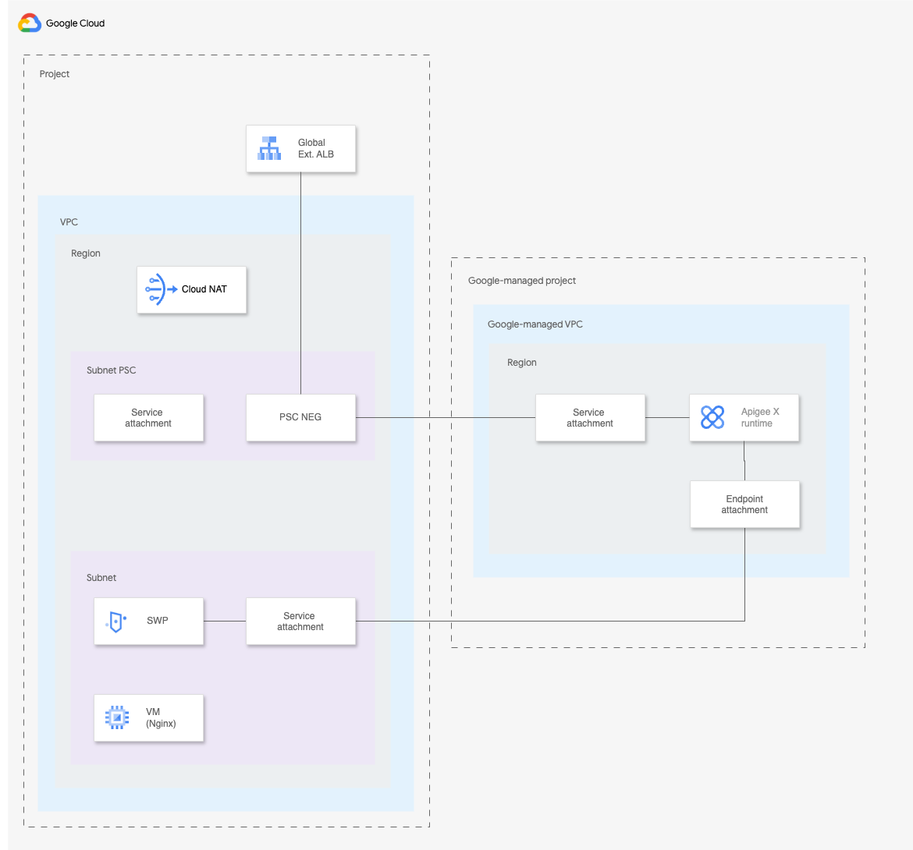

# Apigee X with Secure Web Proxy

This recipe demonstrates how to configure Apigee X with Secure Web Proxy (SWP). This is a common solution when you need your Apigee X runtime to connect to numerous on-premises backends, but prefer to avoid establishing VPC peering between the Apigee X Google-managed VPC and the VPC where hybrid connectivity and advertising Apigee X runtime IP ranges to the on-premises network.

The diagram below depicts the architecture deployed:



In this recipe the SWP gateway has been co-located with Apigee X in the same project for ease of deployment. It's important to note that the SWP gateway's deployment is flexible and can be independently placed in a different project. Our current setup uses a privately accessible VM as the backend target for SWP. In a real-world scenario, with hybrid connectivity configured in the SWP gateway's VPC, the backend could alternatively be an on-premises host.

Once the terraform configuration is applied you can verify that all is working by running the following:

* Deploy a sample proxy to Apigee X

    ./deploy-apiproxy.sh

* Make a request to the proxy

    curl -v &lt;API_URL&gt;/test

  Note: The API_URL is returned as a terraform output
<!-- BEGIN TFDOC -->
## Variables

| name | description | type | required | default |
|---|---|:---:|:---:|:---:|
| [analytics_region](variables.tf#L27) | Region. | <code>string</code> | ✓ |  |
| [instance_region](variables.tf#L32) | Region. | <code>string</code> | ✓ |  |
| [network_config](variables.tf#L37) | Network configuration. | <code title="object&#40;&#123;&#10;  subnet_ip_cidr_range            &#61; string&#10;  subnet_psc_ip_cidr_range        &#61; string&#10;  subnet_proxy_only_ip_cidr_range &#61; string&#10;&#125;&#41;">object&#40;&#123;&#8230;&#125;&#41;</code> | ✓ |  |
| [project_id](variables.tf#L46) | Project ID. | <code>string</code> | ✓ |  |
| [_testing](variables.tf#L17) | Populate this variable to avoid triggering the data source. | <code title="object&#40;&#123;&#10;  name             &#61; string&#10;  number           &#61; number&#10;  services_enabled &#61; optional&#40;list&#40;string&#41;, &#91;&#93;&#41;&#10;&#125;&#41;">object&#40;&#123;&#8230;&#125;&#41;</code> |  | <code>null</code> |

## Outputs

| name | description | sensitive |
|---|---|:---:|
| [api_url](outputs.tf#L17) | API url. |  |
<!-- END TFDOC -->
## Test

```hcl
module "recipe_apigee_swp" {
  source     = "./fabric/modules/apigee/recipe-apigee-swp"
  project_id = "project-1"
  _testing = {
    name   = "project-1"
    number = 1234567890
  }
  instance_region  = "europe-west1"
  analytics_region = "europe-west1"
  network_config = {
    subnet_ip_cidr_range            = "10.16.0.0/24"
    subnet_psc_ip_cidr_range        = "10.16.1.0/24"
    subnet_proxy_only_ip_cidr_range = "10.16.2.0/24"
  }
}
# tftest modules=10 resources=43
