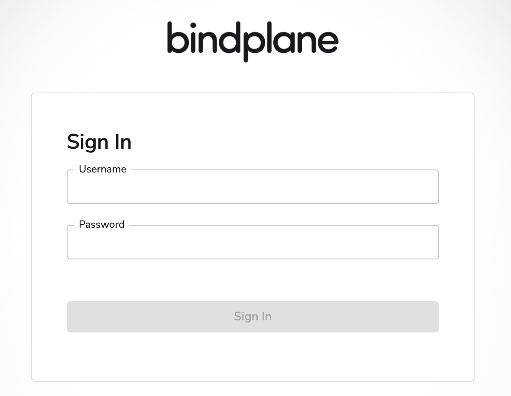

# Containerized Bindplane on Container Optimized OS

This module manages a `cloud-config` configuration that starts a containerized [Bindplane](https://observiq.com/solutions) service on Container Optimized OS, using the official [Bindplane EE image](https://hub.docker.com/r/observiq/bindplane-ee) provided by observIQ and documented in the [official documentation page](https://observiq.com/download) when selecting "Docker" as target platform.

The resulting `cloud-config` can be customized in a number of ways:

- a custom Bindplane configuration can be set in Docker compose file available in `/run/bindplane/docker-compose.yml` using the `bindplane_config` variable
- additional files can be passed in via the `files` variable
- a completely custom `cloud-config` can be passed in via the `cloud_config` variable, and additional template variables can be passed in via `config_variables`

The default instance configuration inserts iptables rules to allow traffic on port 3001.

Logging and monitoring are enabled via the [Google Cloud Logging agent](https://cloud.google.com/container-optimized-os/docs/how-to/logging) configured for the instance via the `google-logging-enabled` metadata property, and the [Node Problem Detector](https://cloud.google.com/container-optimized-os/docs/how-to/monitoring) service started by default on boot.

The module renders the generated cloud config in the `cloud_config` output, to be used in instances or instance templates via the `user-data` metadata.

## Setup

Please refer to the examples below for a sample terraform code for deploying a Bindplane server on GCP Compute VM with COS. After setting up the terraform code run the following commands:

```bash
terraform init
terraform apply
```

Wait for a couple of minutes for the VM to be bootstrapped then connect via IAP tunnel using the following command (substitute the VM name, project and zone according to your configuration):

```bash
gcloud compute ssh $VM_NAME --project $PROJECT --zone $ZONE -- -L 3001:127.0.0.1:3001 -N -q -f
```

Navigate to http://localhost:3001 to access the Bindplane console, the following login page should be displayed.

<p align="center">
  
</p>

## Examples

### Default configuration

This example will create a `cloud-config` that uses the module's defaults, creating a simple bindplane server with default (latest) docker image versions and setting localhost as remote url (suited only for local development).

```hcl
module "cos-nginx" {
  source   = "./fabric/modules/cloud-config-container/bindplane"
  password = "secret"
}

module "vm-nginx-tls" {
  source     = "./fabric/modules/compute-vm"
  project_id = "my-project"
  zone       = "europe-west8-b"
  name       = "cos-nginx"
  network_interfaces = [{
    network    = "default"
    subnetwork = "gce"
  }]
  metadata = {
    user-data              = module.cos-nginx.cloud_config
    google-logging-enabled = true
  }
  boot_disk = {
    initialize_params = {
      image = "projects/cos-cloud/global/images/family/cos-stable"
      type  = "pd-ssd"
      size  = 10
    }
  }
  tags = ["http-server", "ssh"]
}
# tftest modules=2 resources=2
```

<!-- BEGIN TFDOC -->
## Variables

| name | description | type | required | default |
|---|---|:---:|:---:|:---:|
| [password](variables.tf#L63) | Default admin user password. | <code>string</code> | ✓ |  |
| [bindplane_config](variables.tf#L17) | Bindplane configurations. | <code title="object&#40;&#123;&#10;  remote_url                      &#61; optional&#40;string, &#34;localhost&#34;&#41;&#10;  bindplane_server_image          &#61; optional&#40;string, &#34;us-central1-docker.pkg.dev&#47;observiq-containers&#47;bindplane&#47;bindplane-ee:latest&#34;&#41;&#10;  bindplane_transform_agent_image &#61; optional&#40;string, &#34;us-central1-docker.pkg.dev&#47;observiq-containers&#47;bindplane&#47;bindplane-transform-agent:latest&#34;&#41;&#10;  bindplane_prometheus_image      &#61; optional&#40;string, &#34;us-central1-docker.pkg.dev&#47;observiq-containers&#47;bindplane&#47;bindplane-prometheus:1.56.0&#34;&#41;&#10;&#125;&#41;">object&#40;&#123;&#8230;&#125;&#41;</code> |  | <code>&#123;&#125;</code> |
| [cloud_config](variables.tf#L29) | Cloud config template path. If null default will be used. | <code>string</code> |  | <code>null</code> |
| [config_variables](variables.tf#L35) | Additional variables used to render the cloud-config and Nginx templates. | <code>map&#40;any&#41;</code> |  | <code>&#123;&#125;</code> |
| [file_defaults](variables.tf#L41) | Default owner and permissions for files. | <code title="object&#40;&#123;&#10;  owner       &#61; string&#10;  permissions &#61; string&#10;&#125;&#41;">object&#40;&#123;&#8230;&#125;&#41;</code> |  | <code title="&#123;&#10;  owner       &#61; &#34;root&#34;&#10;  permissions &#61; &#34;0644&#34;&#10;&#125;">&#123;&#8230;&#125;</code> |
| [files](variables.tf#L53) | Map of extra files to create on the instance, path as key. Owner and permissions will use defaults if null. | <code title="map&#40;object&#40;&#123;&#10;  content     &#61; string&#10;  owner       &#61; string&#10;  permissions &#61; string&#10;&#125;&#41;&#41;">map&#40;object&#40;&#123;&#8230;&#125;&#41;&#41;</code> |  | <code>&#123;&#125;</code> |
| [runcmd_post](variables.tf#L68) | Extra commands to run after starting nginx. | <code>list&#40;string&#41;</code> |  | <code>&#91;&#93;</code> |
| [runcmd_pre](variables.tf#L74) | Extra commands to run before starting nginx. | <code>list&#40;string&#41;</code> |  | <code>&#91;&#93;</code> |
| [users](variables.tf#L80) | List of additional usernames to be created. | <code title="list&#40;object&#40;&#123;&#10;  username &#61; string,&#10;  uid      &#61; number,&#10;&#125;&#41;&#41;">list&#40;object&#40;&#123;&#8230;&#125;&#41;&#41;</code> |  | <code title="&#91;&#10;&#93;">&#91;&#8230;&#93;</code> |

## Outputs

| name | description | sensitive |
|---|---|:---:|
| [cloud_config](outputs.tf#L17) | Rendered cloud-config file to be passed as user-data instance metadata. |  |
<!-- END TFDOC -->
