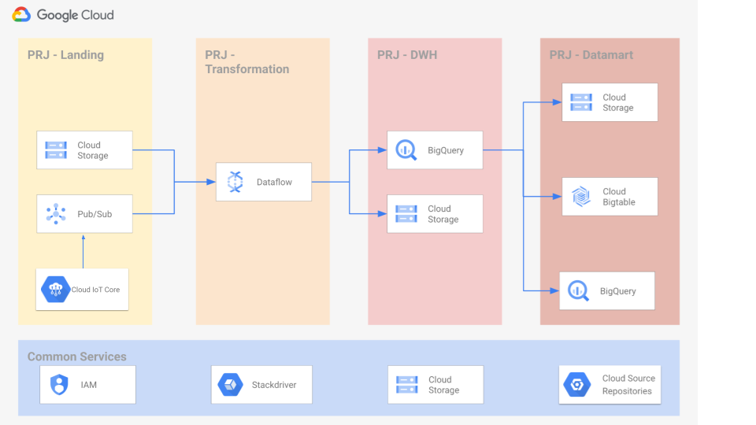

# Google Cloud IoT Core Module

This module sets up Cloud IoT Core Registry, registers IoT Devices and configures Pub/Sub topics required in Cloud IoT Core.

To use this module, ensure the following APIs are enabled:
* pubsub.googleapis.com
* cloudiot.googleapis.com

## Simple Example

Basic example showing how to create an IoT Platform (IoT Core), connected to a set of given Pub/Sub topics and provision IoT devices.

Devices certificates must exist before calling this module. You can generate these certificates using the following command

```
openssl req -x509 -newkey rsa:2048 -keyout rsa_private.pem -nodes -out rsa_cert.pem -subj "/CN=unused"
```

And then provision public certificate path in the devices yaml file following the convention device_id: device_cert


```hcl
module "iot-platform" {
  source                     = "./modules/iot-core"
  project_id                 = "my_project_id"
  region                     = "europe-west1"
  telemetry_pubsub_topic_id = "telemetry_topic_id"
  status_pubsub_topic_id    = "status_topic_id"
  protocols = {
      http = false,
      mqtt = true
  }
  devices_config = {
      blocked = false, 
      certificate_format = "RSA_X509_PEM", 
      gateway = false, 
      yaml_file = "devices.yaml", 
      log_level =  "INFO"
  }
}
# tftest:skip

```

Now, we can test sending telemetry messages from devices to our IoT Platform, for example using the MQTT demo client at https://github.com/googleapis/nodejs-iot/tree/main/samples/mqtt_example

## Example with specific PubSub topics for custom MQTT topics

If you need to match specific MQTT topics (eg, /temperature) into specific PubSub topics, you can use extra_telemetry_pubsub_topic_ids for that, as in the following example:

```hcl
module "iot-platform" {
  source                     = "./modules/iot-core"
  project_id                 = "my_project_id"
  region                     = "europe-west1"
  telemetry_pubsub_topic_id = "telemetry_topic_id"
  status_pubsub_topic_id    = "status_topic_id"
  extra_telemetry_pubsub_topic_ids = {
      "temperature" = "temp_topic_id",
      "humidity" = "hum_topic_id"
  }
  protocols = {
      http = false,
      mqtt = true
  }
  devices_config = {
      blocked = false, 
      certificate_format = "RSA_X509_PEM", 
      gateway = false, 
      yaml_file = "devices.yaml", 
      log_level =  "INFO"
  }
}
# tftest:skip

```

## Example integrated with Data Foundation Platform
In this example, we will show how to extend the **[Data Foundations Platform](../../data-solutions/data-platform-foundations/)** to include IoT Platform as a new source of data. 



1. First, we will setup Environment following instructions in **[Environment Setup](../../data-solutions/data-platform-foundations/01-environment/)** to setup projects and SAs required. Get output variable project_ids.landing as will be used later

1. Second, execute instructions in **[Environment Setup](../../data-solutions/data-platform-foundations/02-resources/)** to provision PubSub, DataFlow, BQ,... Get variable landing-pubsub as will be used later to create IoT Registry

1. Now it is time to provision IoT Platform. Modify landing-project-id and landing_pubsub_topic_id with output variables obtained before. Create device certificates as shown in the Simple Example and register them in devices.yaml file together with deviceids.

```hcl
module "iot-platform" {
  source                     = "./modules/iot-core"
  project_id                 = "landing-project-id"
  region                     = "europe-west1"
  telemetry_pubsub_topic_id = "landing_pubsub_topic_id"
  status_pubsub_topic_id    = "status_pubsub_topic_id"
  protocols = {
      http = false,
      mqtt = true
  }
  devices_config = {
      blocked = false, 
      certificate_format = "RSA_X509_PEM", 
      gateway = false, 
      yaml_file = "devices.yaml", 
      log_level =  "INFO"
  }
}
# tftest:skip
```
1. After that, we can setup the pipeline "PubSub to BigQuery" shown at **[Pipeline Setup](../../data-solutions/data-platform-foundations/03-pipeline/pubsub_to_bigquery.md)**

1. Finally, instead of testing the pipeline by sending messages to PubSub, we can now test sending telemetry messages from simulated IoT devices to our IoT Platform, for example using the MQTT demo client at https://github.com/googleapis/nodejs-iot/tree/main/samples/mqtt_example . We shall edit the client script cloudiot_mqtt_example_nodejs.js to send messages following the pipeline message format, so they are processed by DataFlow job and inserted in the BigQuery table.
```
const payload = '{"name": "device4", "surname": "NA", "timestamp":"'+Math.floor(Date.now()/1000)+'"}';
```

Or even better, create a new BigQuery table with our IoT sensors data columns and modify the DataFlow job to push data to it.
<!-- BEGIN TFDOC -->

## Variables

| name | description | type | required | default |
|---|---|:---:|:---:|:---:|
| [project_id](variables.tf#L41) | Project were resources will be deployed | <code>string</code> | ✓ |  |
| [region](variables.tf#L55) | Region were resources will be deployed | <code>string</code> | ✓ |  |
| [status_pubsub_topic_id](variables.tf#L66) | pub sub topic for status messages (GCP-->Device) | <code>string</code> | ✓ |  |
| [telemetry_pubsub_topic_id](variables.tf#L71) | pub sub topic for telemetry messages (Device-->GCP) | <code>string</code> | ✓ |  |
| [devices_config](variables.tf#L17) | IoT configuration for the batch of devices to be configured. Certificates format values are RSA_PEM, RSA_X509_PEM, ES256_PEM, and ES256_X509_PEM. yaml_file name including Devices map to be registered in the IoT Registry in the form DEVICE_ID: DEVICE_CERTIFICATE | <code title="object&#40;&#123;&#10;  blocked &#61; bool,&#10;  certificate_format &#61; string,&#10;  gateway &#61; bool,&#10;  yaml_file &#61; string,&#10;  log_level &#61; string&#10;&#125;&#41;">object&#40;&#123;&#8230;&#125;&#41;</code> |  | <code>&#123; blocked &#61; false, certificate_format &#61; &#34;RSA_X509_PEM&#34;, gateway &#61; false, yaml_file &#61; &#34;&#34;, log_level &#61;  &#34;INFO&#34;&#125;</code> |
| [extra_telemetry_pubsub_topic_ids](variables.tf#L29) | additional pubsub topics linked to adhoc MQTT topics (Device-->GCP) in the format MQTT_TOPIC: PUBSUB_TOPIC_ID | <code>map&#40;string&#41;</code> |  | <code>&#123;&#125;</code> |
| [log_level](variables.tf#L35) | IoT Registry Log level | <code>string</code> |  | <code>&#34;INFO&#34;</code> |
| [protocols](variables.tf#L46) | IoT protocols (HTTP / MQTT) activation | <code title="object&#40;&#123;&#10;  http &#61; bool,&#10;  mqtt &#61; bool&#10;&#125;&#41;">object&#40;&#123;&#8230;&#125;&#41;</code> |  | <code>&#123; http &#61; true, mqtt &#61; true &#125;</code> |
| [registry_name](variables.tf#L60) | Name for the IoT Core Registry | <code>string</code> |  | <code>&#34;cloudiot-registry&#34;</code> |

## Outputs

| name | description | sensitive |
|---|---|:---:|
| [iot_registry](outputs.tf#L17) | Cloud IoT Core Registry |  |

<!-- END TFDOC -->
