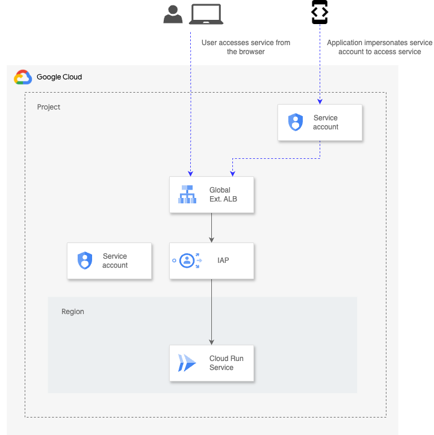

# Expose Cloud Run service with Global External Application Load Balancer protected by IAP

This recipe demonstrates how to expose a Cloud Run Service Global External Application Load Balancer protected by IAP.

The architecture deployed by this recipe is the one depicted below:



Note: Make sure that the email that you pass as support email for the IAP brand is the email of a group in which the identity executing terraform is a member with the role MANAGER. Otherwise an error will be raised. Also bear in mind only organization internal brands can be created using Terraform.  

This recipe addresses common requirements of backends protected by IAP:

* CORS

  When a browser sends a CORS preflight OPTIONS request, it typically doesn't include any authentication credentials (like IAP session cookies). Since IAP is designed to protect an application by requiring authentication, it often blocks these unauthenticated OPTIONS requests, returning an errorinstead of the necessary CORS headers. The browser then sees this as a CORS failure and blocks the subsequent actual request.
  Google Cloud's IAP has a setting, `access_settings.cors_settings.allow_http_options`, that needs to be set to true. This allows IAP to pass OPTIONS requests to your backend without requiring authentication. The backend application must then be configured to correctly respond to these OPTIONS requests with the appropriate CORS headers (e.g., Access-Control-Allow-Origin, Access-Control-Allow-Methods, Access-Control-Allow-Headers). This tells the browser that cross-origin requests are permitted.

* Programmatic access using a service account

  To access a service exposed with Global External Application Load Balancer protected by IAP programmatically impersonating a service account:

  * The service account to use for programmatic access must be granted the IAP-Secured Web App User role (`roles/iap.httpsResourceAccessor`) on the backend service of your Global External Application Load Balancer.

  * To access the IAP-protected service from code impersonating a service account, an ID token signed issues for this one needs to be obtained. The key is to generate an ID token with the correct audience. The audience for an IAP-protected resource is the OAuth 2.0 Client ID that IAP uses.

  To try out that programmatic access works for this particular service do the following you can run the command returned as output.
<!-- BEGIN TFDOC -->
## Variables

| name | description | type | required | default |
|---|---|:---:|:---:|:---:|
| [project_id](variables.tf#L39) | Project ID. | <code>string</code> | ✓ |  |
| [region](variables.tf#L44) | Region. | <code>string</code> | ✓ |  |
| [support_email](variables.tf#L49) | Support email for IAP brand. | <code>string</code> | ✓ |  |
| [_testing](variables.tf#L17) | Populate this variable to avoid triggering the data source. | <code title="object&#40;&#123;&#10;  name             &#61; string&#10;  number           &#61; number&#10;  services_enabled &#61; optional&#40;list&#40;string&#41;, &#91;&#93;&#41;&#10;&#125;&#41;">object&#40;&#123;&#8230;&#125;&#41;</code> |  | <code>null</code> |
| [accesors](variables.tf#L27) | List of identities able to access the service via IAP (e.g. group:mygroup@myorg.com). | <code>list&#40;string&#41;</code> |  | <code>&#91;&#93;</code> |
| [impersonators](variables.tf#L33) | List of identities able to impersonate the service account for programmatica access. | <code>list&#40;string&#41;</code> |  | <code>&#91;&#93;</code> |

## Outputs

| name | description | sensitive |
|---|---|:---:|
| [application_service_account_email](outputs.tf#L26) | Application service account email. |  |
| [command](outputs.tf#L31) | Command. |  |
| [oauth2_client_id](outputs.tf#L40) | OAuth client ID. |  |
| [url](outputs.tf#L45) | URL to access service exposed by IAP. |  |
<!-- END TFDOC -->
## Tests

```hcl
module "test" {
  source     = "./fabric/modules/net-lb-app-ext/recipe-cloud-run-iap"
  project_id = "project-1"
  _testing = {
    name   = "project-1"
    number = 1234567890
  }
  region        = "europe-west1"
  support_email = "mygroup1@myorg.com"
  accesors = [
    "group:mygroup2@myorg.com"
  ]
  impersonators = [
    "group:mygroup3@myorg.com"
  ]
}
# tftest modules=6 resources=24
```
