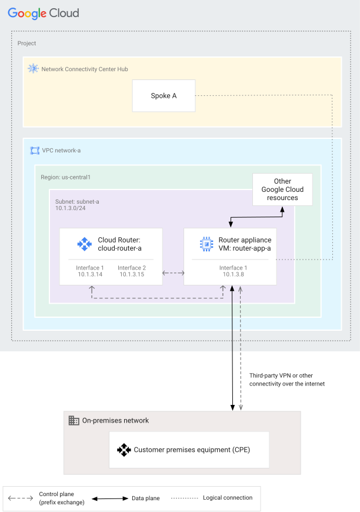
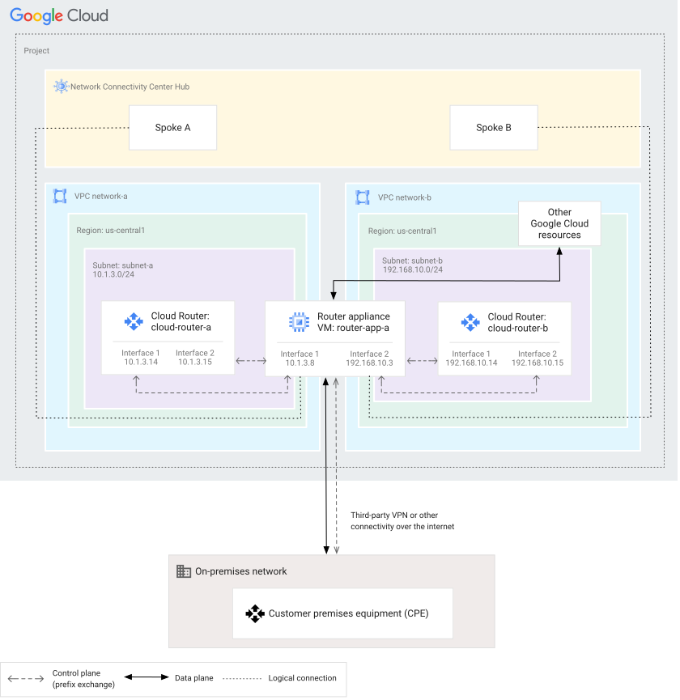

# Network Connectivity Center Module

This module allows the creation and management of an NCC-based hub-and-spoke architecture. It focuses in site-to-cloud connectivity with network virtual appliances (NVAs) as the _backing resource_ for spokes. This allows to connect an external network to Google Cloud by using a SD-WAN router or another appliance with BGP capabilities. It does not handle site-to-site data transfer which is not available in all regions, in particular in EMEA.

The module can manage a hub, multiple spokes, and corresponding Cloud Routers and BGP sessions to network virtual appliances. The NVAs themselves, VPCs, and other Google Cloud resources should be managed externally.

## Examples

### Connect a site to a VPC network

In this example a router appliance connects with a peer router in an on-premises network, and also peers with a Cloud Router.

<p align="center">  </p>

```hcl
module "vpc" {
  source     = "./fabric/modules/net-vpc"
  project_id = "my-project"
  name       = "network-a"
  subnets = [
    {
      name          = "subnet-a"
      ip_cidr_range = "10.1.3.0/24"
      region        = "us-central1"
    }
  ]
}

module "nva1" {
  source     = "./fabric/modules/compute-vm"
  project_id = "my-project"
  zone       = "us-central1-a"
  name       = "router-app-a"
  network_interfaces = [{
    network    = module.vpc.self_link
    subnetwork = module.vpc.subnet_self_links["us-central1/subnet-a"]
    addresses  = { external = null, internal = "10.1.3.8" }
  }]
  can_ip_forward = true
}

module "ncc" {
  source     = "./fabric/modules/net-ncc"
  asn        = 65000
  name       = "ncc-hub"
  project_id = "my-project"
  spokes = {
    spoke-a = {
      vpc        = module.vpc.name
      region     = "us-central1"
      subnetwork = module.vpc.subnet_self_links["us-central1/subnet-a"]
      nvas = [
        {
          vm = module.nva1.self_link
          ip = module.nva1.internal_ip
        }
      ]
      router = {
        ip1      = "10.1.3.14"
        ip2      = "10.1.3.15"
        peer_asn = 65001
      }
    }
  }
}
# tftest
```

### Connect a site to two VPC networks

In the following topology, a router appliance instance has interfaces in two VPC networks. Each interface has been used to create a Router appliance spoke.

<p align="center">  </p>

```hcl
module "vpc-a" {
  source     = "./fabric/modules/net-vpc"
  project_id = "my-project"
  name       = "network-a"
  subnets = [
    {
      name          = "subnet-a"
      ip_cidr_range = "10.1.3.0/24"
      region        = "us-central1"
    }
  ]
}

module "vpc-b" {
  source     = "./fabric/modules/net-vpc"
  project_id = "my-project"
  name       = "network-b"
  subnets = [
    {
      name          = "subnet-b"
      ip_cidr_range = "192.168.10.0/24"
      region        = "us-central1"
    }
  ]
}

module "nva1" {
  source     = "./fabric/modules/compute-vm"
  project_id = "my-project"
  zone       = "us-central1-a"
  name       = "router-app-a"
  network_interfaces = [
    {
      network    = module.vpc-a.self_link
      subnetwork = module.vpc-a.subnet_self_links["us-central1/subnet-a"]
      addresses  = { external = null, internal = "10.1.3.8" }
    },
    {
      network    = module.vpc-b.self_link
      subnetwork = module.vpc-b.subnet_self_links["us-central1/subnet-b"]
      addresses  = { external = null, internal = "192.168.10.3" }
    }
  ]
  can_ip_forward = true
}

module "ncc" {
  source     = "./fabric/modules/net-ncc"
  asn        = 65000
  name       = "ncc-hub"
  project_id = "my-project"
  spokes = {
    spoke-a = {
      vpc        = module.vpc-a.name
      region     = "us-central1"
      subnetwork = module.vpc-a.subnet_self_links["us-central1/subnet-a"]
      nvas = [
        {
          vm = module.nva1.self_link
          ip = module.nva1.internal_ips[0]
        }
      ]
      router = {
        ip1      = "10.1.3.14"
        ip2      = "10.1.3.15"
        peer_asn = 65001
      }
    },
    spoke-b = {
      vpc        = module.vpc-b.name
      region     = "us-central1"
      subnetwork = module.vpc-b.subnet_self_links["us-central1/subnet-b"]
      nvas = [
        {
          vm = module.nva1.self_link
          ip = module.nva1.internal_ips[1]
        }
      ]
      router = {
        ip1      = "192.168.10.14"
        ip2      = "192.168.10.15"
        peer_asn = 65001
      }
    }
  }
}
# tftest
```

### Use load-balanced router appliance instances

The following topology shows a site that uses load-balanced router appliance instances to connect to Google Cloud. Both router appliance instances are backing resources for the same spoke.

```hcl
module "vpc" {
  source     = "./fabric/modules/net-vpc"
  project_id = "my-project"
  name       = "network-a"
  subnets = [
    {
      name          = "subnet-a-1"
      ip_cidr_range = "10.0.1.0/24"
      region        = "us-west1"
    }
  ]
}

module "nva1" {
  source     = "./fabric/modules/compute-vm"
  project_id = "my-project"
  zone       = "us-west1-a"
  name       = "router-app-a"
  network_interfaces = [{
    network    = module.vpc.self_link
    subnetwork = module.vpc.subnet_self_links["us-west1/subnet-a-1"]
    addresses  = { external = null, internal = "10.0.1.10" }
  }]
  can_ip_forward = true
}

module "nva2" {
  source     = "./fabric/modules/compute-vm"
  project_id = "my-project"
  zone       = "us-west1-b"
  name       = "router-app-b"
  network_interfaces = [{
    network    = module.vpc.self_link
    subnetwork = module.vpc.subnet_self_links["us-west1/subnet-a-1"]
    addresses  = { external = null, internal = "10.0.1.11" }
  }]
  can_ip_forward = true
}

module "ncc" {
  source     = "./fabric/modules/net-ncc"
  asn        = 65000
  name       = "ncc-hub"
  project_id = "my-project"
  spokes = {
    spoke-a = {
      vpc        = module.vpc.name
      region     = "us-west1"
      subnetwork = module.vpc.subnet_self_links["us-west1/subnet-a-1"]
      nvas = [
        {
          vm = module.nva1.self_link
          ip = module.nva1.internal_ip
        },
        {
          vm = module.nva2.self_link
          ip = module.nva2.internal_ip
        }
      ]
      router = {
        ip1      = "10.0.1.5"
        ip2      = "10.0.1.6"
        peer_asn = 65001
      }
    }
  }
}
# tftest
```
