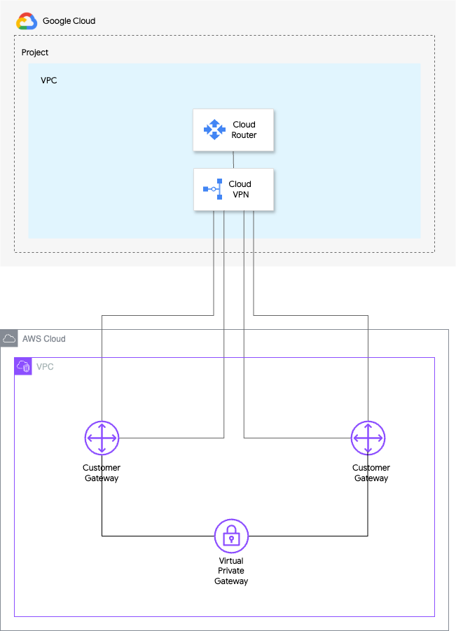

# HA VPN connections between Google Cloud and AWS

This recipe demonstrates how to create highly available VPN connections between Google Cloud and Amazon Web Services (AWS) for direct communication between VPC networks across the two cloud platforms using a Virtual Private Gateway in AWS. For more details on this architecture have a look [here](https://cloud.google.com/network-connectivity/docs/vpn/tutorials/create-ha-vpn-connections-google-cloud-aws)

The architecture deployed by this recipe is the one depicted below:


<!-- BEGIN TFDOC -->
## Variables

| name | description | type | required | default |
|---|---|:---:|:---:|:---:|
| [aws_asn](variables.tf#L27) | AWS ASN. | <code>string</code> | ✓ |  |
| [aws_region](variables.tf#L32) | AWS Region. | <code>string</code> | ✓ |  |
| [aws_vpc_cidr_block](variables.tf#L37) | CIDR block. | <code>string</code> | ✓ |  |
| [gcp_asn](variables.tf#L42) | Google ASN. | <code>string</code> | ✓ |  |
| [gcp_region](variables.tf#L47) | GCP Region. | <code>string</code> | ✓ |  |
| [project_id](variables.tf#L52) | Project ID. | <code>string</code> | ✓ |  |
| [shared_secret](variables.tf#L63) | Shared secret. | <code>string</code> | ✓ |  |
| [_testing](variables.tf#L17) | Populate this variable to avoid triggering the data source. | <code title="object&#40;&#123;&#10;  name             &#61; string&#10;  number           &#61; number&#10;  services_enabled &#61; optional&#40;list&#40;string&#41;, &#91;&#93;&#41;&#10;&#125;&#41;">object&#40;&#123;&#8230;&#125;&#41;</code> |  | <code>null</code> |
| [propagate_routes](variables.tf#L57) | Flag indicating whether routed received by AWS's Virtual Private Gateway should be propagated to main route table. | <code>bool</code> |  | <code>false</code> |

## Outputs

| name | description | sensitive |
|---|---|:---:|
| [external_gateway](outputs.tf#L17) | External VPN gateway resource. |  |
| [gateway](outputs.tf#L22) | VPN gateway resource (only if auto-created). |  |
| [id](outputs.tf#L27) | Fully qualified VPN gateway id. |  |
<!-- END TFDOC -->
## Test

```hcl
module "gcp_vpn" {
  source     = "./fabric/modules/net-vpn-ha/recipe-vpn-aws-gcp"
  project_id = "project-1"
  _testing = {
    name   = "project-1"
    number = 1234567890
  }
  aws_asn            = 65001
  gcp_asn            = 65534
  aws_region         = "us-east-1"
  gcp_region         = "us-east1"
  aws_vpc_cidr_block = "10.0.0.0/16"
  shared_secret      = "test123456"
}
# tftest modules=4 resources=36
