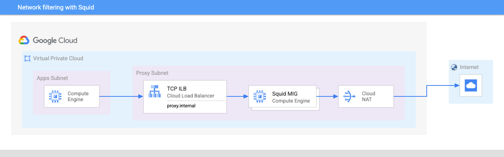

# Network filtering with Squid

This example shows how to deploy a filtering HTTP proxy to restrict Internet access. Here we show one way to do this using a VPC with two subnets:

- The `apps` subnet hosts the VMs that will have their Internet access tightly controlled by a non-caching filtering forward proxy.
- The `proxy` subnet hosts a Cloud NAT instance and a [Squid](http://www.squid-cache.org/) server.

The VPC is a Shared VPC and all the service projects will be located under a folder enforcing the `compute.vmExternalIpAccess` [organization policy](https://cloud.google.com/resource-manager/docs/organization-policy/org-policy-constraints). This prevents the service projects from having external IPs, thus forcing all outbound Internet connections through the proxy.

To allow Internet connectivity to the proxy subnet, a Cloud NAT instance is configured to allow usage from [that subnet only](https://cloud.google.com/nat/docs/using-nat#specify_subnet_ranges_for_nat). All other subnets are not allowed to use the Cloud NAT instance.

To simplify the usage of the proxy, a Cloud DNS private zone is created and the IP address of the proxy is exposed with the FQDN `proxy.internal`.

You can optionally deploy the Squid server as [Managed Instance Group](https://cloud.google.com/compute/docs/instance-groups) by setting the `mig` option to `true`. This option defaults to `false` which results in a standalone VM.

<!-- BEGIN TFDOC -->
## Variables

| name | description | type | required | default |
|---|---|:---: |:---:|:---:|
| billing_account | Billing account id used as default for new projects. | <code title="">string</code> | ✓ |  |
| prefix | Prefix used for resources that need unique names. | <code title="">string</code> | ✓ |  |
| root_node | Root node for the new hierarchy, either 'organizations/org_id' or 'folders/folder_id'. | <code title="">string</code> | ✓ |  |
| *allowed_domains* | List of domains allowed by the squid proxy. | <code title="list&#40;string&#41;">list(string)</code> |  | <code title="&#91;&#10;&#34;.google.com&#34;,&#10;&#34;.github.com&#34;&#10;&#93;">...</code> |
| *cidrs* | CIDR ranges for subnets | <code title="map&#40;string&#41;">map(string)</code> |  | <code title="&#123;&#10;apps  &#61; &#34;10.0.0.0&#47;24&#34;&#10;proxy &#61; &#34;10.0.1.0&#47;28&#34;&#10;&#125;">...</code> |
| *mig* | Enables the creation of an autoscaling managed instance group of squid instances. | <code title="">bool</code> |  | <code title="">false</code> |
| *nat_logging* | Enables Cloud NAT logging if not null, value is one of 'ERRORS_ONLY', 'TRANSLATIONS_ONLY', 'ALL'. | <code title="">string</code> |  | <code title="">ERRORS_ONLY</code> |
| *region* | Default region for resources | <code title="">string</code> |  | <code title="">europe-west1</code> |

## Outputs

| name | description | sensitive |
|---|---|:---:|
| squid-address | None |  |
<!-- END TFDOC -->
