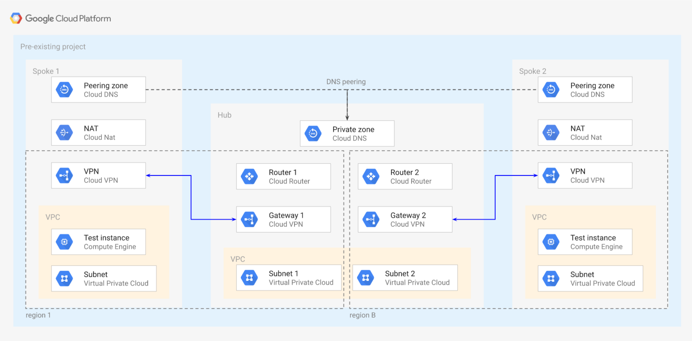

# Hub and Spoke via VPN

This example creates a simple **Hub and Spoke VPN** setup, where the VPC network connects satellite locations (spokes) through a single intermediary location (hub) via [IPsec VPN](https://cloud.google.com/vpn/docs/concepts/overview), optionally providing full-mesh networking via [custom route advertisements](https://cloud.google.com/router/docs/how-to/advertising-overview).

The example has been purposefully kept simple to show how to use and wire the VPC and VPN modules together, and so that it can be used as a basis for more complex scenarios. This is the high level diagram:



## Managed resources and services

This sample creates several distinct groups of resources:

- one VPC for each hub and each spoke
- one set of firewall rules for each VPC
- one VPN gateway, one tunnel and one Cloud Router for each spoke
- two VPN gateways, two tunnels and two Cloud Routers for the hub (one for each spoke)
- one DNS private zone in the hub
- one DNS peering zone in each spoke
- one Cloud NAT configuration for each spoke
- one test instance for each spoke

## Operational considerations

A single pre-existing project is used in this example to keep variables and complexity to a minimum, in a real world scenarios each spoke would probably use a separate project. The provided project needs a valid billing account and the Compute and DNS APIs enabled. You can easily create such a project  with the [project module](../../modules/project) or with the following commands:

``` shell
MY_PROJECT_ID="<desired project id>"
gcloud projects create $MY_PROJECT_ID
gcloud alpha billing projects link --billing-account=XXXXXX-XXXXXX-XXXXXX $MY_PROJECT_ID
gcloud services enable --project=$MY_PROJECT_ID {compute,dns}.googleapis.com
```

The example does not account for HA, but the VPN gateways can be easily upgraded to use HA VPN via the [net-vpn-ha module](../../modules/net-vpn-ha).

If a single router and VPN gateway are used in the hub to manage all tunnels, particular care must be taken in announcing ranges from hub to spokes, as Cloud Router does not explicitly support transitivity and overlapping routes received from both sides create unintended side effects. The simple workaround is to announce a single aggregated route from hub to spokes so that it does not overlap with any of the ranges advertised by each spoke to the hub.

<!-- BEGIN TFDOC -->
## Variables

| name | description | type | required | default |
|---|---|:---: |:---:|:---:|
| project_id | Project id for all resources. | <code title="">string</code> | ✓ |  |
| *bgp_asn* | BGP ASNs. | <code title="map&#40;number&#41;">map(number)</code> |  | <code title="&#123;&#10;hub     &#61; 64513&#10;spoke-1 &#61; 64514&#10;spoke-2 &#61; 64515&#10;&#125;">...</code> |
| *bgp_custom_advertisements* | BGP custom advertisement IP CIDR ranges. | <code title="map&#40;string&#41;">map(string)</code> |  | <code title="&#123;&#10;hub-to-spoke-1 &#61; &#34;10.0.32.0&#47;20&#34;&#10;hub-to-spoke-2 &#61; &#34;10.0.16.0&#47;20&#34;&#10;&#125;">...</code> |
| *bgp_interface_ranges* | BGP interface IP CIDR ranges. | <code title="map&#40;string&#41;">map(string)</code> |  | <code title="&#123;&#10;spoke-1 &#61; &#34;169.254.1.0&#47;30&#34;&#10;spoke-2 &#61; &#34;169.254.1.4&#47;30&#34;&#10;&#125;">...</code> |
| *ip_ranges* | IP CIDR ranges. | <code title="map&#40;string&#41;">map(string)</code> |  | <code title="&#123;&#10;hub-a     &#61; &#34;10.0.0.0&#47;24&#34;&#10;hub-b     &#61; &#34;10.0.8.0&#47;24&#34;&#10;spoke-1-a &#61; &#34;10.0.16.0&#47;24&#34;&#10;spoke-1-b &#61; &#34;10.0.24.0&#47;24&#34;&#10;spoke-2-a &#61; &#34;10.0.32.0&#47;24&#34;&#10;spoke-2-b &#61; &#34;10.0.40.0&#47;24&#34;&#10;&#125;">...</code> |
| *regions* | VPC regions. | <code title="map&#40;string&#41;">map(string)</code> |  | <code title="&#123;&#10;a &#61; &#34;europe-west1&#34;&#10;b &#61; &#34;europe-west2&#34;&#10;&#125;">...</code> |

## Outputs

| name | description | sensitive |
|---|---|:---:|
| vms | GCE VMs. |  |
<!-- END TFDOC -->
