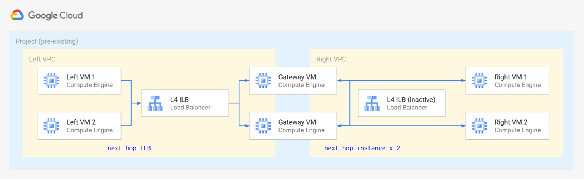

# Internal Load Balancer for Gateways

iftop -i ens4 -F 10.0.0.2/32

<!-- BEGIN TFDOC -->
## Variables

| name | description | type | required | default |
|---|---|:---: |:---:|:---:|
| billing_account_id | Billing account id used as default for new projects. | <code title="">string</code> | ✓ |  |
| prefix | Prefix used for resources that need unique names. | <code title="">string</code> | ✓ |  |
| root_node | Hierarchy node where projects will be created, 'organizations/org_id' or 'folders/folder_id'. | <code title="">string</code> | ✓ |  |
| *ip_ranges* | Subnet IP CIDR ranges. | <code title="map&#40;string&#41;">map(string)</code> |  | <code title="&#123;&#10;gce &#61; &#34;10.0.16.0&#47;24&#34;&#10;gke &#61; &#34;10.0.32.0&#47;24&#34;&#10;&#125;">...</code> |
| *ip_secondary_ranges* | Secondary IP CIDR ranges. | <code title="map&#40;string&#41;">map(string)</code> |  | <code title="&#123;&#10;gke-pods     &#61; &#34;10.128.0.0&#47;18&#34;&#10;gke-services &#61; &#34;172.16.0.0&#47;24&#34;&#10;&#125;">...</code> |
| *owners_gce* | GCE project owners, in IAM format. | <code title="list&#40;string&#41;">list(string)</code> |  | <code title="">[]</code> |
| *owners_gke* | GKE project owners, in IAM format. | <code title="list&#40;string&#41;">list(string)</code> |  | <code title="">[]</code> |
| *owners_host* | Host project owners, in IAM format. | <code title="list&#40;string&#41;">list(string)</code> |  | <code title="">[]</code> |
| *private_service_ranges* | Private service IP CIDR ranges. | <code title="map&#40;string&#41;">map(string)</code> |  | <code title="&#123;&#10;cluster-1 &#61; &#34;192.168.0.0&#47;28&#34;&#10;&#125;">...</code> |
| *project_services* | Service APIs enabled by default in new projects. | <code title="list&#40;string&#41;">list(string)</code> |  | <code title="&#91;&#10;&#34;container.googleapis.com&#34;,&#10;&#34;stackdriver.googleapis.com&#34;,&#10;&#93;">...</code> |
| *region* | Region used. | <code title="">string</code> |  | <code title="">europe-west1</code> |

## Outputs

| name | description | sensitive |
|---|---|:---:|
| gke_clusters | GKE clusters information. |  |
| projects | Project ids. |  |
| service_accounts | GCE and GKE service accounts. |  |
| vms | GCE VMs. |  |
| vpc | Shared VPC. |  |
<!-- END TFDOC -->
