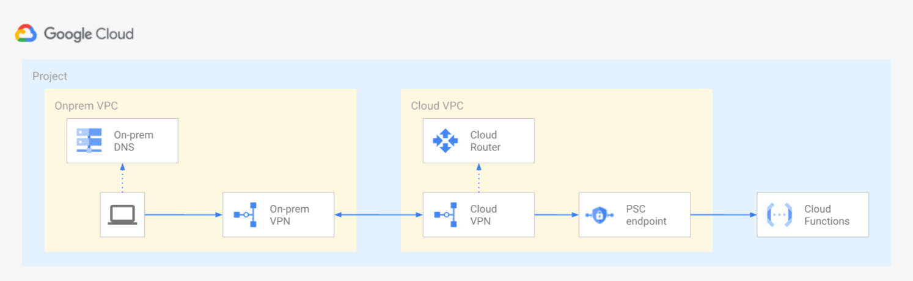

# Calling a private Cloud Function from On-premises

This example shows how to invoke a private Google Cloud Function from the on-prem environment via a Private Service Connect endpoint.

According to the [documentation](https://cloud.google.com/functions/docs/networking/network-settings#ingress_settings), only requests from VPC networks in the same project or VPC Service Controls perimeter are allowed to call a private Cloud Function. That's the reason why a Private Service Connect endpoint is needed in this architecture.

The Terraform script in this folder will create two projects connected via VPN: one to simulate the on-prem environment and another containing the Cloud Function and the Private Service Connect endpoint.

The "on-prem" project contains a small VM that can be used to test the accessibility to the private Cloud Function:

```bash
curl https://YOUR_REGION-YOUR_PROJECT_ID.cloudfunctions.net/my-hello-function
```



<!-- BEGIN TFDOC -->
## Variables

| name | description | type | required | default |
|---|---|:---: |:---:|:---:|
| billing_account_id | Billing account id used as default for new projects. | <code title="">string</code> | ✓ |  |
| cloud_function_gcs_bucket | Google Storage Bucket used as staging location for the Cloud Function source code. | <code title="">string</code> | ✓ |  |
| function_project_id | ID of the project that will contain the Cloud Function. | <code title="">string</code> | ✓ |  |
| onprem_project_id | None | <code title="">string</code> | ✓ |  |
| root_id | Root folder or organization under which the projects will be created. | <code title="">string</code> | ✓ |  |
| *create_projects* | Whether need to create the projects. | <code title="">bool</code> |  | <code title="">true</code> |
| *ip_ranges* | IP ranges used for the VPCs. | <code title="map&#40;string&#41;">map(string)</code> |  | <code title="&#123;&#10;onprem &#61; &#34;10.0.1.0&#47;24&#34;,&#10;hub &#61; &#34;10.0.2.0&#47;24&#34;&#10;&#125;">...</code> |
| *psc_endpoint* | IP used for the Private Service Connect endpoint, it must not overlap with the hub_ip_range. | <code title="">string</code> |  | <code title="">10.100.100.100</code> |
| *region* | Region where the resources will be created. | <code title="">string</code> |  | <code title="">europe-west1</code> |
| *zone* | Zone where the test VM will be created. | <code title="">string</code> |  | <code title="">europe-west1-b</code> |

## Outputs

| name | description | sensitive |
|---|---|:---:|
| function_url | URL of the Cloud Function. |  |
<!-- END TFDOC -->