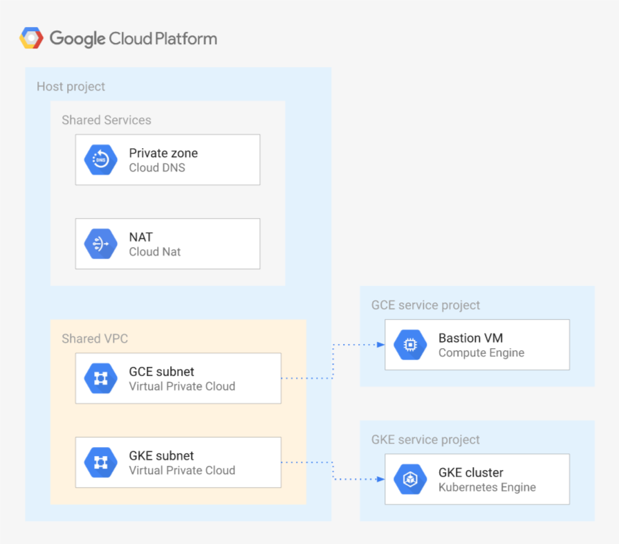

# Shared VPC with GKE example

This sample creates a basic [Shared VPC](https://cloud.google.com/vpc/docs/shared-vpc) setup using one host project and two service projects, each with a specific subnet in the shared VPC. The setup also includes the specific IAM-level configurations needed for [GKE on Shared VPC](https://cloud.google.com/kubernetes-engine/docs/how-to/cluster-shared-vpc) to enable cluster creation in one of the two service projects.

The sample has been purposefully kept simple so that it can be used as a basis for different Shared VPC configurations. This is the high level diagram:



## Applying the example

The example cannot be applied from scratch with a single `terraform apply` command, as Terraform is unable to manage Shared VPC project registration for multiple projects, before those are created and exist in state. To apply the example from scratch, follow this order:

```bash
tf apply \
  -target module.project-svc-gce \
  -target module.project-svc-gke
tf apply
```

Once the first command has run successfully, the service projects exist in state and can be referenced by the multiple resource in the host project module that manages project registration.

## Accessing the bastion instance and GKE cluster

The bastion VM has no public address so access is mediated via [IAP](https://cloud.google.com/iap/docs), which is supported transparently in the `gcloud compute ssh` command. Authentication is via OS Login set as a project default.

Cluster access from the bastion can leverage the instance service account's `container.developer` role: the only configuration needed is to fetch cluster credentials via `gcloud container clusters get-credentials` passing the correct cluster name, location and project via command options.

## Destroying

There's a minor glitch that can surface running `terraform destroy`, where the service project attachments to the Shared VPC will not get destroyed even with the relevant API call succeeding. We are investigating the issue, in the meantime just manually remove the attachment in the Cloud console or via the `gcloud beta compute shared-vpc associated-projects remove` command when `terraform destroy` fails, and then relaunch the command.

<!-- BEGIN TFDOC -->
## Variables

| name | description | type | required | default |
|---|---|:---: |:---:|:---:|
| billing_account_id | Billing account id used as default for new projects. | <code title="">string</code> | ✓ |  |
| prefix | Prefix used for resources that need unique names. | <code title="">string</code> | ✓ |  |
| root_node | Hierarchy node where projects will be created, 'organizations/org_id' or 'folders/folder_id'. | <code title="">string</code> | ✓ |  |
| *ip_ranges* | Subnet IP CIDR ranges. | <code title="map&#40;string&#41;">map(string)</code> |  | <code title="&#123;&#10;gce &#61; &#34;10.0.16.0&#47;24&#34;&#10;gke &#61; &#34;10.0.32.0&#47;24&#34;&#10;&#125;">...</code> |
| *ip_secondary_ranges* | Secondary IP CIDR ranges. | <code title="map&#40;string&#41;">map(string)</code> |  | <code title="&#123;&#10;gke-pods     &#61; &#34;10.128.0.0&#47;18&#34;&#10;gke-services &#61; &#34;172.16.0.0&#47;24&#34;&#10;&#125;">...</code> |
| *owners_gce* | GCE project owners, in IAM format. | <code title="list&#40;string&#41;">list(string)</code> |  | <code title="">[]</code> |
| *owners_gke* | GKE project owners, in IAM format. | <code title="list&#40;string&#41;">list(string)</code> |  | <code title="">[]</code> |
| *owners_host* | Host project owners, in IAM format. | <code title="list&#40;string&#41;">list(string)</code> |  | <code title="">[]</code> |
| *private_service_ranges* | Private service IP CIDR ranges. | <code title="map&#40;string&#41;">map(string)</code> |  | <code title="&#123;&#10;cluster-1 &#61; &#34;192.168.0.0&#47;28&#34;&#10;&#125;">...</code> |
| *project_services* | Service APIs enabled by default in new projects. | <code title="list&#40;string&#41;">list(string)</code> |  | <code title="&#91;&#10;&#34;container.googleapis.com&#34;,&#10;&#34;stackdriver.googleapis.com&#34;,&#10;&#93;">...</code> |
| *region* | Region used. | <code title="">string</code> |  | <code title="">europe-west1</code> |

## Outputs

| name | description | sensitive |
|---|---|:---:|
| gke_clusters | GKE clusters information. |  |
| projects | Project ids. |  |
| service_accounts | GCE and GKE service accounts. |  |
| vms | GCE VMs. |  |
| vpc | Shared VPC. |  |
<!-- END TFDOC -->
