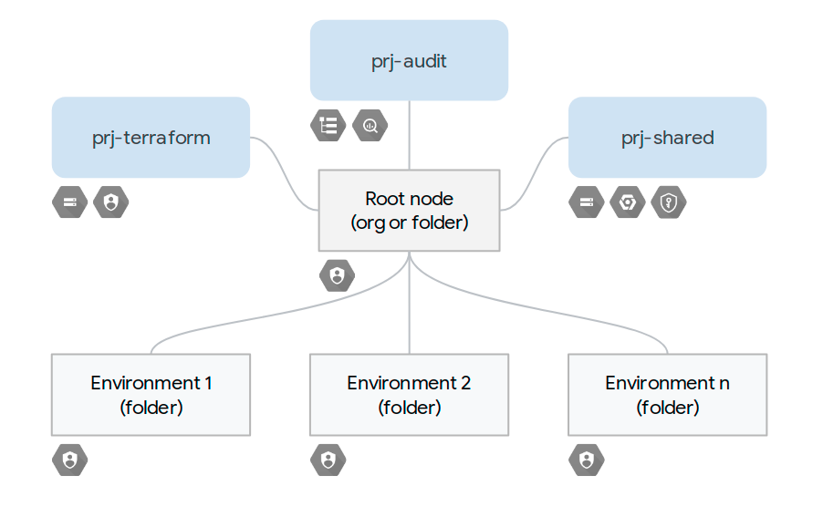

# Environment-based organizational sample

This sample creates an organizational layout with a single level, where each  folder is usually mapped to one infrastructure environment (test, dev, etc.). It also sets up all prerequisites for automation (GCS state buckets, service accounts, etc.), and sets up the correct roles on those to enforce separation of duties at the environment level.

This layout is well suited for small and medium-sized infrastructures, where a limited set of teams manages the underlying infrastructure, and the complexity in application resource ownership and access roles is mostly dealt with at the project level, and/or in the individual infrastructure services (GKE, Cloud SQL, etc.). Its simplicity also makes it a good starting point for more complex or specialized layouts.

This set of Terraform files is usually applied manually by an org-level administrator as a first step, and then reapplied only when a new environment needs to be created or an existing one removed, and serves different purposes:

- automating and parameterizing creation of the organizational layout
- automating creation of the base resources needed for Terraform automation, obviating the need for external scripts or hand-coded commands
- anticipating the requirement of organizational-level roles for specific resources (eg Shared VPC), by granting them to the service accounts used for environment automation
- enforcing separation of duties by using separate sets of automation resources (GCS, service accounts) for each environment, and only granting roles scoped to the environment's folder

## Managed resources and GCP services

This sample creates several distinct groups of resources:

- one folder per environment
- one top-level project to hold Terraform-related resources
- one top-level project to set up and host centralized audit log exports (optional)
- one top-level project to hold services used across environments like GCS, GCR, KMS, Cloud Build, etc. (optional)

The number of resources in this sample is kept to a minimum so as to make it generally applicable, more resources can be easily added by leveraging the full array of [Cloud Foundation Toolkit modules](https://github.com/terraform-google-modules), especially in the shared services project.

## Operational considerations

As mentioned above this root module is meant to be run infrequently, only when the number of environments change or a new service needs to be added to the shared project, so the advantages of automating it in a CI pipeline are very limited.

Regardless of how it's run, the credentials used need very specific roles on the root node, and some roles at the organization level if Shared VPC usage is anticipated in environments:

- Billing Account Administrator on the billing account or organization
- Folder Administrator
- Logging Administrator on the root folder or organization
- Project Creator
- Organization Administrator, if Shared VPC roles need to be granted

### Prerequisites

### State

### Gotchas

<!-- BEGINNING OF PRE-COMMIT-TERRAFORM DOCS HOOK -->
## Inputs

| Name | Description | Type | Default | Required |
|------|-------------|:----:|:-----:|:-----:|
| billing\_account\_id | Billing account id used as default for new projects. | string | n/a | yes |
| environments | Environment short names. | list(string) | n/a | yes |
| gcs\_location | GCS bucket location. | string | `"EU"` | no |
| generate\_service\_account\_keys | Generate and store service account keys in the state file. | string | `"false"` | no |
| organization\_id | Organization id. | string | n/a | yes |
| prefix | Prefix used for resources that need unique names. | string | n/a | yes |
| project\_services | Service APIs enabled by default in new projects. | list | `<list>` | no |
| root\_node | Root node for the new hierarchy, either 'organizations/org\_id' or 'folders/folder\_id'. | string | n/a | yes |
| terraform\_owners | Terraform project owners, in IAM format. | list | `<list>` | no |

## Outputs

| Name | Description |
|------|-------------|
| audit\_logs\_bq\_dataset | Bigquery dataset for the audit logs export. |
| audit\_logs\_project | Project that holds the audit logs export resources. |
| bootstrap\_tf\_gcs\_bucket | GCS bucket used for the bootstrap Terraform state. |
| environment\_folders | Top-level environment folders. |
| environment\_service\_account\_keys | Service account keys used to run each environment Terraform modules. |
| environment\_service\_accounts | Service accounts used to run each environment Terraform modules. |
| environment\_tf\_gcs\_buckets | GCS buckets used for each environment Terraform state. |
| shared\_resources\_project | Project that holdes resources shared across environments. |
| terraform\_project | Project that holds the base Terraform resources. |

<!-- END OF PRE-COMMIT-TERRAFORM DOCS HOOK -->
