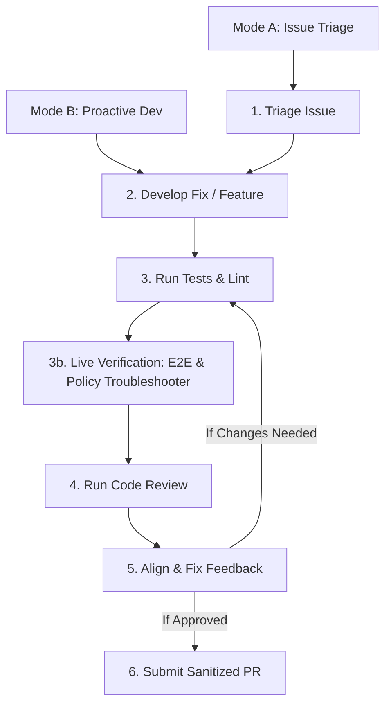

# CFF Contribution Flow Skill

This skill defines the end-to-end workflow for contributing to Cloud Foundation Fabric (CFF). It supports two entry modes:
- **Mode A: Issue Triage & Bug Fix**: You are addressing an assigned or reported GitHub Issue. Start at **Step 1**.
- **Mode B: Proactive Development & PR Prep**: You are actively building a feature, refactoring code, or preparing an existing branch for a Pull Request. Jump directly to **Step 2**.

---

## Step-by-Step Workflow



### Step 1: Triage the Issue (Mode A Only)

1.  **Retrieve Issue Details**: Use the GitHub CLI to view the issue context.
    ```bash
    gh issue view <issue-number>
    ```

2.  **Explore the Codebase**: Identify the target module (`modules/<module_name>`) or FAST stage (`fast/stages/<stage_name>`) that requires modification.

3.  **Evaluate Fit & Scope**: Assess whether the issue is relevant for Fabric. Ensure it aligns with CFF's core philosophy (modules should be lean, composable, and represent a single resource type context). Confirm the change has a sufficiently large scope and represents a generic, valuable addition to the module or FAST stage rather than a highly specific, one-off customization.

4.  **Read Provider Documentation**: If the issue involves Google Cloud resources, retrieve and read the latest version of the documentation for the involved GCP resources or Terraform provider resource/datasource to ensure accurate implementation of its attributes, behaviors, and constraints.
    > [!WARNING]
    > Do NOT rely solely on the proposed solution, examples, or partial specifications provided in the issue description. Always retrieve and review the complete documentation schema from the official provider registry.
    >
    > **Workaround for Registry Page JS/Redirection Errors**:
    > If the registry page fails to load properly with `read_url_content` (e.g. returns "Please enable Javascript" or truncates due to HTML formatting issues), find the source markdown file on GitHub and fetch its raw content using `curl` to a temporary file:
    > ```bash
    > curl -s https://raw.githubusercontent.com/hashicorp/terraform-provider-google/main/website/docs/r/workstations_workstation_config.html.markdown -o scratch/workstation_config_doc.md
    > ```
    > You can then search and view it locally to identify all supported arguments and blocks.
    > Use this information to make an informed decision on which arguments to support. While 100% coverage is not always necessary or desirable, make a deliberate choice to include all arguments that are useful and align with CFF's composability and simplicity goals, rather than missing them by omission.

### Step 2: Develop the Fix or Feature (Modes A & B)

1.  **Align with Fabric Zen**: Ensure the design focuses on composition, encapsulates logical entities (like IAM and log sinks directly inside modules), adopts common interfaces, and keeps code flat and easy to evolve.
    > [!IMPORTANT]
    > You MUST strictly follow the design principles and coding conventions defined in [CONTRIBUTING.md](../../CONTRIBUTING.md) and [GEMINI.md](../../GEMINI.md) when designing variables, modules, and factories.

2.  **Create a Git Branch**: Create a new git branch named after your username and the feature/fix (e.g., `<username>/<feature-name>`, such as `johndoe/feature-name`).
    ```bash
    git checkout -b <username>/<feature-name>
    ```

3.  **Apply CFF Design Conventions**:
    *   **Context Interpolation**: If context support is relevant and needed for the module (e.g., to support resolving symbolic references like `"$project_ids:myprj"`), add a `context` variable block and implement `ctx`/`ctx_p` locals in `main.tf`. Do not add it blindly if the module does not benefit from symbolic interpolation.
    *   **Compact Variables**: Leverage objects with `optional()` attributes and default values to keep user interfaces clean.
    *   **Stable State Keys**: Always use maps instead of lists for collection variables to avoid index shifts in Terraform state.
    *   **Scope Isolation**: Use private locals (prefixed with `_`) for intermediate transformations, reserving module-level locals for values referenced by resources.
    *   **Locals Separation for Complex Manipulations**: When adding complex conditional strings, string interpolations, or transformations to resource attributes, compute the map in `locals` so the resource block references a clean index like `local.my_map[each.key]`. This keeps resource blocks legible (<79 chars) and avoids cluttering resource definitions.
    *   **Validate ENUM Variables**: When adding or exposing variables that mirror ENUM values in the underlying Terraform provider, always include a `validation` block to check for allowed values at plan time. Example from `modules/gcs`:
        ```hcl
        variable "storage_class" {
          description = "Bucket storage class."
          type        = string
          default     = "STANDARD"
          validation {
            condition     = contains(["STANDARD", "MULTI_REGIONAL", "REGIONAL", "NEARLINE", "COLDLINE", "ARCHIVE"], var.storage_class)
            error_message = "Storage class must be one of STANDARD, MULTI_REGIONAL, REGIONAL, NEARLINE, COLDLINE, ARCHIVE."
          }
        }
        ```

4.  **Reference Implementations ("Golden Paths")**:
    *   [compute-vm](../../modules/compute-vm): Ideal reference for compact variable design, optional objects with defaults, and map variables.
    *   [project](../../modules/project): Best reference for logical entity encapsulation (IAM, log sinks, Shared VPC configurations), complex locals transformation, and context-based interpolation.

5.  **Maintain Code Consistency**:
    *   Always keep variables in `variables.tf` and outputs in `outputs.tf` in strict alphabetical order.
    *   Limit line length to 79 characters (relaxed for long attribute names and descriptions).
    *   **JSON Schema & Factory Alignment**: When a change is made to a module that implements a factory (e.g., `cloud-workstations`) or is the base for one (e.g., `net-vpc-factory` to `2-networking`), the schemas MUST be updated (including their `.schema.md` documentation files), and the factory code should be updated to mirror the changed variable surface. Ensure you regenerate the schema documentation by running:
        ```bash
        .venv/bin/python3 tools/schema_docs.py
        ```

6.  **Update or Add Tests**:
    *   For modules: If the change introduces a new feature or configuration option, update an existing example in the module's `README.md` (or add a new one) to demonstrate its usage. Ensure the example includes `# tftest` parameters and update the corresponding inventory YAML files under `tests/modules/<module_name>/examples/`.
    *   For FAST stages: Update `tftest.yaml` scenarios and tfvars/yaml inventories under `tests/fast/...`.

### Step 3: Run Tests, Linting & Inventory Regeneration (Modes A & B)

Before running tests, ensure the virtual environment is active (`source .venv/bin/activate`). Do not run `pip install` on every test run unless dependencies are missing. For faster Terraform testing, always set `TF_PLUGIN_CACHE_DIR=/tmp/tfcache`.

1.  **Run Unified Linting**: Execute `./tools/lint.sh` to check copyright boilerplates, Terraform format (`terraform fmt`), alphabetical sorting, and schema validations:
    ```bash
    source .venv/bin/activate
    ./tools/lint.sh
    ```

2.  **Update Documentation**: If you changed variables or outputs, check consistency and regenerate the README documentation tables:
    ```bash
    source .venv/bin/activate
    python3 tools/check_documentation.py modules/<module-name>
    python3 tools/tfdoc.py --replace modules/<module-name>
    ```

3.  **Run Impacted Tests**: Execute `pytest` on the target module/stage (using the plugin cache directory for speed):
    ```bash
    source .venv/bin/activate
    mkdir -p /tmp/tfcache
    TF_PLUGIN_CACHE_DIR=/tmp/tfcache pytest tests/modules/<module-name>
    ```

4.  **Regenerate Test Inventories**: If module-level tests (`tftest.yaml`) or README example inventories fail due to intentional plan output changes, regenerate them automatically using `generate_plan_summary.py` (ensure you activate `.venv` first):
    ```bash
    # For module-level tftest.yaml inventories:
    source .venv/bin/activate
    python3 tools/generate_plan_summary.py tests/modules/<module-name>/tftest.yaml <test-name> --save

    # For README.md example inventories:
    source .venv/bin/activate
    python3 tools/generate_plan_summary.py modules/<module-name>/README.md "<Example Heading>" --save
    ```

### Step 3b: Live Verification — E2E Sandbox & Policy Troubleshooter (Modes A & B — Optional / Recommended)

When code modifications affect GCP resource structures or APIs, run a live E2E sandbox deployment test:

1.  **Request a Sandbox Project**: Ask the user to specify a GCP project ID (and if applicable, parent folder / billing account details) for performing E2E sandbox testing.

2.  **Create Sandbox Directory**: Create a temporary sandbox folder under `scratch/e2e_sandbox/`.

3.  **Generate Test Configuration**:
    *   Generate a root Terraform module `main.tf` in the sandbox directory.
    *   **CRITICAL**: The `source` argument of the module call MUST point to the **local path** of the modified module in the repository (e.g. `source = "../../modules/<module-name>"`), NOT the GitHub reference, to ensure your local changes are tested.
    *   Set up necessary providers and variables.

4.  **Deploy and Verify**:
    *   Run `terraform init` and `terraform apply -auto-approve` in the sandbox folder.
    *   Confirm that all resources are created successfully.

5.  **Verify IAM Conditions via Policy Troubleshooter**:
    *   When modifying IAM conditional bindings or policies, use Google Cloud's official IAM Policy Troubleshooter (`gcloud policy-troubleshoot iam`) to verify runtime evaluation against live target resources.
    *   **CRITICAL**: GCP IAM runtime evaluates `resource.name` using numeric Project Numbers. Always test conditions against `--resource-name` with the numeric Project Number:
        ```bash
        gcloud policy-troubleshoot iam //logging.googleapis.com/projects/<PROJECT_NUMBER>/locations/global/buckets/<BUCKET> \
          --permission=logging.buckets.write \
          --principal-email=<TEST_PRINCIPAL_EMAIL> \
          --resource-name=projects/<PROJECT_NUMBER>/locations/global/buckets/<BUCKET> \
          --format="json(access,explainedPolicies[].bindingExplanations)"
        ```

6.  **Destroy Resources**:
    *   Once verified, run `terraform destroy -auto-approve` to tear down all created resources and avoid ongoing cloud costs.
    *   Delete the sandbox directory.

### Step 4: Perform Code Review (Modes A & B)

Perform an automated code review on your changes (`git diff HEAD` for local changes or `git diff --staged`):

1.  **Analyze the Diff**: Evaluate the diff strictly against repository guidelines (`GEMINI.md` and `CONTRIBUTING.md`). Check for:
    *   Naming conventions.
    *   Missing context support (`ctx` variables).
    *   Incorrect IAM patterns.
    *   Missing or incorrect tests (`tftest` examples).
    *   **CRITICAL TESTING RULE**: If resource blocks are modified (adding a new argument or modifying an existing one), the resulting Terraform plan output will change. You MUST verify that the corresponding test inventory YAML files (`tests/.../*.yaml`) are updated in the diff to reflect this new plan output. If they are not updated, flag this as a critical testing failure.
    *   Consistency with JSON schemas (for factories).

2.  **Format the Output**: Present the review in the chat using the following Markdown table structure:
    ```markdown
    ### Automated PR Review 🤖

    [A short introductory paragraph summarizing the overall impression of the changes.]

    ### Review Summary

    | Category | Status | Comment |
    | :--- | :--- | :--- |
    | Architecture & Conventions | [✅ Good / ⚠️ Needs improvement] | [Brief comment] |
    | Code Quality & Style | [✅ Good / ⚠️ Needs improvement] | [Brief comment] |
    | Testing | [✅ Good / ⚠️ Needs improvement] | [Brief comment] |
    | Documentation | [✅ Good / ⚠️ Needs improvement] | [Brief comment] |

    --------

    ### ❗ Critical Issues
    [List any critical guideline violations with specific file names, line numbers, and proposed diff fixes. Omit if none.]

    --------

    ### 💡 Suggestions
    [List minor improvements or refactoring ideas. Omit if none.]
    ```

3.  **Address Feedback**: Address any critical issues or suggestions raised by the review before proceeding.

### Step 5: Submit the PR (After User Approval) (Modes A & B)

1.  **Format the PR Title**: Do NOT use Conventional Commits format (no `feat:` or `fix:` prefixes). Use a short, capitalized, imperative title (e.g., "Add native tag bindings support to `modules/net-firewall-policy`").

2.  **Write the PR Body**:
    *   Explain the problem, rationale, and the fix clearly.
    *   **Document Verification & E2E Testing Methodology**: Detail any local unit tests, live E2E sandbox deployments, or Policy Troubleshooter API verifications performed so reviewers can see the exact testing rationale and methodology.
    *   **CRITICAL PII SANITIZATION**: Before writing the PR description, **MUST scrub all developer PII** (real GCP project IDs, numeric project numbers, personal email addresses, usernames, and custom bucket/resource names) and replace them with generic placeholders (e.g., `my-project`, `123456789012`, `user:tester@example.com`, `test-bucket`).
    *   **CRITICAL PITFALL**: Do NOT write the body directly to the CLI command via inline strings if it contains backticks (e.g. `gh pr create --body "Fixes `bug`"`) as the shell will evaluate backticks, corrupting the description.
    *   **Instead, write the body to a temporary file first and read it**:
        ```bash
        # Write body to temp file
        cat << 'EOF' > /tmp/pr-body.txt
        Fixes #<issue-number>.

        ### Problem & Rationale
        [Explain why this fix is needed and how it works, using backticks normally]

        ### Verification & E2E Testing Methodology
        [Detail local test results, live E2E sandbox deployments, and Policy Troubleshooter verification]
        EOF

        # Create PR using the body file
        gh pr create --title "Your PR Title" --body-file /tmp/pr-body.txt
        ```
