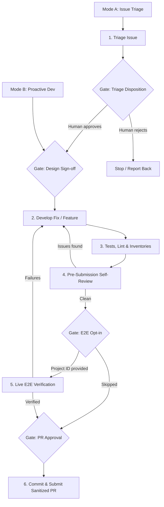

# Fabric Contribution Flow Skill

This skill defines the end-to-end workflow for contributing to Cloud Foundation Fabric. It supports two entry modes:
- **Mode A: Issue Triage & Bug Fix**: You are addressing an assigned or reported GitHub Issue. Start at **Step 1**.
- **Mode B: Proactive Development & PR Prep**: You are actively building a feature, refactoring code, or preparing an existing branch for a Pull Request. Jump directly to the **Design Sign-off Gate** before Step 2.

If it is unclear which mode applies, ask the user before proceeding.

## Human-in-the-Loop Gates

Gate on steps that are hard to reverse, costly, or where your judgment is likely to diverge from a maintainer's. Keep mechanical, reversible steps (linting, tests, doc and inventory regeneration) autonomous. Gates are **blocking**: if you are running non-interactively and cannot get an answer, stop — never assume approval.

| Gate | When | What the human decides |
| :--- | :--- | :--- |
| **Triage Disposition** | End of Step 1 (Mode A) | Whether the issue is in scope and worth pursuing: proceed, reject, or escalate. |
| **Design Sign-off** | Before Step 2 | Approves the proposed design and scope. Mandatory for new features and interface changes; skippable for trivial fixes where the design is self-evident. |
| **E2E Opt-in** | Step 5 | Whether to run live cloud verification. Providing a sandbox project ID **is** the consent to deploy to it. |
| **Behavioral Verification Opt-in** | Step 5, after read-back verification | Whether to also verify runtime behavior of the deployed resources, given the described extra time and cost. |
| **PR Approval** | Step 6 | Reviews the final sanitized PR body before submission. |

---

## Step-by-Step Workflow



### Step 1: Triage the Issue (Mode A Only)

1.  **Retrieve Issue Details**: Use the GitHub CLI to view the issue context.
    ```bash
    gh issue view <issue-number>
    ```

2.  **Explore the Codebase**: Identify the target module (`modules/<module-name>`) or FAST stage (`fast/stages/<stage-name>`) that requires modification.

3.  **Evaluate Fit & Scope**: Assess whether the issue is relevant for Fabric. Ensure it aligns with Fabric's core philosophy (modules should be lean, composable, and represent a single resource type context). Confirm the change has a sufficiently large scope and represents a generic, valuable addition to the module or FAST stage rather than a highly specific, one-off customization.

4.  **Read Provider Documentation**: If the issue involves Google Cloud resources, retrieve and read the documentation for the involved GCP resources or Terraform provider resource/datasource to ensure accurate implementation of its attributes, behaviors, and constraints.
    *   Start from the provider registry, e.g. <https://registry.terraform.io/providers/hashicorp/google/latest/docs/resources/compute_address>.
    *   **Check the pinned provider range**: the repo pins the `google` provider in [default-versions.tf](../../default-versions.tf). If the feature you are implementing requires provider functionality released after the pinned minimum version, that is a good reason to bump the pin — do it across the board with `uv run tools/versions.py --provider-min-version <x.y.z> --write-defaults`, which rewrites `default-versions.tf` and propagates it to every module and stage `versions.tf` (linting enforces they stay in sync). Never edit version pins in individual modules only.
    *   Only rely on documentation for functionality available in a **released** provider version: docs from the provider's `main` branch may describe unreleased attributes that no released provider accepts at plan time.
    > [!WARNING]
    > Do NOT rely solely on the proposed solution, examples, or partial specifications provided in the issue description. Always retrieve and review the complete documentation schema from the official provider registry.
    >
    > **Workaround for Registry Page JS/Redirection Errors**:
    > If the registry page fails to load properly with your URL-fetching tool (e.g. returns "Please enable Javascript" or truncates due to HTML formatting issues), find the source markdown file on GitHub and fetch its raw content using `curl` to a scratch file (the `scratch/` directory is gitignored), using the tag of the provider release whose docs you need (e.g. `v7.40.0`):
    > ```bash
    > curl -s https://raw.githubusercontent.com/hashicorp/terraform-provider-google/v7.40.0/website/docs/r/workstations_workstation_config.html.markdown -o scratch/workstation_config_doc.md
    > ```
    > You can then search and view it locally to identify all supported arguments and blocks.
    > Use this information to make an informed decision on which arguments to support. While 100% coverage is not always necessary or desirable, make a deliberate choice to include all arguments that are useful and align with Fabric's composability and simplicity goals, rather than missing them by omission.

5.  **Gate — Triage Disposition**: Present your assessment (target module/stage, fit with Fabric's philosophy, scope evaluation) and let the human decide whether to proceed. If the issue fails the fit test, report your reasoning and stop — do NOT comment on, label, or close the issue yourself; disposition of the issue is a maintainer decision.

### Gate: Design Sign-off (Modes A & B)

Before writing code, present the proposed design for approval:
*   The target module(s)/stage(s) and the shape of the variable interface (new/changed variables, whether `context` support is added).
*   For provider-surface changes: the explicit list of provider arguments you intend to include and exclude, with reasoning.
*   Whether the change requires bumping the pinned provider version (a repo-wide change — see Step 1.4).

This gate is **mandatory for new features and interface changes**. For trivial fixes (typos, one-line bugfixes with an obvious solution) where the design is self-evident, state your intent and proceed without blocking.

### Step 2: Develop the Fix or Feature (Modes A & B)

1.  **Align with Fabric Zen**: Ensure the design focuses on composition, encapsulates logical entities (like IAM and log sinks directly inside modules), adopts common interfaces, and keeps code flat and easy to evolve.
    > [!IMPORTANT]
    > You MUST strictly follow the design principles and coding conventions defined in [CONTRIBUTING.md](../../CONTRIBUTING.md) and [GEMINI.md](../../GEMINI.md) when designing variables, modules, and factories.

2.  **Set Up the Git Branch**:
    *   If you are not already on a feature branch, create one named after your username and the feature/fix (e.g., `<username>/<feature-name>`, such as `johndoe/feature-name`):
        ```bash
        git checkout master && git pull
        git checkout -b <username>/<feature-name>
        ```
    *   If preparing an existing branch (Mode B), do NOT create a new one; instead make sure it is up to date with `master` (rebase or merge) before submission.
    *   Direct branches require push access to the repo (granted to regular contributors on request). Without it, use the fork-based flow described in [CONTRIBUTING.md](../../CONTRIBUTING.md); the rest of this workflow is identical.

3.  **Apply Fabric/FAST Design Conventions**:
    *   **Context Interpolation**: If context support is relevant and needed for the module (e.g., to support resolving symbolic references like `"$project_ids:myprj"`), add a `context` variable block and implement `ctx`/`ctx_p` locals in `main.tf`. Do not add it blindly if the module does not benefit from symbolic interpolation.
    *   **Compact Variables**: Leverage objects with `optional()` attributes to keep user interfaces clean. Prefer `optional()` **without** an explicit default so the provider applies whatever default value it defines; only set a default when module logic needs a known value.
    *   **Stable State Keys**: Always use maps instead of lists for collection variables to avoid index shifts in Terraform state.
    *   **Scope Isolation**: Use private locals (prefixed with `_`) for intermediate transformations, reserving module-level locals for values referenced by resources.
    *   **Locals Separation for Complex Manipulations**: When adding complex conditional strings, string interpolations, or transformations to resource attributes, compute the map in `locals` so the resource block references a clean index like `local.my_map[each.key]`. This keeps resource blocks legible (<79 chars) and avoids cluttering resource definitions.
    *   **Validate ENUM Variables**: When adding or exposing variables that mirror ENUM values in the underlying Terraform provider, always include a `validation` block to check for allowed values at plan time. Example from `modules/gcs`:
        ```hcl
        variable "storage_class" {
          description = "Bucket storage class."
          type        = string
          default     = "STANDARD"
          validation {
            condition     = contains(["STANDARD", "MULTI_REGIONAL", "REGIONAL", "NEARLINE", "COLDLINE", "ARCHIVE"], var.storage_class)
            error_message = "Storage class must be one of STANDARD, MULTI_REGIONAL, REGIONAL, NEARLINE, COLDLINE, ARCHIVE."
          }
        }
        ```

4.  **Reference Implementations & Knowledge Sources**:
    *   [compute-vm](../../modules/compute-vm): Ideal reference for compact variable design, optional objects with defaults, and map variables.
    *   [project](../../modules/project): Best reference for logical entity encapsulation (IAM, log sinks, Shared VPC configurations), complex locals transformation, and context-based interpolation.
    *   [adrs/](../../adrs/): Architectural Decision Records documenting the rationale behind key design patterns (e.g. the IAM ADR explains the full `iam*` interface). Before designing, build an index of all ADRs with their title and status:
        ```bash
        find adrs -name '*.md' ! -name 'README.md' | sort | while read -r f; do
          st=$(awk '/^## Status/ {getline; while ($0 == "") getline; print; exit}' "$f")
          printf '%s | %s | %s\n' "$f" "$(head -1 "$f" | sed 's/^# //')" "$st"
        done
        ```
        Read in full any ADR whose title relates to the area you are changing. Weigh them by status: ignore `Rejected` ones, treat `Draft`/`Proposed` as directional rather than settled, and remember that even implemented ADRs can lag behind the code — on conflict, the current code and golden-path modules are the source of truth.

5.  **Maintain Code Consistency**:
    *   Always keep variables in `variables.tf` and outputs in `outputs.tf` in strict alphabetical order. For larger modules, variables and outputs can be grouped logically into separate files (e.g. `variables-logging.tf`), each internally alphabetically sorted.
    *   Limit line length to 79 characters (relaxed for long attribute names and descriptions).
    *   **JSON Schema & Factory Alignment**: When a change is made to a module that implements a factory (e.g., `cloud-workstations`) or is the base for one (e.g., `net-vpc-factory` to `2-networking`), the schemas MUST be updated (including their `.schema.md` documentation files), and the factory code should be updated to mirror the changed variable surface. Ensure you regenerate the schema documentation by running:
        ```bash
        uv run tools/schema_docs.py
        ```
    *   **Duplicated Files**: Some files (e.g. schemas, factory test fixtures) are intentionally duplicated across modules and stages, and CI enforces that copies stay identical. When changing such a file, sync all its copies; the duplicate groups are listed in [tools/duplicate-diff.py](../../tools/duplicate-diff.py) — update that list when adding new duplicated files.

6.  **Update or Add Tests**:
    *   For modules: If the change introduces a new feature or configuration option, update an existing example in the module's `README.md` (or add a new one) to demonstrate its usage. Ensure the example includes `# tftest` parameters and update the corresponding inventory YAML files under `tests/modules/<module_name>/examples/`.
    *   For FAST stages: Update `tftest.yaml` scenarios and tfvars/yaml inventories under `tests/fast/...`.
    > [!NOTE]
    > Module directories use hyphens (`modules/net-vpn-ha`) while test directories generally use underscores (`tests/modules/net_vpn_ha`). Always check the actual test directory name — a mistyped path makes `pytest` silently collect zero tests.

### Step 3: Run Tests, Linting & Inventory Regeneration (Modes A & B)

Run Python tooling through `uv run` — the scripts in `tools/` declare their dependencies inline, so no virtual environment setup is needed. For faster Terraform testing, always set `TF_PLUGIN_CACHE_DIR=/tmp/tfcache`.

1.  **Run Unified Linting**: Execute `tools/lint.sh` to check copyright boilerplates, Terraform format (`terraform fmt`), alphabetical sorting, and schema validations:
    ```bash
    uv run --with-requirements tools/requirements.txt tools/lint.sh
    ```

2.  **Update Documentation**: If you changed variables or outputs, check consistency and regenerate the README documentation tables:
    ```bash
    uv run tools/check_documentation.py modules/<module-name>
    uv run tools/tfdoc.py --replace modules/<module-name>
    ```

3.  **Run Impacted Tests**: Execute `pytest` on the target module/stage (using the plugin cache directory for speed):
    ```bash
    mkdir -p /tmp/tfcache
    # tftest.yaml scenarios (note: underscores in the test directory name)
    TF_PLUGIN_CACHE_DIR=/tmp/tfcache uv run --with-requirements tests/requirements.txt pytest tests/modules/<module_name>
    # README example tests
    TF_PLUGIN_CACHE_DIR=/tmp/tfcache uv run --with-requirements tests/requirements.txt pytest -k 'modules and <module-name>:' tests/examples
    ```

4.  **Regenerate Test Inventories**: If module-level tests (`tftest.yaml`) or README example inventories fail due to intentional plan output changes, regenerate them using `generate_plan_summary.py`:
    ```bash
    # For module-level tftest.yaml inventories:
    uv run tools/generate_plan_summary.py tests/modules/<module_name>/tftest.yaml <test-name> --save

    # For README.md example inventories:
    uv run tools/generate_plan_summary.py modules/<module-name>/README.md "<Example Heading>" --save
    ```
    > [!CAUTION]
    > `--save` overwrites the assertion baseline, so a regenerated inventory makes the test pass **by construction**. After regenerating, diff the inventory against the previous version (`git diff tests/`), verify that every changed line maps to the intended feature or fix, and report the inventory diff to the user. If a changed line is not explained by your change, treat it as a bug in your code, not a baseline to save.

### Step 4: Pre-Submission Self-Review (Modes A & B)

Review your own diff (`git diff HEAD`, or `git diff master...HEAD` for an existing branch) against the repository guidelines (`GEMINI.md`, `CONTRIBUTING.md`) before submission. This is a pre-flight self-check; the canonical automated review runs in CI after the PR is opened (`Automated PR Review` workflow) — do NOT imitate its output format or header.

Check the diff against this checklist:

*   [ ] Naming conventions respected (variables, outputs, resources).
*   [ ] Context support (`ctx` variables) present where the module warrants it.
*   [ ] IAM follows the standard `iam*` interface patterns.
*   [ ] Examples with `# tftest` parameters cover the new/changed behavior.
*   [ ] **CRITICAL TESTING RULE**: if resource blocks were modified (adding a new argument or modifying an existing one), the Terraform plan output changes — the corresponding test inventory YAML files (`tests/.../*.yaml`) MUST be updated in the diff. If they are not, this is a critical testing failure.
*   [ ] JSON schemas and factory code consistent with the changed variable surface.
*   [ ] Documentation tables regenerated (`tfdoc`), alphabetical order preserved.
*   [ ] **Breaking Changes**: If any variable or YAML interface changed in a backwards-incompatible way, verify the PR description draft includes the `**Breaking Changes**` / `upgrade-note` block.

Report the outcome as a short plain-text list of issues found (or "no issues found") under a `Pre-submission self-review` heading — no emojis, no status tables. Fix any issue and loop back to Step 3 until the checklist passes.

### Step 5: Live Verification — E2E Sandbox & Policy Troubleshooter (Modes A & B — Optional / Recommended)

When code modifications affect GCP resource structures or APIs, run a live E2E sandbox deployment test. Run it only once the diff is stable (tests and self-review pass) to avoid repeated cloud deployments.

1.  **Gate — E2E Opt-in**: Ask the user for a GCP project ID (and if applicable, parent folder / billing account details) for E2E sandbox testing, stating explicitly that providing the project ID authorizes you to deploy and destroy resources in it with `-auto-approve`. If no project is provided, skip this step entirely.

2.  **Verify Credentials**: Confirm `gcloud` authentication and Application Default Credentials are available (`gcloud auth list`) before attempting any deployment, and surface a clear error rather than failing mid-apply.

3.  **Create Sandbox Directory**: Create a temporary sandbox folder under `scratch/e2e_sandbox/` (the `scratch/` directory is gitignored).

4.  **Generate Test Configuration**:
    *   Generate a root Terraform module `main.tf` in the sandbox directory.
    *   **CRITICAL**: The `source` argument of the module call MUST point to the **local path** of the modified module in the repository (e.g. `source = "../../modules/<module-name>"`), NOT the GitHub reference, to ensure your local changes are tested.
    *   Set up necessary providers and variables.

5.  **Deploy**:
    *   Run `terraform init` and `terraform apply -auto-approve` in the sandbox folder.
    *   Confirm that all resources are created successfully. A clean apply is the baseline, not the goal: it only proves the API accepted the request, not that the change behaves as intended.

6.  **Read-Back Verification (required)**:
    *   Verify the deployed state through the service's read API (e.g. `gcloud compute backend-services describe`, or the equivalent `GET`/`describe` surface for the resource), not just the Terraform state or plan output.
    *   For every field or block touched by the change, confirm the live resource contains the intended value and structure (e.g. one API list entry per input element, correct nesting, no silently dropped attributes).

7.  **Behavioral Verification (optional — Gate)**:
    *   **Gate — Behavioral Verification Opt-in**: after read-back verification passes, explicitly ask the user whether to also verify runtime behavior, describing what the check would entail for this specific change (resources involved, expected extra time such as propagation delays, any additional cost). Proceed only on explicit approval; skipping is a valid outcome and must be recorded in the PR body.
    *   Verify the change behaves as expected from the perspective of a consumer of the deployed infrastructure. Examples:
        *   Compute instances: connect to the instance (SSH/serial) and check it is reachable and its startup configuration behaves as expected.
        *   Networking, load balancers, DNS: send traffic through the deployed path and verify routing, reachability, and response attributes (e.g. `curl` through a load balancer and inspect status and headers, resolve records, test connectivity across peerings or VPN tunnels).
        *   Serverless and workloads (Cloud Run, Cloud Functions, GKE): invoke the deployed service and verify the response.
        *   Data services (GCS, BigQuery, Pub/Sub): perform a representative read/write operation (upload an object, run a query, publish and pull a message).
    *   Account for propagation delays (load balancers, CDN, IAM can take several minutes); retry before concluding failure.
    *   **IAM conditional bindings**: use Google Cloud's official IAM Policy Troubleshooter as the behavioral check (`gcloud policy-troubleshoot iam`) to verify runtime evaluation against live target resources.
    *   **CRITICAL**: GCP IAM runtime evaluates `resource.name` using numeric Project Numbers. Always test conditions against `--resource-name` with the numeric Project Number:
        ```bash
        gcloud policy-troubleshoot iam //logging.googleapis.com/projects/<PROJECT_NUMBER>/locations/global/buckets/<BUCKET> \
          --permission=logging.buckets.write \
          --principal-email=<TEST_PRINCIPAL_EMAIL> \
          --resource-name=projects/<PROJECT_NUMBER>/locations/global/buckets/<BUCKET> \
          --format="json(access,explainedPolicies[].bindingExplanations)"
        ```

8.  **Destroy Resources**:
    *   Once verified, run `terraform destroy -auto-approve` to tear down all created resources and avoid ongoing cloud costs.
    *   Delete the sandbox directory.
    *   If verification surfaced failures, fix the code and loop back to Step 3 before re-deploying.

### Step 6: Commit & Submit the PR (Modes A & B)

1.  **Sanitize Before Committing**: PII sanitization applies to **everything that leaves your machine** — commits, file contents, and the PR body. Never commit files containing real GCP project IDs, numeric project numbers, personal email addresses, or custom resource names from live testing; verify `git status` shows no stray sandbox or scratch files before staging.

2.  **Commit and Push**: Stage the relevant files, commit with a short imperative message describing the change, make sure the branch is up to date with `master` (rebase if needed), and push:
    ```bash
    git add <files>
    git commit -m "Add <feature> to modules/<module-name>"
    git push -u origin <username>/<feature-name>
    ```

3.  **Format the PR Title**: Do NOT use Conventional Commits format (no `feat:` or `fix:` prefixes). Use a short, capitalized, imperative title (e.g., "Add native tag bindings support to `modules/net-firewall-policy`").

4.  **Write the PR Body**:
    *   Explain the problem, rationale, and the fix clearly.
    *   **Document Verification & E2E Testing Methodology**: Detail local unit tests and, for E2E runs, the apply, read-back, and behavioral verification results (or note that behavioral verification was skipped) so reviewers can see the exact testing rationale and methodology.
    *   **CRITICAL PII SANITIZATION**: Before writing the PR description, **MUST scrub all developer PII** (real GCP project IDs, numeric project numbers, personal email addresses, usernames, and custom bucket/resource names) and replace them with generic placeholders (e.g., `my-project`, `123456789012`, `user:tester@example.com`, `test-bucket`).
    *   **Breaking Changes & Upgrade Notes**: Whenever a change requires users to upgrade their variable or YAML surface (e.g. variable type changes, deleted attributes, changed schema structures), you **MUST append** a `**Breaking Changes**` section with an `upgrade-note` code fence at the bottom of the PR description. This is automatically parsed by `tools/changelog.py` when generating release notes.
        Format:
        ````markdown
        **Breaking Changes**

        ```upgrade-note
        `modules/organization`: `custom_roles` variable type changed from `map(list(string))` to `map(object({...}))`. Existing code passing permission lists directly must be updated to pass `{ permissions = [...] }`.
        ```
        ````
    *   Do NOT touch `CHANGELOG.md`: release notes are generated from PR labels and `upgrade-note` blocks by maintainers using `tools/changelog.py`.

5.  **Gate — PR Approval**: Present the final sanitized PR title and body to the user and get explicit approval before creating the PR.

6.  **Create the PR**:
    *   **CRITICAL PITFALL**: Do NOT pass the body inline on the CLI if it contains backticks (e.g. `gh pr create --body "Fixes `bug`"`) as the shell will evaluate backticks, corrupting the description. Do NOT use shell redirection or heredocs to create the body file either (see `GEMINI.md`).
    *   Instead, write the body to a temporary file **using your file-writing tool**, then reference it:
        ```bash
        gh pr create --title "Your PR Title" --body-file /tmp/pr-body.md
        ```
