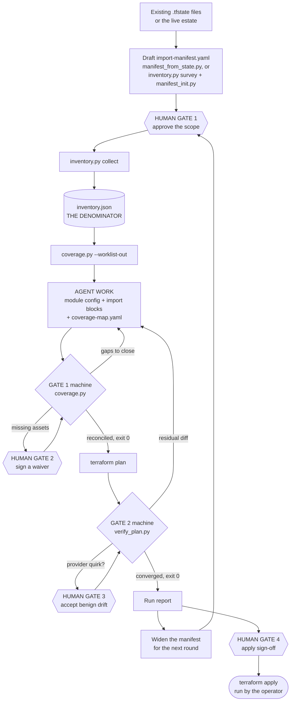
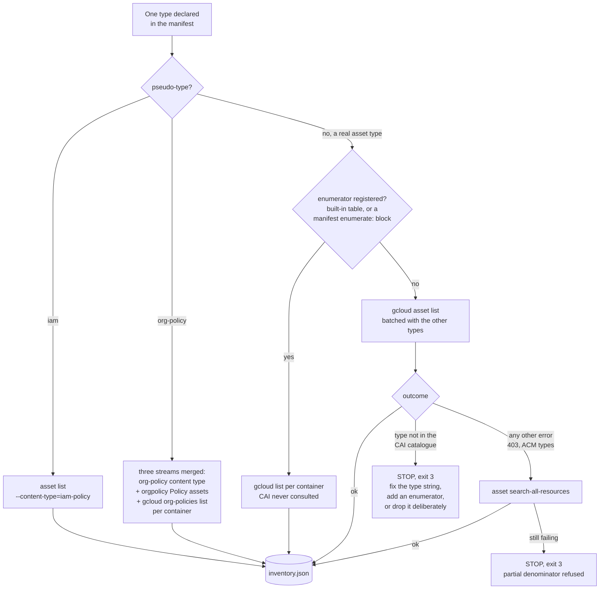
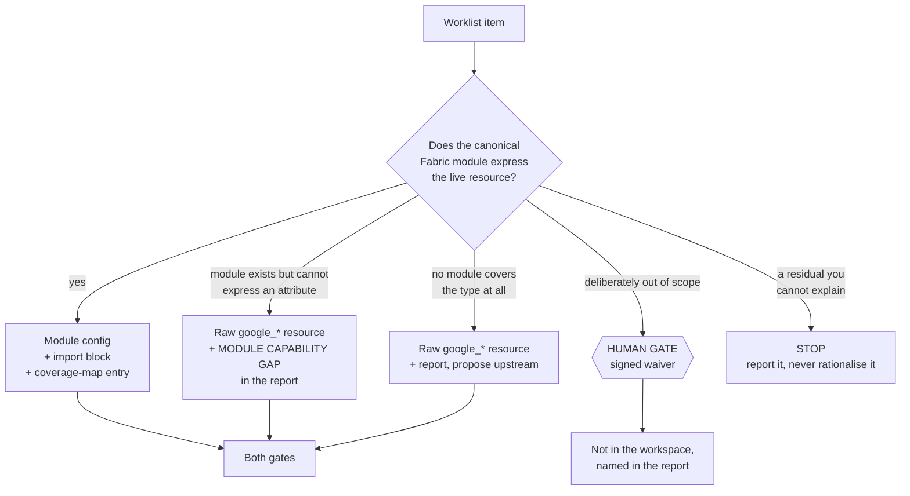

# fabric-importer

`fabric-importer` reverse-engineers an existing Google Cloud organization into Cloud Foundation Fabric Terraform modules with native `import` blocks. An AI agent generates the module mapping; a set of frozen verification scripts proves the result is complete, attribute-accurate, and plan-converged. It never modifies anything in your live cloud environment.

Start with the document for your role:

- **Human Operator / Requesting an Import**: Follow this guide below.
- **AI Agent Performing the Work**: Follow [SKILL.md](./SKILL.md).
- **Supported Resources & Maturity**: See the [Maturity Matrix](./COVERAGE.md).

---

## The Design in One Paragraph

Most infrastructure importers rely on brittle per-resource generator pipelines that quickly grow stale. This skill inverts that model: the AI agent inspects the live inventory and Fabric module sources directly, then emits idiomatic Fabric module calls paired with native Terraform 1.5+ `import {}` blocks. Two frozen verification gates validate the output. This is sound because every mistake is immediately visible: a missing attribute or schema mismatch causes `terraform plan` to propose unexpected changes, and a missed resource is flagged during inventory reconciliation. Verification per run replaces trust in generator code.

---

## What you provide, and what the tools work out

You write one file: `import-manifest.yaml`. Everything else is derived from it.

The important part is what that file contains. **It names resource types, not
resources.** You never write a list of your 47 org policies. You write:

```yaml
scope:
  root: organizations/123456789012
types:
  - type: org-policy
    levels: [organization]
  - type: cloudresourcemanager.googleapis.com/Folder
    levels: [organization, folder]
```

That means "in this organization, take over org policies attached at org level,
and every folder". Finding the actual 47 policies and 12 folders is the tool's
job — and it has to be. If a human wrote the list of resources, "everything is
covered" would only ever mean "everything I remembered to write down". The
manifest is a deliberately coarse statement of intent; turning intent into an
exact list is where people miss things, so a frozen script does it and refuses
to hand back a partial answer.

The run answers five questions in order, and only the third one is yours:

| Question | Answered by | Binding? |
|---|---|---|
| What do I already manage in Terraform? | `manifest_from_state.py` | no, advisory |
| What actually exists in the cloud? | `inventory.py survey` + `manifest_init.py` | no, advisory |
| **What do I want under management?** | **you, in `import-manifest.yaml`** | **yes** |
| Which live resources does that mean, exactly? | `inventory.py collect` → `inventory.json` | yes |
| How much of it is done? | `coverage.py` | yes |

The first two exist to break a chicken-and-egg problem: you cannot write a
sensible manifest about an estate you cannot see, and the tools that measure the
estate need a manifest first. Neither is a gate, neither produces anything
binding, and you can skip both if you already know your scope. Run them anyway
the first time: the gap between "what Terraform manages" and "what exists" is
usually the most useful thing discovered all week.

### `survey` and `collect` are not the same thing

They are the same script and both list resources, which makes them easy to
confuse. Their purposes are opposite.

`survey` runs **without** a manifest. It browses, so that a human can decide. Its
output is a conversation aid and is never used to judge anything.

`collect` runs **only** with an approved manifest. Its output is the
**denominator**: the exact list of live resources matching what you agreed.
Everything downstream is measured against it.

### The two gates answer different questions

This is the part worth reading twice, because neither gate can catch the other's
failure.

| Gate | Compares | Answers |
|---|---|---|
| 1 — `coverage.py` | `inventory.json` against the **text of your code** | did you cover everything? |
| 2 — `verify_plan.py` | the **Terraform plan** against reality | is what you wrote correct? |

Gate 1 never runs Terraform and never contacts your cloud. It reads
`inventory.json`, the `import {}` blocks it parses out of your `*.tf` files, the
`coverage-map.yaml` ledger, and `waivers.yaml`. Every asset in the denominator
must be in the ledger or in the waivers.

Gate 1 can pass on completely wrong code — right addresses, garbage
configuration. The plan catches that, as diffs.

Gate 2 can pass on a workspace covering 3 of your 59 resources. A plan of three
clean imports and nothing else is perfectly converged; Terraform has no idea the
other 56 exist. **A converged plan says nothing about completeness**, because
Terraform only knows about what you wrote down. Completeness can only be judged
against a list built independently of the code, which is exactly what
`inventory.json` is.

### `inventory.json` is the only door

The loop is closed in both directions:

- a ledger key that is not in the inventory fails gate 1 as `stale`
- an `import {}` block that no ledger key claims fails gate 1 as an `orphan`

So nothing can be imported that the denominator does not contain, and nothing in
the denominator can be quietly dropped. That is what makes "both gates green"
mean something precise: everything the manifest declared is either in code or
waived by name, and applying that code would change nothing.

---

## Human-in-the-Loop Gates

Gate on steps that are hard to reverse, costly, or where human judgment is required (e.g. narrowing scope, waiving assets, or accepting provider drift). Keep mechanical, reversible steps (asset collection, scaffolding, linting, plan checks) autonomous. Gates are **blocking**: if running non-interactively and confirmation cannot be obtained, stop — never assume approval.

| Gate | When | What the human decides |
| :--- | :--- | :--- |
| **Scope Approval** | Manifest drafting, before any enumeration | Reviews and commits `import-manifest.yaml`: which resource types, hierarchy levels (org/folder/project), and included/excluded subtrees are in scope. |
| **Waiver Signing** | Completeness Gate (`coverage.py`) | Reviews deliberate exclusions in `waivers.yaml` and signs them with attribution (`signed_by`) for unmanaged or auto-generated resources (e.g. default log sinks, default compute service accounts). |
| **Benign Drift Review** | Plan Convergence Gate (`verify_plan.py`) | Evaluates proposed cosmetic provider quirks (e.g. computed labels, default timeouts) and commits reviewed entries to `scripts/benign-drift.yaml`. |
| **Final Review & Apply** | Handover, before `terraform apply` | Inspects the final zero-drift plan, run report, and input provenance digests before running `terraform apply` on their own schedule. |

---

## How the work flows

Three views. The main loop, then the two places where a single item funnels
through a decision — enumeration and mapping.

### The main loop



Everything above the scope gate is advisory. Everything below it is mechanical
and binding.

### Funnel 1: how a declared type becomes inventory entries



No path exits with "skip it". Every branch ends in the denominator or in a stop,
because an unenumerated asset is invisible to both gates at once — it would pass
every check by not existing.

### Funnel 2: how a worklist item becomes code



Three of those four outcomes are successes. That matters: the temptation at the
middle two is to force the module to fit, or to call the leftover diff benign.

---

### Terminal / ASCII alternative

```text
  [what Terraform manages]          [what actually exists]
  (manifest_from_state.py)      (inventory.py survey + manifest_init.py)
              |                                |
              +----------------+---------------+
                               v
                  Draft import-manifest.yaml
                               |
                  +------------v-------------+
                  |  HUMAN GATE: scope       |  <-- types and levels,
                  |  approved and committed  |      never a list of resources
                  +------------v-------------+
                               v
            inventory.py collect --> inventory.json (the denominator)
                               |
                               v
            coverage.py --worklist-out --> worklist.yaml
                               |
                               v
            AGENT: module config + import blocks + coverage-map.yaml
                               |
                               v
            GATE 1 coverage.py     (denominator vs the text of the code)
              | missing? --> HUMAN GATE: sign a waiver, or write the code
              | reconciled (exit 0)
                               v
            terraform plan --> GATE 2 verify_plan.py   (plan vs reality)
              | residual? --> fix the code, or HUMAN GATE: accept benign drift
              | converged (exit 0)
                               v
            Run report --> widen the manifest, next round
                       \--> HUMAN GATE: apply sign-off --> terraform apply
```

---
## Step-by-Step Operator Guide

### 1. Declare the Scope (`import-manifest.yaml`)
You and the agent agree on an `import-manifest.yaml` declaring which resource types to import (e.g., folders, service accounts, VPC networks, org policies), at which container levels (organization, folder, or project), and which subtrees to include or exclude.

This is the only file you author, and it names types, not resources. The two
options below are drafting aids that answer different questions — A tells you
what Terraform already manages, B tells you what exists. Run both the first
time and compare them; run neither if you already know your scope. Neither
output is binding until you have reviewed it and committed it.

**Option A — Inferred from existing Terraform state(s):**
```bash
python3 scripts/manifest_from_state.py --state <state-files...> --out import-manifest.yaml
```
See [references/inferring-manifests-from-state.md](./references/inferring-manifests-from-state.md).

**Option B — Surveyed from live GCP estate:**
```bash
python3 scripts/inventory.py survey --scope organizations/ORG_ID --out survey.json
python3 scripts/manifest_init.py --survey survey.json --scope organizations/ORG_ID --out import-manifest.yaml
```
Ready-made examples aligned with FAST stages are provided in [`examples/`](./examples/).

### 2. Enumerate the Denominator (`inventory.json`)
The enumeration script queries Cloud Asset Inventory (CAI) and service APIs to construct the exact denominator of all matching live assets:
```bash
python3 scripts/inventory.py collect --manifest import-manifest.yaml --out inventory.json
```

CAI is the default source of the denominator, not its boundary. CAI does
not model every GCP resource, and a type it cannot see would otherwise be
invisible to both gates at once — so the tool routes around it rather
than shrinking the denominator. For types known to be absent from the
catalogue it ships built-in `gcloud` enumerators and uses them
automatically; declaring the type is all it takes. Where no enumerator
exists the run stops with the remedy instead of guessing: either the
type string is wrong (checked against the
[supported types list](https://cloud.google.com/asset-inventory/docs/supported-asset-types)),
or the type needs a native enumerator declared in the manifest — a
read-only `gcloud` command run per in-scope container, normalized into
the same inventory (this also overrides a built-in):

```yaml
  - type: iam.googleapis.com/DenyPolicy       # not in the CAI catalogue
    levels: [organization, folder]
    enumerate:
      command: [iam, policies, list, --kind=denypolicies]
      container_arg: '--attachment-point=cloudresourcemanager.googleapis.com/{container}'
      key: '//iam.googleapis.com/{container}/denypolicies/{item.name}'
```

Every run closes with a one-line cost summary on stderr:

```
7 gcloud call(s) in 12.0s: asset list x5, org-policies list x2
```

Add `--verbose` (after the subcommand) to see each command as it runs,
with its outcome, duration and item count:

```
[api   1] gcloud --quiet asset list --format=json --page-size=1000 --organization=123 --content-type=resource --asset-types=...
[api   1] ok in 4.2s, 1841 item(s)
```

The full log is written to `_meta.api_calls` either way, so the cost of a
scope stays auditable without making the run unreadable: on a large
estate the per-container sweeps produce a pair of lines per container,
and those would bury the warnings that decide whether the denominator
can be trusted.

CAI listings request the largest page each API allows (1000 for
`asset list`, 500 for `search-all-resources`), which is what decides how
many HTTP requests each command turns into.

Every such sweep is recorded verbatim in `_meta.native_sweeps` so a
reviewer can re-run it. See
[references/cai-blind-spots.md](./references/cai-blind-spots.md) for the
full ladder (CAI → gcloud → REST API → signed waiver) and the guard
rails.

### 3. Compute Delta Worklist
The completeness tool reconciles the denominator against any existing code and written waivers. This is the same program that runs as gate 1 in step 5 — the same comparison, run for a different reason. Here it tells you what is left to do; there it decides whether anything is. On the first round everything is outstanding, so the worklist is the whole denominator. On later rounds it is only the delta, which is what makes repeated rounds cheap:
```bash
python3 scripts/coverage.py --inventory inventory.json --workspace tf \
  --waivers waivers.yaml --worklist-out worklist.yaml
```

### 4. Agent Maps & Emits Terraform
For each item in `worklist.yaml`, the agent writes:
1. Canonical Fabric module configuration matching the live state.
2. A paired Terraform `import {}` block:
   ```hcl
   import {
     to = module.folder-team-a.google_folder.folder[0]
     id = "folders/123456789012"
   }
   ```
3. A ledger entry in `coverage-map.yaml` linking the asset to its Terraform address.

### 5. Automated Verification (Definition of Done)
Work is complete only when two independent gates pass with exit code `0`. They are independent in a specific sense: each catches a failure the other cannot see. Gate 1 can pass on wrong code, and gate 2 can pass on a workspace covering three resources out of fifty-nine. See [The two gates answer different questions](#the-two-gates-answer-different-questions).
- **Completeness Gate (`coverage.py`)**: Reconciles the inventory against `coverage-map.yaml`, `waivers.yaml`, and emitted `import {}` blocks. Every asset must be mapped or waived. It reads files only — no Terraform, no cloud access — so it needs neither credentials nor a `terraform init` to run.
- **Plan Convergence Gate (`verify_plan.py`)**: Consumes `terraform show -json <planfile>` output (file argument or stdin) and classifies the planned actions. It never invokes Terraform itself. The plan may only contain clean imports, no-ops, and human-reviewed benign drift entries from `scripts/benign-drift.yaml`. Any residual attribute modification or destruction fails the gate.

Run both gates like this:

```bash
terraform -chdir=tf fmt -recursive
python3 scripts/coverage.py --inventory inventory.json --workspace tf \
  --waivers waivers.yaml --require-signed-waivers
terraform -chdir=tf init -input=false
rm -f tf/verify.tfplan   # a stale plan must never answer for a failed one
terraform -chdir=tf plan -input=false -out=verify.tfplan
terraform -chdir=tf show -json verify.tfplan | python3 scripts/verify_plan.py
```

Do not add `-detailed-exitcode` to the plan: it returns 2 for any
non-empty plan, and a converged import plan is always non-empty.
`verify_plan.py` is the verdict.

### 6. Review and Apply
The resulting workspace (`tf/`) is clean, formatted, and ready for you to review and run `terraform apply` at your own pace. The skill **never** runs `terraform apply` or mutates live cloud resources.

---

## Script reference

Run every script from the skill directory. All output paths are relative
to the current working directory.

| Script | Purpose | Flags |
|---|---|---|
| `inventory.py survey` | Enumerate everything in scope, to draft a manifest from | `--scope` (required), `--out`, `--verbose` |
| `manifest_init.py` | Draft a manifest from a survey (Mode B) | `--survey` (required), `--scope` (required), `--out` |
| `manifest_from_state.py` | Infer a manifest from existing `.tfstate` (Mode A) | `--state` (1+, required), `--out` (`-` for stdout), `--force` to overwrite an existing manifest |
| `inventory.py collect` | Build the denominator from CAI | `--manifest` (required), `--out`, `--verbose` |
| `coverage.py` | Gate 1 — completeness | `--inventory` (required), `--workspace` (required), `--coverage-map`, `--waivers`, `--require-signed-waivers`, `--allow-empty-inventory`, `--worklist-out` |
| `verify_plan.py` | Gate 2 — plan convergence | positional plan JSON (default stdin), `--rules`, `--allow-empty-plan` |
| `integrity.py` | Print the frozen-tools provenance digest | `--verbose` for per-file digests |

`inventory.py` requires the `survey` or `collect` subcommand; it has no
top-level flags. `--verbose` therefore goes after the subcommand
(`inventory.py collect --manifest m.yaml --verbose`), not before it.

Exit codes — `coverage.py`: `0` reconciled, `1` malformed input, `2` gaps
or problems. `verify_plan.py`: `0` converged, `1` malformed input, `2`
residual changes, `3` converged but ADVISORY (a substituted `--rules`
file). A substituted ruleset can never exit `0`; a residual plan still
exits `2`. Note that argparse usage errors also exit `2`, so read the
message, not only the code.

There is no checked-in expected digest. To check a recorded gate run,
compute `python3 scripts/integrity.py` from a pristine checkout of the
same commit and compare it with the `frozen tools:` line in the captured
output.

---

## Prerequisites & Permissions

### System Requirements
- **Terraform**: `v1.5.0+` (required for native `import {}` blocks).
- **Google Cloud SDK (`gcloud`)**: Authenticated with a configured quota project.
- **Python**: `3.9+` (the scripts use `str.removeprefix`) with `PyYAML`.

### Minimal Read-Only IAM Permissions
Run the import using a dedicated read-only identity. The following roles on the organization scope provide full read visibility:

| Role | Purpose |
|---|---|
| `roles/cloudasset.viewer` | CAI asset inventory enumeration across the hierarchy |
| `roles/resourcemanager.organizationViewer` | Organization resource details |
| `roles/resourcemanager.folderViewer` | Folder hierarchy discovery |
| `roles/viewer` | Read-only inspection of imported resources via service APIs |
| `roles/iam.securityReviewer` | IAM policy discovery at organization, folder, and project levels |
| `roles/orgpolicy.policyViewer` | Organization policy evaluation |
| `roles/accesscontextmanager.policyReader` | VPC Service Controls discovery (when VPC-SC is in scope) |

No write or admin permissions are required.

---

## User Ownership Boundary

Three human-owned files govern the process. The agent may propose edits, but only you commit them:

| File | Purpose |
|---|---|
| `import-manifest.yaml` | Declares in-scope resource types, container levels, and subtree filters. |
| `waivers.yaml` | Written waivers for resources deliberately excluded from management (e.g. `_Default` log sinks, default compute service accounts). Requires a `signed_by` attribute. |
| `scripts/benign-drift.yaml` | Scoped provider quirks accepted as cosmetic diffs (e.g., computed provider labels or default timeouts). |

---

## Repository Layout

```text
skills/fabric-importer/
├── SKILL.md                     # Agent protocol and operational contract
├── README.md                    # Human operator guide and architecture overview
├── COVERAGE.md                  # Resource family maturity matrix (N / C / V)
├── scripts/                     # Verification gates and helper utilities
│   ├── inventory.py             #   Asset enumeration (CAI + API sweeps)
│   ├── coverage.py              #   Completeness gate & delta worklist generator
│   ├── verify_plan.py           #   Plan-convergence gate (benign-drift aware)
│   ├── manifest_from_state.py   #   Terraform state-driven manifest inference
│   ├── manifest_init.py         #   Starter manifest drafting assistant
│   ├── integrity.py             #   Input binding & runtime provenance stamping
│   └── benign-drift.yaml        #   Human-reviewed provider quirk ruleset
├── examples/                    # Manifest and waiver templates
│   ├── import-manifest.org-foundation.yaml
│   ├── import-manifest.fast-org-setup.yaml
│   ├── import-manifest.fast-security.yaml
│   ├── import-manifest.fast-vpcsc.yaml
│   ├── import-manifest.fast-networking.yaml
│   └── waivers.example.yaml
├── references/                  # Normative mapping rules & technical gotchas
│   ├── mapping-cookbook.md      #   Module map, escaping rules, import IDs
│   ├── inferring-manifests-from-state.md # State-driven manifest inference workflow
│   ├── cai-blind-spots.md       #   Known CAI gaps and service API mitigations
│   └── operating-contract.md    #   Safety invariants and trust boundaries
└── tests/                       # Unit test suite
```
