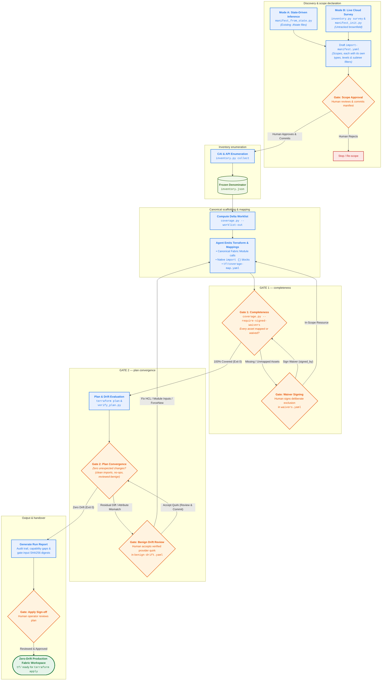

# Fabric Importer — agent protocol

You (the agent) reverse-engineer live GCP resources into Cloud Foundation
Fabric Terraform. There is no per-resource pipeline: **you perform the
mapping yourself**, guided by the cookbook, and two frozen gates verify
your output. Trust comes from the gates, not from you.

## Trust boundary (non-negotiable)

- **Frozen scripts** — everything in `scripts/`: `inventory.py`,
  `coverage.py`, `verify_plan.py`, `benign-drift.yaml`,
  `manifest_init.py`, `manifest_from_state.py`, `integrity.py`. You may
  RUN them; you must NEVER modify them or their rulesets.
  `manifest_from_state.py` is frozen for the same reason as the gates:
  it decides the SCOPE the denominator is built from, so editing it
  shrinks what "complete" means. Both gates print runtime provenance and active input hashes;
  a reviewer compares them against a clean checkout. If a gate is
  genuinely broken, report it with evidence — do not patch around it.
- **Human-owned files**: the import manifest and the waiver ledger. You
  may draft or propose changes; a human reviews and commits them.
- **Yours**: everything in the workspace (`tf/`, `coverage-map.yaml`,
  reports). Constraint: once an address exists, it is immutable — extend,
  never rewrite (see "Incremental runs").

## Safety contract

1. **NEVER run `terraform apply`.** The workspace contains authoritative
   surfaces (org policies, sinks — and authoritative IAM where opted
   into), so an apply is equivalent to overwriting live config with a
   snapshot. The additive-IAM default narrows that blast radius; it does
   not lift this rule. Verification is plan-only via `verify_plan.py`.
   Never synthesize state files.
2. **Read-only against GCP**: `list`/`describe`/`get-iam-policy`/asset
   export only. Prefer a dedicated read-only identity
   (`roles/cloudasset.viewer` + per-service viewers, via impersonation)
   so an accidental apply fails with 403.
3. **All workspace output is org-confidential.** Fabric is used
   fork-and-own, so during the OWN phase these artifacts legitimately
   live in the operator's own private fork alongside the code — that is
   the expected working directory. What must never happen is any of it
   reaching a PUBLIC repository, an upstream pull request, or a document
   that leaves the engagement: no org/folder/project ids, principals,
   resource names or asset counts. Pulled `.tfstate` and saved
   `*.tfplan` additionally contain secret VALUES (Secret Manager
   payloads, generated keys); delete them once the manifest is drafted
   and the plan is verified, and never commit them anywhere.
4. **Never rationalize a residual diff.** If you believe a plan diff is a
   provider artifact, propose a `benign-drift.yaml` entry with evidence in
   your report and stop. A human accepts it or the run stays red.

## Human-in-the-Loop Gates

Gate on steps that are hard to reverse, costly, or where human judgment is required (e.g. narrowing scope, waiving assets, or accepting provider drift). Keep mechanical, reversible steps (asset collection, scaffolding, linting, plan checks) autonomous. Gates are **blocking**: if running non-interactively and confirmation cannot be obtained, stop — never assume approval.

| Gate | When | What the human decides |
| :--- | :--- | :--- |
| **Scope Approval** | Manifest drafting, before any enumeration | Reviews and commits `import-manifest.yaml`: which resource types each scope declares, at which hierarchy levels (org/folder/project), under which included/excluded subtrees. |
| **Waiver Signing** | Completeness Gate (`coverage.py`) | Reviews deliberate exclusions in `waivers.yaml` and signs them with attribution (`signed_by`) for unmanaged or auto-generated resources (e.g. default log sinks, default compute service accounts). |
| **Benign Drift Review** | Plan Convergence Gate (`verify_plan.py`) | Evaluates proposed cosmetic provider quirks (e.g. computed labels, default timeouts) and commits reviewed entries to `scripts/benign-drift.yaml`. |
| **Final Review & Apply** | Handover, before `terraform apply` | Inspects the final zero-drift plan, run report, and input provenance digests before running `terraform apply` on their own schedule. |

---

## Step-by-Step Workflow



---

## Operational Workflow

### Step 0 — establish the manifest (with the user)

The manifest is the user's contract: which resource types, at which
levels, under which subtrees — declared per scope, since `scopes:` is
a list and **every scope carries its own `types:` list**. Never invent
it silently. If one exists, confirm it; otherwise run one of the
drafting workflows:

**Option A — Inferred from existing Terraform state(s)** (preferred when migrating existing TF):

```bash
uv run scripts/manifest_from_state.py --state <state-files...> --out import-manifest.yaml
# add --force to replace an existing manifest, or --out - to review first
```

See [references/inferring-manifests-from-state.md](./references/inferring-manifests-from-state.md).

**Option B — Surveyed from live GCP estate**:

```bash
uv run scripts/inventory.py survey --scope organizations/ORG_ID --out survey.json
uv run scripts/manifest_init.py --survey survey.json \
  --scope organizations/ORG_ID --out import-manifest.yaml
```

Then interview the user over the draft (every discovered type is listed
with per-level counts, commented out; foundation types are pre-enabled):

- What do you want under Terraform management *now*? (Start narrow —
  org foundation first, workloads later. Show them
  `examples/import-manifest.org-foundation.yaml` as the reference.)
- At which levels? (e.g. org IAM yes, project IAM no.)
- Same depth everywhere, or different depths per subtree? (Different ⇒
  several scopes, each with its own `types:` list —
  `examples/import-manifest.multi-domain.yaml` is the reference.)
- Any subtrees to exclude (sandboxes, decommissioning trees)?

When writing a scope's `include`/`exclude`, note that CAI `ancestors`
store NUMERIC project numbers; `inventory.py` automatically resolves
alphanumeric project IDs to numbers during enumeration, but project numbers
remain supported and canonical.

**Per-scope `types:` rules (fail-closed, exit 1 before any API call).**
A scope's list is the only place types are declared, so what a scope
collects is exactly what is written on it. The same type may appear in
several scopes with different `levels`, `iam` or `enumerate`. The
validator refuses: a scope without a `types:` list or with `types: []`
(a scope that collects nothing may not say so quietly); a type whose
`levels` cannot intersect its scope's `levels` (dead declaration —
entries listing `unknown` are exempt); a duplicate `type:` within one
list; and the retired top-level `scope:`/`types:` grammar, which is
rejected with migration instructions — a manifest from an earlier
engagement is migrated per
[references/manifest-migration.md](./references/manifest-migration.md).
Unlike `types:`, a scope's
`emission:` map inherits built-in defaults for omitted families — it
is denominator-neutral; do not reason from one knob to the other.

The user commits the manifest. Scope changes later = manifest edit +
incremental re-run, never a rewrite.

### Step 1 — enumerate (the denominator)

```bash
uv run scripts/inventory.py collect --manifest import-manifest.yaml --out inventory.json
```

By default, `inventory.py survey` and `inventory.py collect` filter out
soft-deleted containers (`DELETE_REQUESTED` / `DELETE_IN_PROGRESS` folders and
projects) and their child resources, matching what is active in the GCP Console.
Pass `--include-deleted` if you explicitly need to capture soft-deleted assets in
the denominator (e.g. to audit or waive them).

Similarly, resources GCP creates or manages on the operator's behalf —
un-creatable auto-generated VPC routes (subnet-local routes, NCC and peering routes),
Google-managed default log sinks and log buckets (`_Default` and `_Required`),
and ephemeral Privileged Access Manager (PAM) grants (`privilegedaccessmanager.googleapis.com/Grant`) —
are automatically excluded from the denominator. Pass `--include-auto-generated`
(or `--include-auto-generated=family,...` e.g. `routes`, `logging-defaults`, `pam-grants`;
`--include-logging-defaults` and `--include-pam-grants` remain supported as aliases)
if you explicitly need to capture them in the denominator.

**CAI is the default source of the denominator, never the boundary of
it.** Cloud Asset Inventory does not model every GCP resource. A type it
does not support must be enumerated by other means and merged into the
same denominator — `gcloud <service> list|describe` first, the service
REST API only where gcloud has no surface at all. It is never dropped:
an unenumerated asset is invisible to BOTH gates at once, which is the
exact failure the gates exist to prevent.

`inventory.py` does this for you where it can: it ships built-in gcloud
enumerators for types known to be absent from the CAI catalogue
(`NATIVE_ENUMERATORS`), so declaring the type in a scope's `types:`
list is enough — the tool skips CAI, sweeps with gcloud in that scope,
and says so. Where no
enumerator exists it refuses to proceed rather than guess, and it
separates that case from a permission failure. Three remedies, in order:

- **The type string is wrong.** The common case. Check it against the
  [supported types list](https://cloud.google.com/asset-inventory/docs/supported-asset-types)
  — CAI calls the Logs Router settings singleton
  `logging.googleapis.com/Settings`, not `.../OrganizationSettings`.
- **The type string is right, but only for the other CAI surface.** CAI
  has TWO asset-type taxonomies. For a few Compute families the
  list surface (`asset list`, the primary sweep) splits the family by
  scope into separate types — `compute.googleapis.com/GlobalAddress`,
  `.../GlobalForwardingRule`, `.../RegionBackendService`,
  `.../RegionDisk` — while `search-all-resources` unifies them. This
  one does not raise: the declared type is supported, the sweep
  succeeds, the yield is non-zero, and the split-off assets are simply
  never asked for. `inventory.py` sweeps the known siblings
  automatically and accounts them under the declared type (stamped in
  `_meta.split_type_sweeps`, and per entry as `cai_list_type`). The
  table is a frozen snapshot of a doc that changes, so check it against
  live CAI at least once per engagement:

  ```bash
  uv run scripts/inventory.py collect --manifest import-manifest.yaml \
    --out inventory.json --verify-search-parity
  ```

  One extra call per scope; fatal if the search surface returns an asset
  the list sweep did not. `_meta.split_parity` EMPTY means the probe did
  not run; a probe that ran and found nothing is a record whose
  `only_in_search` is empty. Read the record, not the key — and say
  which in the report. See
  [references/cai-blind-spots.md](./references/cai-blind-spots.md).
- **CAI genuinely does not model the type, and no built-in covers it.**
  Give it a native enumerator — a read-only gcloud command run per
  in-scope container, normalized into inventory entries. The
  `enumerate:` block lives in the `types:` list of each scope that
  needs it (per-scope lists never inherit), and also overrides a
  built-in when you know better:

  ```yaml
      - type: iam.googleapis.com/DenyPolicy   # not in the CAI catalogue
        levels: [organization, folder]
        enumerate:
          command: [iam, policies, list, --kind=denypolicies]
          container_arg: '--attachment-point=cloudresourcemanager.googleapis.com/{container}'
          key: '//iam.googleapis.com/{container}/denypolicies/{item.name}'
  ```

  The manifest is human-owned: draft the block, a human commits it.
  Guard rails (read-only verbs only, no `--filter`/`--limit`, unique key
  templates), the built-in table, and the full ladder — including what
  to do when gcloud has no surface either, or when the command is scoped
  to a bucket rather than a container — are in
  [references/cai-blind-spots.md](./references/cai-blind-spots.md). An
  enumerator that worked belongs in your report as a proposed addition
  to the built-in table.

Every entry that did not come from CAI is stamped into
`inventory.json`'s `_meta.native_sweeps` with the verbatim command, and
belongs in the step-5 report. Entries that came from CAI under a
different asset type than the one declared are stamped into
`_meta.split_type_sweeps` and belong there too.

Collection closes with a one-line cost summary (`N gcloud call(s) in
Xs: …`) and records every command it ran in `_meta.api_calls`. Add
`--verbose` after the subcommand to watch each call as it happens —
useful when a sweep is slow and you want to know which one. Quote the
summary line in the report: on a large estate the per-container
org-policy sweep dominates the run, and this is what makes that visible
instead of guessed at.

### Step 2 — get your worklist

```bash
uv run scripts/coverage.py --inventory inventory.json --workspace tf \
  --waivers waivers.yaml --worklist-out worklist.yaml
```

First run: everything is missing. Re-runs: only the delta.

### Step 3 — map and emit (your job)

**Fabric modules are the product, not an optimization.** Every resource
maps to its canonical Fabric module (the cookbook's "Canonical module
map" is normative): `modules/organization` for everything org-level,
and — by default — one `modules/folder` instance per folder and one
`modules/project` instance per project, each carrying its own IAM, org
policies, and sinks. For families where Fabric also offers a factory
carrier (e.g. `project-factory` for the folder hierarchy,
`net-firewall-policy` rule factories), the manifest may opt into
`factory` emission per resource family via `emission:` — a human call,
made when the imported workspace is meant to become the day-2
operating model (e.g. foundational folders + org policies + IAM as
YAML data). The default stays per-instance: shallow, chosen addresses
with no coupling to factory internals. The cookbook's "Factory
emission (opt-in)" section is normative for how, and for the
tradeoffs.

For each worklist entry, emit module config (factory YAML or module
inputs, per the cookbook) + a paired import block targeting the
module-internal address, maintaining `tf/coverage-map.yaml`
(inventory key → list of Terraform addresses). Read
`references/mapping-cookbook.md` FIRST: it encodes the hard-won rules
(escaping, import-ID formats, coalesce traps, dry-run keys, hashed
condition keys).

**IAM is emitted additive by default.** Bindings map to
`iam_bindings_additive` (one `google_*_iam_member` per role/member/
condition tuple): an apply can only create or destroy the exact pairs
emitted and can never strip members it does not manage — the posture
Google itself recommends for PAM coexistence. Authoritative emission
(`iam` / `iam_bindings`) is a deliberate opt-in via `emission.iam:
authoritative` in the manifest, for estates that want IAM fully
declarative as the day-2 model; the cookbook's container-IAM rules
cover both and the tradeoff.

**Machine-managed IAM is excluded, never imported — and never part of
the denominator.** Privileged Access Manager grant bindings — temporary
time-bound conditional bindings that PAM injects on grant activation
and revokes itself — are stripped by `inventory.py` before the
denominator is formed: whenever IAM is collected, active grants are
enumerated through CAI (`privilegedaccessmanager.googleapis.com/Grant`,
one call per scope) and matching bindings are removed
deterministically by (target, role, requester) from the grant itself.
There is nothing to map and nothing to waive — a container whose
policy is only grant bindings mints no `#iam` entry at all. Stripped
bindings are stamped in `_meta.pam_grant_exclusions` and belong in the
step-5 report, like `deleted:` principal tombstones (which remain a
mapping-time exclusion). The cookbook's container-IAM rules are
normative. PAM *entitlements* are ordinary importable configuration —
only *grants* are excluded.

When the cookbook has no section for a type — which is the normal case,
not an error — follow the method below. The cookbook is the precipitate
of that method, not a precondition for it.

**Raw `google_*` resources are the exception, never a shortcut.**
Permitted only when (a) the canonical module cannot express a required
attribute of the live resource (a *module capability gap*), or (b) no
Fabric module covers the type at all. Every raw resource MUST appear in
the step-5 report's "module capability gaps" section with the concrete
reason. For drafting raw config,
`terraform plan -generate-config-out=generated.tf` is provider-faithful
by construction — but it is an inspection technique, not a mapping
tier.

Read the Fabric module source **in this repository** before targeting
module-internal addresses; do not trust memory. Root-module wiring
(`versions.tf`, provider config, module blocks) is part of your output.

Three cookbook sections are normative for HOW you emit: **Workspace
layout** (one file per CONTAINER; project-contained resources live in
their project's file; hierarchical `data/` keyed by instance keys),
**The reference rule** (managed resources are referenced via module
outputs, never literals), and **Scaffolding scripts** (run-local
generators are fine — parameterized, cookbook-conformant, deterministic,
never promoted into the skill).

### Step 3b — when the cookbook has never seen this type

The cookbook will never be comprehensive, and it is not meant to be. It
is the accumulated residue of running this loop against real resources;
every entry in it was produced this way. Meeting an undocumented type is
routine — apply the same method, at the same standard of evidence.

What makes that safe is division of labour. **The gates make the method
safe**: you cannot take a wrong mapping to green, because a bad import
ID errors, a mismatched attribute stays residual, and an unmapped asset
fails coverage. **The cookbook makes it cheap and correctly diagnosed**:
it is the difference between converging on the first attempt and the
third, and — more importantly — between identifying a diff's cause and
confidently misreading it. The gates cannot catch a misdiagnosis, because
classifying a diff as benign is a human judgement they delegate. Do not
treat an absent cookbook section as licence to reason loosely.

The loop:

1. **Census the type.** Confirm the CAI asset-type string against live
   `gcloud asset list` output before trusting it. Type strings taken
   from module knowledge have been wrong before. Record what CAI
   actually returns, including which enumeration path had to be used.
   A non-zero yield is NOT confirmation that the type is complete: for
   split families the list surface answers happily with only part of
   the family (see step 1's second remedy). Where the type has any
   global/regional/zonal distinction, census it on BOTH surfaces —
   `asset list --asset-types=T` against `asset search-all-resources
   --asset-types=T` — and reconcile the counts before trusting either.
   If CAI does not model the type at all, that is not a dead end and
   not a reason to narrow the manifest: enumerate it with `gcloud` (or
   the REST API) and merge it into the same denominator — see step 1 and
   `references/cai-blind-spots.md`.
2. **Find the module and read its source.** Canonical module map first,
   then `modules/` in this repository. Read the resource blocks for
   addresses and `for_each` key formats, and the variables file for the
   input shape. Never work from memory about module internals.
3. **Mirror ForceNew inputs to live values BEFORE the first plan.**
   Check which inputs are ForceNew on the underlying resource and set
   them to exactly what is live. A destroy/create pair on an imported
   resource is always a mapping error, never an acceptable outcome.
4. **Emit, plan, and read the result.** The plan is the oracle. A wrong
   import ID fails loudly and safely; a wrong attribute shows up as a
   diff. This step is cheap — use it rather than deliberating.
5. **Diagnose every diff before classifying it**, in this order:
   - Read the module's variable TYPE. Terraform silently discards
     attributes a variable type does not declare — no error, `validate`
     returns Success — so a field you believe you set may never have
     reached the resource.
   - Check whether the field is assigned directly or wrapped in
     `coalesce()`. Directly assigned fields accept `null` and need no
     rule; `coalesce` fields cannot express "empty" at all.
   - Check the escaping matrix if the value passes through
     `templatestring()`.
   Only after those does the question "is this benign?" become
   answerable.
6. **Land on one of three outcomes — all legitimate:**
   - *Clean convergence.* The module expresses the live resource.
   - *Module capability gap.* The module exists but cannot express an
     attribute that changes how the resource behaves. Emit a raw
     resource mirroring the live values, name it in the report's module
     capability gaps section with the module evaluated and the attribute
     missing, and treat it as upstream-Fabric-issue material. This is a
     successful outcome, not a failure.
   - *No module covers the type.* Same as above, plus note whether a
     module is worth proposing upstream.
   A residual you cannot explain is none of these. Report it and stop —
   never rationalise it into green.
7. **Write the cookbook entry as part of your report.** A type you
   mapped and verified is knowledge the next engagement should not have
   to rediscover: the CAI type string, the module addresses and
   `for_each` key formats, the import ID, the ForceNew inputs, and every
   trap that cost you a cycle. Mark surfaces you did not exercise as
   unverified. This step is what makes the tool compound instead of
   resetting to zero on every engagement — without it, the same traps
   are paid for repeatedly.

### Step 4 — run the gates

**The two gates measure different things, and neither can catch the
other's failure.** Gate 1 compares the denominator against the TEXT of
your workspace — the `import {}` blocks it parses out of `*.tf`, the
coverage map, the waivers. It never runs Terraform and never reads your
cloud. Gate 2 compares the plan against reality.

So gate 1 passes happily on code that is completely wrong, and gate 2
passes happily on a workspace covering three of fifty-nine assets: a
plan of three clean imports is perfectly converged, because Terraform
only knows about what you wrote down. **A converged plan is not evidence
of completeness**, and a reconciled coverage report is not evidence of
correctness. Never report one as if it covered the other, and never
skip a gate because the other one is green.

**An orphan import block is evidence about the DENOMINATOR, not just
about the coverage map.** When gate 1 reports an `import {}` block
targeting a resource that is not in `inventory.json`, and you know that
resource is live, the first hypothesis is that enumeration missed it —
not that the mapping is spurious. This is the only signal that fires for
a silently short denominator, and it has been mistaken for a coverage-map
problem and waived away in a live run. Investigate the enumeration path
for that type (step 1, and `references/cai-blind-spots.md`) BEFORE
proposing a waiver: a waiver over a short denominator makes the gap
permanent and puts a human's name on it.

```bash
terraform -chdir=tf fmt -recursive   # generated code is ALWAYS fmt-ed
uv run scripts/coverage.py --inventory inventory.json --workspace tf \
  --waivers waivers.yaml --require-signed-waivers
terraform -chdir=tf init -input=false
rm -f tf/verify.tfplan   # never let a stale plan answer for a failed one
terraform -chdir=tf plan -input=false -out=verify.tfplan
terraform -chdir=tf show -json verify.tfplan | uv run scripts/verify_plan.py
```

Do not add `-detailed-exitcode` here: it returns **2 whenever the plan is
non-empty**, and a converged import plan is always non-empty (every
`import {}` block is a planned change). Under `set -e`, or to an agent
treating non-zero as failure, it aborts the workflow at exactly the step
that is meant to validate it. `verify_plan.py` is the verdict, not
terraform's exit code.

The `rm -f` matters: `plan` and `show` are separate commands, so if the
plan step fails (expired credentials, a provider error, a syntax error in
newly emitted HCL) `show -json` will happily read the PREVIOUS
iteration's plan file and the gate can print CONVERGED for code that was
never planned.

`verify_plan.py` exit codes: `0` converged, `1` malformed input, `2`
residual changes, `3` advisory run (a substituted `--rules` file — never
a passing gate).

`--require-signed-waivers` is the default posture: every waiver must
carry a `signed_by` recording the human who accepted it. Drop the flag
only in a fully unattended run, and say so in the report.

Iterate step 3 until **both** gates are green. Convergence =
coverage reconciled ∧ every plan change is a clean import, no-op, or
reviewed-benign.

### Step 5 — report

Produce a run report for the user: what was imported (counts by type,
with the Fabric module used for each), an **enumeration sources**
section naming every type that did not come from CAI and the exact
command that produced it (`_meta.native_sweeps` covers declared
enumerators; quote anything you enumerated out of band yourself), a
**module capability gaps** section — every raw resource emitted, which
module fell short, which attribute, and whether it is
upstream-Fabric-issue material — plus
benign diffs relied on, waivers in effect, proposed waivers/benign rules
awaiting human review, and anything the manifest excludes that you
believe deserves attention. State whether `--verify-search-parity` was
run and what it found. An empty `_meta.split_parity` means the probe did
not run; a clean probe is a record whose `only_in_search` is empty.
Reporting an unchecked table as clean is exactly the kind of claim this
section exists to prevent. Quote the **per-scope** yield tables
(`_meta.scopes[].declared_types` / `zero_yield_types`), not only the
aggregate `_meta.declared_types`: a type can be non-zero org-wide while
the one scope that declared it yielded nothing, and only the per-scope
record shows that. Convergence claims are bounded per scope — state
each scope's declared surface, not one sentence about "the manifest".
Plain facts; no "100%" claims beyond what the
gates literally verified.

The report MUST include the verbatim stdout of both final gate runs —
including the provenance stamp and every `input … sha256:` line.
Those lines are what lets a reviewer tie the verdict to the exact tool
build and the exact inputs; a report that paraphrases the gates instead
of quoting them is not evidence.

## Incremental runs

- The workspace persists. `coverage.py`'s worklist is the only to-do
  list; touch nothing that is already mapped.
- Commit `.terraform.lock.hcl` in the (user-owned, private) workspace
  repo: convergence verdicts are only reproducible against the exact
  provider build that produced them.
- Existing Terraform addresses and `coverage-map.yaml` entries are
  immutable. If a mapping must genuinely change (e.g. folder renamed),
  emit `moved {}` blocks and flag it prominently in the report.
- Manifest NARROWING fails closed: `coverage.py` flags now-out-of-scope
  mapped keys as `stale?` problems and exits 2. Resolution is a human
  decision: re-widen the manifest, sign waivers, or deliberately retire
  the mappings (remove config + import blocks + coverage-map entries in
  one reviewed commit) — never silently.
- Manifest widening only ever adds worklist entries; it never invalidates
  existing mappings.

## Prerequisites

`terraform` >= 1.5, `gcloud`, and [`uv`](https://docs.astral.sh/uv/).

Run every script with `uv run scripts/<name>.py`. Each one declares its
own dependencies inline (PEP 723), so nothing needs installing or
activating and the run cannot pick up a stale system PyYAML. Where `uv`
is genuinely unavailable, `python3` >= 3.10 with PyYAML installed works
and the arguments are identical — say which you used in the report.

Discovery IAM — the read-only grant on the scope root (same table as the
README):

- `roles/viewer`
- `roles/resourcemanager.organizationViewer`
- `roles/resourcemanager.folderViewer`
- `roles/iam.securityReviewer`
- `roles/orgpolicy.policyViewer`
- `roles/cloudasset.viewer`
- `roles/accesscontextmanager.policyReader` (when VPC-SC is in scope)

This covers org foundation, folders, projects, networking, and storage;
families verified later (KMS, CAS, VPC-SC, BigQuery, Pub/Sub, Tags, WIF)
may need additional per-service viewer roles — the plan gate names the
missing permission when one is needed.

## References

- [README.md](./README.md) — human user guide and architecture overview
- [COVERAGE.md](./COVERAGE.md) — resource maturity matrix
- [references/mapping-cookbook.md](./references/mapping-cookbook.md) —
  Fabric mapping rules, escaping, import-ID table, known traps
- [references/address-map.yaml](./references/address-map.yaml) — the
  fielded subset of the cookbook (asset type, module, address, import
  ID, verification round); validated and rendered by
  `scripts/address_map.py`, never read by the gates
- [references/inferring-manifests-from-state.md](./references/inferring-manifests-from-state.md)
  — inferring import manifests from existing Terraform states
- [references/manifest-migration.md](./references/manifest-migration.md)
  — the manifest grammar changed to scopes-only with per-scope
  `types:` lists; how to migrate a manifest written for the retired
  grammar, and what stayed identical
- [references/cai-blind-spots.md](./references/cai-blind-spots.md) —
  where the CAI denominator is incomplete and what to do about it
- [references/operating-contract.md](./references/operating-contract.md)
  — invariants and trust boundaries in full
