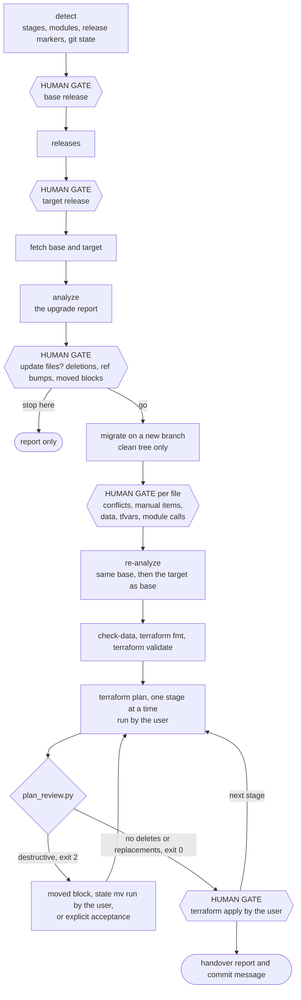

# fast-upgrade

`fast-upgrade` upgrades a FAST repository that a customer forked and owns
to a newer Cloud Foundation Fabric release. An AI agent drives the
conversation; frozen scripts do the comparison, the file changes and the
Terraform plan review. It never runs `terraform apply`, never commits, and
never touches live cloud resources.

Start with the document for your role:

- **Human operator / requesting an upgrade**: follow this guide.
- **AI agent performing the upgrade**: follow [SKILL.md](./SKILL.md).
- **Contributor changing the skill**: see [TESTING.md](./TESTING.md).

---

## The design in one paragraph

A FAST repository in production is never a clean copy of a release. Stages
get renamed or moved, Terraform gets edited, modules are vendored under
another folder or sourced from git, and the factory YAML is entirely the
customer's. A diff between two releases cannot tell those edits apart from
upstream's, and a diff between the repository and the new release cannot
either. So the scripts compare **three** trees: the customer's repository
(**C**), the release it was built from (**B**, the base) and the release to
upgrade to (**T**, the target). A file that only upstream changed is taken,
a file that only the customer changed is kept, and a file changed on both
sides is 3-way merged. Everything else, such as deletions, factory data,
variables, module interfaces and moved blocks, is reported for a human
decision. Nothing is trusted to the agent's judgment: the classification
comes from the scripts, and whether the upgrade is safe comes from each
stage's Terraform plan.

---

## How files are classified

For every file of every mapped folder, `plan` compares the three trees:

| Customer (C) vs base (B) | Target (T) vs base (B) | Category | What `apply` does |
| --- | --- | --- | --- |
| same | same | `unchanged` | nothing |
| same | changed | `upstream-changed` | takes the target |
| changed | same | `customer-changed` | keeps the customer's file |
| changed | changed, C equals T | `already-updated` | nothing |
| changed | changed differently | `conflict` | 3-way merge (`git merge-file`) |
| not in B, not in C | added | `upstream-added` | adds it |
| added | not in B or T | `customer-added` | keeps it |
| same | deleted | `upstream-deleted` | deletes only with `--include-deletes` |
| changed | deleted | `conflict-deleted` | manual (merged into the new path if upstream renamed it) |
| deleted | changed | `conflict-customer-deleted` | manual |
| deleted | same | `customer-deleted` | stays deleted |
| added | added with other content | `conflict-added` | manual |

Two details make this work on real forks:

- **Folders are mapped, not assumed.** Customer folders are matched to
  upstream stages and modules by name, then by name prefix
  (`2-project-factory-acme`), then by content, so a renamed or moved stage
  still lines up. Modules can live anywhere (`modules/`, `tf/modules/`,
  `vendor/fabric/`), or come from git at a `?ref=`.
- **Upstream code is rewritten to the customer's layout before comparing.**
  If the customer moved `modules/` to `tf/modules/` and fixed the relative
  `source` paths, the upstream files are rewritten the same way first. A
  reorganized repository therefore does not turn every file into a
  conflict, and the files `apply` writes already point at the customer's
  folders.

### Why the base matters

The base decides every classification, and a wrong base fails in two
different ways:

- **Base too new:** upstream changes between the real base and the chosen
  one look like customer edits and are **silently kept**. The upgrade skips
  them without warning. This is the dangerous direction.
- **Base too old:** those changes show up as conflicts instead, and most
  merge cleanly because both sides made the same edit. Noisy, but never
  silent.

`detect` reads the release markers that FAST stages carry
(`fast_version.txt`) and the `?ref=` of git-sourced modules. When the
evidence is split, the agent recommends the older candidate, and it can
compare candidate bases by how many files each one leaves `unchanged`.

---

## What the report covers

`plan` is read-only. It opens with a verdict and a ranked list of
findings, then reports, besides the file actions above, what a file merge
cannot fix:

| Section | What it tells you |
| --- | --- |
| **READINESS** | `BLOCKED`, `NEEDS WORK` or `READY WITH REVIEW`, with a few key points |
| **FINDINGS** | Every issue with an ID, a severity, the stage, the files, the evidence and the action to take |
| **NOT CHECKED** | What the analysis could not verify: unreadable tfvars, YAML without a schema, Terraform state, CI/CD |
| **BREAKING CHANGES**, **UPGRADING NOTES** | The CHANGELOG and `UPGRADING.md` entries of every release in (B, T], filtered to the stages and modules this repository uses, each with its impact here |
| **VERSION PINS IN YOUR FILES** | Customer-owned files whose provider or Terraform constraints exclude the target (`terraform init` would fail) |
| **STAGE VARIABLES** | Variables removed from a stage but still set in the customer's tfvars, new required variables, changed types, tfvars that could not be read (with the broken link target) |
| **YOUR MODULE CALLS** | Code the customer owns that calls a module whose interface changed: removed or newly required arguments, changed types, renamed modules |
| **FACTORY DATA**, **SCHEMA CHANGES** | Factory YAML that is valid today and invalid after the upgrade, checked against the target's JSON schemas the way Terraform reads the YAML (the release schemas when the repository has none), and stages with no factory data found |
| **PROVIDERS** | Provider constraint changes (`terraform init -upgrade` per stage) |
| **MOVED BLOCKS** | Upstream files of `moved` blocks for the release range, to copy into the stages |
| **GIT REFS TO FABRIC** | Git-sourced module calls whose `?ref=` can be bumped to the target |
| **UNRESOLVED MODULE SOURCES**, **FILES KEEPING UPSTREAM MODULE SOURCES** | Module sources that would not resolve after the upgrade, and files that still use upstream-relative sources in a reorganized repository |
| **LINKED REPOSITORIES** | Module or stage folders (such as `datasets/`) that are symlinks or nested clones of another git repository: apply checks and writes nested clones, and only compares symlinked folders |
| **REPOSITORY HYGIENE** | Broken or absolute symlinks, and generated provider or tfvars files committed to git |
| **ADD-ON COPIES** | Files copied from `fast/addons` into a stage, which apply does not update, and whether upstream changed the add-on since |

### The customer report

`plan --markdown <file>` writes the report to hand to the customer, as
GitHub-flavoured Markdown. It renders on any Git host and in a merge
request, imports into Google Docs, and diffs cleanly between the report
before and after the upgrade. It is written for Markdown previews in IDEs
and agents as much as for Git hosts: the verdict is a GitHub alert,
severities carry colour badges, long text sits in lists rather than wide
table cells, and the stage order is a Mermaid diagram. Viewers without
alert or Mermaid support show a plain quote and a code block instead.
Its sections:

1. **Summary**: the readiness verdict, counts per severity and key points.
2. **Findings tracker**: one row per finding with empty Owner, Status and
   Due columns for the customer's team to fill in.
3. **Findings in detail**: for each ID, what was found, what to do, the
   files and the evidence.
4. **By stage**: findings and file actions per stage.
5. **Upgrade plan**: the ordered steps as a task list.
6. **Breaking changes**: the ones that apply, with their impact on the
   customer's code, then the rest for completeness, and upgrading notes.
7. **File actions**: what apply does per category, and the files that need
   a person.
8. **Coverage**: what was checked and what was not.
9. **Appendices**: mappings, version pins, providers, type changes, module
   calls, factory data, schema changes, linked repositories, add-on copies,
   provenance digests, and every changed file.

`plan --brief <file>` writes a chat-sized version (one message, typically 100–150 lines): the
verdict, key points, every blocker and high finding with its fix, every
other finding in one table, stages, the breaking changes that apply, the
plan and what was not checked. The agent pastes it into its answer so
the user reads the report inline; it uses no alerts, Mermaid or anchors,
which chat views may not render.

`plan --html <file>` writes the same content as one self-contained,
offline HTML page with filters, search, CSV export and a checklist that
remembers its ticks in the browser, for walkthroughs. It uses the host's
theme tokens when they exist, so it reads well in light or dark mode in an
agent's side pane, and falls back to a light theme in a browser.

`plan --widget <file>` writes a compact, interactive HTML card for chat
clients that can embed HTML inline. It stays under 500 px tall: the
verdict, severity chips that
filter the findings, and tabs for Start here, Findings (expandable, with
search), Stages, Plan (a checklist), Breaking and Not checked. It also
follows the host theme, loads nothing from the network, and names the full
report in its footer. The agent embeds it above the brief; the brief stays
in the answer as the text record.

All reports replace local absolute paths and anyone's home folder with
placeholders; they still name the customer's resources, so keep them
inside the engagement.

| Severity | Meaning |
| --- | --- |
| `blocker` | The upgrade cannot succeed until this is fixed |
| `high` | Likely breaks `terraform plan` or changes infrastructure |
| `medium` | Needs a decision or a manual step |
| `low` | Cleanup or a follow-up |
| `info` | For awareness |

A shortened example from a v57.0.0 fork upgraded to v59.0.0:

```text
fast-upgrade plan | tools 9ac44a589c8246a4
repo    ./customer-fast  [git main @ b5aa2cf, clean]  detected v57.0.0 (high)

READINESS  BLOCKED  (blocker 1, high 3, medium 9, low 1, info 4)
  Blockers must be resolved before the upgrade can be applied.

FINDINGS (14; info items in --markdown, --html and --json)
  F001 BLOCKER Version constraints in fast/stages/0-org-setup/terraform.tf exclude v59.0.0
       -> Change these constraints to the target default-versions.tf values ...

FILE ACTIONS
  upstream-changed             361  changed upstream only: apply takes the target
  upstream-added                60  new upstream: apply adds it
  upstream-deleted              23  removed upstream: apply deletes only with --include-deletes
  customer-changed               1  changed by you only: kept
  unchanged                   1322  identical in all three

BREAKING CHANGES (relevant to this repository) (6)
  v58.0.0 [module project] `modules/project`: `custom_roles` variable type changed ...

FACTORY DATA (breaks 1)
  breaks        fast/stages/2-project-factory/data/projects/app.yaml: buckets/state:
                Additional properties are not allowed ('description' was unexpected)
```

---

## Human-in-the-Loop Gates

Mechanical, reversible steps (scanning, fetching, planning, dry runs, static
checks) are autonomous. Anything that decides what the customer's
infrastructure becomes is gated. Gates are **blocking**: when the agent runs
non-interactively and cannot get a confirmation, it stops and reports.

| Gate | When | What the human decides |
| :--- | :--- | :--- |
| **Base release** | Phase 1, after `detect` | Which release the repository was built from |
| **Target release** | Phase 1, after `releases` | Which release to upgrade to (downgrades are refused) |
| **Code update** | Phase 2, after the upgrade report | Whether to update the repository files on a new branch, and whether to include deletions, ref bumps and moved-block copies |
| **Resolutions** | Phase 3 | Each conflict block, each manual item, each change to factory YAML, tfvars or module calls |
| **Plans and state** | Phase 4 | Runs `terraform plan` and `terraform apply` per stage, in order, and decides every destructive change and state operation |

---

## How the work flows



Everything before the code update gate only reads. Everything after it happens on
a branch the user can inspect with `git diff` and throw away.

---

## Step-by-step operator guide

Run the scripts from the skill folder with [`uv`](https://docs.astral.sh/uv/),
which reads each script's inline dependencies. The agent runs these for you;
they are listed so you can follow along or run them yourself.

### 1. Discovery

```bash
uv run scripts/fast_upgrade.py detect ../customer-fast
uv run scripts/fast_upgrade.py releases
```

Confirm the base release (the detected one, unless you know better) and
pick the target (usually the newest release).

### 2. Impact analysis

```bash
uv run scripts/fast_upgrade.py fetch v57.0.0
uv run scripts/fast_upgrade.py fetch v59.0.0
uv run scripts/fast_upgrade.py analyze --repo ../customer-fast \
  --base <base tree> --target <target tree> \
  --output ../customer-fast/.fast-upgrade/plan.txt \
  --markdown ../customer-fast/.fast-upgrade/report.md \
  --brief ../customer-fast/.fast-upgrade/report-brief.md \
  --widget ../customer-fast/.fast-upgrade/report-card.html \
  --html ../customer-fast/.fast-upgrade/report.html
```

`fetch` prints the path of each release tree on its last line; use them as
`--base` and `--target`. Releases are cached in `~/.cache/fast-upgrade` (or
`$FAST_UPGRADE_CACHE`). Without access to GitHub, use `--upstream <mirror>`
or `--from-repo <local Fabric clone>`. Factory data or tfvars kept outside
the repository are added with `--data <folder>`.

Customer repository layouts the plan handles:

- **One stage per repository.** Terraform files at the repository root are
  matched by the repository folder name (`2-networking`,
  `2-networking-prod`, `gcp-networking`) and confirmed by content.
- **Factory data anywhere.** YAML is read from stage folders, from any other
  folder when the file has a `yaml-language-server` schema modeline, from
  folders behind symlinks, and from `--data`. When the repository has no
  schema, the YAML is validated against the release schemas. Keep data held
  outside a stage in a folder named after its stage, so schemas that differ
  between stages resolve. A stage with sample datasets upstream and no data
  found is reported, and the data coverage shows as not checked.
- **Linked data.** A `datasets/` folder that is a symlink to another checkout
  is compared read-only and never written; a nested git clone below a stage is
  listed as a linked repository that `migrate` checks and writes.
- **Sample datasets you do not keep.** Upstream changes to datasets missing
  from the repository are reported as low and not added by `migrate`. A dataset
  new in the target release is added when the repository keeps every
  dataset of the base release, and left out when it curates its own.
- **Module groups.** Module folders nested up to three levels deep are
  cataloged.
- **Release files.** `CHANGELOG.md` and `default-versions.tf` next to the
  copied `fast/` folder are upgraded when they are still the release's own
  (or carry a Fabric release stamp); rewritten copies are left alone. The
  top-level files of a fully vendored `modules/` folder are upgraded too.
- **Version pins.** Provider and Terraform constraints are checked only in
  files Terraform loads (a stage or module folder, or the target of a
  symlinked `.tf` file), so templates kept for copying do not block the
  upgrade.
- **Stage candidates.** A stage-like folder (a `fast_version.txt`, a
  stage-style name, a `variables-fast.tf`, or FAST stage variables) that
  matches no stage clearly is listed with ranked guesses, and the agent
  asks you which stage it is based on. Pass the answer to both `analyze` and
  `migrate` as `--map <folder>=<stage>`, or `--map <folder>=none` when the
  folder is your own. A mapping set by hand that shares less than half of
  the stage's files is reported as high.

Not handled: stages consumed remotely (a module call to `fast/stages/<stage>`
or a Terragrunt wrapper) show "No folder maps to FAST". For an estate split
over several repositories, analyze each repository on its own, adding the
repository that holds its data with `--data`.

Read the report, then decide at the code update gate.

### 3. Update repository files

On a clean working tree and a new branch:

```bash
git -C ../customer-fast switch -c fast-upgrade/v59.0.0
```

```bash
uv run scripts/fast_upgrade.py migrate --repo ../customer-fast \
  --base <base tree> --target <target tree> --dry-run
uv run scripts/fast_upgrade.py migrate --repo ../customer-fast \
  --base <base tree> --target <target tree> --include-deletes --copy-moved
```

Then resolve what the agent brings to you one file at a time: conflict
blocks, manual items, factory data, tfvars and module calls. Re-running
`analyze` afterwards shows what is left.

### 4. Verify and hand over

```bash
uv run scripts/fast_upgrade.py check-data ../customer-fast
```

For each stage, in stage order, you run the plan and the agent reviews it:

```bash
terraform init -upgrade
terraform plan -out=upgrade.tfplan
terraform show -json upgrade.tfplan | uv run <skill>/scripts/plan_review.py
```

`plan_review.py` lists every delete and replacement with Terraform's reason
and flags resource types that are dangerous to re-create in a landing zone
(projects, folders, custom roles, KMS keys, buckets, log sinks, VPC Service
Controls, organization policies, networks, service accounts, tags, and
more). Apply a stage yourself only after its review is clean, or after you
have explicitly accepted each remaining entry. The agent ends with a
handover report and a proposed commit message; you commit.

---

## Script reference

| Script | Purpose | Key flags |
| --- | --- | --- |
| `fast_upgrade.py detect` | Stages, module layout, release markers, git state | `--json`, `--fabric-source` |
| `fast_upgrade.py releases` | Upstream release tags, newest first | `--upstream` |
| `fast_upgrade.py fetch` | Materialize a release (`fast/`, `modules/`, `CHANGELOG.md`) | `--from-repo`, `--upstream`, `--cache-dir`, `--refresh` |
| `fast_upgrade.py changelog` | Breaking changes, module renames and upgrading notes in (from, to] | `--upstream-dir`, `--from`, `--to`, `--repo` |
| `fast_upgrade.py analyze` (alias `plan`) | The upgrade report (read-only) | `--repo`, `--base`, `--target`, `--data`, `--map`, `--output`, `--json`, `--limit`, `--markdown`, `--brief`, `--widget`, `--html`, `--skip-data-checks` |
| `fast_upgrade.py migrate` (alias `apply`) | Update repository files on a clean git tree | the `analyze` flags, `--dry-run`, `--include-deletes`, `--bump-refs`, `--copy-moved`, `--allow-dirty` |
| `fast_upgrade.py check-data` | Validate factory YAML against its modeline schemas | `--schemas` |
| `plan_review.py` | Classify a `terraform show -json` plan (file or stdin) | `--json` |
| `provenance.py` | Print the frozen-tools digest | `--verbose` |

Exit codes: `0` success; `1` an error, or a refusal by a safety check (a
dirty tree, a folder outside git, a downgrade); `2` attention needed
(`migrate`: conflict markers or manual items remain; `check-data`: invalid
files; `plan_review.py`: destructive or unrecognized changes). argparse
usage errors also exit `2`, so read the message too.

Every report starts with `tools <digest>`, a digest of the frozen scripts.
To check a recorded run, compute `uv run scripts/provenance.py` on a clean
checkout of the same commit and compare. `analyze` and `migrate` also record the
digests of the base and target trees in their JSON output.

---

## Prerequisites

- **git**, used for `releases`, `fetch`, the clean-tree check and
  `git merge-file`.
- **[`uv`](https://docs.astral.sh/uv/)** (recommended): every script
  declares its dependencies inline
  ([PEP 723](https://peps.python.org/pep-0723/)), so nothing needs
  installing. Otherwise **Python 3.10+** with `PyYAML` and `jsonschema`
  (in a virtualenv where the system Python refuses `pip install`).
  Without them `plan` stops with an error; `--skip-data-checks` produces
  a report that marks factory data as not checked.
- **Terraform**, only for Phase 4.
- **Network access** to GitHub or a mirror for `releases` and `fetch`,
  unless you use `fetch --from-repo` with a local clone that has the tags.

No cloud credentials are needed until you run `terraform plan` yourself.

---

## User ownership boundary

The agent proposes; you decide and you commit.

| Decision or file | Owner |
| --- | --- |
| Base and target release | you |
| Conflict resolutions and manual items | you approve each one |
| Factory YAML, tfvars (inside and outside the repository) | you approve each change |
| Deletions, ref bumps, moved-block copies | you opt in at the apply gate |
| `terraform plan`, `terraform apply`, `terraform state` commands | you run them |
| Commits, pushes, merges and pull requests | you |

Reports go to `<repo>/.fast-upgrade/`, which the scripts ignore. They name
your organization, projects and principals, and plan files can contain
secrets: do not commit them, and do not paste them into public issues.

---

## Limits

- Upstream says in [UPGRADING.md](../../../fast/stages/UPGRADING.md) that
  its upgrade notes are a guideline with no guarantees. What makes an
  upgrade safe is the per-stage plan review, not the file merge.
- Upgrading from the legacy stages (bootstrap and resource manager,
  replaced in v44.0.0) to the current ones is not supported upstream, and
  the skill stops there.
- Stages that are new in the target are reported, never added: adopting a
  new stage is a design decision, not an upgrade.
- Folder mapping is heuristic. The report lists every mapping and how it
  was made; confirm the surprising ones, and correct any with
  `--map <folder>=<stage>`.
- If the repository is a real git fork with upstream history, a plain
  `git merge <tag>` is an alternative. This skill still adds what git
  cannot: the impact report, the factory data checks and the plan review.

---

## Repository layout

```text
skills/fast/fast-upgrade/
├── SKILL.md                   # Agent protocol: trust boundary, safety contract, gates, workflow
├── README.md                  # This guide
├── TESTING.md                 # Test scenarios, unit and integration tests, playbooks
├── references/                # Per-phase instructions the agent reads before each phase
│   ├── phase1-discovery.md
│   ├── phase2-analysis.md
│   ├── phase3-apply.md
│   └── phase4-verify.md
├── scripts/                   # Frozen scripts: the agent runs them, never edits them
│   ├── fast_upgrade.py        #   detect, releases, fetch, changelog, plan, apply, check-data
│   ├── plan_review.py         #   Plan gate for terraform show -json output
│   ├── release_notes.py       #   CHANGELOG and UPGRADING.md parsing, relevance filtering
│   ├── report.py              #   Findings, readiness, coverage, checklist; Markdown and HTML reports
│   ├── factory_data.py        #   Modeline schema resolution, YAML validation, schema diffs
│   ├── hcl_lite.py            #   Dependency-free HCL scanning (module sources, variables)
│   └── provenance.py          #   Frozen-tools digest
└── tests/
    └── test_fast_upgrade.py   # Unit tests, plus opt-in integration tests on real releases
```
