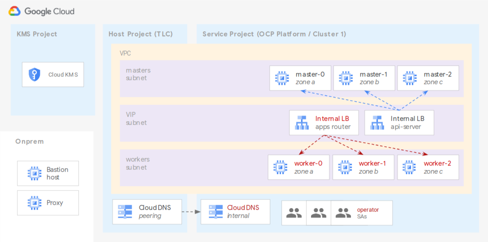

# OpenShift on GCP user-provisioned infrastructure

This example shows how to quickly install OpenShift 4.7 on GCP user-provided infrastructure (UPI), combining [different](https://docs.openshift.com/container-platform/4.7/installing/installing_gcp/installing-gcp-user-infra-vpc.html) official [installation](https://docs.openshift.com/container-platform/4.7/installing/installing_gcp/installing-restricted-networks-gcp.html) documents into a single setup, that uses a Python script for the initial configuration via the `openshift-install` command, and a set of Terraform files to bootstrap the cluster.

Its main features are:

- remove some dependencies (eg public DNS zone) by generating the yaml file used to seed the install process
- automate the edits required to manifest files during the install process
- use Terraform to bring up the bootstrap and control plane resources
- tightly couple the install configuration and bootstrap phases via a single set of Terraform variables
- allow worker management via native OpenShift machine sets

Several GCP features and best practices are directly supported:

- internal-only clusters with no dependency on public DNS zones or load balancers
- Shared VPC support with optional separate subnets for masters, workers and load balancers
- optional encryption keys for instance disks
- optional proxy settings

The example uses a Python script to drive install configuration, and a set of Terraform files to bootstrap the cluster. The resulting infrastructure is shown in this diagram, which includes the prerequisite and optional resources (Shared VPC, KMS, proxy, etc):



## Prerequisites

### OpenShift commands and pull secret

From the [OpenShift GCP UPI documentation](https://cloud.redhat.com/openshift/install/gcp/user-provisioned), download

- the Installer CLI
- the Command Line CLI
- your pull secret

*Optional:* if you want to use a specific GCP RHCOS image, download it from the [RedHat library](https://mirror.openshift.com/pub/openshift-v4/dependencies/rhcos/4.7/4.7.7/), then import it as a GCE image and configure the relevant Terraform variable before bootstrap.

### GCP projects and VPC

This example is designed to fit into enterprise GCP foundations, and assumes a Shared VPC and its associated host and service projects are already available.

If you don't have them yet, you can quickly bring them up using [our example](../../networking/shared-vpc-gke). Just remember to set the `cluster_create` variable to `false` in the Shared VPC example variables, to skip creating the associated GKE cluster.

There are several services that need to be enabled in the host and service project. You can either activate them before installing using the [list of services in the RedHat documentation](https://docs.openshift.com/container-platform/4.7/installing/installing_gcp/installing-restricted-networks-gcp.html#installation-gcp-enabling-api-services_installing-restricted-networks-gcp), or wait for error messages to pop up during `terraform apply`, follow the link in the error message to enable the missing service, then re-run `apply`.

### Python environment

A few Python libraries are needed by the script used to configure the installation files. The simplest option is to create a new virtualenv and install via the provided requirements file:

```bash
python3 -m venv ~/ocp-venv
. ~/ocp-venv/bin/activate
pip install -r requirements.txt
```

You can then check if the provided Python cli works:

```bash
./prepare.py --help
Usage: prepare.py [OPTIONS] COMMAND [ARGS]...

  Run all commands except precheck.

Options:
  --tfdir PATH                    Terraform folder.
  --tfvars TEXT                   Terraform vars file, relative to Terraform
[...]
```

### Install service account

The OpenShift install requires a privileged service account and the associated key, which is embedded as a secret in the bootstrap files, and used to create the GCP resources directly managed by the OpenShift controllers.

The secret can be removed from the cluster after bootstrap, as individual service accounts with lesser privileges are created during the bootstrap phase. Refer to the [Mint Mode](https://docs.openshift.com/container-platform/4.7/authentication/managing_cloud_provider_credentials/cco-mode-mint.html#mint-mode-permissions-gcp) and [Cloud Credential](https://docs.openshift.com/container-platform/4.6/operators/operator-reference.html#cloud-credential-operator_red-hat-operators) documentation for more details.

The simplest way to get this service account credentials with the right permissions is to create it via `gcloud`, and assign it `owner` role on the service project:

```bash
# adjust with your project id and credentials path
export OCP_SVC_PRJ=my-ocp-svc-project-id
export OCP_DIR=~/ocp

gcloud config set project $OCP_SVC_PRJ
gcloud iam service-accounts create ocp-installer

export OCP_SA=$(\
gcloud iam service-accounts list \
  --filter ocp-installer --format 'value(email)' \
)

gcloud projects add-iam-policy-binding $OCP_SVC_PRJ \
  --role roles/owner --member "serviceAccount:$OCP_SA"
gcloud iam service-accounts keys create $OCP_DIR/credentials.json \
  --iam-account $OCP_SA
```

If you need more fine-grained control on the service account's permissions instead, refer to the Mint Mode documentation linked above for the individual roles needed.

## Installation

### Configuring variables

### Generating ignition files

### Bringing up the cluster
