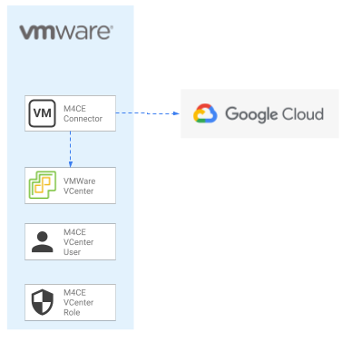

# M4CE(v5) - ESXi Connector

This example deploys the virtual machine and the security prerequisites to run the Migrate for Compute Engine (v5) [connector](https://cloud.google.com/migrate/compute-engine/docs/5.0/how-to/migrate-connector) on VMWare ESXi.

The example is designed to deploy the M4CE (v5) connector on and existing VMWare environment. The [network configuration](https://cloud.google.com/migrate/compute-engine/docs/5.0/concepts/architecture#migration_architecture) required to allow the communication of the migrate connetor to the GCP API is not included in this example.

This is the high level diagram:



## Managed resources and services

This sample creates several distinct groups of resources:

- virtual machine
  - [M4CE migrate connector](https://cloud.google.com/migrate/compute-engine/docs/5.0/how-to/migrate-connector#installing_the_migrate_connector) 
- IAM
  - [vCenter user role](https://cloud.google.com/migrate/compute-engine/docs/5.0/how-to/migrate-connector#step-1)

## Variables

| name | description | type | required | default |
|---|---|:---:|:---:|:---:|
| vsphere_environment | Billing account id used as default for new projects. | <code>string</code> | ✓ |  |
| m4ce_appliance_properties | Root node for the m4ce host project. Must be of the form folders/folder_id or organizations/org_id. | <code>string</code> | ✓ |  |
| m4ce_ssh_public_key | Local path to [SSH public key](https://cloud.google.com/migrate/compute-engine/docs/5.0/how-to/migrate-connector#step-2) (eg. ~/.ssh/key.pub) | <code>string</code> | ✓ |  |
| vcenter_password | Vcenter user password.  | <code>string</code> | ✓ |  |
| m4ce_connector_ovf_url | URL to public M4CE connector OVA image repository.  | <code>string</code> |  | <code>&#34;https://storage.googleapis.com/vmmigration-public-artifacts/migrate-connector-2-0-1663.ova &#34;</code> |

## Manual Steps
Once this example is deployed a VCenter user has to be created and binded to the M4CE role in order to allow the connector access the VMWare resources.
The user can be created manually through the VCenter web interface or througt GOV commandline if it is available:
```bash
export GOVC_URL=<VCENTER_URL> (eg. https://192.168.1.100/sdk)
export GOVC_USERNAME=<VCENTER_ADMIN_USER> (eg. administrator@example.local)
export GOVC_PASSWORD=<PASSWORD>
export GOVC_INSECURE=true

govc sso.user.create  -p <USER_PASSWORD> -R gcp-m4ce-role gcp-m4ce-user
govc permissions.set  -principal gcp-m4ce-user@example.local   -propagate=true  -role gcp-m4ce-role
```
